# 用 Python 清理金融时间序列数据

> 原文：<https://towardsdatascience.com/cleaning-financial-time-series-data-with-python-f30a3ed580b7?source=collection_archive---------7----------------------->


“Black and white photo of the street sign for Wall St in New York City” by [Rick Tap](https://unsplash.com/@ricktap?utm_source=medium&utm_medium=referral) on [Unsplash](https://unsplash.com?utm_source=medium&utm_medium=referral)

假设有一家公司， ***ABC 金融服务公司*** 根据公司的经济研究代表其客户做出金融投资决策。这些决策中有许多涉及对金融工具未来价格的投机。ABC 公司利用几个经济指标，但有一个指标在他们的分析中特别重要，那就是[密歇根大学的消费者情绪调查](https://en.wikipedia.org/wiki/University_of_Michigan_Consumer_Sentiment_Index) (CSI)。

唯一的问题是，他们必须等待这些数据的发布(每月发布一次)，这削弱了 ABC 在市场上的一些优势。为了保持竞争力，他们希望能够提前预测这个数字。我建议使用一种机器学习(ML)的形式对尚未发布的最终消费者情绪数据进行时间序列预测。

为此，我们将使用在 CSI 之前发布的其他经济数据(作为 ML 算法的特征)。我们将使用这些数据构建最终数据集，为预测算法做好准备。

# 多个数据集

我们将使用的历史数据集如下所列，可从以下链接下载:

*   道琼斯指数:来源(雅虎财经)
*   来自美国劳工部的美国失业(失业救济)数据:来源(美联储)
*   [公开市场原油历史价格](https://fred.stlouisfed.org/series/MCOILBRENTEU):来源(美联储)
*   [美国人口普查局新屋开工数](https://fred.stlouisfed.org/series/HOUST#0):资料来源(美联储)
*   [售出车辆总数](https://fred.stlouisfed.org/series/TOTALSA):资料来源(美联储)
*   [美国人口普查局的零售销售数据](https://fred.stlouisfed.org/series/RSXFS):来源(美联储)
*   [联邦利率](https://fred.stlouisfed.org/series/FEDFUNDS%5D):来源(美联储)
*   密歇根大学的消费者情绪调查 —数据预测:来源(密歇根大学)

# 工具

我们将使用 Python 和 Pandas 库来处理我们的数据清理任务。我们将使用 Jupyter Notebook，这是一个开源的 web 应用程序，允许您创建和共享包含实时代码、等式、可视化和叙述性文本的文档。对于数据科学家来说，这是一个非常棒的工具。你可以前往[Anaconda.org](http://anaconda.org)下载大多数数据科学库预装的最新版本。

我们将使用 pandas 将上述数据集合并到一个表中，然后进行必要的清理。上述部分数据集已经过季节性调整，以消除可预测的季节性模式的影响。在实际的预测学习/测试中，我们将对两种类型的数据集进行实验。

数据清理在很大程度上取决于数据的类型和您试图完成的任务。在我们的例子中，我们组合来自不同来源的数据，并清理产生的数据帧。在图像分类数据中，我们可能需要对图像进行整形和调整大小，并创建标签，而情感分析任务可能需要检查语法错误和关键词提取。

# 目视检查数据帧

为此，我们需要从 python 库中导入一些内容，如下所示。

```
*# Import necessary modules***import** **numpy** **as** **np**
**import** **pandas** **as** **pd**
**import** **matplotlib.pyplot** **as** **plt**
**import** **seaborn** **as** **sns**
%matplotlib inline
**from** **scipy** **import** stats
**from** **datetime** **import** datetime
**from** **functools** **import** reduce
**import** **datetime**
```

将数据表导入 Pandas 数据框架。

```
*# load all the datasets to pandas DataFrames*dow     = pd.read_csv('data/Dow Jones Industrial Average DJI.csv')
unemp   = pd.read_csv('data/Civilian Unemployment Rate UNRATE.csv')
oil     = pd.read_csv('data/Crude Oil Prices MCOILBRENTEU.csv')
hstarts = pd.read_csv('data/Housing Starts HOUST.csv')
cars    = pd.read_csv('data/Total Vehicle SalesTOTALSA .csv')
retail  = pd.read_csv('data/Advance Retail Sales_RSXFS.csv')
fedrate = pd.read_csv('data/Federal Interest Rates FEDFUNDS.csv')
umcsi   = pd.read_excel('data/consumer_sent_UMCH_tbmics.xls',header=3)
```

加载完数据后，我们要做的第一件事就是目视检查数据，了解数据的结构、内容，并注意任何异常情况。您将遇到的大多数数据至少有数千行长，所以我喜欢一次检查随机的行块。

我们使用 *head()* 和 *tail()* 函数分别检查表格的顶部和底部。

```
# view the top of the dow jones tabledow.head()
```

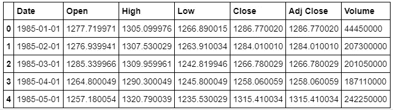

```
# view the top of the umcsi tableumcsi.head()
```

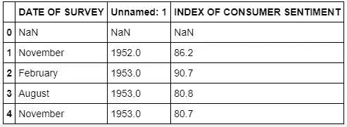

```
# view the bottom of the data tableumcsi.tail()
```

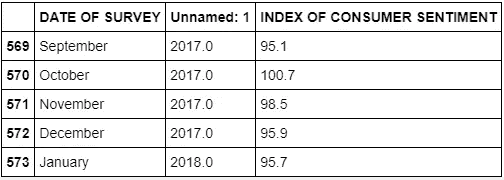

我们还可以使用一个循环来遍历所有的表，并获取大小。从这一步开始，我们可以开始预测我们需要做的连接的种类，或者决定我们是否有足够的统计数据来开始。记住坏数据比没有数据更糟糕。

```
*# get the shape of the different datasets*

dflist = [dow, unemp, oil, hstarts, cars, retail, fedrate, umcsi]
**for** i, dfr **in** enumerate(dflist):
 print(dflist[i].shape)
```

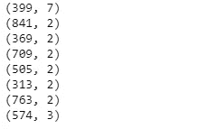

当我们检查数据时，另一个有用的 pandas 工具是 *describe()* 函数，它给出了数据中所有数字列的一般统计信息的快照。

```
*# we look at the statistical charateristics of the datsets*

**for** i, dfr **in** enumerate(dflist):
    print(dflist[i].describe())
```

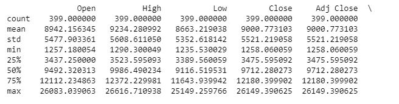

The table above contains more columns as indicated by the back slash at the top right

我们还想知道我们是否正在处理包含空值的数据，因为如果忽略，这可能会导致坏数据。获取空值的一种方法是使用 *isnull()* 函数来提取这些信息。我们使用下面的循环来迭代所有的数据表。

```
*# see which datasets have null values*

**for** i, dfr **in** enumerate(dflist):
    print(dflist[i].isnull().sum().sum())
```

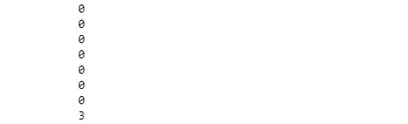

# 对数据进行观察

*   下面的一些观察结果在上面的图片中并不明显，但在[我的 GitHub](https://github.com/RonKG/machine-learning-portfolio-projects.......in-progress/tree/master/1.%20data_cleaning_project) 库中的[这里](https://github.com/RonKG/machine-learning-portfolio-projects.......in-progress/tree/master/1.%20data_cleaning_project)的原始笔记本中可以看到。
*   在这种情况下，我们获得的数据对于数百个列来说并不太复杂，但是记住这一点是有好处的，因为情况并不总是如此，我们必须能够轻松处理非常大的杂乱数据。
*   从上面的检查来看，在我们能够实现最终的干净数据集之前，有一些事情需要纠正。
*   所有数据集的日期格式都需要转换成统一的格式。
*   日期范围也很不一致。开始日期从 1947 年到 1992 年。
*   umcsi 中的日期在两列中(字符串**月**浮点**年**)，很难与该列中的其他数据集合并。
*   umcsi 也有 3 个空值，因此我们必须删除存在空值的整行。
*   出于我们的目的，道琼斯数据框架也有额外的列，所以我们需要去掉一些。
*   这些只是我能观察到的一些修改，但很可能会有其他的并发症。
*   注释你的代码也是必要的，这样你的同事就能理解你在做什么。
*   在某些时候，我们还必须将日期格式从字符串更改为支持绘图的格式。

# 数据清理

道琼斯数据附带了许多我们在最终数据框架中不需要的额外列，因此我们将使用 *pandas drop 函数*来释放额外的列。

```
*# drop the unnecessary columns*

 *dow.drop(['Open','High','Low','Adj Close','Volume'],axis=1,inplace=True)*# view the final table after dropping unnecessary columnsdow.head()
```

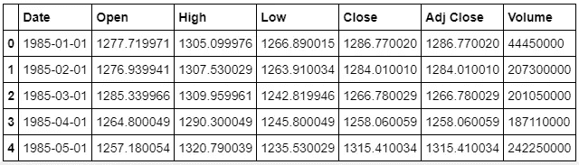

```
*# rename columns to upper case to match other dfs*

dow.columns = ['DATE', 'OPEN', 'HIGH', 'LOW', 'CLOSE', 'ADJ CLOSE', 'VOLUME']# view result after renaming columns
dow.head()
```

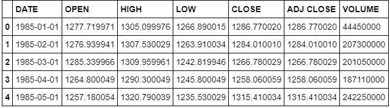

这些步骤中的大部分可以合并成更少的步骤，但我将它们分解，这样我们就可以遵循，并且我们还可以确认我们正在实现预期的结果。接下来，我们从数据表中删除那些具有空值的列。有时候，我们可能需要组合这些空列，然后在以后删除它们，这样我们就可以填充其他表中的值或获得额外的列(信息)。

下面的*原位*标志永久删除被删除的行。

```
*# drop NaN Values*

umcsi.dropna(inplace=**True**)
```

umcsi 表包含数据类型为 float 的年份值，当我们开始获取年份的小数数字时，这可能会有问题。我创建了一个函数，它从 float 列创建一个新的 integer 列。然后我们可以将旧的 float year 列*放到()*中。有时日期列是字符串格式，我们必须使用内置函数来解析日期，或者我们可以为那些特殊的情况创建自己的列。当您清理数据时，会有很多这样的情况。

```
*# create 'Year' column with int values instead of float*# casting function
**def** to_int(x):
    **return** int(x)# use function to convert floats to int

umcsi['Year'] = umcsi['Unnamed: 1'].apply(to_int)
umcsi.head()
```

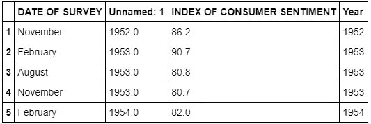

请注意，我们将月份和年份作为单独的列，需要将它们组合起来，以匹配其余数据表中的日期格式。为此，我们使用 pandas *datetime* 函数，它能够处理大多数日期和时间操作。事实证明，其他表的日期数据类型为 string，因此我们还必须将 umcsi 日期列更改为 string。这很有意义，因为作为一个时间序列，任何表连接都将在日期列上作为键。

```
*# combine year columns to one column format*

umcsi['DATE'] = umcsi.apply(**lambda** x: datetime.datetime.strptime("**{0}** **{1}**".format(x['Year'],x['DATE OF SURVEY']), "%Y %B"),axis=1)*# turn date format to string to match other DATE's. We'll merge the data on this column so this is a vital step.*

**def** to_str(x):
    **return** str(x)[:10]

umcsi['DATE'] = umcsi['DATE'].apply(to_str)
umcsi.head()
```


我们的 umcsi 表看起来很好，除了旧的浮动日期列和月份列，所以我们必须去掉它。为了保持条理，我们还应该把最后的日期列移到前面的列。

```
*# drop unneeded columns column*
umcsi.drop(['Unnamed: 1','Year','DATE OF SURVEY'], axis=1, inplace=**True**)

*# move 'DATE' column to the front*
cols = list(umcsi)
cols.insert(0, cols.pop(cols.index('DATE')))
umcsi = umcsi.reindex(columns = cols)
umcsi.head()
```

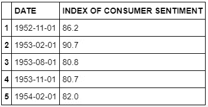

A more useful table than we started of with.

有了内聚格式的所有表，我们可以继续连接它们并做一些最后的清理步骤。我们将用日期列作为键来连接这些表。我们将使用强大的 lambda 函数来快速完成这个任务。实际上，我们将封装更多的函数来展示 pandas 在数据操作方面有多么强大。

```
*# concatenate all dataframes into one final dataframe* dfs = [dow,unemp,oil,hstarts,cars,retail,fedrate,umcsi] # we perform the joins on DATE column as key and drop null valuesdf = reduce(**lambda** left,right: pd.merge(left,right,on='DATE', how='outer'), dfs).dropna() df.head(5)
```

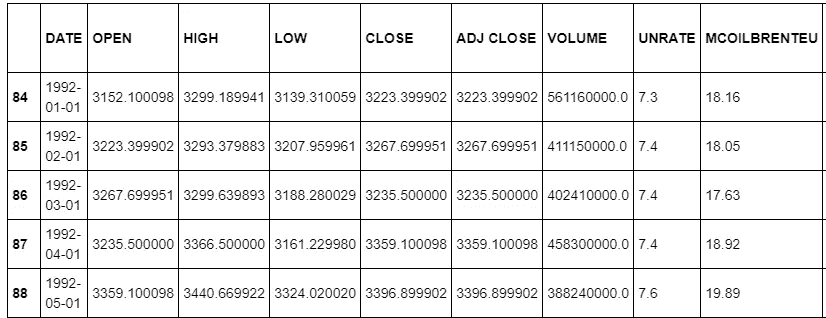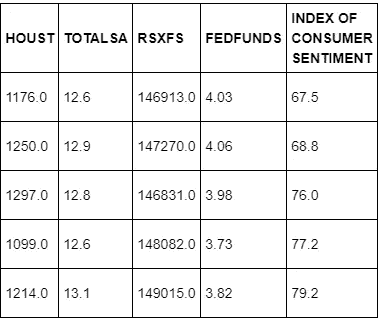

我们现在有了一个最终的熊猫数据框架，尽管它还需要更多的清理。接下来，我们必须从我们的最终表中删除异常值，因为这些异常值可能会在稍后的机器学习任务中引入大量噪声。

```
*# remove all rows with outliers in at least one row*

df = df[(np.abs(stats.zscore(df.drop(['DATE'], axis=1))) < 3).all(axis=1)]# show final size after removing outliers
df.shape
```

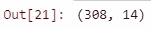

Final dataframe shape

Python 有一种专门的格式来处理时间列，这种格式非常有效。我们可以使用 *strip()* 函数从当前的字符串格式中提取出 *datetime.datetime* 格式。同样，我们将使用 lambda 函数动态地将其应用于所有行。

```
*# change the DATE column from String to python's 
# datetime.datetime format* df['DATE'] = df['DATE'].apply(**lambda** x: datetime.datetime.strptime(x,"%Y-%m-**%d**"))
```

最后一步是将这些列重命名为更便于用户使用的名称，以便那些继续使用这些数据的用户使用。

```
*# rename columns to more user friendly names*

df.columns = ['DATE', 'OPEN', 'HIGH', 'LOW', 'CLOSE', 'ADJ CLOSE', 'VOLUME', 'UNEMP %','OIL PRICE','NEW HOMES','NEW CARS SOLD',
                    'RETAIL SALES','FED INTRST %','CSI' ]# preview final table
df.head(20)
```

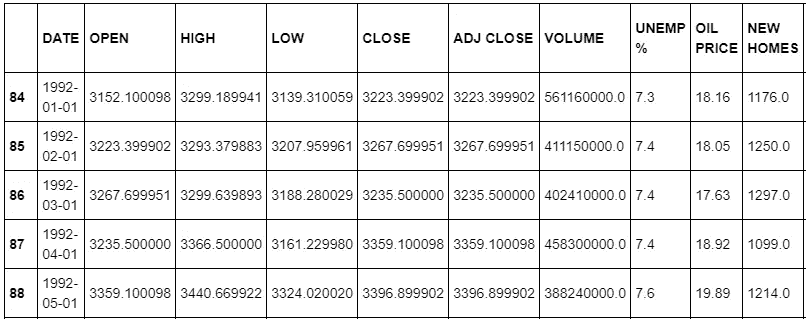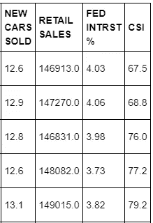

FINAL pandas dataframe

# 数据清理结论

*   数据清理有各种形式和大小，没有一个模板可以处理所有情况。
*   虽然我们不知道数据在预测 CSI 的任务中表现如何，但我们知道所提供的数据已经过处理，以便在 ML 环境中快速采用和测试。
*   当然，我们可以设计出更多的功能，并对当前的功能进行更多的处理，但对于我们来说，ML 团队将如何进行就太放肆了。例如，我们可以将特征归一化到统一的比例，但没有这样做。
*   总之，像数据科学领域的大多数任务一样，我们最多只能在合适的团队中不断提问，并根据这些问题进行更深入的实验。