# 清理债务:熊猫之道

> 原文：<https://towardsdatascience.com/cleaning-up-debt-a-pandas-approach-4093937388de?source=collection_archive---------7----------------------->

## 不良贷款(NPL)数据的数据争论和探索性数据分析

最近对东南亚信贷市场的分析揭示了这一特定地区信贷文化的一些细微差别。这些数据让我开始思考全球信贷健康状况和全球不良贷款率。鉴于我最近对数据分析的尝试，我认为一个笔记本是合适的。

**但首先，什么是信贷市场，什么是不良贷款？**

通过考察信贷市场，我们看到了个人、公司和政府向投资者借钱的市场。这种形式的借款可以采取许多不同的形式，从你的日常信用卡支出到你的下一个海滩房屋的抵押贷款。

不良贷款(NPL)是指借款人在一段时间内(通常超过 90 天)无法按期还款的贷款。

当不良贷款水平上升时，通常是信贷市场健康状况恶化的指标。简而言之，更多的人没有偿还他们所欠的债务。

我们将从世界银行数据库中调查不同国家的不良贷款水平。

首先，我们从导入必要的包开始…

因为有些行包含填充列信息，所以我用 islice 跳过前 4 行。

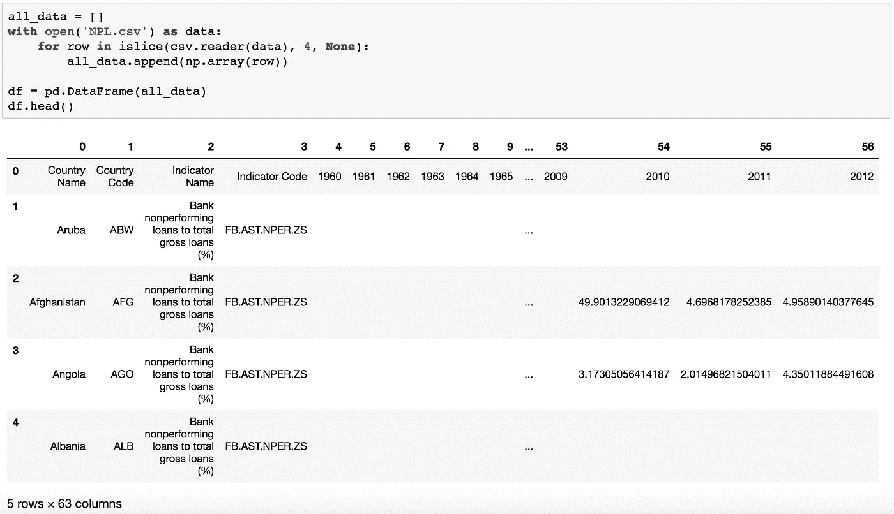

## 缺失数据

看一下数据框架，似乎表明有许多缺失的数据，尤其是前几年的数据。为了更好地了解通常缺失的数据，我们使用 missingno 来快速可视化。

但是，在使用 missingno 之前，空数据似乎是由 numpy 字符串表示的。因此，我们希望用 np.nan 替换所有这样的实例，以使 missingno 可视化工作。

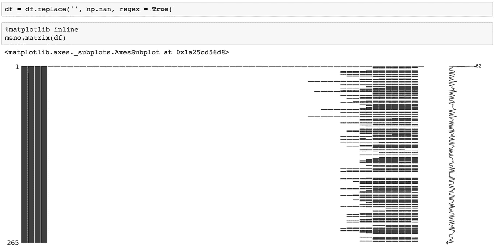

Any white space indicates missing data

这种可视化似乎表明大量数据缺失，尤其是截至 2010 年的年度数据。相对于之前的 6 年，2016 年似乎缺少更多数据。缺少 2010-2015 年数据的国家因此被剔除。

此外,“指标名称”和“指标代码”这两列似乎也不是特别有用。

我们将创建一个新的数据框架，其中仅包含国家、国家代码和 2010 年至 2015 年的数据。我们还将设置列名，这些列名当前位于第一行。

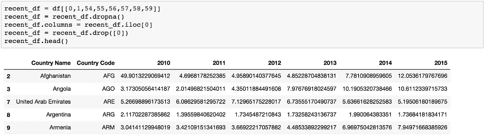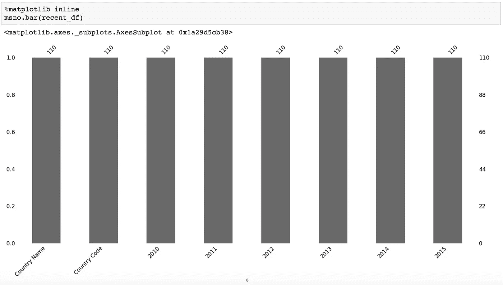

No missing fields now

## 数据类型

好多了。剩下 144 个国家/地区的每一列都有值。一些行索引可能不是特定于国家的。但是首先，有数据类型的问题。

检查列的数据类型，所有数据看起来都是非空对象。出于分析代表百分比的 NPL 水平的目的，这些应该是浮动类型的。

将数据类型更改为 float 后，describe()函数再次工作，平均值似乎保持在一个相对较窄的范围内。2010 年和 2011 年的最低不良贷款似乎有一个特殊的异常值。不良贷款可以在 0%吗？似乎是一个幻想世界。

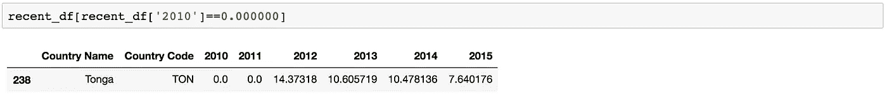

汤加似乎是个例外，2012 年不良贷款跃升至 14%。或许他们只是在 2012 年才开放信贷市场？谷歌快速搜索揭穿了这一说法。这可能是一个错误的条目，我们将从分析中删除汤加。

## “过剩”数据

看一下“国家名称”一栏，发现有 143 个“国家”，但其中许多是指特定的地区和分类，如“南亚(IDA & IBRD)”。我们只想要纯国家数据，所以我们将从 country_list 导入一个已知国家名称的列表，并过滤掉它们。

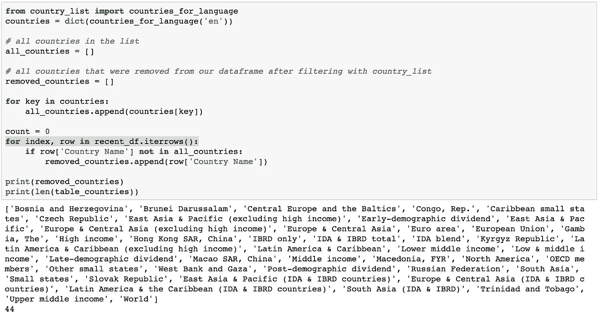

有许多方法可以着手清理国家名单。更好的方法包括寻找最接近的匹配和按分数过滤。例如，[ous ful](https://blog.ouseful.info/2017/03/20/data-cleaning-finding-near-matches-in-names/)给出了一个使用模糊集寻找近似匹配的很好的例子。

然而，鉴于这是一个相对较小的指数值集，我们可以简单地查看在与国家列表交叉引用时被过滤掉的国家。

在删除的 44 个值中，“波斯尼亚和黑塞哥维那”、“文莱达鲁萨兰国”、“刚果共和国”、“捷克共和国”、“冈比亚”、“中国香港特别行政区”、“吉尔吉斯共和国”、“中国澳门特别行政区”、“马其顿、FYR”、“斯洛伐克共和国”、“特里尼达和多巴哥”等国名似乎应该保留。

然后，我们继续使用列表理解来查找最终的过滤国家列表。

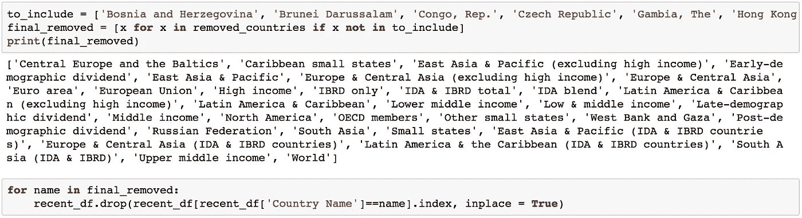

The wonders of list comprehension

现在，我们已经在数据框架中包含了我们想要的国家，让我们添加一些由世界银行提供的相同数据集的其他属性。在单独的 csv 中，他们提供了关于国家所在地区及其人口收入群体的信息。可以对国家代码(文件之间的公共列)进行合并。

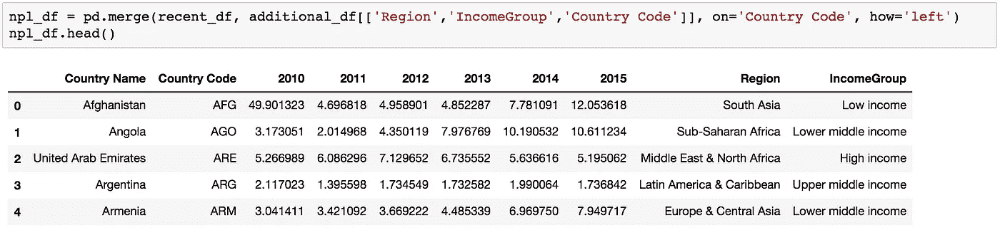

## 融化的

太好了，现在我们有了一个包含相关信息的国家列表。然而，年度不良贷款数据的格式仍然反映了原始数据条目的格式。有了“整洁”的数据结构，EDA 和进一步的分析会更容易。从 2010 年到 2015 年的列名作为值可能比列名更有用。

因此，我们将“融化”数据集。这也被称为从宽格式到长格式。

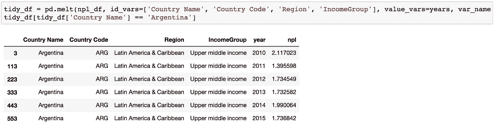

Long form data for Argentina

## 添加类别

我们可能在一个数据帧中有了我们想要的数据，但是这是否意味着它已经可以进行分析了呢？快速浏览 info()会得到一个响亮的“不”。

如果我们要进行任何类型的时间序列分析，那么“year”列作为一个非空对象实际上是没有用的，因此它应该被转换为整数或日期时间对象。

此外，虽然你可以按收入群体对数据进行分组，但如果我们在数据上附加一个尺度，可能会更能说明问题。虽然这种标量转换不太适用于地区，但人们可以可靠地对收入群体进行加权。

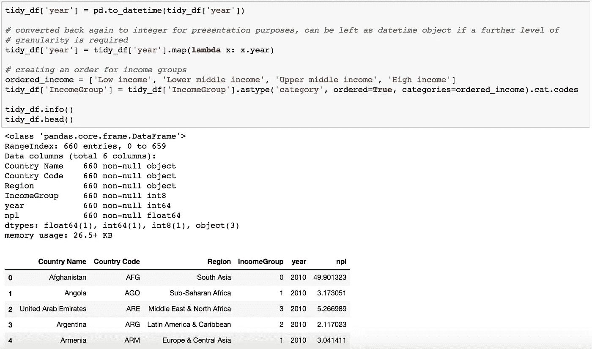

现在数据集更清晰了，让我们看看数据告诉了我们什么。

## 不良贷款分布

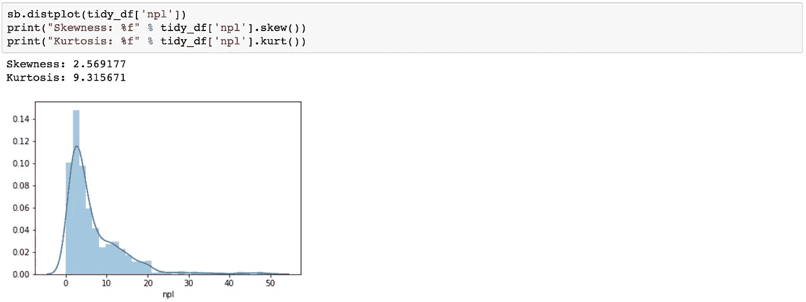

首先看一下不良贷款水平的分布，就会发现它并不完全是正态分布，而是一种偏态分布。偏斜度和峰度值的计算似乎支持这一点，两者都偏离了“正常”范围。

注意这种偏斜度和峰值的值是很重要的，因为它们会极大地影响任何预测模型。

## 散点图和识别聚类

接下来，我们来看看这些不良贷款水平在不同收入群体中的分布。然后这些点用颜色编码来代表年份。

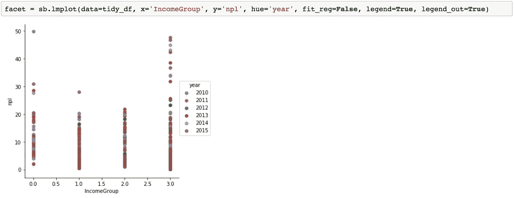

我最初预计低收入群体的不良贷款会高得多，因此最突出的是高收入群体国家的大量异常值。债务市场上的这些坏演员是谁？

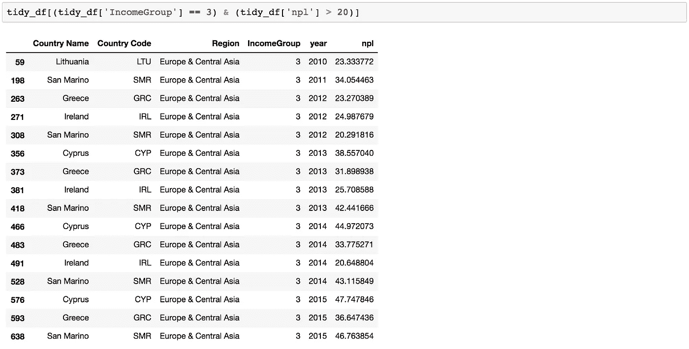

“坏演员”名单似乎被少数几个国家所控制，如爱尔兰、希腊、圣马力诺和塞浦路斯。

尽管它们的收入水平相对较高，但它们拥有一些最高的不良贷款水平。

这些不良贷款水平很好地反映了现实生活中的事件，爱尔兰在 2012 年重新陷入衰退，塞浦路斯在 2012-2013 年发生金融危机，圣马力诺的金融部门受到欧元区危机的重创，希腊面临着自 2009 年以来的大规模债务危机。

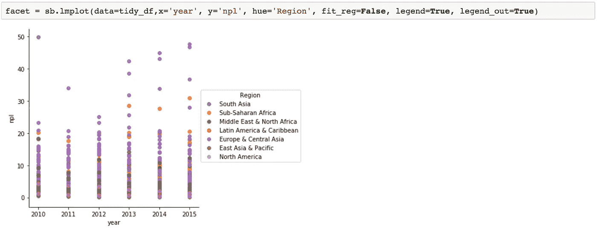

我们还可以进一步了解不同地区的不良贷款水平。快速浏览一下过去几年按地区分组的不良贷款集群，就会发现欧洲、中亚和撒哈拉以南非洲的不良贷款率明显较高。

## 信用透明度

我们拥有的每个地区的数据量可以作为信贷市场透明度的指标吗？我们数据框架中的国家是近年来拥有充足的不良贷款信息的国家。我们来比较一下各个地区的相对代表性。

“欧洲&中亚”和“北美”地区似乎是不良贷款数据最透明的地区。大多数其他地区徘徊在 50%左右，而“中东和北非”在信贷透明度方面明显落后，只有 19%的国家有不良贷款数据。

## 后续步骤

对全球不良贷款数据的初步研究得出了一些非常有趣的结果。然而，鉴于这一过程的主要目的是整理世界银行的数据，仍有很大的探索空间。我希望将其他行的数据汇总到这个数据框架中，或许进行一个面板数据分析。

调查每个地区/国家的本地因素以更好地量化信贷文化肯定会很有意思。信贷文化可以是一个相对任意的术语，它的大多数定量测量是基于还款历史和其他贷款数据。将“软”指标纳入对信贷文化的审查是很有趣的。这些“软”指标可能包括对债务的文化观点、贷款积极性、社区信任以及自我概念和借贷或欠款中的“面子”的检查。

如果您对代码感兴趣，请查看 Jupyter 笔记本[这里](https://github.com/finnqiao/npl_data)！

感谢阅读！