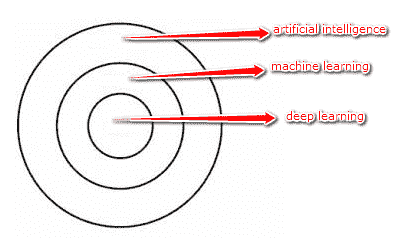
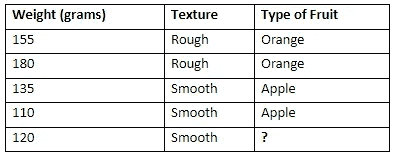

# 澄清困惑:人工智能 vs 机器学习 vs 深度学习的差异

> 原文：<https://towardsdatascience.com/clearing-the-confusion-ai-vs-machine-learning-vs-deep-learning-differences-fce69b21d5eb?source=collection_archive---------0----------------------->

如果你陷入了区分人工智能(AI)与机器学习(ML)和深度学习(DL)的困惑，请举手…

把你的手放下来，伙计，我们看不见！

尽管这三个术语通常可以互换使用，但它们并不完全指同一事物。

德国计算机专家 Andrey Bulezyuk 在教授人工智能系统如何工作方面有超过五年的经验，他说“这个领域的从业者可以清楚地说出这三个密切相关的术语之间的区别。”

所以，人工智能、机器学习、深度学习有区别吗？

这是一张试图将它们之间的区别形象化的图片:

在上面三个同心圆的图像上可以看到，DL 是 ML 的子集，ML 也是 AI 的子集。

有意思？

因此，AI 是最初爆发的无所不包的概念，然后是后来蓬勃发展的 ML，最后是有希望将 AI 的进步提升到另一个水平的 DL。

让我们更深入地挖掘一下，这样你就能明白哪个更适合你的具体用例:人工智能，机器学习，还是深度学习。

# **什么是人工智能？**

顾名思义，人工智能可以被松散地解释为将人类的智能融入到机器中。

人工智能是一个更广泛的概念，包括从优秀的老式人工智能 [(GOFAI)](https://en.wikipedia.org/wiki/Symbolic_artificial_intelligence) 到深度学习等未来技术的一切。

每当机器根据一套规定的解决问题的规则(算法)完成任务时，这样的“智能”行为就是所谓的人工智能。

例如，这种机器可以移动和操纵物体，识别是否有人举手，或者解决其他问题。

人工智能驱动的机器通常分为两组——通用型和窄型。一般的人工智能 AI 机器都是可以智能解决问题的，像上面说的那些。

狭义智能人工智能机器可以很好地执行特定的任务，有时甚至比人类更好——尽管它们的范围有限。

Pinterest 上用于分类图像的技术就是狭义人工智能的一个例子。

# **什么是机器学习？**

顾名思义，[机器学习](https://blog.liveedu.tv/become-artificial-intelligence-engineer/)可以宽泛地解释为赋予计算机系统“学习”的能力。

ML 的目的是使机器能够使用提供的数据进行自我学习，并做出准确的预测。

ML 是人工智能的子集；其实简单来说就是一种实现 AI 的技术。

这是一种训练算法的方法，这样它们就可以学习如何做出决策。

机器学习中的训练需要向算法提供大量数据，并允许它学习更多关于处理过的信息。

例如，下面的表格根据水果的特征确定了水果的类型:

正如你在上面的表格中看到的，水果是根据它们的重量和质地来区分的。

然而，最后一行只给出了重量和质地，没有给出水果的类型。

而且，可以开发一种机器学习算法来尝试识别水果是橙子还是苹果。

在该算法获得训练数据后，它将学习橙子和苹果之间的不同特征。

因此，如果提供重量和质地的数据，它可以准确地预测具有这些特征的水果的类型。

# **什么是深度学习？**

如前所述，深度学习是 ML 的子集；事实上，它只是一种实现机器学习的技术。换句话说，DL 是机器学习的下一次进化。

DL 算法大致受到人脑中发现的信息处理模式的启发。

就像我们用大脑来识别模式和分类各种类型的信息一样，深度学习算法可以被教会为机器完成同样的任务。

大脑通常试图解读它接收到的信息。它通过给物品贴上标签并将其归入不同的类别来实现这一点。

每当我们接收到新信息时，大脑都会试图在理解它之前将其与已知项目进行比较——这与深度学习算法采用的概念相同。

例如，人工神经网络(ann)是一种旨在模仿我们大脑决策方式的算法。

比较深度学习和机器学习可以帮助你理解它们的细微差异。

例如，DL 可以自动发现用于分类的特征，而 ML 需要手动提供这些特征。

此外，与 ML 相比，DL 需要高端机器和相当大量的训练数据来提供准确的结果。

# **收尾**

你现在明白 AI vs ML vs DL 的区别了吗？

然后，举起你的手…

我们承诺开发一种人工智能算法，当有人举手时，它会告诉我们。