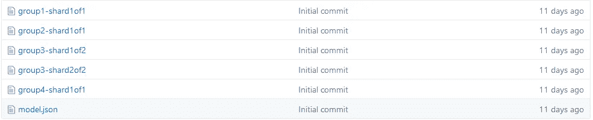
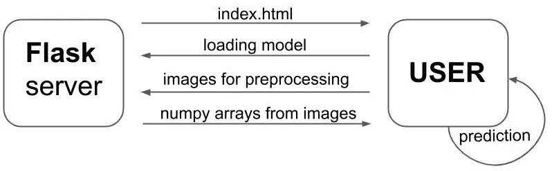
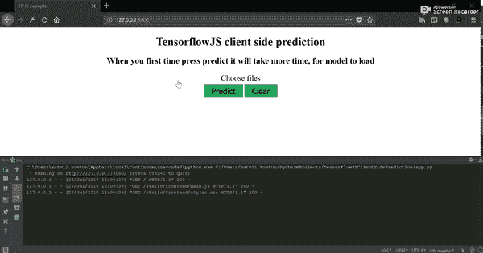

# 使用 TensorFlow.js 进行客户端预测

> 原文：<https://towardsdatascience.com/client-side-prediction-with-tensorflow-js-e143ed53235b?source=collection_archive---------1----------------------->

大家好，我叫 Matvii，是一名**数据科学家**。我的工作包括数据预处理、**开发/训练和部署模型**。所以今天我将尝试分享我的知识，并展示如何部署一个模型，一些**计算**将由**客户端**完成**。下面的帖子是为那些创建了一个模型，并想通过将**预测**部分委托给客户端来减少服务器负载的人准备的。尤其是对于日常使用 **Python** 并且对 **JavaScript** 一知半解的数据科学家来说。可以跳过这个帖子，直接进入我的[**Github**](https://github.com/MattKovtun/TensorFlowJSClientSidePrediction)**资源库。****

****指标** 0。简介
1。创建模型
2。设置**烧瓶**服务器
3。正在创建**index.html
4。正在创建**main . js**5。更新**烧瓶**服务器****

****0。简介**
让我们想象你已经创建了一些深刻而令人敬畏的模型，它做了一些**伟大的事情** **并且帮助人们**。例如，该模型通过人们杯子的照片来预测他们最喜欢的表情符号。你把这个模型放在网上，每天的使用量大约是 1000 次查询，不是很多。简单的服务器可以处理它，但是有一天这个模型被公众发现了，你开始每天接收 10 万个查询，同一个服务器可能会**死掉**。因此，现在您可以扩展服务器并添加越来越多的内存，或者尝试在客户端重写预测。如果你选择第二个选项，这里有一个教程给你。**

**为了实现目标，我们将拥有以下**组件**。
**后端** : Flask，任何你想在 python 中对一个图像进行预处理的库
**前端** : tensorflowjs
最近 tensorflowjs 增加了对 **node.js** 的支持，不过，我们将使用 **Flask** ，这是一个 python 库。通常，一些经过训练的模型需要数据**预处理**才能正确执行。到目前为止，预处理在 python 中比在 javascript 中更方便。(我希望有一天也能在客户端进行预处理)**

****1。创建模型**
你可以通过运行`train_model.py`为 MNIST 训练模型，或者你可以创建和训练任何你想要的模型。这里重要的一点是保存模型的拓扑和权重。如果你的模型是用 **keras** 写的，简单的加上这个。**

**保存模型后，您将拥有一个包含以下内容的文件夹。**

****

**其中\* — 的**group \ *-shard \ *是二进制权重文件的集合，
**model.json —** 是模型拓扑和配置。****

****2。设置 Flask 服务器**
是因为我们希望用户访问我们的模型。**

**简单的服务器到目前为止，没有什么复杂的，只是一个路径返回我们的静态页面**index.html。** 还有，系统的一般架构会是这样的。**

****

****3。创建 index.html** 我们需要一些入口点，用户将与它交互，我们将在那里运行我们的预测。因此，让我们设置**index.html。****

**我们的第一个版本将是这样的。这里唯一重要的是在**第 6 行**上，它从 cdn 添加了 **tensorflowjs。** 下一步是添加一些 **HTML 主体**以便用户能够上传图像和点击按钮。:)在这里。**

**我们的 **HTML 部分**的下一步也是最后一步，是给我们的页面添加一些样式，从而给 HTML 元素带来类，同时创建 **main.js** 文件，该文件将包含我们的**神奇预测部分**。现在让我们看看**index.html 的最终版本。****

**您的**index.html**可能与我的不同，您也可以添加或删除一些部分，但是，这里重要的是:
— **第 6 行**(在头部添加来自 **CDN** 的脚本——对于生产版本的代码来说是一个不好的做法，但是，我不想麻烦任何人解释什么是 **npm** 和**node _ modules**)
—**第 13 行 **如果你想让用户上传一张图片，你也可以使用不同类型的输入)
— **第 20 行**(我们的脚本做客户端预测)******

**4。Creating main.js** 现在是带来魔力的时候了。首先我们需要**初始化按钮、输入、模型**和预测的**功能。**

在**第 3 行**我们有我们模型的 URL，到目前为止它在我的**本地机器**上，但是一般来说它可以部署在任何地方。此外，稍后我们将在 Flask 中为该模型创建一条路线。
现在让我们添加将**下载**我们的**模型**的部分，然后拍摄用户上传的图像并将其发送到服务器进行**预处理**。

我们将图像发送到 **/api/prepare/** 我们稍后将添加的路线。我们还将来自服务器的响应从字段**图像**放到`tf.tensor2d`。
现在是时候为我们的张量添加**预测，然后**将预测**和图像渲染到用户的视图中。最后就是添加一些按钮例程和函数调用。**

所以带有客户端预测的神奇脚本的最后一个版本看起来会像这样。

请随意重写获取部分，以便在一个帖子中发送完整的**批文件**。
不要忘记根据用于训练模型的形状对返回的数组进行整形！

**5。更新 Flask 服务器**
现在我们必须更新我们的服务器，这样它就可以为 **/api/prepare** 对图像进行**预处理**，并且**还可以为 **/model** 的 model** 提供前端服务。服务器的最终版本将类似于此。

对于**的预处理**部分，我们有两个函数:
— **准备**(调用**/API/prepare**)
—**预处理**(拍摄一幅图像，将调整后的图像返回到 **numpy 数组，**这个函数可以做任何你喜欢的预处理，只要它返回 numpy 数组，一切都会正常工作)
**模型部分:**—
—

> **为什么我们需要两个函数和两个独立的 API 来服务一个模型，而不是一个？**

**在 **tensorflowjs** 的下一个版本中，当我们为某个 API `model = await tf.loadModel(modelURL);` 加载模型时，它首先从`modelURL`加载模型，这是一个 JSON 文件，然后它自动向**域名根**发送几个帖子，以便加载**碎片**(在服务器日志中的演示中查看这些帖子)。因为我不想把我的模型放在服务器旁边的根目录中，所以我需要两个函数，一个用于 **model.json** ，另一个用于 **shards** 。**

**就是这样！现在，你可以将预测人们最喜欢的表情符号(根据他们杯子的照片)发送到客户端，或者像我一样，只发送 MNIST！此外，如果一切正常，您将会看到类似这样的内容。**

****

**感谢您的阅读！随意添加/重写你喜欢的任何部分！尽情享受吧！
[**Github**](https://github.com/MattKovtun/TensorFlowJSClientSidePrediction)**