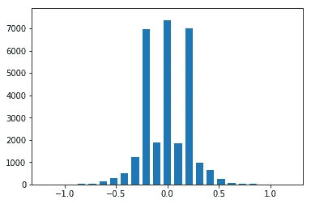
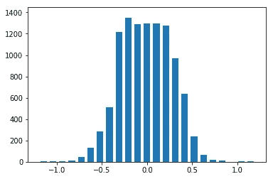
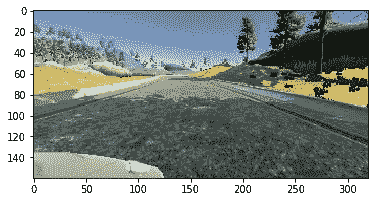
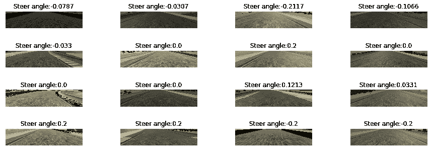
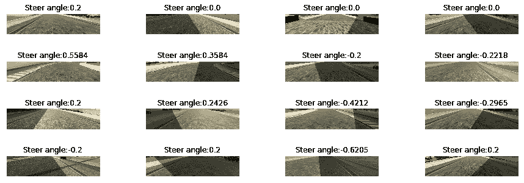
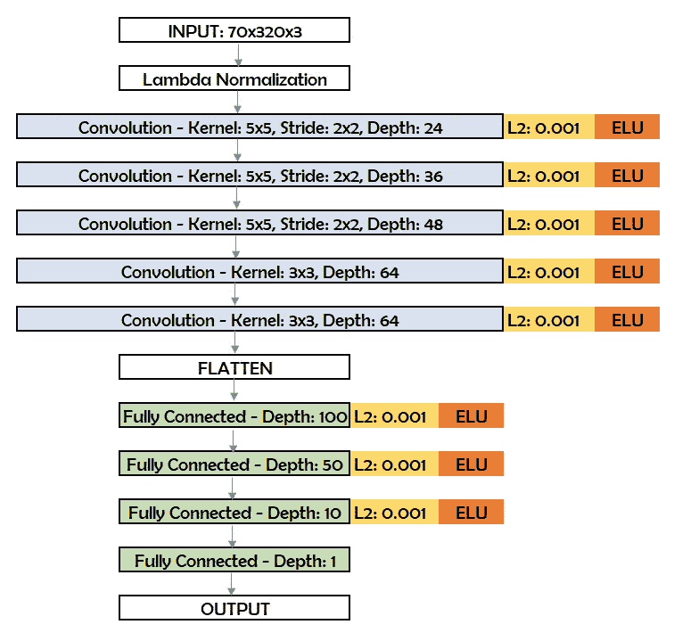
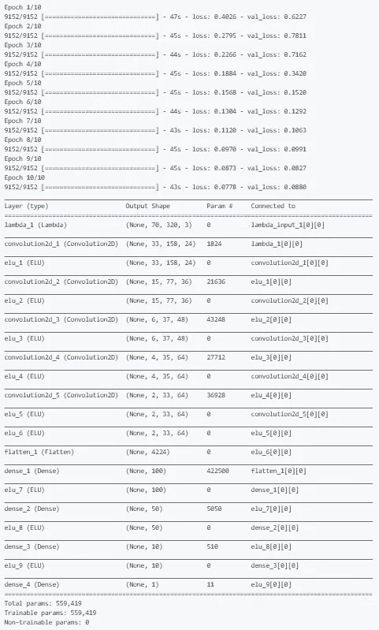

# 克隆人类驾驶员的行为，并将其应用于自动驾驶汽车

> 原文：<https://towardsdatascience.com/clone-a-human-drivers-behavior-and-mimic-it-to-let-a-vehicle-drive-autonomously-e2930a61b42c?source=collection_archive---------10----------------------->

如何克隆人类司机的行为？嗯，首先，我们需要去兜兜风，同时采集一些数据。听起来不错。让我们开始吧。没那么快。你会问为什么？因为我车里没有设备来完成这件事。好吧，我会退而求其次:一个由 Udacity 创建的模拟环境，它服务于我的目的:在模拟环境中驾驶汽车并捕捉数据。听起来像是轻而易举的事，但我不知道我的游戏技能充其量也就是一般水平。我试了 20 多次才让这辆车在跑道上行驶而不撞车。现在我有了一些数据，我需要建立一个卷积神经网络(CNN)，并训练它模仿我捕捉的数据。如果一切顺利，CNN 模型将学习模仿驾驶行为，并克隆学习自己驾驶。如果你只对最终结果感兴趣，就跳到这个 [*视频*](https://youtu.be/ap68tlotoPk) *。关于详细的讨论，请继续阅读。*

希望一切顺利，我建立了模型，训练了它，并在模拟器上焦急地测试它，以查看结果:当我的车可以自主游泳和越野时，谁想模仿我的驾驶！看看下面的视频，你就会明白我在说什么了。在那一瞬间，我觉得我的冒险车是最酷的！它可以越野行驶，也可以游泳。直到它翻转过来的那一刻😒。回到基础，我去了。

**第一步:收集和探索数据**

我最初捕捉到的训练数据是在赛道上跑一圈多一点。我需要更多的数据和更好的模型。为了获取更多的数据，我没有重新使用我糟糕的视频游戏技能，而是选择用 Udacity 提供的额外数据来扩充我的数据。模拟器有一辆带有三个捕捉图像的前置摄像头的汽车:左视图、中间视图和右视图各一个。它还输出一个包含以下六列数据的 CSV 文件:第 1 列:中间图像的图像路径，第 2 列:左侧图像的图像路径，第 3 列:右侧图像的图像路径，第 4 列:转向角度，第 5 列:油门，第 6 列:刹车

我在专栏 1-3 中使用了所有三张图片，因为它们提供了道路的不同视角。然而，左和右相机图像的转向角需要通过校正因子来调整，以考虑相机位置。我绘制了转向角的直方图(图 1)以探索数据的分布，并发现许多数据集中在零附近，即直线行驶。这是有意义的，因为赛道上有很多直线行驶，这将导致模型中直线行驶的偏差。

Fig 1: Histogram of Steering Angles distribution

**第二步:处理和扩充数据**

为了解决驾驶偏向直线的问题，我删除了一些接近零转向角的数据点，并使它们下降，以便分布均匀。当我绘制这些数据的直方图(图 2)时，它看起来确实更加一致。

Fig 2: Histogram of Steering Angles distribution after removing biases

图像大小为 160x320x3(图 3)。然而，顶部图像的三分之一是与模型无关的数据:地平线以上的天空和树木等。底部的 25 个像素也无关紧要，因为它有汽车的引擎盖。我裁剪了图像，去掉了这些区域，使图像尺寸缩小到 70x320x3。

Fig 3: Sample image of the input dataset

由于树木的原因，图像中似乎有阴影，我想确保汽车可以在不同的照明条件下行驶。所以，我用随机的阴影和亮度增强来处理一些受这篇[帖子](https://chatbotslife.com/using-augmentation-to-mimic-human-driving-496b569760a9)启发的图片。随机亮度&阴影增强的结果如图 4 & 5 所示。

Fig 4: Images with varying brightness

Fig 5: Images with random shadows

模拟器轨道也有许多左转，这些数据会导致模型偏向于向左行驶。为了解决这个问题，我将一半的图像随着转向角度翻转，以生成向右行驶的图像。现在，我相信我已经有了一个平衡的数据集，可以将模型推广到各种情况下的驾驶，图 2 中的直方图证实了这一点。

**第三步:建立一个 CNN 模型**

我在这个项目中使用了[英伟达的 CNN 模型](https://images.nvidia.com/content/tegra/automotive/images/2016/solutions/pdf/end-to-end-dl-using-px.pdf)的改编版，因为它是为自动驾驶而设计的。我用 Keras 建立了这个模型。经过实验(步骤 4)，我用 L2 正则化和 ELU 激活对模型进行了微调，得到了图 6 中的架构。

Fig 6: Network Architecture Details

**第四步:训练和微调模型**

我以 85/15 的比例将输入数据集分成训练和验证数据集，并训练 CNN 模型。与[交通标志分类](https://medium.com/@techreigns/traffic-signs-classification-with-a-convolutional-neural-network-75911a1904)问题不同，该项目的目标是预测转向角，这可以通过线性回归实现。我使用 Adam 优化器来获得预测转向角的最佳均方误差(MSE)值。我用 10 个历元进行训练，批量为 64 个。为了提高内存效率，我没有将预处理过的数据一次性存储在内存中，而是使用了生成器函数来提取数据片段，并根据需要动态处理它们。模型训练的结果总结以及训练和验证损失如图 7 所示。由于 AWS 的处理能力，这些训练运行非常快(大约 7 分钟)。我不认为如果这些运行需要很长时间，我会用不同的设置做很多实验，因为如果我在我的本地计算机上运行，他们会这样做。

Fig 7: Model training results

**第五步:在模拟器上测试模型**

我拿着经过训练的模型，启动模拟器来测试我的模型，看看它在自主模式下表现如何。经过多次实验，我终于能够让汽车在稳定的基础上自动驾驶。

Results Video of a car driving autonomously

**总结:**

这是一个非常有趣和令人兴奋的项目。从一辆会游泳的车，到一辆能在赛道上自主驾驶的车，我走过了漫长的道路。在许多领域都有改进的空间，我想在时间允许的情况下重新审视这个项目，让这个模型很好地推广到不同的赛道，在有车道的赛道上驾驶，最终在车流中驾驶。多亏了论坛、其他学生的建议和 Udacity 的资源，我能够测试许多想法，并挑选出最适合我的项目的想法。

这个项目的代码可以在我的 [GitHub 库](https://github.com/uppala75/CarND-Behavioral-Cloning-P3)中找到。