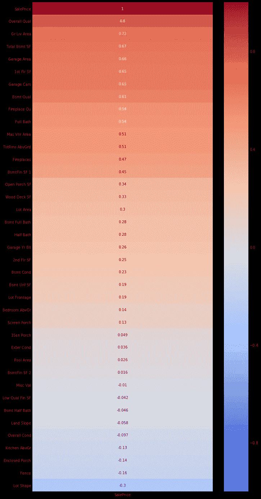
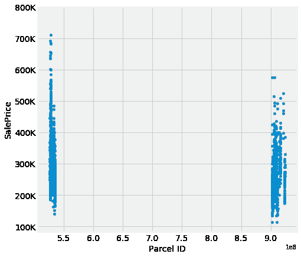
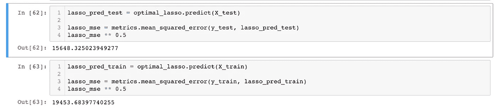

# 结束销售

> 原文：<https://towardsdatascience.com/closing-the-sale-predicting-home-prices-via-linear-regression-2eac62c72818?source=collection_archive---------21----------------------->

## 通过正则化线性回归预测房价

在今年秋天完成我的数据科学沉浸式学习时，我们的第一个“真正的数据科学项目”之一是分析艾奥瓦州的一组样本住房数据[T1 】,这些数据是通过埃姆斯评估办公室收集的，用于计算 2006 年至 2010 年在艾姆斯出售的个人住宅物业的评估值。具体来说，我们被要求创建一个模型来预测预期的房屋价值，并最小化](http://jse.amstat.org/v19n3/decock/DataDocumentation.txt)[均方根误差(RMSE)](http://statweb.stanford.edu/~susan/courses/s60/split/node60.html) 。

这个数据集已经在一个非常受欢迎的 Kaggle 竞赛系列中使用，并作为一个很好的学习工具来练习应用完整的数据科学模型工作流:从导入/清理到模型预测。

对于这一挑战，我们的队列仅限于使用线性回归来寻找预分割测试数据子集的期望值。这在几个方面很重要:

1.  因为整个数据集已经被分割成一个测试集，这减少了我们的模型可以训练的实例的数量。虽然建议您通常在建模时执行训练/测试分割，但进一步减少训练集可能会限制整体性能。
2.  如数据描述中所述，有五个观察值被认为是异常值:“三个...真正的异常值(可能不代表实际市场价值的部分销售)和两个…简单的不寻常销售(价格相对合理的非常大的房子)。”这很有帮助，因为我们可以很容易地量化/识别在我们的训练和测试数据集中有多少离群值。因为我们的线性回归不太可能预测这些异常值，并且评分是基于 RMSE 的，所以我们的模型从训练数据归纳到测试数据的能力将受到这些异常值的数量是否在训练集内的更大影响。
3.  由于销售价格的广泛分散和正偏差，部分由于上述异常值，该模型将倾向于低估多于高估。这可以通过记录目标要素(和/或任何其他非正态分布的要素)来归一化值的范围来解决。然而，结果很难解释(以对数或平方根美元表示的销售价格),我们无法预测哪个训练或测试集中有哪些异常值。

然而，作为数据科学家，我们必须做出某些假设，并在当前可用数据的范围内工作。

# 导入、数据清理和 EDA

清理和 EDA 对于这项挑战非常重要，因为该数据集包含许多在分类中可能很重要的有序/分类特征，并且需要转换为数值。

作为基线，我导入了以下库来清理、探索和建模训练数据。

我的第一个预处理步骤是将所有对象类型转换成可用于线性回归的数字特征。根据数据字典，有几个本质上是有序的分类特征。根据我个人的判断，我将对潜在购房者来说很重要的值从 0(如果 n a 是一个选项)或 1(如果 NA 不是一个选项)向上转换(取决于功能的数量)。

虽然我可以使用`get_dummies`方法，但通过使用一系列值(然后可以缩放)可以得到更多细微差别，并减少总体特征的数量。

Converting some of the categorical features

此外，该数据集中有许多需要估算的缺失/空值。对于具有大量缺失值的要素(如“地块临街面”)，更希望使用“真实”值而非“虚拟”值(如 0)来估算这些要素。这可以通过使用均值、中值、众数或其他相关函数来实现。

为了简单和节省时间，我没有使用计算来估算所有缺失的值。相反，我关注的是空值比例最大的变量。对于所有其他特性，我使用了`.fillna(0)`。使用一个基本的、有点随意的假设，我通过以下方式估算了地段临街面的缺失值:

我通过将某些数字特征转换成字符串，准备了通过`.get_dummies`转换的非序数分类特征:

Converting numerical features to string types

最后，为了证实我对功能重要性的最初假设，我创建了一个 Seaborn heatmap，它计算了与我的目标功能:销售价格相关的 Pearson 系数。

# 特征工程和选择

所有数据科学家的一项关键技能是特征选择的艺术和科学。这需要严格的统计测试和专业知识(或直觉)来从噪音中过滤信号。在进行最初的数据探索时，我发现了一个有趣的现象，即包裹 ID 和销售价格之间存在明显的相关性。通过散点图，我们可以发现宗地 ID 中的分歧(5 对 9)以及 PID 以 9 开头的房屋聚集在较低值的趋势。虽然这可能具有统计学意义，但我没有进行假设检验来验证。结果，我考虑到这种噪音，去掉了 PID 列。

由于该数据集的特征(多个相关特征)，存在冗余和多重共线性的可能性。虽然我们可以使用某些正则化技术(如套索)来补偿，但我也决定创建特征交互，希望隔离/放大最有影响力的特征。

因为我生成的要素使用不同的比例，所以在拟合模型之前，我应用了`StandardScaler`作为预处理集进行归一化。

# 拟合和交叉验证模型

为了验证我的线性回归模型的性能，我实例化并交叉验证了四个变量:多元线性回归、Lasso、Ridge 和 ElasticNet。虽然我的训练数据包含 350 多个特征，但通过使用正则化函数，我能够更准确地微调我的预测。最终，《套索》在 RMSE 和 R。

# 结论

虽然我非常具体的 Lasso 线性回归在我的训练数据和 Kaggle Challenge(不到 2 万美元 RMSE)的 30%测试数据中表现得相当好，但当该模型应用于其余 70%的测试数据时，我最终失败了。由于存在显著的异常值(我在训练集中去掉了这些异常值)，我的模型没有一般化，而是过度拟合了。

尽管如此，我希望我在这篇文章中展示的一些技术对其他有志于学习回归建模的数据科学家有用。

RMSE for Training and Test Data