# 云计算机视觉

> 原文：<https://towardsdatascience.com/cloud-computer-vision-d5708a3d4e05?source=collection_archive---------4----------------------->

## 测试概述

## 我的目标

有时我会把照片上传到像 Shutterstock 或 Depositphotos 这样的网站上。为了更好地被发现，照片应该包含适当的关键字和标题。Depositphotos 没有关键字的建议工具。Shutterstock 在手机应用程序中可以根据图片上的内容神奇地建议关键词。我很感兴趣，并决定创建一个脚本，可以为我所有的照片做同样的事情(我将能够使用它与存款照片)

## 为什么是云

起初，我尝试使用 OpenCV——它是一个用于计算机视觉的开源库。这个库是这样工作的:你需要提供一些参数(矩阵)，这些参数定义了搜索一个图片的内容和图片本身。我开始搜索这些参数，但我发现的只是简单的几何图形和人脸的识别。在哪里找到合适的矩阵或者如何自己创建它还不清楚。那么，为什么是云呢？这样更方便快捷。

## 微软认知服务

我召回微软服务是因为[https://how-old.net](https://how-old.net/)网站。比方说，病毒效应是成功的。因此，微软将牛津实验项目更名为认知服务，现在他们提供付费服务。除了计算机视觉，还有一批不同的 API，如文本到语音转换、搜索、人脸检测。注册非常顺利，几分钟后我就可以测试我的照片了。MS Cognitive Service 的一个很好的功能——它可以为图片创建一个标题。

## 谷歌云愿景

谷歌还提供计算机视觉服务，作为大型谷歌云平台的一部分。意味着更严重更复杂。注册真的很长，需要信用卡。谷歌云的一个很好的功能是地标探测——它可以在图片上找到著名的地方并命名。

## 克拉里菲

这是一家成立 4 年的纽约公司。他们主要也是唯一的服务是云计算机视觉。他们在 ImageNet 竞赛中获得了 5 个名次(这是一种计算机视觉的奥林匹克竞赛)。真正流畅的注册和完美的用户体验。除此之外，他们有真正准确的识别引擎。

## 我是如何测试的

所有这 3 个服务都有一个在线演示，你可以把你的图片放在那里，并立即得到结果。我用 4 种不同类型的图像进行了测试:特写建筑、城市景观、自然和倒影。以下是微软的一些结果:

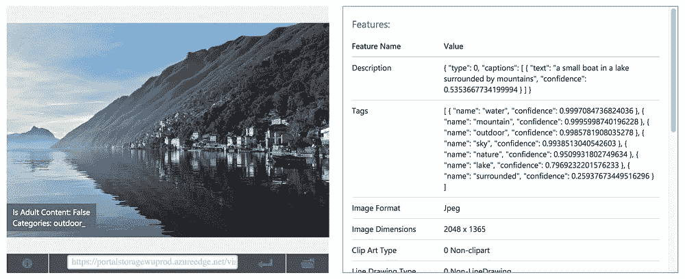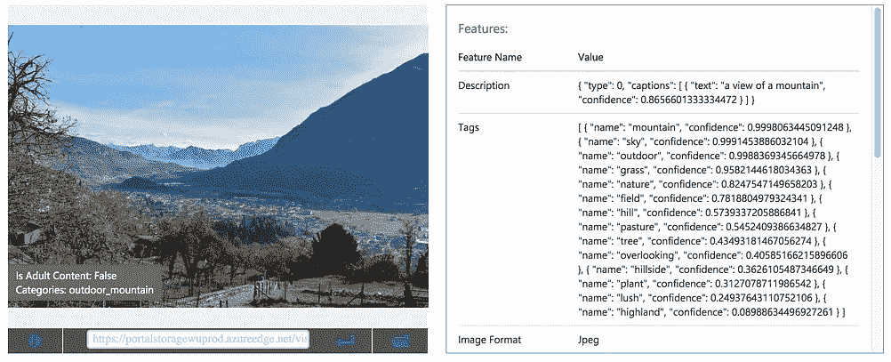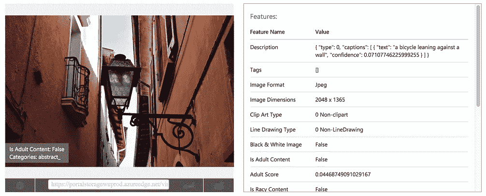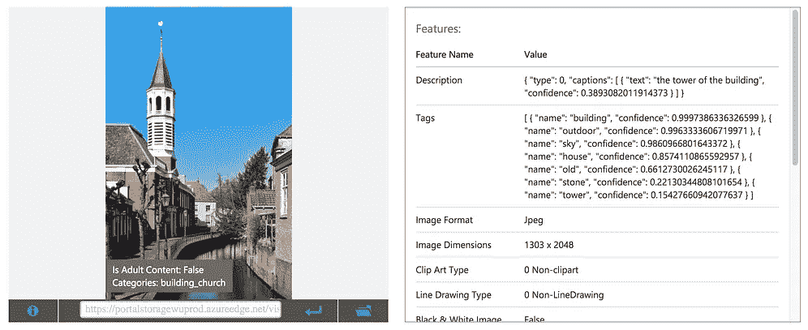

Microsoft Computer Vision

所以，微软对大部分图片都做得很好。它为除了有灯笼的图片之外的所有图片提供了一些漂亮的标题和少量的或多或少相关的标签。接下来是谷歌:

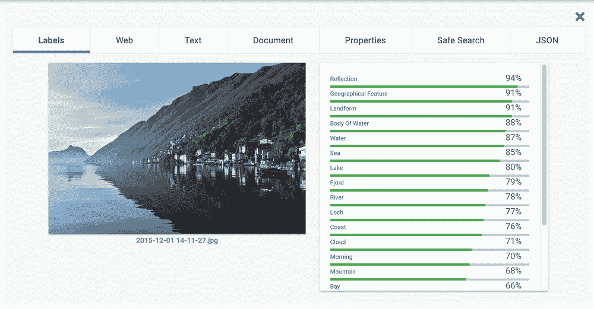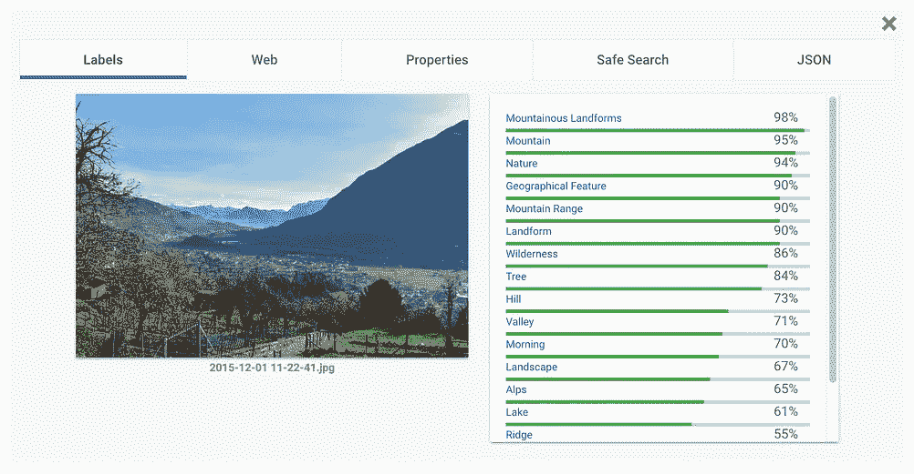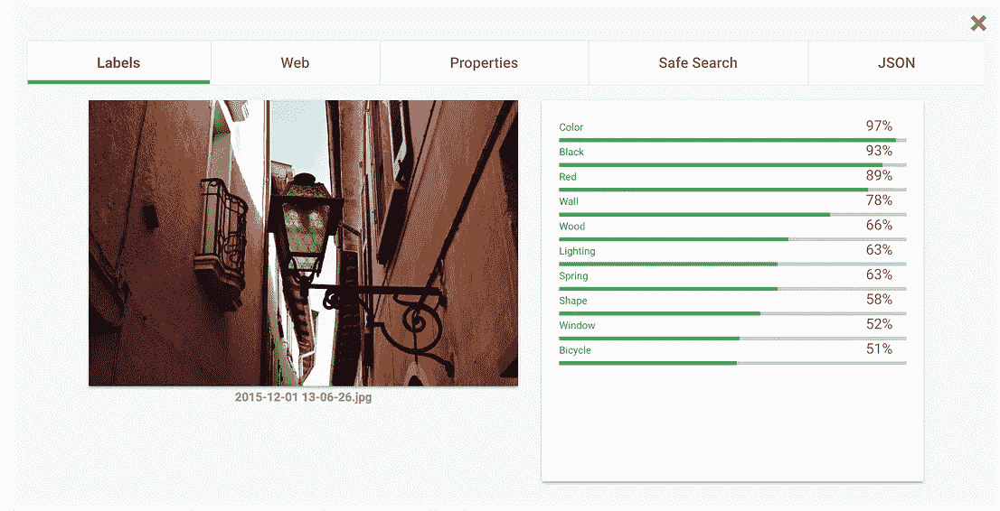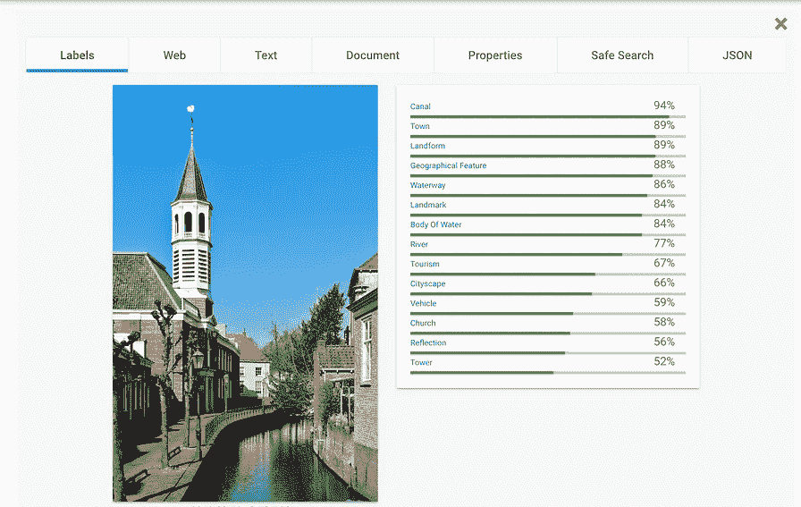

Google Cloud vision

你可以在这里看到更多与图片密切相关的标签。没有地标，但是这个服务也可以提供它(像罗马圆形大剧场或者埃菲尔铁塔)。谷歌也有一个用提灯检测图片的问题。接下来是 Clarifai:

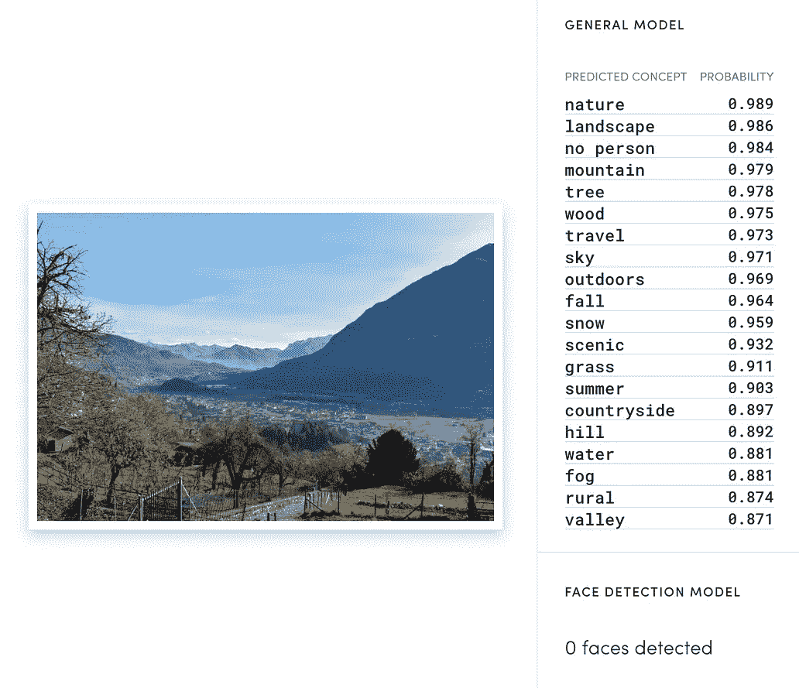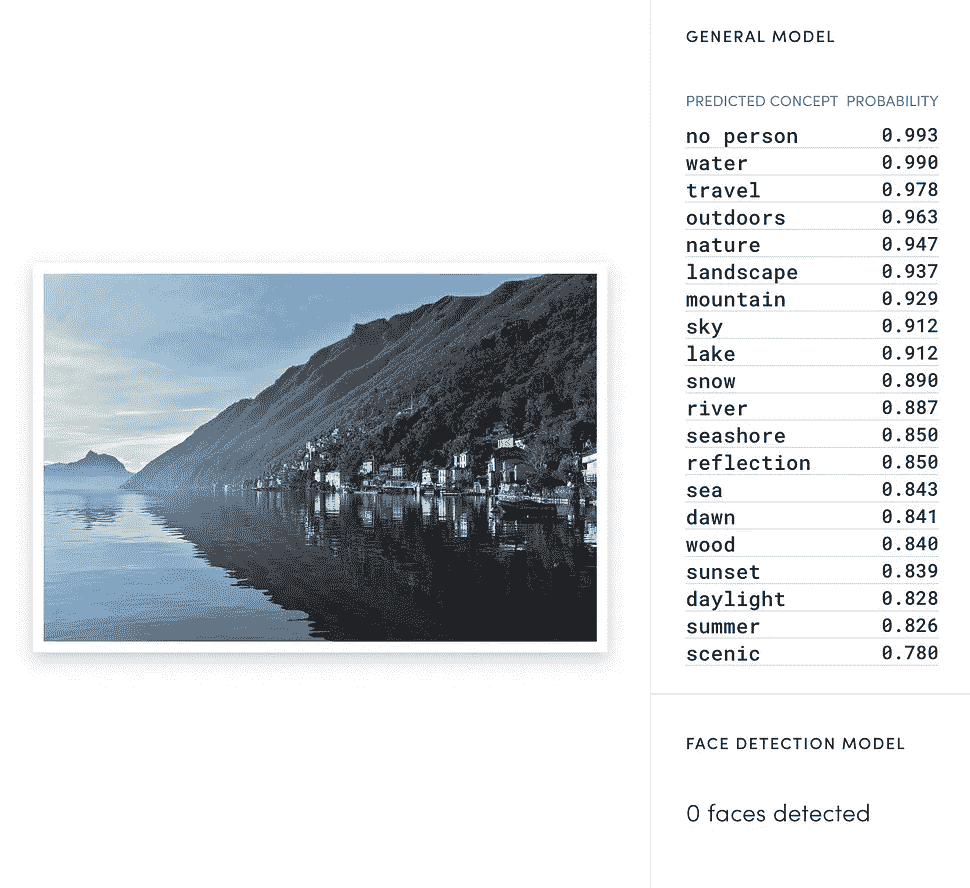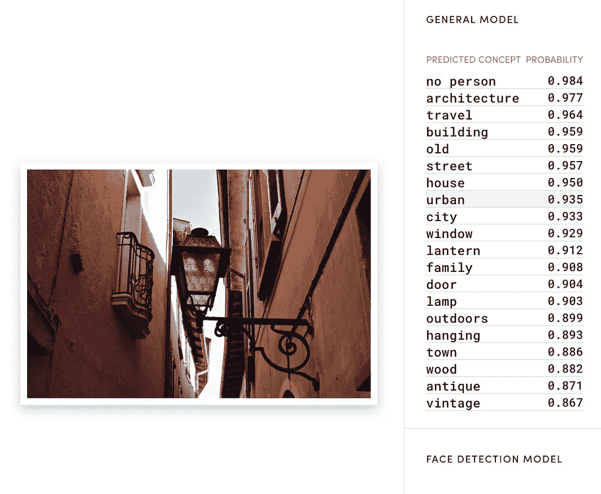

Clarifai API

Clarifai API 显示了这几组照片的最佳结果。正如你所看到的，它提供了大量强相关的标签，也很好地识别了灯笼照片。

## с对照表

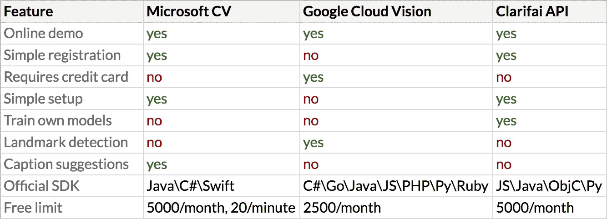

由于复杂的注册和信用卡要求，以及不明确的配额行为，我决定不使用谷歌云视觉。我处理地理相关的标签只是使用免费的地理编码 API。官方 SDK 的缺乏很容易被非官方的掩盖。而且一般来说这只是一个简单的 HTTP 请求。

## 附加服务

我没有试过亚马逊 Rekognition，因为它需要注册和信用卡，没有在线演示。IBM Alchemy 没有通过我最初的测试。它提供了非常少量的标签，有时标签是不相关的。
还有一堆不同的提供计算机视觉的网络服务，我在 Mashape 博客上发现了几个列表，大多数都已经死了，或者需要复杂的注册而没有在线演示，或者只提供付费服务。

## 结论

现在用计算机视觉开始工作真的很容易。大多数情况下，它只需要注册，然后发布带有特殊标题的请求。带有 JSON 响应格式的 REST API。但遗憾的是，并不是 100%正确。我想甚至不是 90%。在我的情况下，结果应该由人来审查。对于其他情况，如人脸检测或成人内容，它的效果要好得多。

我希望你喜欢这篇小评论。如果是这样，请不要犹豫，按下心脏按钮。谢谢！

## 有用的链接

*   计算机视觉国际竞赛—【http://image-net.org/ 
*   【http://opencv.org/】OpenCV 官方页面— [官方](http://opencv.org/)
*   **微软**计算机视觉(在线试用、定价、文档)——[https://www . Microsoft . com/cognitive-services/en-us/Computer-Vision-API](https://www.microsoft.com/cognitive-services/en-us/computer-vision-api)
*   **谷歌**云视觉(在线试用、定价、文档)——[https://cloud.google.com/vision/](https://cloud.google.com/vision/)
*   **Clarifai** API(在线试用、定价、文档)——[https://www.clarifai.com/demo](https://www.clarifai.com/demo)
*   **IBM** 视觉识别(在线试用、定价、文档)——[https://www . IBM . com/Watson/developer cloud/Visual-Recognition . html](https://www.ibm.com/watson/developercloud/visual-recognition.html)
*   **亚马逊** Rekognition(无在线演示)——【https://aws.amazon.com/ru/rekognition/ 
*   原料药市场—【https://www.mashape.com/ 