# 云计算 AWS #1:简介和 EC2 实例创建(通过控制台)

> 原文：<https://towardsdatascience.com/cloud-computing-aws-1-introduction-ec2-instance-creation-via-console-5177a2b43359?source=collection_archive---------12----------------------->

大家好！欢迎来到 AWS 教程。如果你还不认识我，我是 NYU 大学的一名研究生，我冒险进入了写作的世界，与你们分享我有限的知识。我目前正在 NYU 学习“云计算”课程，我认为分享我所学到的东西是值得的。我也在写关于机器学习的文章，所以也来看看这些文章吧！

在这个系列中，我将主要关注实现部分，较少关注理论部分。我知道有许多与 AWS 相关的文章，但它们分散在不同的文章中，我觉得有必要将它们“捆绑”在一起。此外，我计划在接下来的文章中写一些关于使用 AWS 创建 web 应用程序和聊天机器人的内容。

# 来源

本文的灵感来自各种材料，包括但不限于:

1.  [Amazon Web Services in Action 由 Michael Wittig 和 Andreas Wittig](https://www.amazon.com/Amazon-Services-Action-Andreas-Wittig/dp/1617292885) ，
2.  [AWS 官方文档](https://aws.amazon.com/documentation/)，
3.  Sambit Sahu 教授的讲座、笔记和幻灯片，以及
4.  互联网

# 什么是云计算？

让我们从 NIST(美国国家标准与技术研究院)的官方定义开始:

> 云计算是一种支持对可配置计算资源(例如，网络、服务器、存储、应用程序和服务)的共享池进行无处不在、方便、按需的网络访问的模型，可配置计算资源可以通过最少的管理工作或服务提供商交互来快速供应和释放。

你脑子进水了，是吗？只要记住这一点:

> 云计算提供了对随需应变资源的访问，例如计算能力、数据库存储、应用程序和其他一些 IT 资源。

详细定义参见[本](https://cacm.acm.org/magazines/2010/4/81493-a-view-of-cloud-computing/fulltext)。

云可以分为三种类型:

1.  **Public** -由组织管理的云，对公众开放使用
2.  **私有云** -在单个组织内虚拟化和共享 IT 基础设施的云
3.  **混合云**——混合了公共云和私有云的云

云服务也可以分为三种类型:

1.  **基础设施即服务(IaaS)** -使用 Amazon EC2 等虚拟服务器提供计算、存储和网络功能等基础资源
2.  **平台即服务(PaaS)** -提供将定制应用部署到云的平台，例如 AWS Elastic Beanstalk 和 Heroku
3.  **软件即服务(SaaS)**——结合基础设施和运行在云中的软件，包括办公应用程序，如谷歌办公应用程序和微软 Office 365

# 为什么 AWS 优于其他云平台？

有几个原因:

*   它是最成熟的云平台
*   它支持最多的 SDK 语言
*   社区支持比任何其他云平台都大

# AWS 入门

注册过程主要包括五个步骤:

1.  **提供您的登录凭证**

前往[https://aws.amazon.com，](https://aws.amazon.com,)点击创建免费账户/创建 AWS 账户按钮。按照屏幕上的步骤创建您的帐户。

2.**提供您的联系凭据**

只需在必填字段中填写您的联系信息。

3.**提供您的付款详情**

是的，您必须提供您的付款详情才能创建 AWS 帐户。请注意，AWS 支持万事达卡和维萨卡。

4.**验证您的身份**

完成上述步骤后，您将会接到 AWS 的电话。你的屏幕上会显示一个密码，你必须通过电话向机器人语音提供这个密码。

5.**选择您的支持计划**

选择基本计划，因为它是免费的。

恭喜你！您成功创建了一个 AWS 帐户。您现在可以在[https://console.aws.amazon.com](https://consolde.aws.amazon.com)登录您的 AWS 管理控制台

**注意:**强烈建议您按照 AWS 的建议设置计费警报:[http://mng.bz/M7Sj](http://mng.bz/M7Sj)

# EC2 实例

创建 EC2 实例类似于用编程语言编写“Hello World”程序。理解创建该实例所涉及的各种过程是至关重要的。

EC2 是弹性计算云的缩写。它是一种服务，为我们提供了一个叫做实例的虚拟服务器。使用 Amazon EC2，您可以设置和配置操作系统，并在这个实例上安装应用程序。

启动 Amazon EC2 实例的架构如下所示:

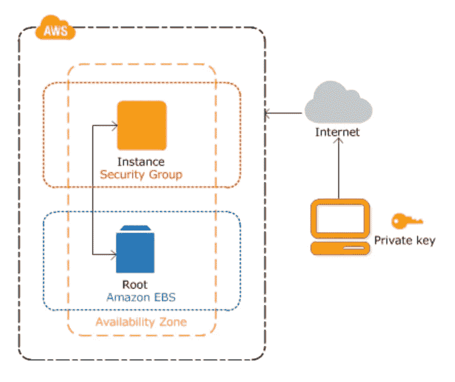

**实例**是一个 Amazon EBS 支持的实例，即 root 是一个 EBS 卷。Amazon EBS(弹性块存储)提供持久的块存储卷供实例使用。亚马逊 EBS 提供以下内容:

*   保护实例免受组件故障的影响
*   提供高可用性和耐用性
*   提供一致的低延迟性能
*   在几分钟内增加或减少您的使用

您可以为您的实例指定**可用性区域**(它应该在那里运行)，或者由 AWS 自动为您指定。

要启动您实例，您需要通过指定一个**密钥对**和一个**安全组**来保护它。

一个**密钥对**由一个私钥和一个公钥组成。公钥将被上传到 AWS 并插入到虚拟服务器中。你应该保存私人钥匙；它就像一个密码，但更安全。当您想要连接到实例时，您需要验证您的身份。这是通过使用私钥的认证来完成的。

**安全组**是 AWS 的一项基本服务，像防火墙一样控制网络流量。当实例启动时，一个或多个安全组与其相关联。有关安全组的更多信息，请参考 AWS 官方文档:[https://docs . AWS . Amazon . com/AWS C2/latest/user guide/using-network-security . html](https://docs.aws.amazon.com/AWSEC2/latest/UserGuide/using-network-security.html)

理论说够了！现在，我们将研究以两种方式启动实例:

1.  通过控制台
2.  通过命令行

# 通过控制台创建 EC2 实例

我们将为 Linux 创建一个 EC2 实例，因为这样做很容易。这一过程包括三个主要步骤:

1.  启动实例
2.  连接到您的实例
3.  终止您的实例

# 1.启动实例

*   登录控制台:[https://console.aws.amazon.com/](https://console.aws.amazon.com/)
*   在继续下一步之前，请确保您在美国东部(N. Virginia)地区(这只是出于一致性目的)

*   导航至**服务** - > **EC2**

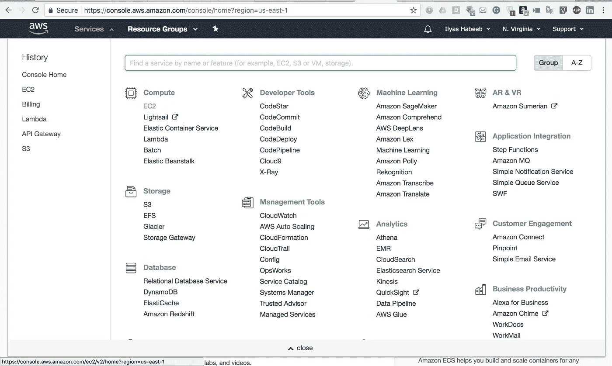

*   点击**启动实例**

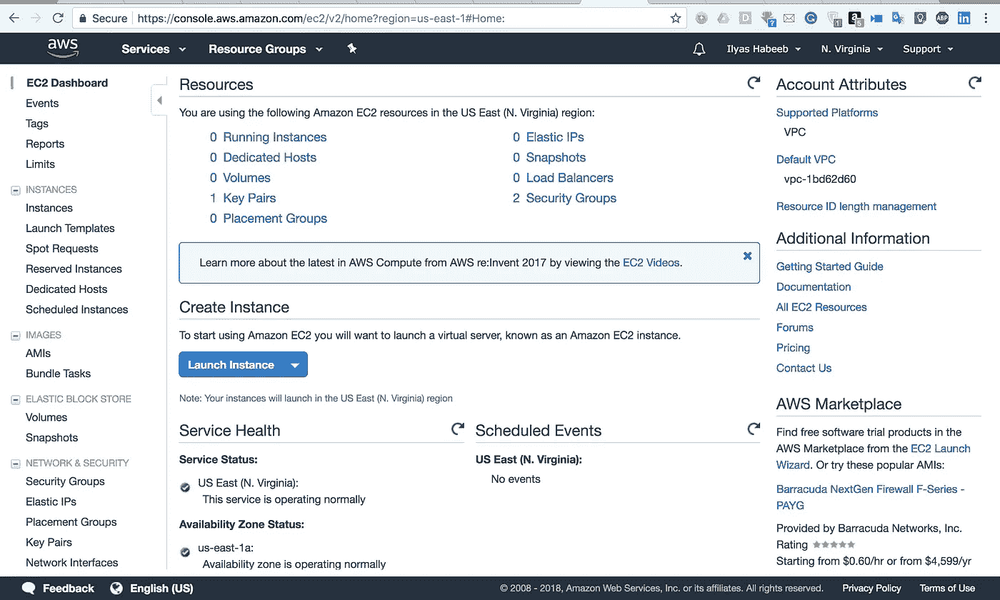

*   现在，**选择一个亚马逊机器图像(AMI)** 推出了。AMI 充当您的实例的基本模板。选择第一个 AMI(HVM 版)。

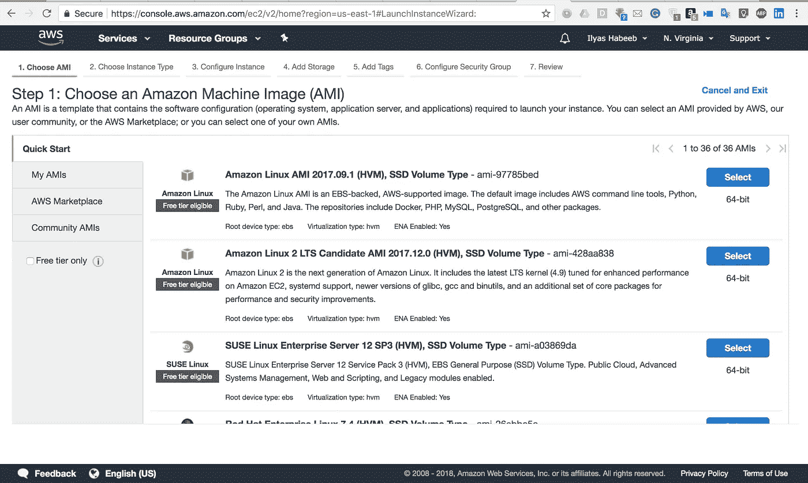

*   选择 t2.micro 实例类型。这是唯一符合*“符合自由层条件”的实例类型。* T2 实例为您的虚拟实例提供基线硬件配置。接下来，点击**查看并启动。**

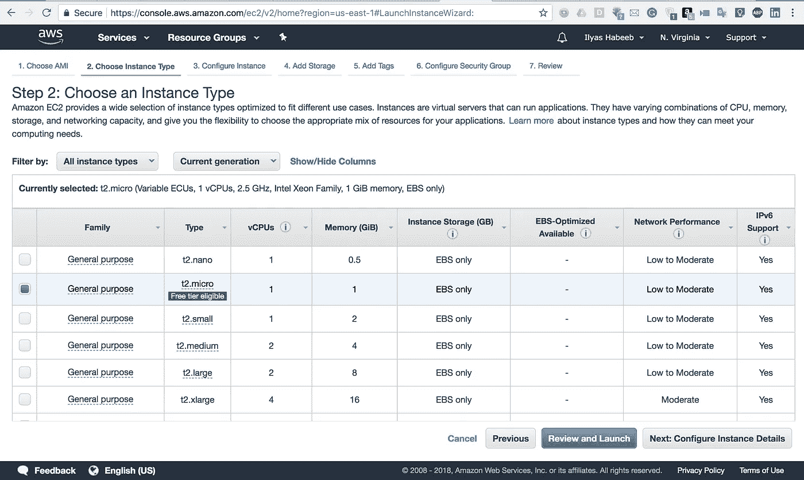

*   在这个页面上，您将看到 AWS 为您自动创建了一个安全组。如果要使用现有的安全组，导航到**编辑安全组**->-**配置安全页面**->-**选择一个现有的安全组。**在本教程中，我们将使用自动为我们创建的安全组。点击**发射**。

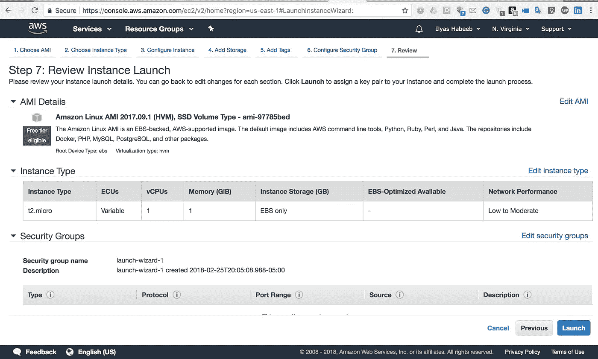

*   将弹出一个密钥对。因为我们没有现有的密钥对，所以选择**创建新的密钥对**选项。写下密钥对的任意名称。我将称它为*‘我的钥匙对’*。点击**下载密钥对**。私钥文件将被下载到您的系统中。保管好它。接下来，点击**启动实例**。

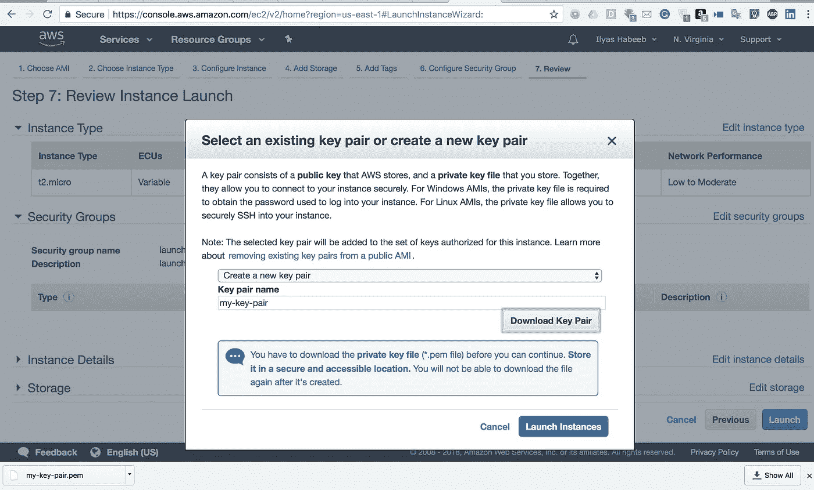

*   您的实例现在将开始运行。导航至页面底部，点击**查看实例**。

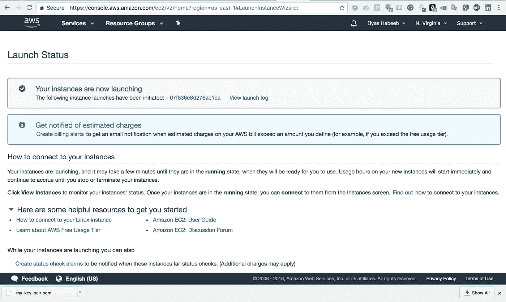

*   现在，您可以看到正在运行的实例的详细信息。花些时间探索和谷歌出某些术语，如“实例 ID”、“公共 DNS (IPv4)”、“IPv4 公共 IP”等。因为如果你理解它们的意思，它会很好地为你服务。同样，等待**状态检查**栏从 ***初始化*** 变为 ***2/2 检查通过。***

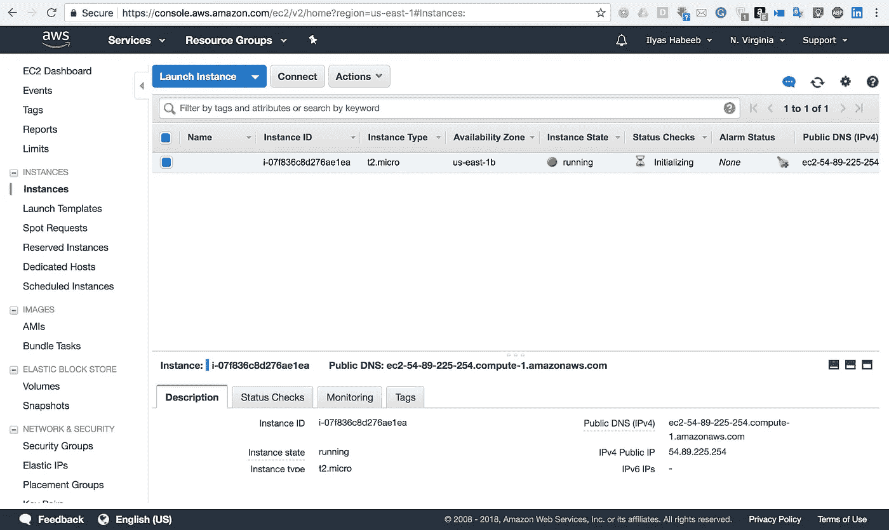

# 2.连接到您的实例

有两种方法可以连接到实例:

*   通过浏览器(在这种情况下，您需要安装 Java)
*   通过独立的 SSH 客户端

官方 AWS 文档提供了通过浏览器连接实例的指南。然而，我们将通过独立的 SSH 连接我们的实例。还要注意，我将通过 Mac 连接实例，但我会尽可能为 Window 用户提供说明。

**对于 Linux(和 Mac)用户:**

*   大多数 Linux 机器默认安装了 **ssh** 客户端。您可以通过在终端上键入 *ssh* 来检查您是否有 ssh 客户端。如果你的电脑不能识别这个命令，那么去[http://www.openssh.com/portable.html](http://www.openssh.com/portable.html)并按照那里的指示去做。

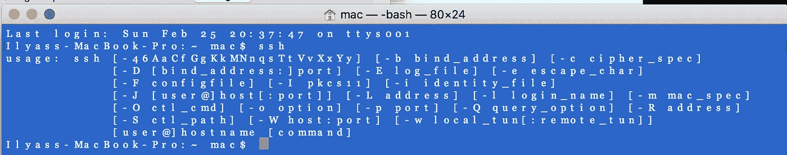

*   接下来，安装 AWS CLI。现在并不真的需要这样做，但是稍后当我们尝试以编程方式创建实例时会用到。如果安装了 pip，请键入以下命令:

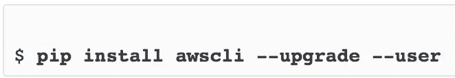

*   验证您已经通过该命令安装了 **awscli** :

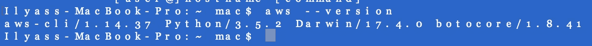

*   如果您在安装 awscli 时遇到任何错误，请参考 AWS 官方文档:[https://docs . AWS . Amazon . com/CLI/latest/user guide/installing . html](https://docs.aws.amazon.com/cli/latest/userguide/installing.html)
*   从控制台获取(记下)实例 ID、公共 DNS 名称和 IPv4 地址。

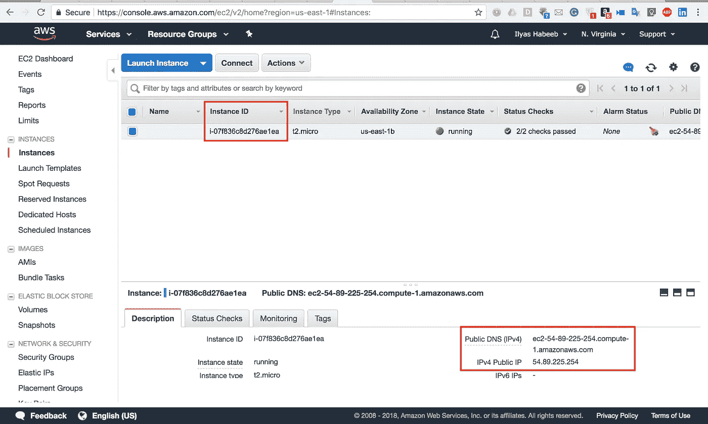

*   在步骤 1 中，我们下载了一个扩展名为'的密钥。pem。找到密钥并记下其路径。我的道路是:

> downloads/我的密钥对. pem

*   使用 **chmod** 命令确保您的私钥不会被公开。该命令如下所示:

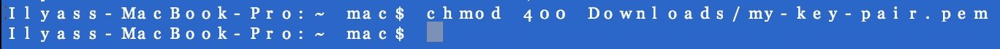

*   现在，使用 **ssh** 命令连接到实例。 **ssh** 命令的语法如下:

> ssh-I[私钥路径]用户名@[公共域名或 IPv4 地址]

*   亚马逊 Linux 的用户名是**ec2-用户**。 **public_dns_name** 或 **IPv4_address** 就是您之前记下的那个。写完 ssh 命令后，提示您输入**是**或**否**。输入**是**。

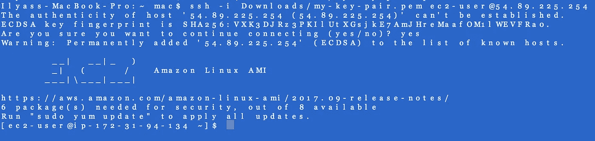

恭喜你！您现在已经连接到 Amazon Linux AMI。

**对于窗口用户:**

Window 用户日子有点不好过。默认情况下，他们没有 SSH 客户端，所以他们需要安装免费的 SSH 客户端。如果你有旧版本的 PuTTy，建议安装最新版本。我不会提供一步一步的指示；相反，我会把你重定向到你可以自己做这件事的链接。

*   **从这里下载 PuTTy:【http://www.chiark.greenend.org.uk/~sgtatham/putty/】**
*   **为您的 Linux 实例启用入站流量:**[https://docs . AWS . Amazon . com/AWS C2/latest/user guide/authoring-access-to-an-Instance . html](https://docs.aws.amazon.com/AWSEC2/latest/UserGuide/authorizing-access-to-an-instance.html)
*   **使用 PuTTYgen 转换私钥:** PuTTYgen 会在您安装 PuTTy 时安装。PuTTy 不支持。pem 扩展名，但它可以将。pem 扩展到。使用 PuTTYgen 的 ppk。
*   **启动一个 PuTTY 会话:**打开 **PuTTY** 。从**类别**窗格中，选择**会话**并完成**主机名** (ec2-user@[public_DNS_name 或 IPv4_address])。然后在**连接类型**下，选择 **SSH** 。最后，确保**端口号**为 **22** 。
*   接下来，在**类别**窗格中，展开**连接**->-**SSH**->**Auth**。选择**浏览** - >选择**。你生成的 ppk 文件**->-**打开**。如果这是您第一次连接到实例，将显示一个**安全警告对话框**，询问您是否信任该连接。选择**是**。一个窗口打开，您现在连接到您的实例。

最后三条说明，参考 AWS 官方文档:[https://docs . AWS . Amazon . com/AWS C2/latest/user guide/putty . html](https://docs.aws.amazon.com/AWSEC2/latest/UserGuide/putty.html)

# 3.终止您的实例

使用实例后将其终止是很重要的。由于您使用的是实例的 AWS 自由层版本，如果您只是让实例闲置，您将会产生费用。下面是实现它的步骤:

*   在 EC2 控制台中，单击 Instances 并选择实例。

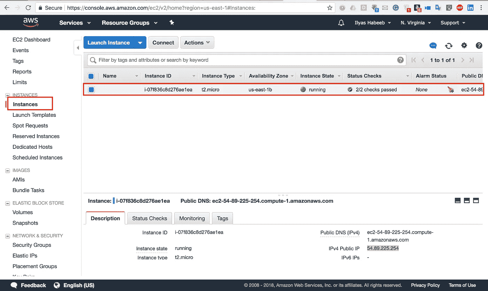

*   选择**动作**->-**实例状态**->-**终止**

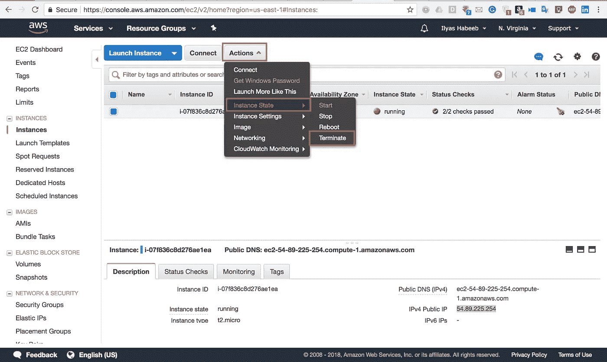

*   当提示确认时，点击**是，终止**。

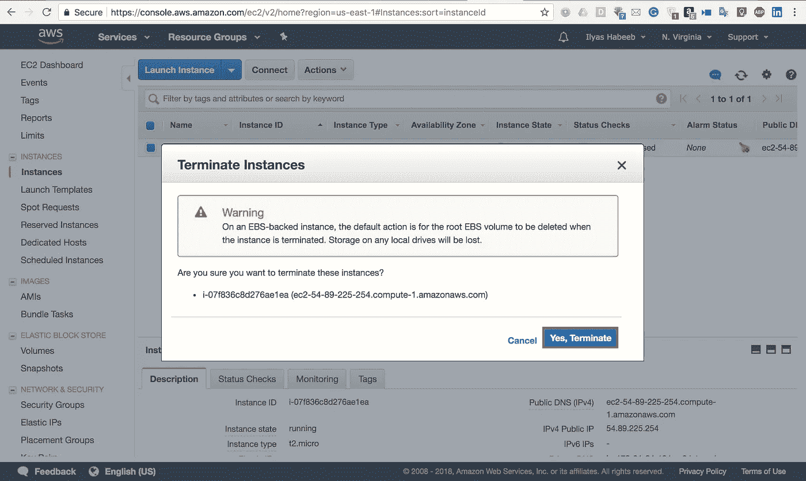

*   该实例将需要一些时间来终止。等待它关闭。实例状态应该从**关闭**到**终止**。

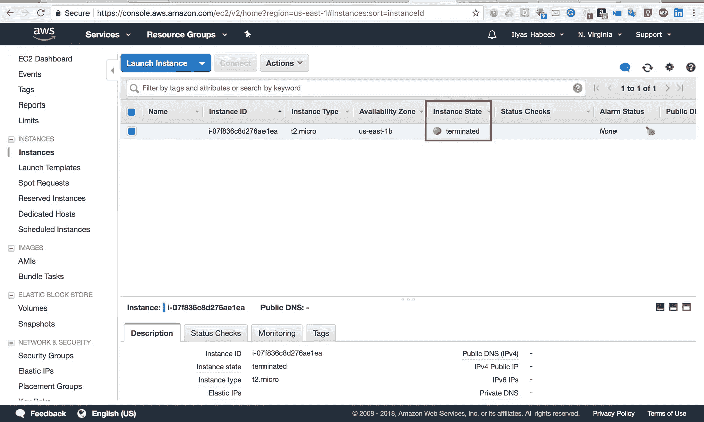

唷！那是一把！我们终于学会了如何创建一个实例，通过 SSH 访问该实例，并终止它。

对这些人来说就是这样！下周，我们将学习做同样的事情，即以编程方式创建一个 Amazon Linux 实例。敬请期待！