# 客户细分的聚类算法

> 原文：<https://towardsdatascience.com/clustering-algorithms-for-customer-segmentation-af637c6830ac?source=collection_archive---------1----------------------->

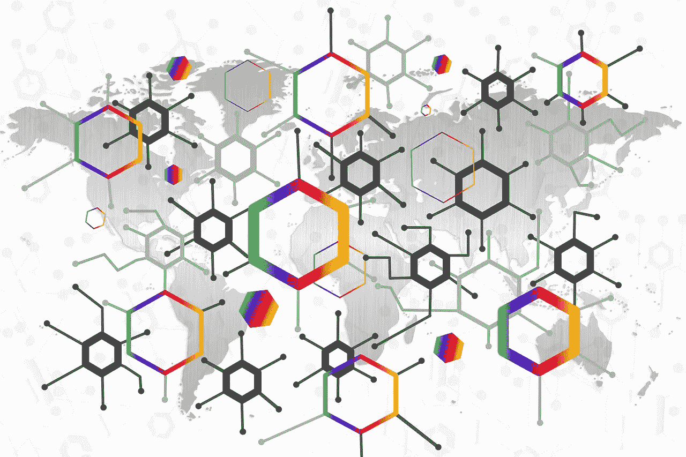

**上下文**
在当今竞争激烈的世界，了解客户行为并根据其人口统计和购买行为对客户进行分类至关重要。这是客户细分的一个重要方面，它允许营销人员在促销、营销和产品开发策略方面更好地针对各种受众群调整营销工作。

**目标**
这篇文章展示了使用 python 中的 k-means 聚类对电子商务网站的客户数据集[进行细分的概念。数据集包含大约 300 名客户的 ***年收入*** 和他们在电子商务网站上的 ***年支出*** 。我们将使用 k-means 聚类算法得出最佳聚类数，并根据提供的数据了解潜在的客户群。](https://github.com/sowmyacr/kmeans_cluster/blob/master/CLV.csv)

**关于数据集**
数据集由 303 名客户的年收入(以 000 美元计)和他们一年内在电子商务网站上的总支出(以 000 美元计)组成。让我们使用 python 中的 *numpy* 和 *pandas* 库来研究这些数据。

```
#**Load the required packages**
import numpy as np
import pandas as pd
import matplotlib.pyplot as plt#**Plot styling**
import seaborn as sns; sns.set()  # for plot styling
%matplotlib inlineplt.rcParams['figure.figsize'] = (16, 9)
plt.style.use('ggplot')#**Read the csv file**
dataset=pd.read_csv('CLV.csv')#**Explore the dataset**
dataset.head()#top 5 columns
len(dataset) # of rows#**descriptive statistics of the dataset**
dataset.describe().transpose() 
```


dataset.head()

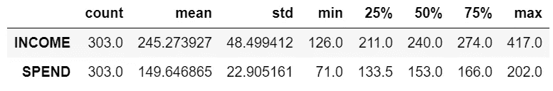

dataset.describe().transpose()

数据集由 303 行组成。平均年收入为 245000 英镑，平均年支出为 149000 英镑。年收入和年支出的分布用 *distplot* 和 *violinplot* 表示。

**可视化数据** disp plot 和 violinplot 显示收入和支出的数据分布。

```
**#Visualizing the data - displot**
plot_income = sns.distplot(dataset["INCOME"])
plot_spend = sns.distplot(dataset["SPEND"])
plt.xlabel('Income / spend')
```

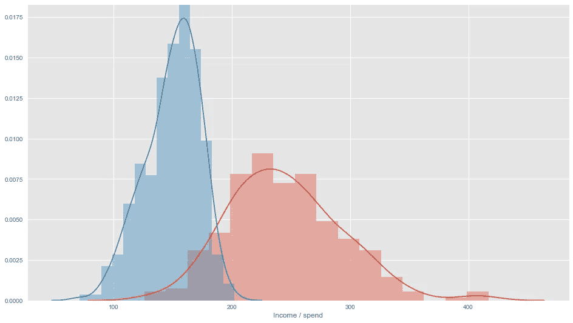

Distribution plot of Income & Spend

```
**#Violin plot of Income and Spend**
f, axes = plt.subplots(1,2, figsize=(12,6), sharex=True, sharey=True)
v1 = sns.violinplot(data=dataset, x='INCOME', color="skyblue",ax=axes[0])
v2 = sns.violinplot(data=dataset, x='SPEND',color="lightgreen", ax=axes[1])
v1.set(xlim=(0,420))
```

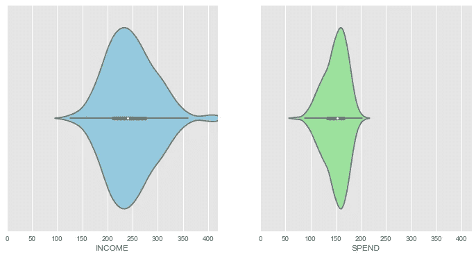

**聚类基础** 聚类是一种无监督的机器学习技术，其中没有定义的因变量和自变量。数据中的模式用于识别/分组相似的观察结果。

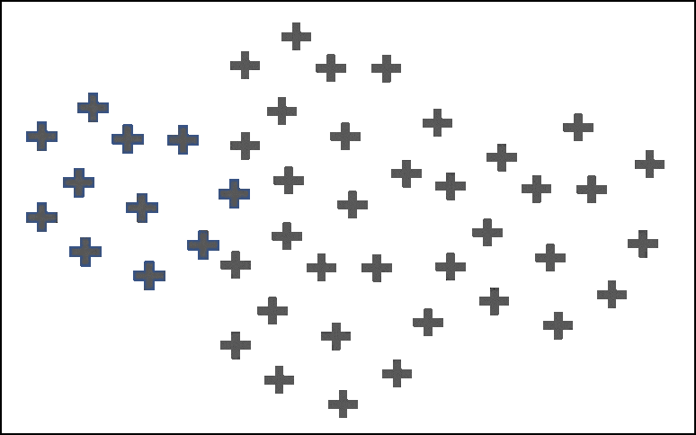

Original Dataset

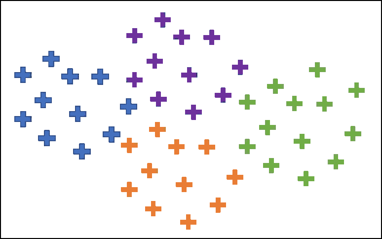

After Clustering

任何聚类算法的目标都是确保一个聚类中数据点之间的距离与两个聚类之间的距离相比非常小。换句话说，一个群体的成员非常相似，而不同群体的成员极其不相似。

我们将使用 are k-means 聚类来根据客户的收入和支出数据创建客户细分。

**K-均值聚类**
K-均值聚类是一种迭代聚类算法，其中聚类数 K 是预先确定的，并且该算法基于特征相似性迭代地将每个数据点分配给 K 个聚类之一。

**k 均值算法的主要步骤**

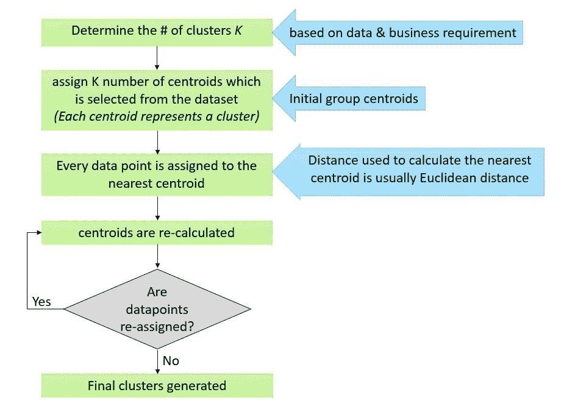

**聚类的数学方法**

聚类背后的数学原理，简单来说，就是最小化聚类质心与其相关数据点之间距离的平方和:

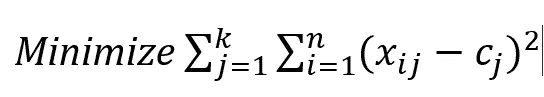

*   *K* =集群的数量
*   *N* =数据点的数量
*   *C*=群集 j 的质心
*   (*xij—CJ*)–数据点与其被分配的质心之间的距离

**确定最佳聚类数“K”** K-means 聚类的主要输入是聚类数。这是使用 ***最小化平方(WCSS)*** 内聚类和的概念导出的。创建一个 scree 图，它在 X 轴上绘制聚类数，在 y 轴上绘制每个聚类数的 WCSS。

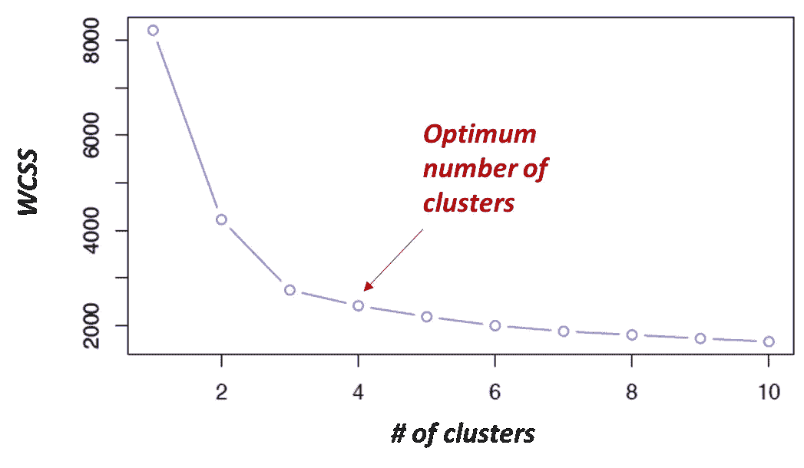

Scree plot / Elbow method to determine optimum number of clusters

随着星团数量的增加，WCSS 不断减小。WCSS 的下降最初是陡峭的，然后下降的速率变慢，导致肘形图。弯头形成处的簇数通常给出了最佳簇数的指示。应该结合对业务需求的具体了解来决定最佳集群数量。

对于我们的数据集，我们将使用肘方法得出最佳聚类数:

```
**#Using the elbow method to find the optimum number of clusters**
from sklearn.cluster import KMeans
wcss = []
for i in range(1,11):
    km=KMeans(n_clusters=i,init='k-means++', max_iter=300, n_init=10, random_state=0)
    km.fit(X)
    wcss.append(km.inertia_)
plt.plot(range(1,11),wcss)
plt.title('Elbow Method')
plt.xlabel('Number of clusters')
plt.ylabel('wcss')
plt.show()
```

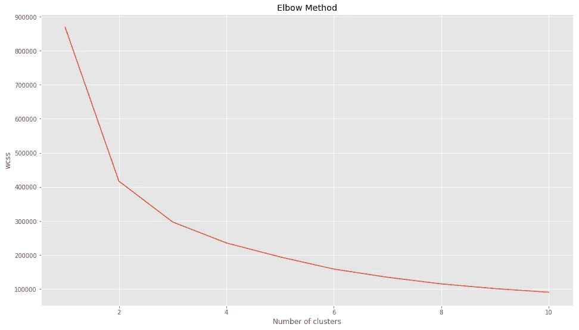

Scree plot of given datatset on customer Income & Spend

根据肘图，我们可以选择 4、5 或 6 个集群。让我们尝试集群的数量和可视化集群，以决定集群的最终数量。

**将 k 均值拟合到 k=4 的数据集**

```
**##Fitting kmeans to the dataset with k=4**
km4=KMeans(n_clusters=4,init='k-means++', max_iter=300, n_init=10, random_state=0)
y_means = km4.fit_predict(X)**#Visualizing the clusters for k=4**
plt.scatter(X[y_means==0,0],X[y_means==0,1],s=50, c='purple',label='Cluster1')
plt.scatter(X[y_means==1,0],X[y_means==1,1],s=50, c='blue',label='Cluster2')
plt.scatter(X[y_means==2,0],X[y_means==2,1],s=50, c='green',label='Cluster3')
plt.scatter(X[y_means==3,0],X[y_means==3,1],s=50, c='cyan',label='Cluster4')plt.scatter(km4.cluster_centers_[:,0], km4.cluster_centers_[:,1],s=200,marker='s', c='red', alpha=0.7, label='Centroids')
plt.title('Customer segments')
plt.xlabel('Annual income of customer')
plt.ylabel('Annual spend from customer on site')
plt.legend()
plt.show()
```

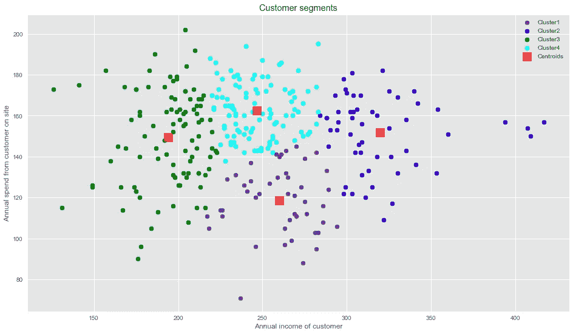

Cluster plot : k=4

该图显示了 4 个集群的分布。我们可以将他们理解为以下客户群:

1.  第 1 类:中等年收入和低年支出的客户
2.  第 2 类:年收入高、年支出中等偏高的客户
3.  第三类:年收入低的客户
4.  第 4 类:年收入中等但年支出高的客户

集群 4 是一个潜在的客户群。然而，群 2 和群 3 可以被进一步细分以达到更具体的目标客户群。现在让我们来看看当 k=6 时，集群是如何创建的:

```
**##Fitting kmeans to the dataset - k=6**
km4=KMeans(n_clusters=6,init='k-means++', max_iter=300, n_init=10, random_state=0)
y_means = km4.fit_predict(X)**#Visualizing the clusters**
plt.scatter(X[y_means==0,0],X[y_means==0,1],s=50, c='purple',label='Cluster1')
plt.scatter(X[y_means==1,0],X[y_means==1,1],s=50, c='blue',label='Cluster2')
plt.scatter(X[y_means==2,0],X[y_means==2,1],s=50, c='green',label='Cluster3')
plt.scatter(X[y_means==3,0],X[y_means==3,1],s=50, c='cyan',label='Cluster4')
plt.scatter(X[y_means==4,0],X[y_means==4,1],s=50, c='magenta',label='Cluster5')
plt.scatter(X[y_means==5,0],X[y_means==5,1],s=50, c='orange',label='Cluster6')plt.scatter(km.cluster_centers_[:,0], km.cluster_centers_[:,1],s=200,marker='s', c='red', alpha=0.7, label='Centroids')
plt.title('Customer segments')
plt.xlabel('Annual income of customer')
plt.ylabel('Annual spend from customer on site')
plt.legend()
plt.show()
```

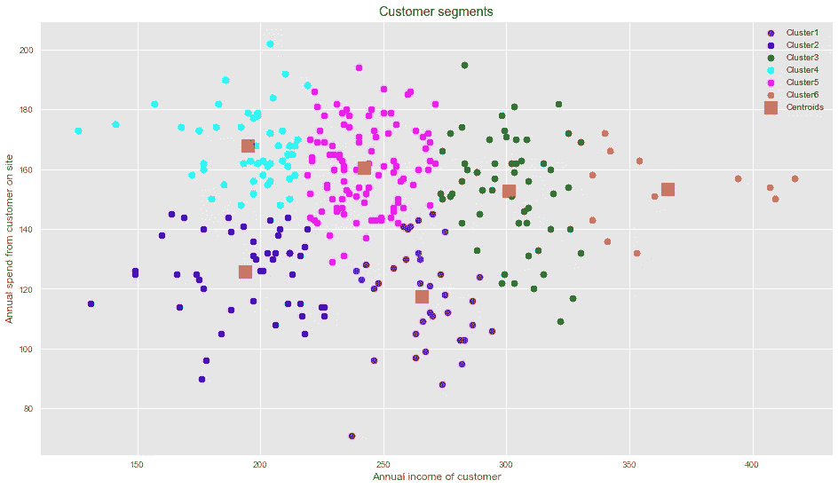

Cluster plot : k=6

将聚类数设置为 6 似乎可以提供更有意义的客户细分。

1.  第 1 类:中等收入，低年支出
2.  第二类:低收入，低年度支出
3.  集群 3:高收入，高年度支出
4.  集群 4:低收入，高年度支出
5.  第 5 类:中等收入，低年支出
6.  集群 6:非常高的收入，高的年支出

因此，很明显，6 个聚类提供了更有意义的客户细分。

**细分客户的营销策略**
根据这 6 个集群，我们可以制定与每个集群相关的营销策略:

*   一个典型的策略是将某些促销努力集中于集群 6 和集群 3 的高价值客户。
*   集群 4 是一个独特的客户群，尽管他们的年收入相对较低，但这些客户倾向于在网站上花费更多，这表明他们的忠诚度。可能会有一些基于折扣价格的促销活动来吸引这一群体。
*   对于收入和年度支出都较低的第 2 组，可能需要进一步分析以找出支出较低的原因，并且可以引入对价格敏感的策略来增加该细分市场的支出。
*   尽管年收入不错，但第 1 类和第 5 类客户在网站上的花费并不多——对这些细分市场的进一步分析可能会导致对这些客户的满意度/不满意度的深入了解，或者降低电子商务网站对这些客户的可见性。策略可以相应地发展。

我们已经看到，我们如何通过使用聚类算法来生成客户细分，从而获得有意义的见解和建议。为了简单起见，数据集只使用了两个变量——收入和支出。在一个典型的业务场景中，有几个变量可能会产生更加现实和特定于业务的见解。