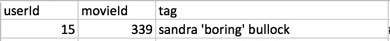
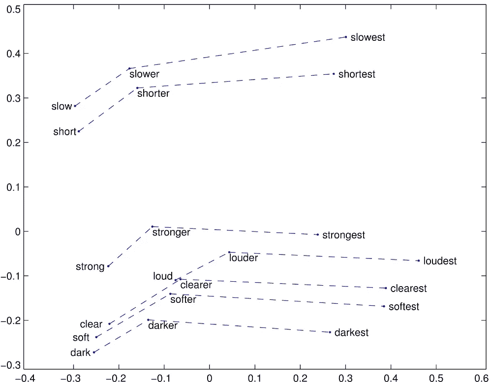
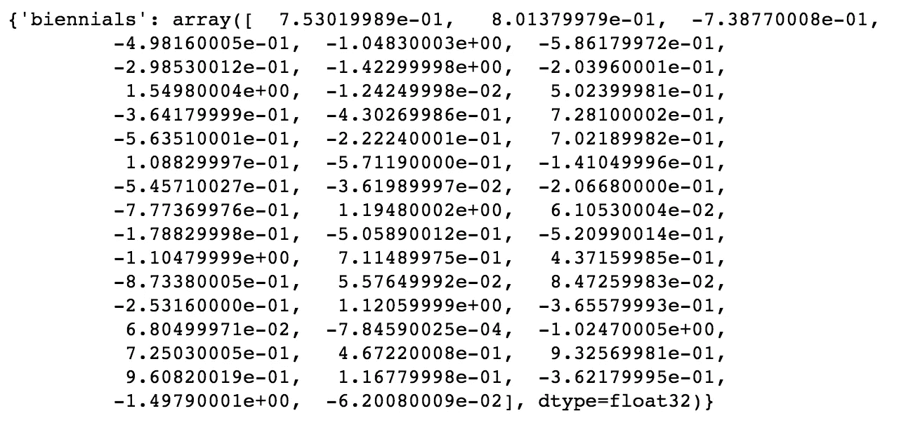
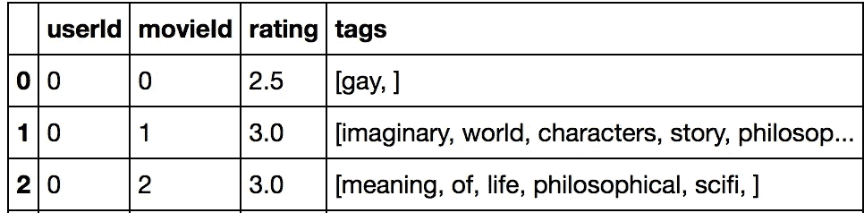
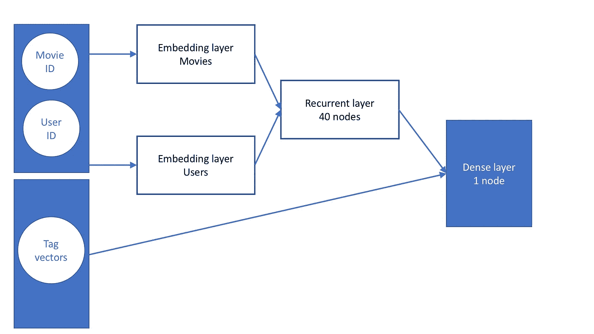
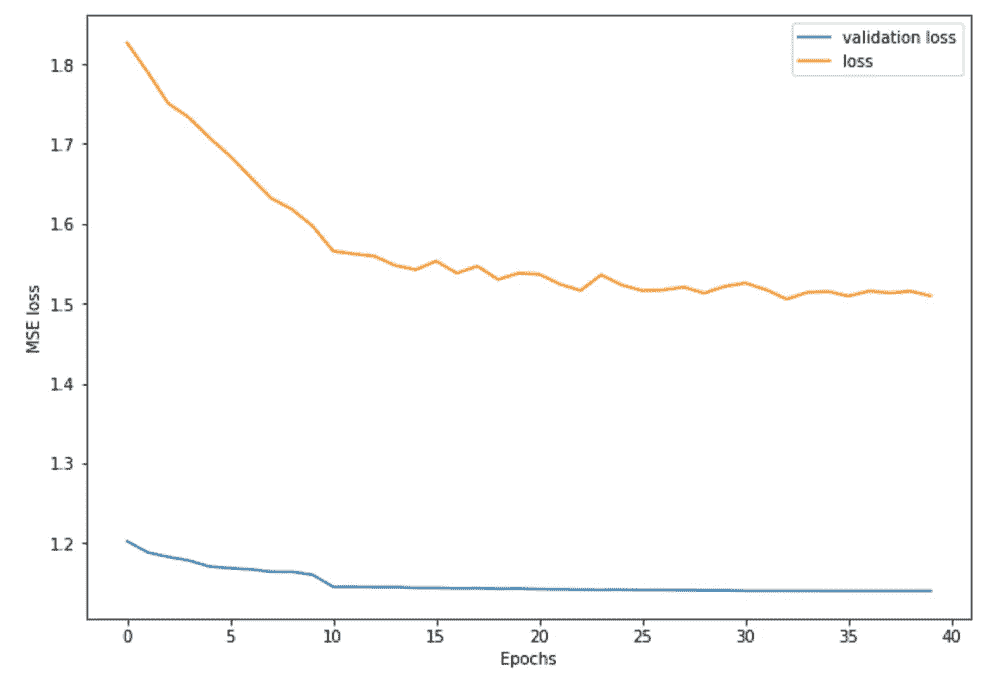

# 聚类和协作过滤——使用单词嵌入

> 原文：<https://towardsdatascience.com/clustering-and-collaborative-filtering-using-word-embeddings-56ee60f0575d?source=collection_archive---------3----------------------->

第二部分，我训练了一些神经网络:

 [## 聚类和协同过滤—实现神经网络

### 第 1 部分，我探索数据集并使用 t-SNE 算法对其进行可视化:

medium.com](https://medium.com/@gabrieltseng/clustering-and-collaborative-filtering-implementing-neural-networks-bccf2f9ff988) 

**内容:**

1.  理解和实现单词嵌入
2.  训练一个“真正的”深而广的网络

**动机**:我在[第二部分](https://medium.com/@gabrieltseng/clustering-and-collaborative-filtering-implementing-neural-networks-bccf2f9ff988)最后一点训练的[深度和广度神经网络](https://arxiv.org/pdf/1606.07792)不是真正的深度和广度模型，因为神经网络的‘广度’部分没有使用任何额外的特征；该模型可以更好地描述为“宽浅”模型。

然而，MovieLens 提供了一组额外的信息，我还没有利用这些信息。每个用户都可以“标记”他们评价的电影。

An example of a tag. movieId 339 is for ‘While you were sleeping (1995)’.

挑战在于将这些标签转化为我的神经网络可以用来衡量用户对电影的感受的东西。

1.  **单词嵌入**

**1.1。单词嵌入简介**

在[第 2 部分](https://medium.com/@gabrieltseng/clustering-and-collaborative-filtering-implementing-neural-networks-bccf2f9ff988)中，我了解并实现了嵌入；这将一些输入转换成一个数组。例如，在实现电影的嵌入时，我将每个 movieId 转换成一个长度为 55 的数组。然后这个数组根据数据进行训练，因此它包含了用户对每部电影的感受信息；对于我的神经网络来说，这比随机分配的单个整数电影 ID 更能提供信息。

单词嵌入包括做同样的事情，除了单词。

就像在 ImageNet 的 150 万张图像上训练的 VGG 模型一样，存在大量的嵌入，这些嵌入在大量的文本语料库上训练，以识别单词的特征是什么。

这些单词嵌入是通过大量的句子来训练的。例如，[单词表示的全局向量](https://nlp.stanford.edu/projects/glove/)或 GloVe，来自维基百科和 [Gigaword](https://nlp.stanford.edu/projects/glove/) ，一个报纸文章的集合。然后替换每个句子中间的一个单词；这很可能使这个句子变得荒谬。嵌入被训练来识别句子是否有意义。

A comparison of superlatives, showing how GloVe captures the similar relationships between the words (credit to GloVe for this plot).

使用预先训练的单词嵌入不同于使用预先训练的模型进行图像识别。因为每幅图像略有不同，当使用 VGG 预训练模型进行图像识别时，我必须下载一个完整的模型，以及它的权重。然而，对于单词嵌入，我可以下载一个字典，将每个单词链接到某个维度的数组(GloVe 有 50、100、200 和 300 维向量)。

An example of a dictionary item in GloVe

**1.2。将单词嵌入到 MovieLens 中**

[链接到代码](http://LearningDataScience/Recommender_System/Word Embeddings.ipynb)

为了将标签添加到我的神经网络中，我将标签分解成它们各自的单词，并将这些标签附加到各自的用户和电影上。

The pandas Dataframe created

然后，我使用手套字典将这些标签转化为数组，使用 50 维单词嵌入。

由于神经网络的输入需要具有一致的大小，我取了最长标签的长度(19 个单词),并为每个用户和电影制作了一个 19 乘 50 的带有零的“标签数组”。然后，我根据需要用相应的单词 embedding from GloVe 填充尽可能多的行。这与使用 Keras 的填充没有什么不同。

**2。训练一个神经网络**

利用这个，我可以训练我的神经网络。

A graph of my neural network. Batch Normalization was implemented at each step, and dropout was used based on the values found in part 2.

不幸的是，这种神经网络的性能明显比没有标签时差:

The validation loss for this network was 1.1400, compared to a best of 0.7699 using the ‘deep only’ model.

我认为这种性能上的差异可以归因于标签的稀疏性；在分配的 100，004 个分级中，只有 1296 个具有标签。因此，从神经网络的大部分传来的绝大多数只是零的阵列(这也可以解释为什么模型对数据拟合不足)。

尽管性能令人失望，但这是对单词嵌入的一个很好的介绍，希望在进行更复杂的自然语言处理时会有用。