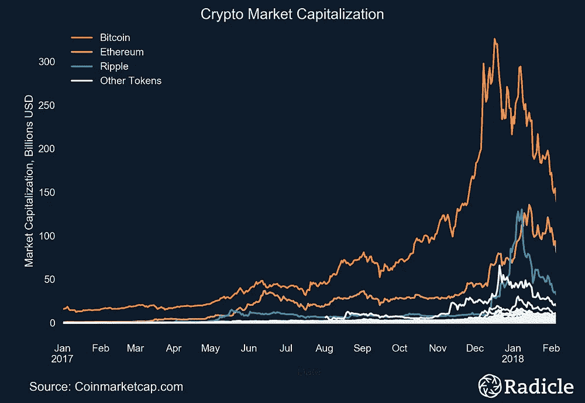
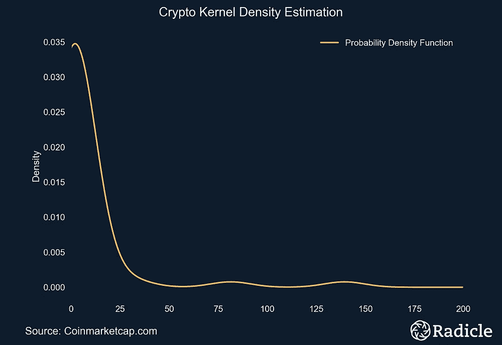
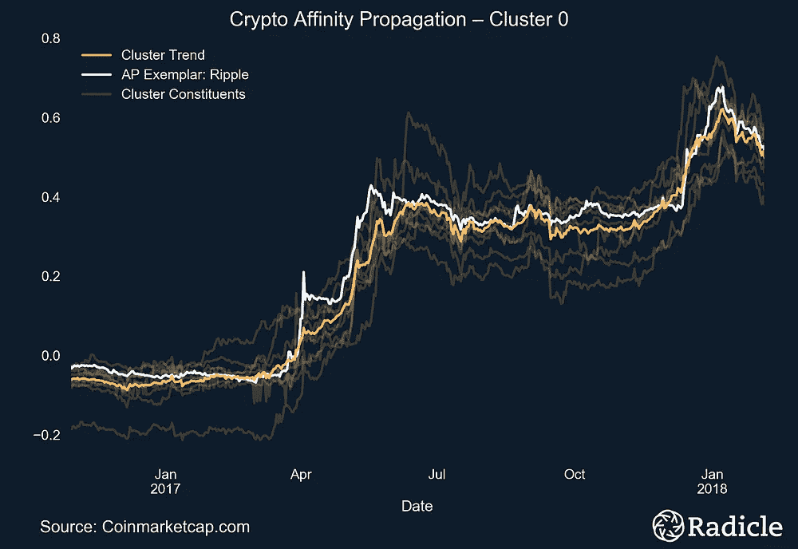
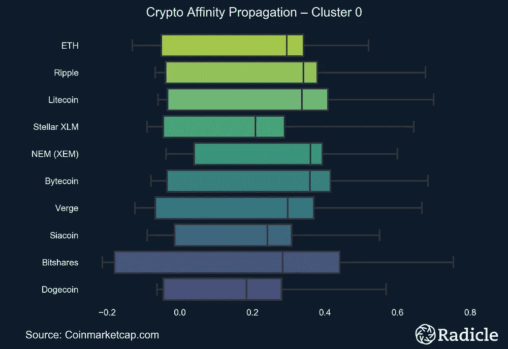
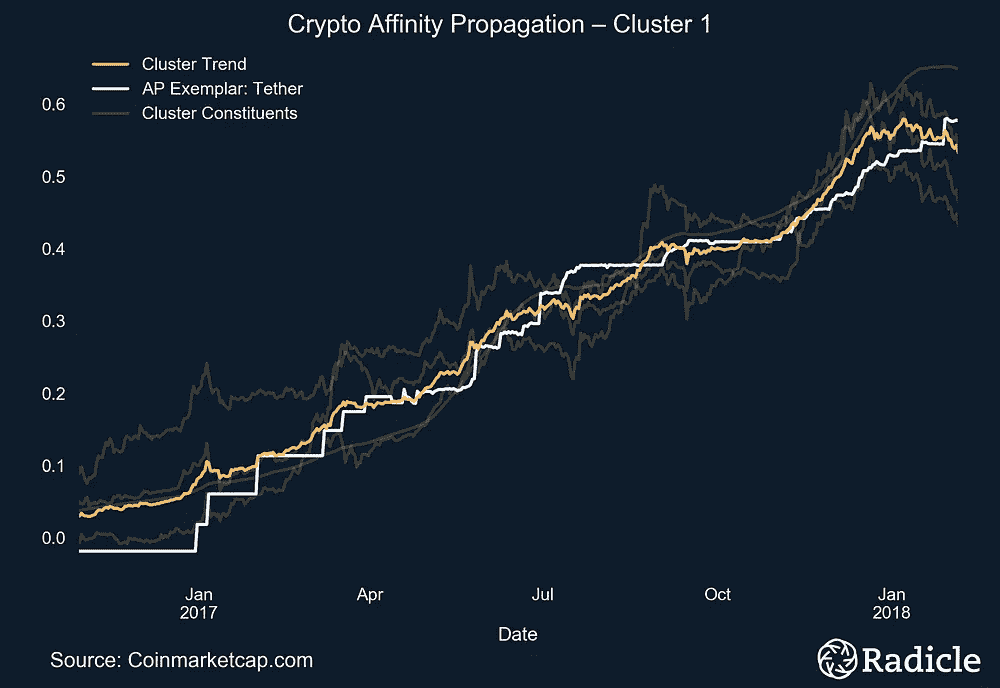
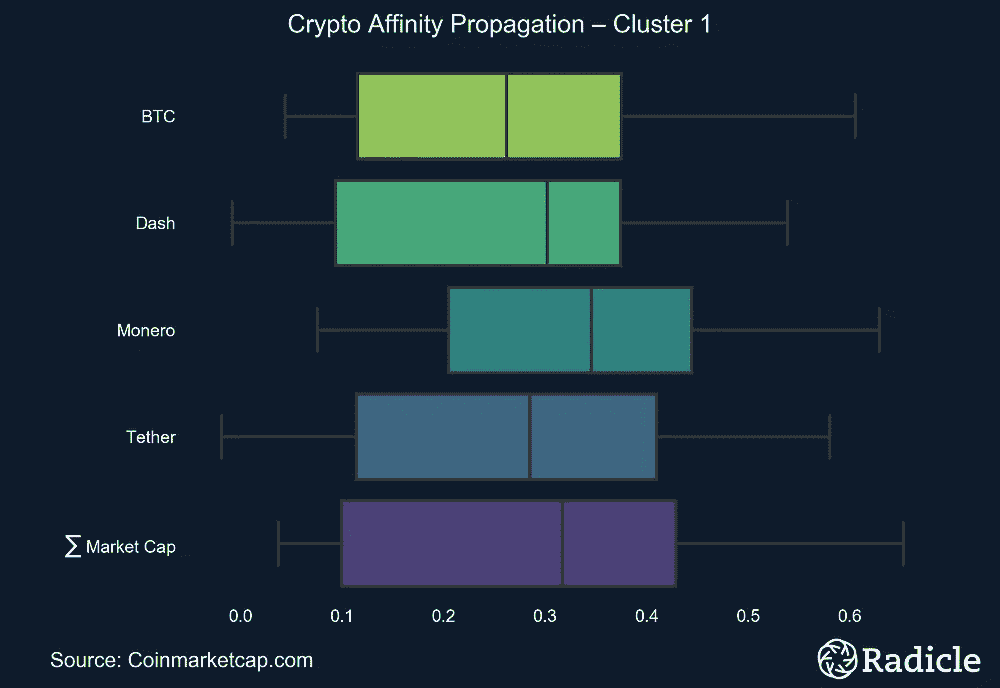
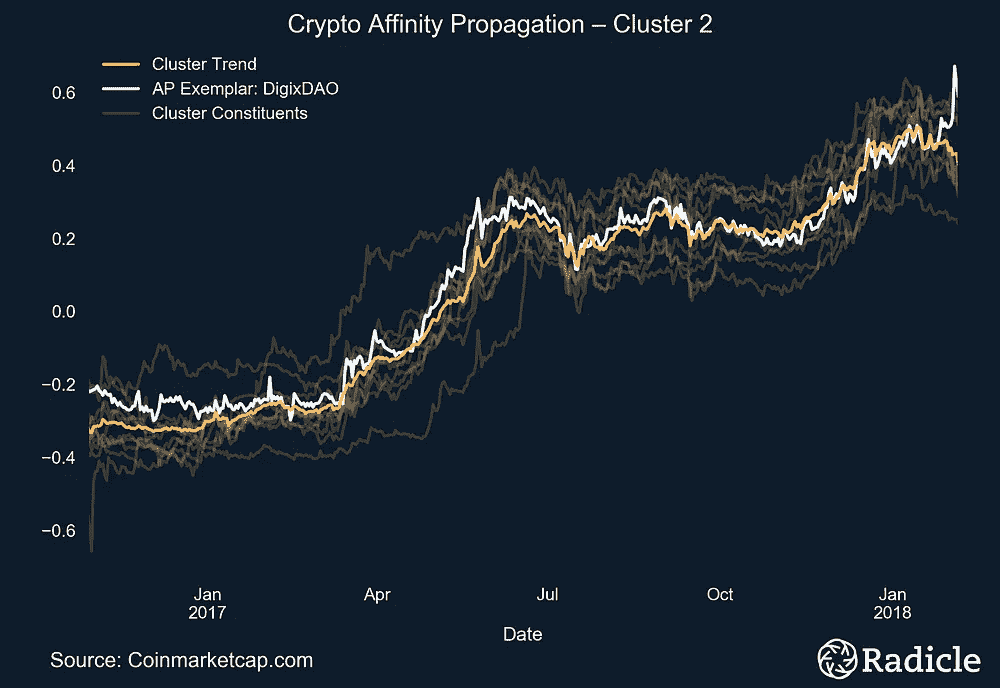
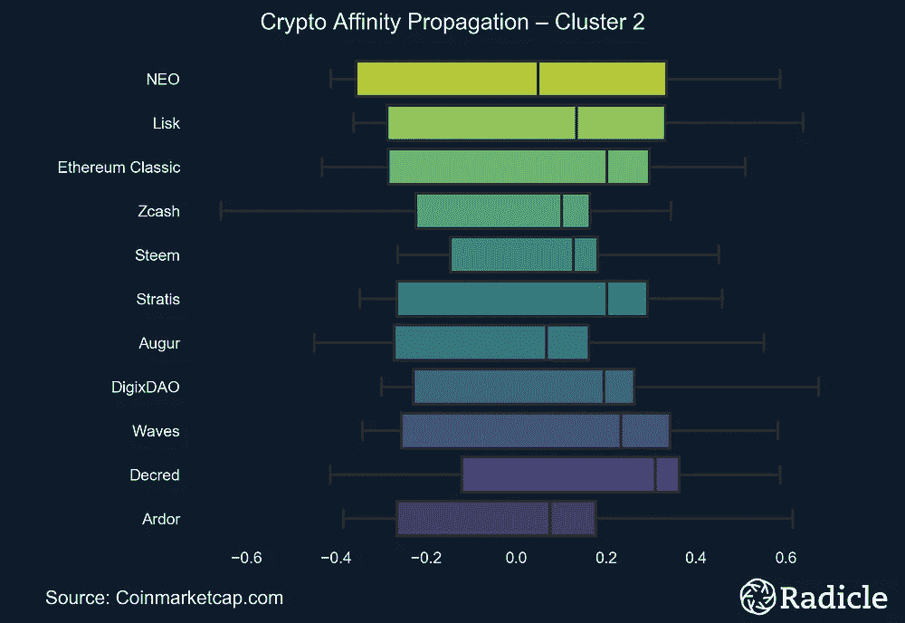

# 基于相似性传播的加密货币聚类

> 原文：<https://towardsdatascience.com/clustering-cryptocurrencies-with-affinity-propagation-b0ca9e105bb6?source=collection_archive---------9----------------------->

为了更好地理解硬币相关性，我们部署了一种相似性传播算法，并在市值表的顶端发现了三个不同的加密资产集群，它们协同移动。

## 介绍

几个月前，拉迪奇的研究团队开始研究区块链复合指数，不是作为一种投资工具，而是为了在评估加密经济中新的分散化项目时有一个清晰和公正的基准。本文讨论了一些初步的统计工作，帮助我们更好地理解硬币运动。简而言之，我们部署了机器学习来解决一场内部辩论——加密货币是独立的资产，根据其价值主张具有独特的运动，还是它们都完全与比特币动荡的新闻周期相关？

> 为什么这很重要？如果每一个代币都简单地跟随比特币的运动，那么综合指数就不是评估表现的有用机制。

当前的工具和最佳实践还不足以回答这个问题。在光谱的一端，您会发现带箭头的[时间序列图](https://www.bloomberg.com/news/articles/2018-02-16/beating-bitcoin-requires-alt-coin-traders-to-mind-correlations)意在传达关于世界的一些无可争议的事实，而在另一端，[相关矩阵](https://www.sifrdata.com/cryptocurrency-correlation-matrix/)提供了一个很好的总体概念，说明加密资产在一段时间内协同移动的程度，但没有足够的粒度背景来得出决定性的结论。

幸运的是，这个问题的设置看起来*几乎*像一个标准的无监督聚类问题——我们有一些未标记的数据，我们希望通过相似性组织成组。我说几乎是因为，如果你是一名数据科学家，你应该注意到普通聚类任务的三个区别:(1)时间序列数据，(2)加密经济中的市值是幂律分布的，以及(3)我们不希望像 k-means 聚类那样预先指定返回的聚类数，因为那样会违背本练习的整个目的。

(Left) Time series plot of crypto market capitalizations since January, 2017\. (Right) Estimated probability density function of crypto market caps using KDE.

随着问题的明确定义，我们部署了一个相似性传播算法来寻找三个不同的加密资产集群，它们位于市值表的顶端，具有相似的移动。本文的其余部分讨论了我们方法的理论和实践基础，详细说明了结果，并以一些简短的结论性意见结束。

> 在继续之前，必须一如既往地强调，统计方法，无论多么详尽，都只能提供一个关于世界的概率观点。他们不宣称因果关系，也不宣称绝对真理。尽管如此，这给了我们很多思考。希望你会同意。

## 为什么要亲和传播？

从一开始，我们就确定了算法需要维护的一些基本需求，以便产生科学勤奋的结果。总的来说，我们发现相似性传播不仅满足了我们所有的需求，而且在理论和实践上也是一个非常强大的算法。

Frey 和 Dueck 在 *Science* 上发表的 [Affinity Propagation](http://www.psi.toronto.edu/affinitypropagation/FreyDueckScience07.pdf) 将数据点之间的相似性度量作为输入，并在数据点之间交换实值消息，直到高质量的聚类自然出现。在交换消息时，算法识别样本，样本是很好地描述集群的观察结果。您基本上可以将样本视为质心，只是它们不是每个组中所有对象的平均值，而是描述其最近邻居的真实观察数据点。出于我们的目的，这意味着我们的样本将是一些真正的加密资产。也就是说，在运行算法后，我们仍然计算质心“趋势”线，并在下面的图中显示它们，以便于解释。

识别样本后，算法本身会推断出数据中存在多少自然聚类。根据创造者的说法，唯一真正需要仔细调整的超参数是阻尼因子，当信息在数据点之间传递时，它被设置为[以避免数字振荡](http://scikit-learn.org/stable/modules/generated/sklearn.cluster.AffinityPropagation.html)。创作者建议将阻尼系数[设置为 0.9](http://www.psi.toronto.edu/affinitypropagation/faq.html#clusters) 。在我们的任务中，介于 0.5 和 0.83 之间的值导致识别出四个聚类。将其增加到 0.83 以上会产生三个聚类。更具体地说，设置较高的阻尼因子将组合来自较低阻尼集的第三和第四类，而前两类完全不变。最后，我们将阻尼因子设置在 0.83 以上，因为结果稍微更直观。

我们考虑了一些其他的算法，但是，没有一个能满足我们的一个或多个需求。我们知道，识别一年中只有几个月非常相似，但一年中其他时间完全不同的加密货币是不可取的。同样重要的是，我们想尽可能地测量并隔离新闻周期对市值的日常影响；忽略任何延迟效应。因此，需要在每个日期索引上专门评估相似性，但要跨整个数组。[动态时间扭曲](http://www.ics.uci.edu/~pazzani/Publications/sdm01.pdf)，这是一种流行的方法，用于测量具有不同长度和异相相似性的时间序列数据的相似性，但不会起作用，因为它试图找到异相相似性。我们有一个奢侈的问题，数据是有意同相的，长度相同。如上所述，k-means 聚类及其许多变体不会工作，因为我们不想告诉机器人应该有多少个聚类。

对于距离度量，如果我们可以标准化幂律分布数据，标准负欧几里得距离将很好地完成工作。为了做到这一点，每个向量首先进行对数变换，然后通过减去其平均值并除以其标准偏差进行标准化；产生一个干净的和可比较的数据集。

方便的是，以上所有暗示了 [sci-kit learn](http://scikit-learn.org/stable/modules/generated/sklearn.cluster.AffinityPropagation.html) 的相似性传播实现将会很好地满足我们的目的。2 月初，我们从 Coinmarketcap.com 获取了市值排名前 50 位的加密资产的历史数据。在这 50 家公司中，只有 26 家已经存在了足够长的时间，足以进行有效的聚类(至少一年)。

## 结果

下面的并排图对应于三个已识别的集群中的每一个。在左边，我们以时间序列的形式显示集群，样本为白色，集群中所有对象的质心线为亮黄色。空间中的其他成分显示为淡黄色。在右侧，我们展示了每个集群对应的方框图，这有效地从不同的角度提供了对相同数据的查看。相似性传播算法找到了三个样本:Ripple、Tether 和 DigixDAO。第一个集群主要由已建立的加密资产组成。

*Note: The clusters start at index zero.*

该集群中值得注意的资产是以太坊和 Ripple，分别是市值第二和第三大资产。集群中的其他应用包括平台(BitShares)、支付网络(Stellar)、货币(Litecoin、Nem、Bytecoin、Verge、Dogecoin)和去中心化应用(Siacoin)。所有这些资产都是在 2015 年或之前创建和推出的，远远早于加密热潮的到来。

下一个聚类包含比特币、Tether、Dash、Monero 和整个样本的总市值。这个集群中的资产都是货币，Dash 和 Monero 是关注隐私的匿名硬币。这是一个有趣的结果，因为有人认为 [Tether 正在支撑比特币](https://www.nytimes.com/2018/01/31/technology/bitfinex-bitcoin-price.html)，从而支撑整个市场，代币据称与美元的比例为 1:1。 [Tether 于 2017 年 12 月初被美国商品期货交易委员会传唤](https://www.bloomberg.com/news/articles/2018-01-30/crypto-exchange-bitfinex-tether-said-to-get-subpoenaed-by-cftc)。

至于第三组，我们真的不知道它是什么。虽然我们预计比特币和以太坊之间可能会出现一些分歧，但这一集群表明，加密领域的异质性比我们预期的要多。我们的密码分析师注意到，这些趋势是 dApp 平台，它们似乎是稍微新的资产。像往常一样，我的观点是，现实世界比我们通常假设的要复杂得多，如果我们增加加密资产的样本，我们可能会发现更多像这样的集群。

## 结束语

从上面的图表中可以推断出许多值得注意的见解。第一个是显而易见的，我们发现了不止一个集群，这意味着，不，加密资产并不完全遵循比特币不稳定的新闻周期。也就是说，似乎确实存在一前一后移动的自然硬币群，我们预计随着加密样本的增加会有更多。

总的来说，这项研究帮助我们得出结论，评估加密资产的基础框架是一种适当的方法。

## 其他视角

 [## 在两轮融资之间，你应该瞄准多少跑道？

### 企业家对硬数据的访问是有限的，这些数据可以帮助他们在试图建立一个…

medium.com](https://medium.com/radicle/how-much-runway-should-you-target-between-financing-rounds-478b1616cfb5)  [## 按阶段剖析启动失败率

### 几周前，在一篇题为“在两轮融资之间，你应该瞄准多少跑道？”，我们发现…

towardsdatascience.com](/dissecting-startup-failure-by-stage-34bb70354a36) 

***法律免责声明*** *: Radicle 不是投资顾问，并且 Radicle 不就投资于任何证券、资产、代币、基金或其他投资工具的合理性做出任何陈述。拉迪奇不是税务顾问。radic e 在 radic e 复合材料或任何 radic e 分析中包含证券、资产或代币并不是 radic e 购买、出售或持有此类证券的建议，也不被视为投资建议。复合材料的过往表现并不代表或保证未来的结果。所有的胚根材料都是基于公众普遍可获得的信息和据信可靠的来源，仅为信息目的而准备的。所示的综合数据和分析并不代表可投资资产/证券的实际交易结果。Radicle 维护综合数据并计算显示或讨论的综合水平和绩效，但不管理实际资产。*