# 群集以太坊地址

> 原文：<https://towardsdatascience.com/clustering-ethereum-addresses-18aeca61919d?source=collection_archive---------10----------------------->

## 使用交易活动中的模式对地址进行分类

## 介绍

以太坊用户可能是匿名的，但他们的地址是唯一的标识符，在区块链上留下了公开可见的痕迹。

我建立了一个基于交易活动的聚类算法，将以太坊用户划分为不同的行为子群。它可以预测某个地址是属于 exchange、miner 还是 ICO wallet。

数据库使用 SQL 构建，模型用 Python 编码。源代码可以在 [GitHub](https://github.com/willprice221/ethereum_clustering) 上获得。

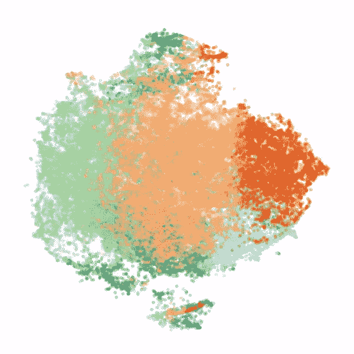

3D representation of Ethereum address feature space using [T-SNE](https://lvdmaaten.github.io/tsne/)

## 背景

以太坊区块链是一个名为**智能合约的去中心化应用平台。**这些合同通常用于代表其他资产。这些资产可以代表现实世界中的物理对象(如房地产所有权)，也可以是纯粹的数字对象(如[公用令牌](https://medium.com/coinmonks/utility-tokens-a-general-understanding-f6a5f9699cc0))。

执行智能合同所需的计算是用生态系统的本地货币 **ether** 支付的。

以太存储在被称为**地址的加密账户中。**

## 动机

许多人认为加密货币提供了数字匿名，这种想法有一定的道理。其实匿名是 [Monero](https://www.getmonero.org/) 和 [ZCash](https://z.cash/) 的核心使命。

然而，以太坊的应用更加广泛，其广泛的灵活性产生了丰富的、公开的交易行为数据集。因为以太坊地址是唯一的标识符，其所有权不会改变，所以可以跟踪、汇总和分析它们的活动。

在这里，我试图通过有效地集群以太坊地址空间来创建**用户原型**。这些原型可以用来预测未知地址的所有者。

这开启了一系列广泛的应用:

*   了解网络活动
*   增强交易策略
*   改进反洗钱活动

## 结果

以太坊生态系统中的参与者可以通过他们交易活动中的模式来区分。已知属于交易所、矿商和[ico](https://www.investopedia.com/terms/i/initial-coin-offering-ico.asp)的地址定性地表明聚类的结果是准确的。

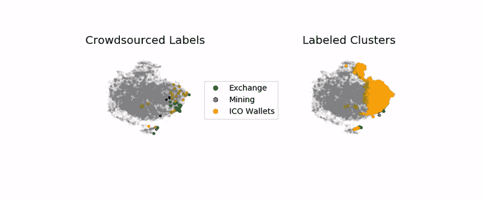

# 技术细节

请随意跳到下面的**解读结果**。

## 特征工程

以太坊交易数据集托管在 [Google BigQuery](https://cloud.google.com/blog/products/data-analytics/ethereum-bigquery-public-dataset-smart-contract-analytics) 上。使用具有最高以太网余额的 40，000 个地址，我创建了 25 个特征来表征用户行为的差异。

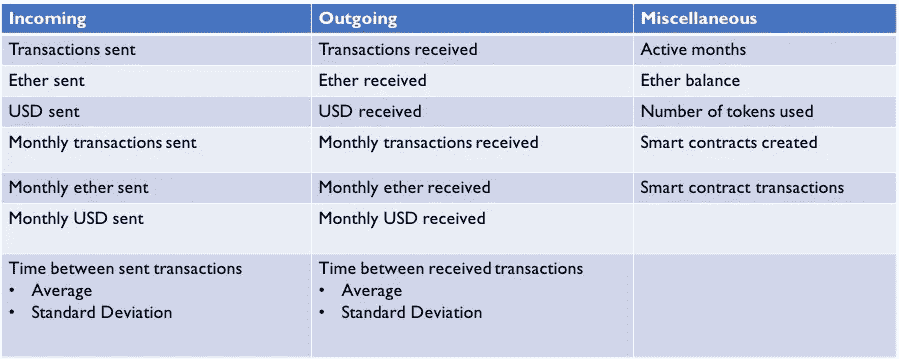

Features derived for each address

## 选择适当数量的集群

使用[剪影分析](https://scikit-learn.org/stable/auto_examples/cluster/plot_kmeans_silhouette_analysis.html)，我确定聚类的最佳数量大约为 8。

这种选择最大限度地减少了具有负轮廓分数的样本的数量，负轮廓分数表明样本可能被分配到错误的聚类。

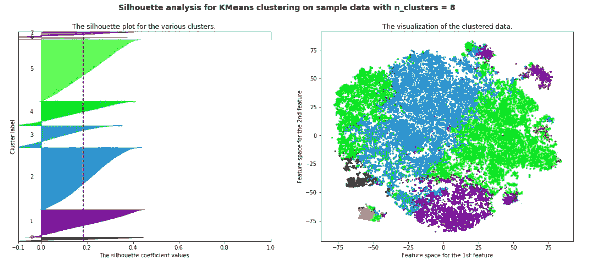

## 但是我们怎么知道它是否有效呢？

通过从[ethers can . io](https://etherscan.io/)block explorer 抓取数据，我在我的数据集中收集了 125 个地址的众包标签。

大多数标签分为三类:

*交易所、矿工和 ICO 钱包。*

聚类是一种无监督的机器学习技术，所以我不能使用标签来训练我的模型。相反，我使用它们将**用户原型**分配给集群，基于每个集群的最高标签密度。[结果可以在这里找到](https://gist.github.com/willprice221/ef10c1622a5e6daeccf59c4251b54682#file-clusterlabels-txt)。

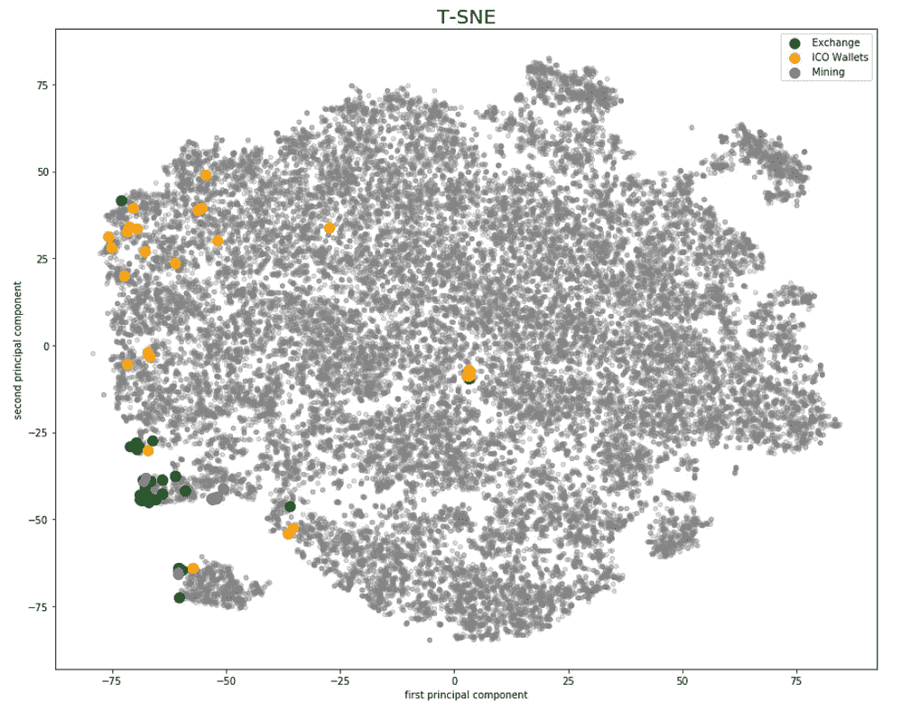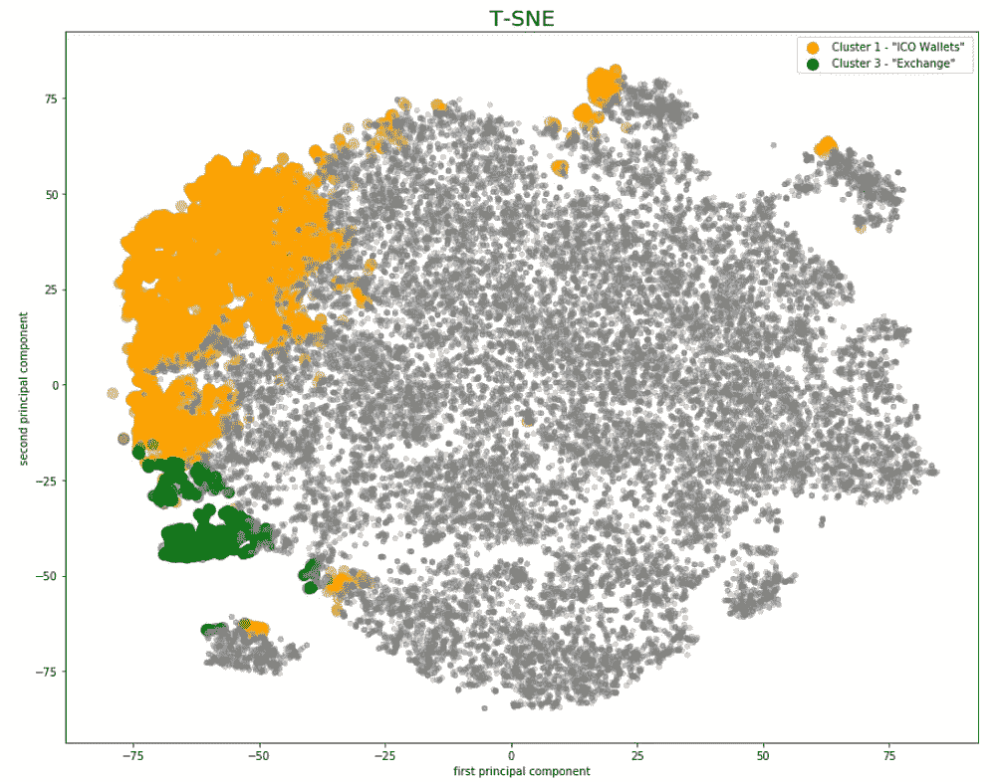

2D visualization of initial clustering. Known addresses on the left.

## 重新聚类

*Exchange* 和 *miner* 的地址一开始是混在同一个集群里的。为了将它们分开，我执行了第二轮聚类，只使用该聚类中的地址。

通过将相异度从*欧几里德距离*改为*余弦距离，*我极大地改善了交易所和矿工之间的分离。

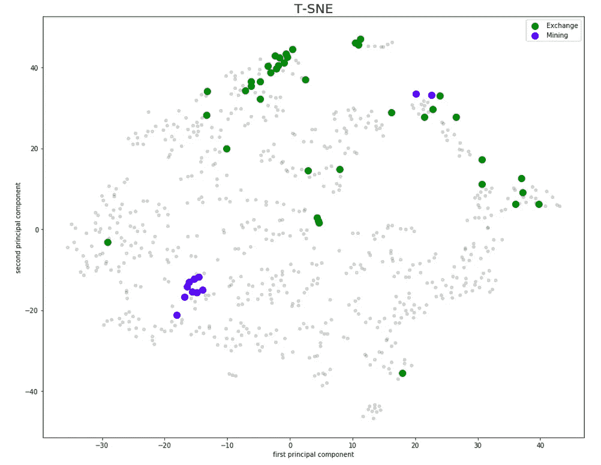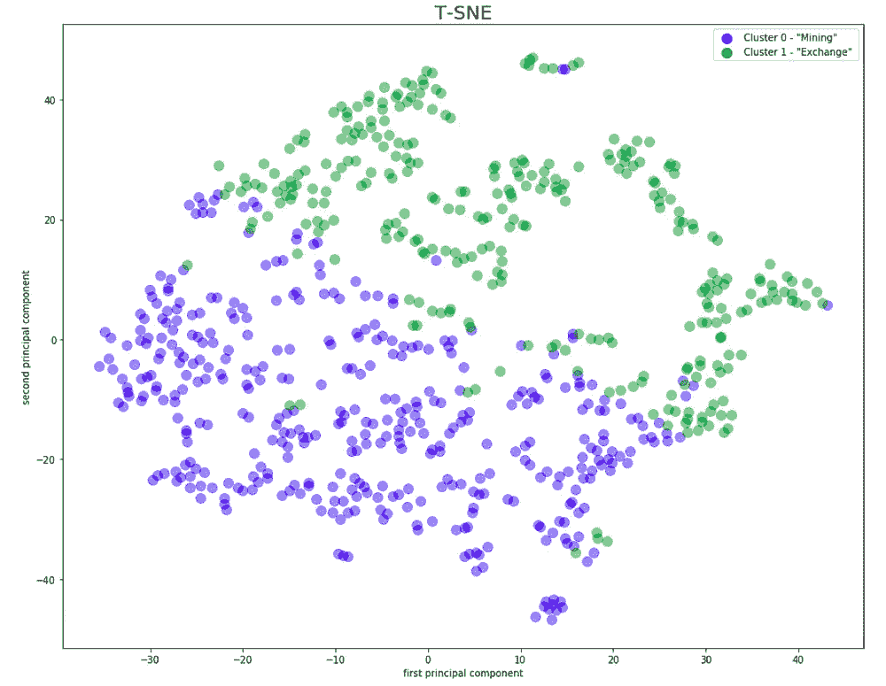

Improved separation of exchanges and miners. Known addresses on the left.

通过将重新聚类的结果代入原始分析，我们最终得到 9 个聚类。

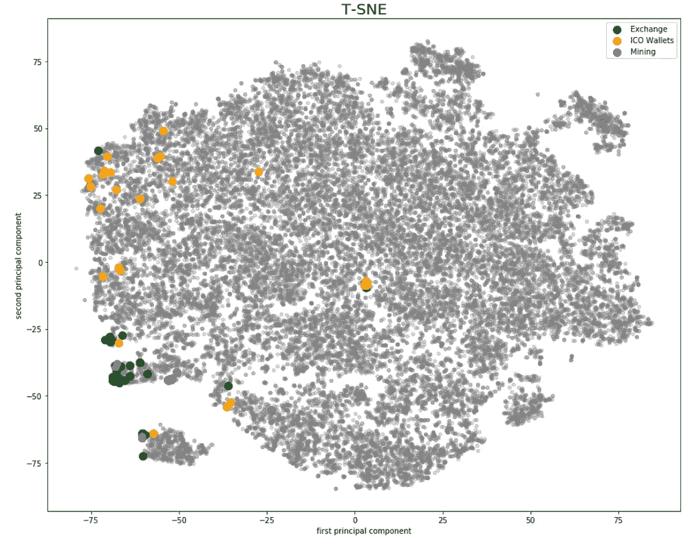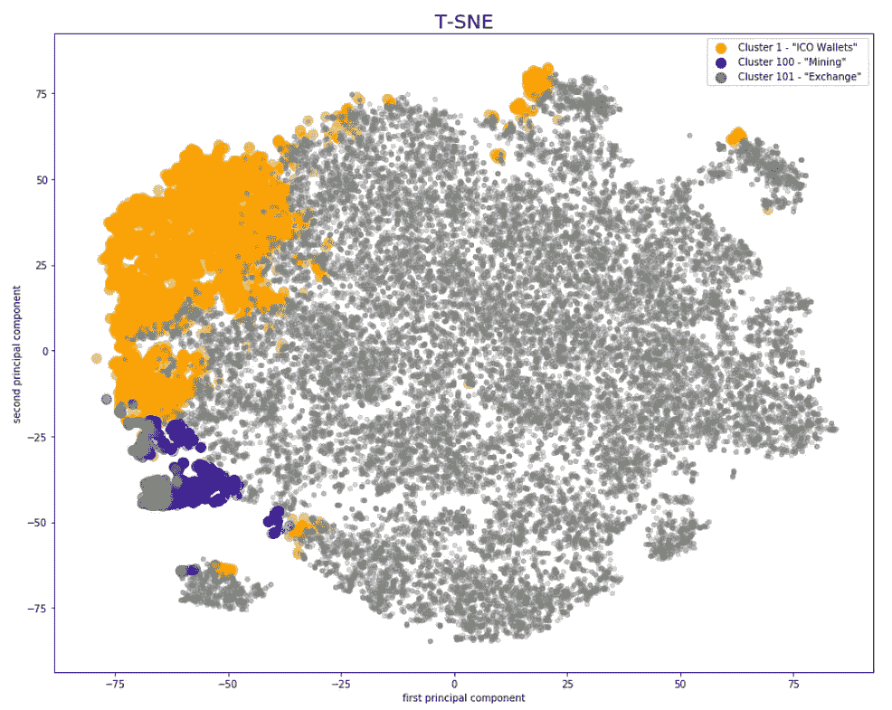

2D visualization of final clustering results. Known addresses on the left.

# 解释结果

我们可以根据相应的聚类质心得出关于用户行为的结论。

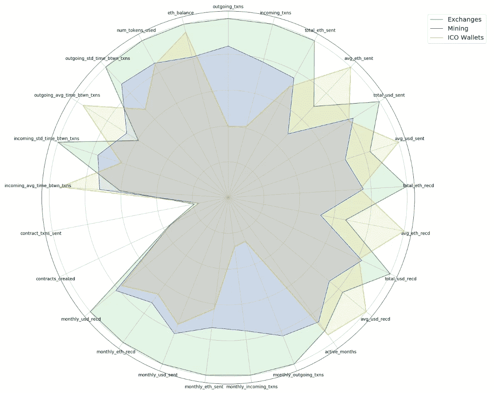

Radar plot — cluster centroid address features

## 交换

*   高乙醚平衡
*   高流入和流出交易量
*   交易之间的时间非常不规则

交易所是加密空间的银行。这些结果是直观的。

## 矿工

*   低乙醚平衡
*   小平均交易规模
*   更有规律的交易间隔时间

矿工通过消耗计算能力来保护区块链，并获得以太奖励。矿工团体经常“集中”他们的资源以减少支出的差异，根据贡献的资源来分配收益。

## ICO 钱包

*   高乙醚平衡
*   少量大额交易
*   交易之间最有规律的时间

ico(首次公开募股)是加密初创公司常用的融资方式。这些初创公司会有大量的资金，并定期出售大量资金来支付日常业务开支，这是有道理的。

## 其他类别

*   *交易所*和*矿业*集群高度相似，因为它们是在第二轮集群中创建的。
*   集群 7 中的地址具有大量智能合约活动。
*   聚类 2 和聚类 5 是高度不同的。

## **你能识别这些用户群吗？**

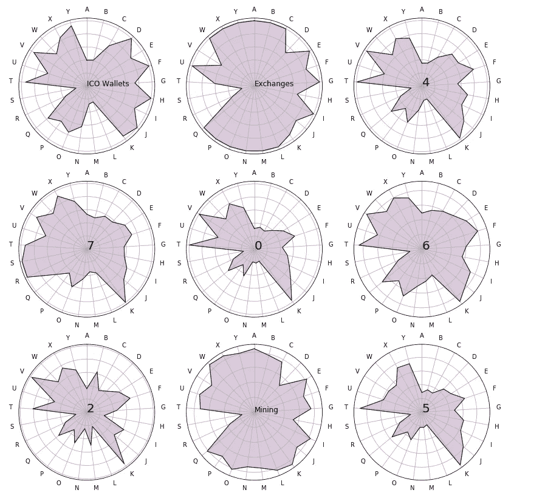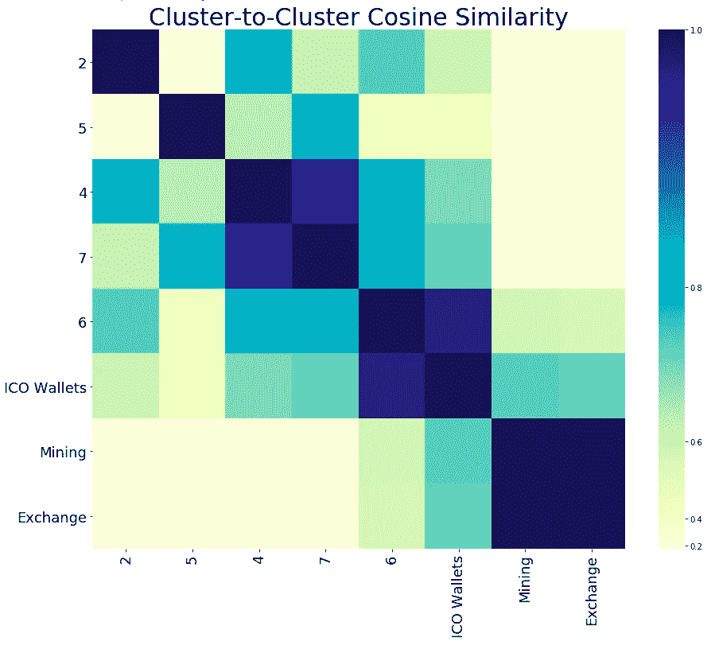

# 后续步骤

扩展这项工作将允许对以太坊区块链数据更细致的观察。以下是一些特别有趣的领域:

*   基于图论和网络分析添加特征
*   区分机器人和人类
*   扩展智能合同分析
*   重复分析 [ERC-20 令牌](https://cointelegraph.com/explained/erc-20-tokens-explained)交易活动

# 有问题吗？建议？

你可以在 [Twitter](https://twitter.com/willprice221) 或者 [LinkedIn](https://www.linkedin.com/in/willprice221/) 上找到我。

# 参考

[Etherscan.io 标签词云](https://etherscan.io/labelcloud)

[掌握以太坊](https://github.com/ethereumbook/ethereumbook)

[表征以太坊地址空间](http://cs229.stanford.edu/proj2017/final-reports/5244232.pdf)

[一把比特币:无名男子的支付特征](https://cseweb.ucsd.edu/~smeiklejohn/files/imc13.pdf)

感谢 Brandon Martin-Anderson、Alex Cuevas、John Braunlin 和 Eric Bragas 审阅本文草稿。