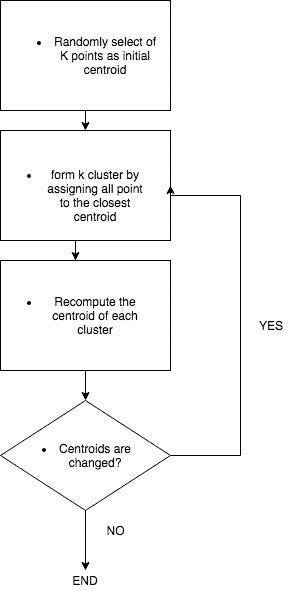

# 日常生活中的聚类——第 1 页，共 2 页

> 原文：<https://towardsdatascience.com/clustering-for-everyday-life-1-of-2-cf641ad769b4?source=collection_archive---------4----------------------->

让我们来考虑这个场景:我喜欢步行，所以当我游览一个城市时，我想尽可能多地步行，但我想优化我的时间来观看尽可能多的景点。现在我想计划我的下一次哥谭市之旅，去参观一些蝙蝠侠的地方。我找到了 1000 个蝙蝠侠出现的地方，我最多还有 4 天。我需要把这 1000 个地方分成 4 个桶，这样这些点就可以靠近我可以停车的中心，来计划我的每一天旅行。我该怎么做？

这类问题可以归为聚类问题。但是什么是集群呢？聚类或聚类分析的任务是将一组数据分组到同类或相似的项目中。同质或相似的概念就是这样定义的。所以解决这类问题是必要的:

*   定义元素之间的“相似性”度量(相似性的概念)
*   根据所选的度量，找出元素的子集是否“相似”

该算法确定哪些元素形成一个聚类，以及在一个聚类中它们的相似度。参考我的[上一篇文章](https://medium.com/towards-data-science/supervised-unsupervised-and-deep-learning-aa61a0e5471c)，聚类是一个可以用属于无监督方法的算法来解决的问题，因为算法不知道任何关于聚类的结构和特征的信息。

特别是，对于这个问题，我将使用 k-means 算法:k-means 是一种在给定数据集上查找 k 个组(其中 k 是定义的)的算法。每个组由一个质心来描述，该质心代表每个聚类的“中心”。中心的概念总是指我们为特定问题选择的距离的概念。

对于我们的问题，距离的概念很简单，因为两点之间的真实距离是由一个纬度和一个经度定义的。为此，不能用欧几里得距离而是有必要引入球面余弦定律来计算从到地理点的正确距离。

但是 k-means 算法是如何工作的呢？它遵循一个迭代过程:

这种算法的流行来自于它的:

*   收敛速度
*   易于实施

另一方面，该算法不能保证达到全局最优。最终解决方案的质量在很大程度上取决于初始集群集。由于该算法非常快，所以可以应用几次并选择最佳解决方案。

该算法从 k 个聚类的定义开始，其中 k 由用户定义。但是用户如何知道 k 是否是正确的数字呢？他如何知道这些集群是否是“好”集群？测量聚类质量的一个可能的度量是 SSE(误差平方和)，其中误差是从聚类质心到当前点的距离。因为这个误差是平方的，所以它更强调远离质心的点。

在下一篇文章中，我将展示一种在 TensorFlow 中解决这个问题的可能方法。

*原载于 2017 年 5 月 14 日*[*【devklaus.wordpress.com*](https://devklaus.wordpress.com/2017/05/14/clustering-for-everyday-life-1-of-2/)*。*