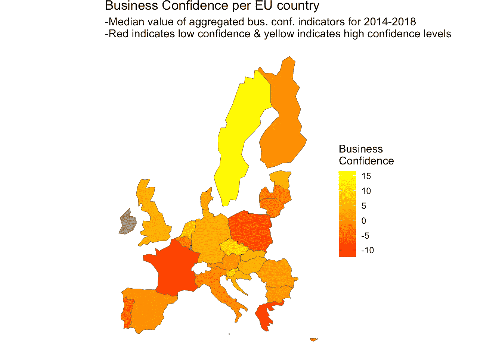
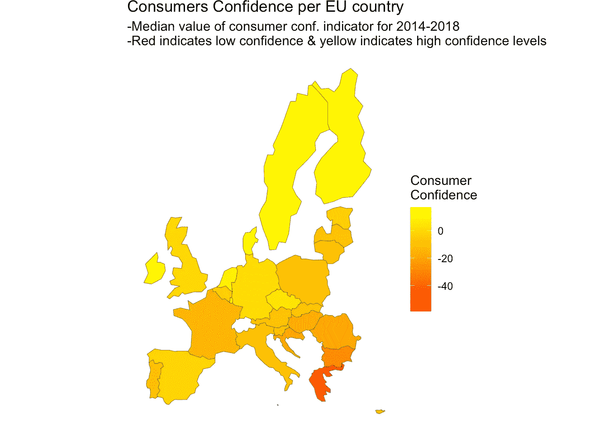
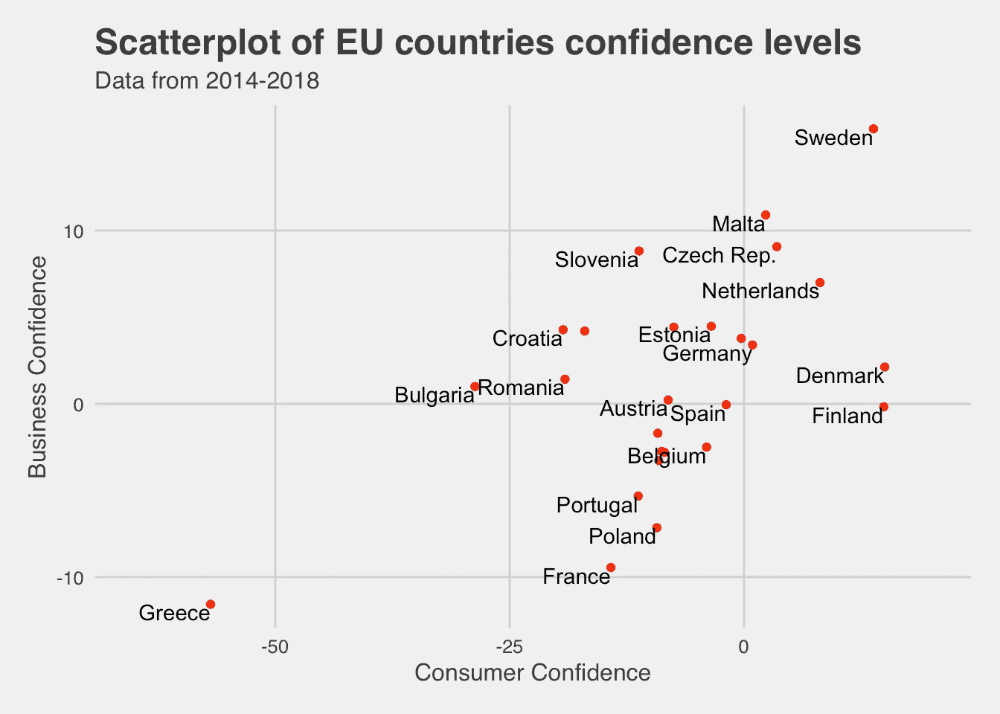
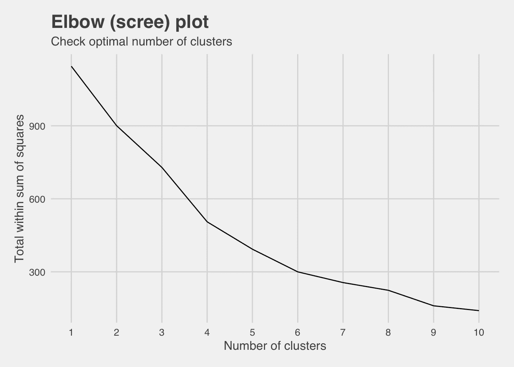
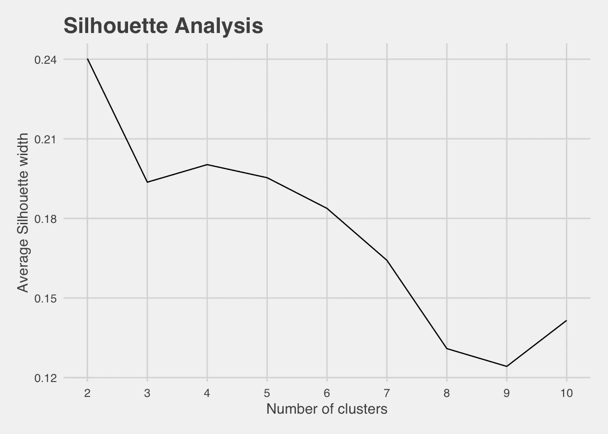
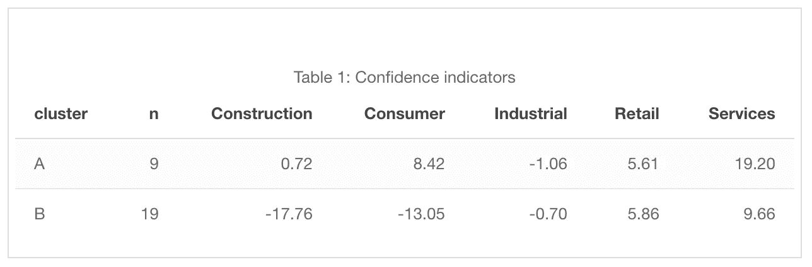
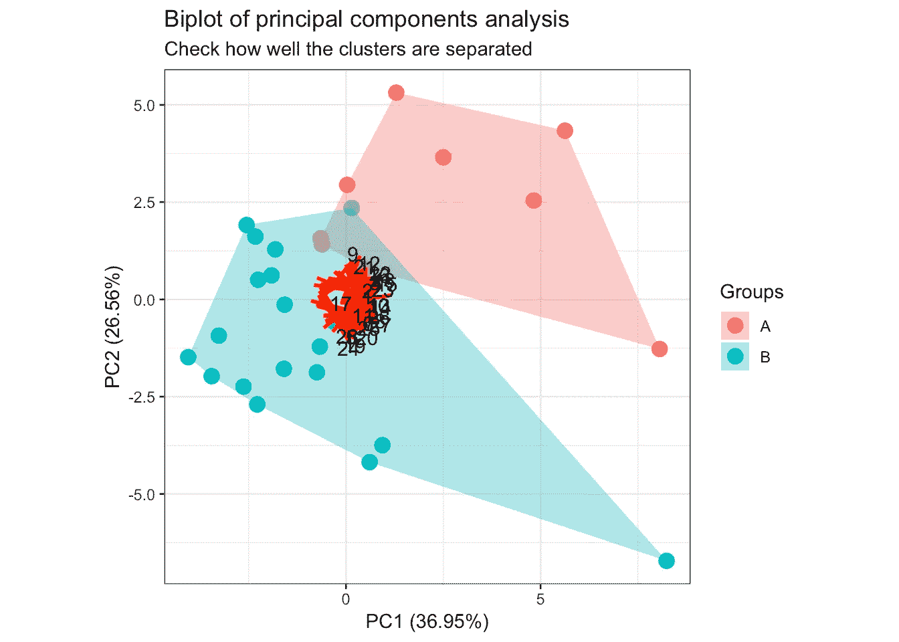
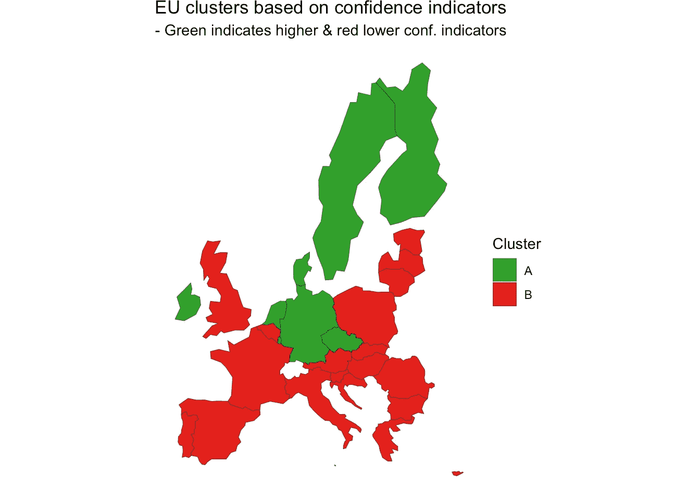
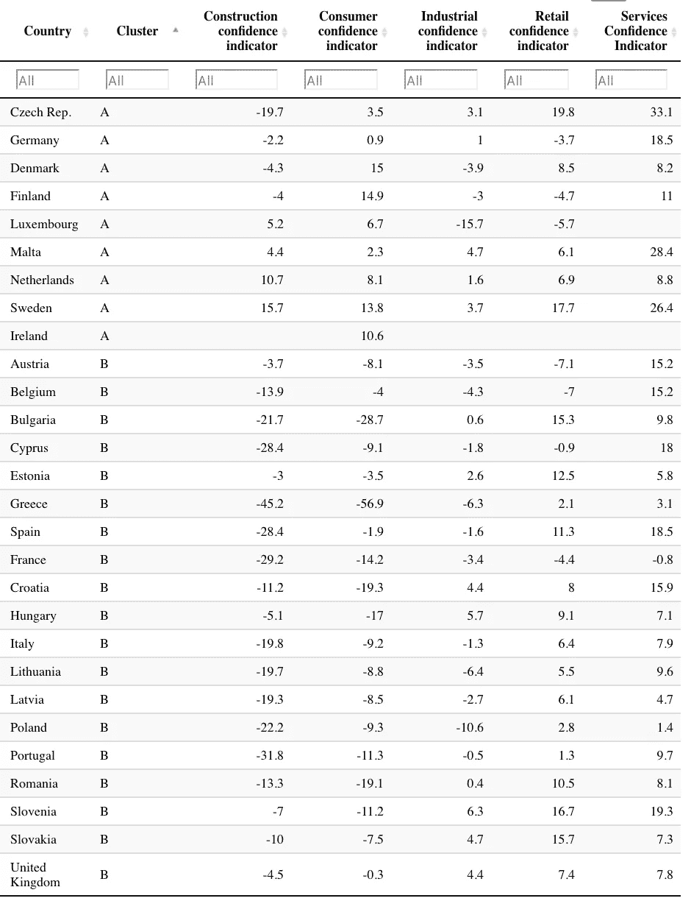

# 欧盟国家集群

> 原文：<https://towardsdatascience.com/clustering-of-eu-countries-b7cbef32c619?source=collection_archive---------9----------------------->

**欧盟国家的细分，包括基于消费者的聚类分析&商业信心指标**

在本文中，我使用了一个公开的欧盟统计局数据集，来对欧盟国家进行细分。该数据集由 5 个置信度指标组成:

*   **消费者信心指数**
*   **建筑业信心指数**
*   **工业信心指数**
*   **零售信心指数**
*   **服务信心指标**

这些指标是通过每月在以下领域进行的定性调查形成的:**制造业、建筑业、消费者、零售业、服务业和金融服务业**。这些调查始于 1980 年，并逐渐包括所有欧盟新成员。目前，整个欧盟每月都有大约 137，000 家公司和超过 41，000 名消费者接受调查。

所使用的指标是余额，即肯定答案和否定答案之间的差异(占总答案的百分比)，作为指标，作为置信度指标(余额的算术平均值)。

有关这些调查的更多信息，请点击此[链接](https://ec.europa.eu/eurostat/cache/metadata/en/ei_bcs_esms.htm)

欧元区由 19 个国家组成:奥地利、比利时、塞浦路斯、爱沙尼亚、芬兰、法国、德国、希腊、爱尔兰、意大利、拉脱维亚、立陶宛、卢森堡、马耳他、荷兰、葡萄牙、斯洛伐克、斯洛文尼亚和西班牙。

用于获取原始数据集的[欧盟统计局包](https://cran.r-project.org/web/packages/eurostat/index.html)。

关于 ETL 步骤的更多细节可以在实际代码中找到，在文章结尾的链接中。

# ETL 和探索性分析

原始数据集包含 11，340 个观察值，其中包括欧盟国家每月的这些指标。在处理过的数据集中，我使用了 2014 年以后的观察值& ii)每个州的每个变量的中值，因此最终数据集总共由 28 个观察值组成。通过对所有商业相关的信心指标(建筑、工业、零售和服务信心指标)进行平均，创建了另一个变量，以使用通用的**商业信心指标**。

看到信心指数的地图会很有趣。下面是消费者和平均商业信心指标的图表。

*   很明显，各国之间存在显著差异。
*   北欧国家往往有更高的消费者信心指数。
*   这里有一些异常值。希腊的信心指数明显低于其他国家。

下面是一个散点图，带有标记标签，表明每个国家在消费者和企业信心指标方面的定位。

我们可以从上面的图中看出一些模式，类似于之前的发现:

*   有一些异常值，比如希腊(左下角)和瑞典(右上角)
*   有一组国家位于图的中间，表明消费者和企业的平均信心
*   在所有国家，商业信心都大大高于消费者信心

# 分割

由于各国之间在信心指标方面存在相当多的差异，因此开发一个细分市场来检查各国组建团队的情况将会非常有趣。
**k-means**聚类算法用于分割。这是最广泛使用的无监督学习算法。该过程遵循一种简单且容易的方式，通过预先确定的固定数量的聚类(假设 k 个聚类)对给定数据集进行分类。主要思想是定义 k 个中心，每个聚类一个。这些中心应该被巧妙地放置，因为不同的位置会导致不同的结果。因此，更好的选择是将它们放置在尽可能远离彼此的地方。下一步是获取属于给定数据集的每个点，并将其与最近的中心相关联。当没有分数悬而未决时，第一步完成，早期小组年龄结束。在这一点上，我们需要重新计算 k 个新的质心作为上一步得到的聚类的重心。在我们有了这 k 个新的质心之后，必须在相同的数据集点和最近的新中心之间进行新的绑定。已经生成了一个循环。作为这个循环的结果，我们可以注意到 k 个中心一步一步地改变它们的位置，直到不再发生变化，或者换句话说，中心不再移动。

# 指出合适的集群数量

下面的肘形图(scree)用于检查簇的合适数量。所以我们要寻找的是曲线开始变平的点。

具体而言，计算类内平方和的总和(每个观察值和对应于该观察值被分配到的类的质心之间的欧几里德距离的总和)。

**剪影分析**

一般而言，轮廓分析确定每个观察值与相应聚类的吻合程度(值越高越好)。

它包括计算每次观察的轮廓宽度:

*   接近 1 的值表明该观察值与其当前聚类非常匹配。
*   值为 0 表示它位于两个集群的边界上，并且可能属于其中任何一个集群。
*   接近-1 的值表示观察值更适合其最近的相邻聚类。

总之，我从两个方面着手，因为从技术和实践的角度来看，这两个方面都更合适。

下面是一个图表，其中包含关于所有集群的**信息，指示集群中每个置信度指标的平均值**

*   在建筑信心指标、消费者信心指标和服务信心指标上，A 类往往比 B 类具有更高的值
*   这两个集群在工业信心指数和零售信心指数上的值相似

# 主成分

最好能画出这些聚类结果并直观地检查出来。但是不可能想象如此多的变量，因为需要不同的维度。克服这一点的一种方法是使用某种降维技术。特别地，使用 PCA(主成分分析)。它在特征中找到结构并帮助可视化。特别是:

*   它会找到一些变量的线性组合来创建主成分(新特征)
*   维护数据中的大部分差异
*   主成分(新特征)是不相关的(即彼此正交)

下图(双图)显示了绘制在前两个主成分上的所有原始观察值。

*   集群 A 明显地从集群 B 中脱颖而出
*   只是有一点重叠

*   总的来说，北欧国家往往有较高的信心指数，将其归入 A 类
*   聚类结果可以证实双速欧盟理论(各国在生活水平等许多方面存在显著差异。)

下面是所有欧盟国家的表格，显示了它们的集群和中值信心指标(自 2014 年以来)

[全 R 码](https://github.com/mantoniou/Blog/blob/master/content/post/2018-10-27-clustering-of-eu-countries.Rmd)