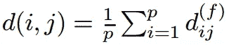
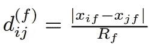
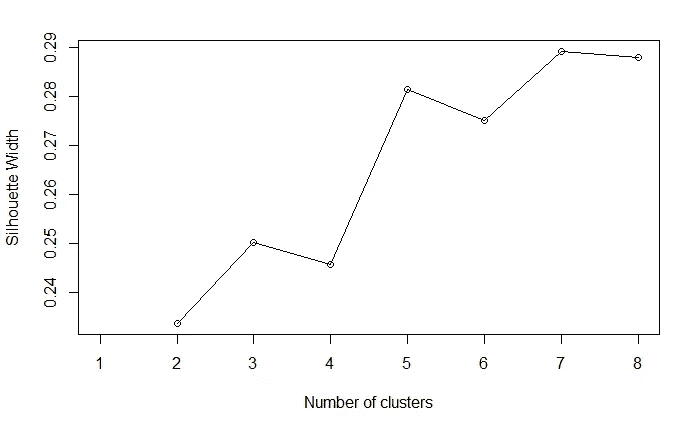
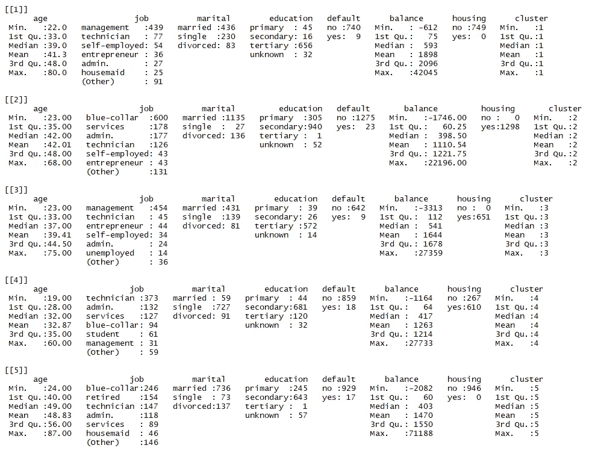
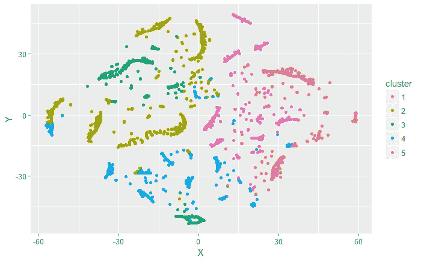

# 混合类型数据的聚类

> 原文：<https://towardsdatascience.com/clustering-on-mixed-type-data-8bbd0a2569c3?source=collection_archive---------0----------------------->


Which methodology to group individuals based on their common patterns and similarities when expressed in multiple data types?

## 一种使用 R

## 关于；在…各处 ；大约

**聚类** [**无监督数据**](https://en.wikipedia.org/wiki/Unsupervised_learning) **并不是一件容易的事情**。事实上，在这种情况下，数据处理和探索通常是由领域知识驱动的，如果不是纯粹的直觉，并且由于没有方法来测量所得分割的准确性(与监督学习相反)，因此变得很困难。

此外，**无监督学习的入门课程相当经常地讨论理想的用例**，比如 k-means 教程，它只适用于数字特征。

然而，**真实的业务情况往往会偏离这些理想的用例**，需要分析由**混合类型数据**、**构成的数据集，其中数值**(两个值的差是有意义的)**、名义**(分类的，不排序的)或**序数**(分类的，排序的)**特征共存**。

在这篇文章中，我将关注这种情况，在使用 R 的无监督分类练习**的背景下。**

*   第一部分包括**方法论**:我正在讨论**使用距离的数学概念来衡量个体之间的相似性**的问题。然后，我将介绍 PAM **聚类算法**(围绕 medoids 进行划分)以及一种选择最佳聚类数(轮廓系数)的方法**。我最后用一句话来结束对**的解读**。**
*   在第二部分中，我将使用 uci 的[机器学习库](https://archive.ics.uci.edu/ml/datasets/Bank+Marketing)上的银行营销数据集以及来自`cluster`和`Rtsne`包的一些有用的函数来说明方法**。该数据集与葡萄牙银行机构的直接营销活动(电话)相关，传统上用于监督学习讨论(分类目标是预测客户是否会认购定期存款)。但是，它包含一些关于**银行客户的信息，我们将尝试对这些信息进行“先验”聚类**。**

我们开始吧！

# 第一部分:方法

## 如何度量相似度


Data Scientists aiming at clustering ‘unknown’ data, sometimes without business knowledge, use distance to avoid subjectivity and ensure consistent approach to all features

**距离**是个体之间距离的数值度量，即用于测量个体之间的接近度或相似度的度量。存在许多距离度量，其中一个实际上对破解我们的案例非常有用，那就是**高尔距离** (1971)。

高尔距离被计算为个体间部分差异的平均值。每个部分不相似性(以及高尔距离)在[0±1]范围内。



Gower distance’s formula

**部分相异** ( `d_ij^f` ) **计算取决于被评估变量的类型**。这意味着将对每个特征应用特定的标准化，并且两个个体之间的距离是所有特征特定距离的平均值。

*   对于一个**数字特征** `**f**`，偏相异度是 1)观察值`x_i`和`x_j`的绝对差值与 2)从所有个体观察到的最大范围:`d_ij^f = |x_i — x_j| / |(max_N(x) — min_N(x))|`，N 是数据集中个体的数量。



Partial dissimilarity computation for numerical features (R_f = maximal range observed)

*   对于一个**定性的**特征`f`，只有当观测值`y_i`和`y_j`具有不同的值时，偏相异度才等于 1。否则为零。

**注**:使用`cluster` 包中的`daisy()`功能，可在 **R** 中获得更高的距离。特征首先自动**标准化**(即重新调整至[0 1]范围内)。

## 聚类算法:**MEDOIDS 周围划分(PAM)**

高尔距离非常符合 [k-medoids 算法](https://en.wikipedia.org/wiki/K-medoids)。k-medoid 是一种经典的聚类划分技术，它将 n 个对象的数据集聚类成 k 个先验已知的聚类**。**

**与 [k-means 算法](https://en.wikipedia.org/wiki/K-means_clustering)非常相似，PAM 具有以下特征:**

*   ****优点**:与 k-means 相比，它直观、对噪声和异常值更鲁棒(由于所使用的距离属性)，并且它为每个聚类产生一个“典型个体”(对解释有用)。**
*   ****缺点**:耗时耗机(运行时间和内存是二次的)。**

## **评估数据集群内的一致性**

**除非你有一个很好的先验原理来强制一个特定的**数量的簇 k** ，否则你可能会对**向**计算机**询问一个基于统计的推荐**感兴趣。[存在几种方法](https://en.wikipedia.org/wiki/Cluster_analysis#Evaluation_and_assessment)来限定所选数量的聚类的相关性。在第二部分中，我们使用**轮廓系数**。**

**[轮廓系数](https://en.wikipedia.org/wiki/Silhouette_(clustering))将到同一簇中元素的平均距离与到其他簇中元素的平均距离进行对比。具有高轮廓值的对象被认为是良好聚类的，具有低值的对象可能是异常值。**该指标**适用于 k-medoids 聚类，并且**也**用于确定最优聚类数。请阅读维基百科页面，了解关于计算和解释的更多细节。**

## **解释**

**基本上有两种方法来研究这种聚类工作的结果，以便得出一些与业务相关的解释。**

*   **1.**每簇**的汇总，使用 r 中的`summary()`函数**
*   **2.**低维空间中的可视化**，使用 [t-SNE](https://lvdmaaten.github.io/tsne/) ，使用 r . t-分布式随机邻居嵌入(t-SNE)中的`Rtsne()`函数是一种降维技术，特别适合于高维数据集的可视化。**

**我们在用例(第二部分)中涵盖了这两种情况。理论够了，来应用和举例说明吧！**

# **第二部分:用例**

**在这个用例中，我们将尝试根据以下特征对银行客户进行聚类:**

*   ****年龄**(数字)**
*   ****工作类型**(分类):‘行政’、'蓝领'、'企业家'、'女佣'、'管理'、'退休'、'个体户'、'服务'、'学生'、'技术员'、'失业'、'未知'**
*   ****婚姻状况**(分类):“离婚”、“已婚”、“单身”、“未知”**
*   ****教育**(分类):“初级”、“中级”、“高级”、“未知”**
*   ****违约**:有信用违约？(分类):“否”、“是”、“未知”**
*   ****余额**(数字):年平均余额，单位为欧元**
*   ****住房**:有住房贷款？(分类):“否”、“是”、“未知”**

```
#' Load useful packages
library(cluster)
library(dplyr)
library(ggplot2)
library(readr)
library(Rtsne)#' Load data
df <- read_csv2("../data/001_unsupervised_mixed_types_data/bank.csv")
```

**根据高尔距离，最相似和最不相似的客户:**

```
#' Compute Gower distance
gower_dist <- daisy(df, metric = "gower")gower_mat <- as.matrix(gower_dist)#' Print most similar clients
df[which(gower_mat == min(gower_mat[gower_mat != min(gower_mat)]), arr.ind = TRUE)[1, ], ]# A tibble: 2 x 7
    age job        marital education default balance housing
  <int> <fct>      <fct>   <fct>     <fct>     <int> <fct>  
1    **52 technician married secondary no          196 yes **   
2   ** 52 technician married secondary no          195 yes**#' Print most dissimilar clients
df[which(gower_mat == max(gower_mat[gower_mat != max(gower_mat)]), arr.ind = TRUE)[1, ], ]# A tibble: 2 x 7
    age job     marital  education default balance housing
  <int> <fct>   <fct>    <fct>     <fct>     <int> <fct>  
1   ** 60 retired married  primary   no        71188 no   **  
2    **26 admin.  divorced secondary yes          -3 yes**
```

**在商业环境中，我们通常寻找一些既有意义又容易记忆的聚类，例如最多 2 到 8 个。轮廓图有助于我们确定最佳选择。**

```
sil_width <- c(NA)
for(i in 2:8){  
  pam_fit <- pam(gower_dist, diss = TRUE, k = i)  
  sil_width[i] <- pam_fit$silinfo$avg.width  
}plot(1:8, sil_width,
     xlab = "Number of clusters",
     ylab = "Silhouette Width")
lines(1:8, sil_width)
```

****

**7 clusters has the highest silhouette width. 5 is simpler and almost as good. Let’s pick k = 5**

****解读****

*   **每个集群的摘要**

```
k <- 5
pam_fit <- pam(gower_dist, diss = TRUE, k)
pam_results <- df %>%
  mutate(cluster = pam_fit$clustering) %>%
  group_by(cluster) %>%
  do(the_summary = summary(.))
pam_results$the_summary
```

****

**Clusters’ scorcard**

**在这里，我们可以尝试为集群中的客户端导出一些通用模式。例如，集群 1 由**“管理 x 三级 x 无违约 x 无住房”**客户组成，集群 2 由**“蓝领 x 二级 x 无违约 x 住房”**客户组成，等等。**

*   ****低维空间中的可视化****

```
tsne_obj <- Rtsne(gower_dist, is_distance = TRUE)tsne_data <- tsne_obj$Y %>%
  data.frame() %>%
  setNames(c("X", "Y")) %>%
  mutate(cluster = factor(pam_fit$clustering))ggplot(aes(x = X, y = Y), data = tsne_data) +
  geom_point(aes(color = cluster))
```

****

**Clients observed in a lower dimensional space**

**虽然不完美(尤其是聚类 3)，但颜色大多位于相似的区域，这证实了分割的相关性。**

## **结论**

**这篇文章是我在尝试对混合类型的无监督数据集进行聚类练习时的想法的总结。我认为这可能对其他数据科学家有附加价值，因此分享。**

****然而，仍存在一些挑战**，包括:**

*   **如何处理海量数据集(cf 内存密集)？**
*   **一种热编码可能是一种解决方案；这两种方法的优缺点是什么？**

**请不吝评论并分享您对如何应对这一挑战和改进这一拟议方法的看法。**

## **来源**

*   **[R 中混合数据类型的聚类](https://dpmartin42.github.io/posts/r/cluster-mixed-types) | Daniel P. Martin | 2016**
*   **[当属性为名义属性时，个体的最优距离函数是什么？](https://stats.stackexchange.com/questions/55798/what-is-the-optimal-distance-function-for-individuals-when-attributes-are-nomina/55802#55802)|[ttnphns](https://stats.stackexchange.com/users/3277/ttnphns)| stats.stackexchange.com**
*   **[分类上升等级](http://larmarange.github.io/analyse-R/classification-ascendante-hierarchique.html)|约瑟夫·拉玛兰吉| 2018(法语)**