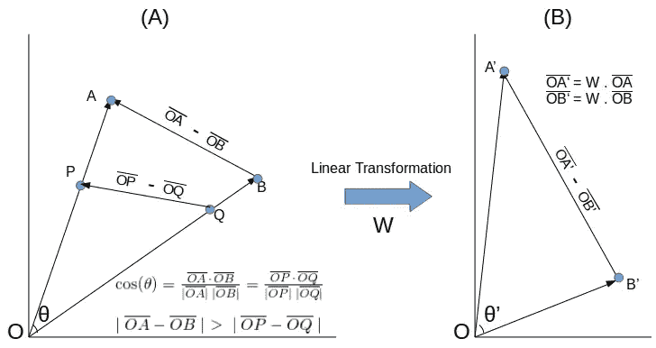
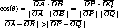
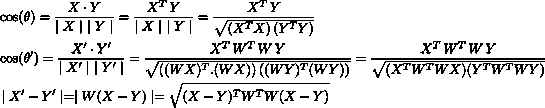
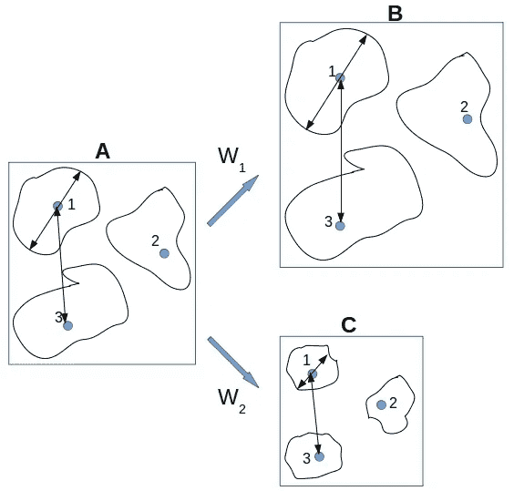
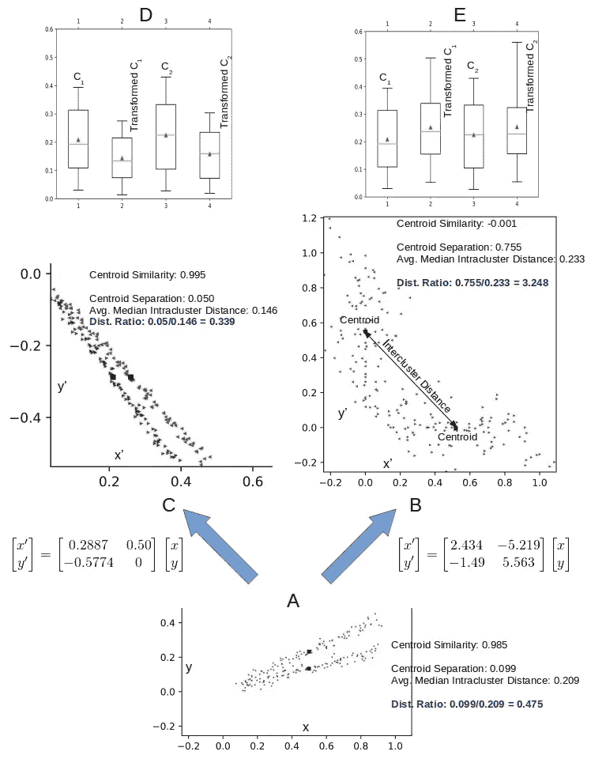

# 用变换的文档向量聚类文本

> 原文：<https://towardsdatascience.com/clustering-text-with-transformed-document-vectors-1e14c9f0f198?source=collection_archive---------19----------------------->

## 距离度量不能跨变换空间进行比较。本文还提出了一种度量方法来测试文档的变换，以提高文档的聚类能力

机器学习中分类的一个姐妹任务是聚类。虽然分类需要用类信息预先标记训练数据，但聚类是无监督的。无人值守的磁盘文本分组有很大的好处，我们想知道单词嵌入是否有帮助。事实上，一旦被识别，这些聚类就可以继续充当类似的未来传入文本的目标分类桶。如果我们成功做到了这一点，我们就不需要预先贴标签了！有价值的目标，但稍后会更多。

单词嵌入产生了从*n*-长( *n* 是组成文本语料库的词汇的大小)稀疏文档向量到*p*-长密集向量的线性变换，其中 *p* < < *n* 。在[文档向量分类](http://xplordat.com/2018/10/09/word-embeddings-and-document-vectors-part-2-classification/)的背景下，我们得出结论，使用 [tf-idf](https://scikit-learn.org/stable/modules/feature_extraction.html#text-feature-extraction) 向量和[朴素贝叶斯](https://scikit-learn.org/stable/modules/naive_bayes.html)分类器是一个很好的起点。虽然我们不能一概而论，但用预先训练/定制的数字向量替换单词似乎对分类质量没有太大帮助。这篇文章(以及下一篇文章)的总体目标是为一个集群任务重复这个练习。在这篇文章中，我们关注以下几点。

*   比较和对比文档的距离/相似性度量
*   变换如何影响向量的可聚集性
*   如何比较不同转换在集群中的有效性？

## 1.文档的聚类与分类

聚类依赖于对象之间距离的概念，而分类依赖于对象相似性的概念。这里的对象是按照经过测试和尝试的[单词袋](http://xplordat.com/2018/01/23/stacks-of-documents-and-bags-of-words/)方法及其变体(包括单词嵌入)表示为数字向量的文档。我们可以选择使用欧几里德距离度量进行聚类，使用余弦相似性进行分类。直觉上，我们期望相似的文档彼此距离很近。但是这并不能保证，除非我们在实现中明确要求它。在对文档向量进行分类时，我们不必担心的事情对聚类任务很重要。其中一些如下。

*   在任何给定的空间中，长度归一化对于聚类文档向量是重要的，但是对于分类它们却不是
*   不同变换空间中的距离和相似性不能直接在数量上进行比较以得出任何结论
*   转换不需要保持距离或相似性，我们实际上希望它们变得更好，因为首先应用转换是没有意义的。

让我们更详细地看看这些，主要集中在向量之间的距离。

## 2.长度标准化

用于文档的[向量空间模型](http://xplordat.com/2018/06/18/reduced-order-models-for-documents/)的核心假设是，如果两个文档包含具有*相同相对频率*的*相同单词*，那么它们很可能在谈论相同的事情。因此，建立在该前提上的向量通过产生单位余弦相似性来反映它。我们也希望在聚类练习中得到相同的最终结果。也就是说，我们想要构建文档的聚类，其中每个聚类中的文档彼此之间的相似度要高于它们与其他聚类中的文档的相似度。有道理对吗？

但是聚类通常是基于特征空间中向量之间的*距离*和基于余弦相似性的*而不是*。也许我们可以使用余弦相似性本身作为距离度量。大多数 K-means 聚类的实现(例如 [scikit-learn](https://scikit-learn.org/stable/modules/clustering.html#k-means) )不允许自定义距离函数。因此，如果我们想要使用 scikit 中的 K-means 实现对文档进行聚类，我们需要文档的距离度量与其余弦相似性表现相同，以获得对文档进行聚类的良好结果。余弦相似性不受向量大小的影响，而向量之间的距离则不受影响。因此，我们要求在执行聚类任务之前，所有的文档向量都被归一化为具有相同的长度。

为了说明，考虑下面图 1 中的向量 *OP* 、 *OA* 、 *OB* 和 *OQ* 。 *OA* 就是简单的 *OP* 但是幅度更大。同样，OB 是 OQ*的放大版。但是 *OA* 、 *OB* 与 *OP* 和 *OQ* 之间的角度相同，因此它们的余弦相似性不受影响。*

Figure 1\. (A) Magnitude of vectors affects their difference but not their cosine similarity. So we need to normalize document vectors for clustering (B) Linear transformation of vectors does not in general preserve angles or lengths. So once again the document vectors should be normalized after a transformation if clustering is the objective.

Equation 1

> 让我们非常清楚，我们需要在聚类文档向量的上下文中进行长度归一化，我们希望距离度量表现得像余弦相似性度量一样…长度归一化不是对任何向量集进行聚类的一揽子建议…事实上，它会破坏我们在以前的帖子中获得的完美聚类，其中距离需要是原始向量之间的良好距离…

## 3.转换

考虑长度为 *n* 的两个向量 *X* 和 *Y* ，词汇量的大小。我们通过使用单词嵌入将它们转换成更短的 *p* 维向量 *X* 和 *Y* 。我们知道(例如参见[单词嵌入和文档向量:第 2 部分。分类)](http://xplordat.com/2018/10/09/word-embeddings-and-document-vectors-part-2-classification/)变换与 X' = *WX* 和 Y' = *WY* 是线性的其中 *W* 是 *pxn* 矩阵其中 *p* 是字向量的长度。余弦相似度和新空间中的距离可以如下导出。

Equation 2

显然，在 *p* 空间中的向量之间的角度和距离是 *W* 的函数。当且仅当 *W* 正交时，它们才是不变的。

Equation 3

但是没有理由期望 *W* 是正交的，因为单词向量是根据底层算法以各种方式从摘要文本中导出的，并且不要求它们是正交的。当我们在这里处理文档时，根据第 1 节中的论点，我们需要，

> 在进行聚类任务之前，对转换后的文档向量的长度进行归一化

## 4.距离测量

我们希望向量的线性变换将使我们能够更好地解读数据中的潜在聚类。每次转换都将文档向量带到不同的空间。虽然我们可以在一个空间内比较距离，但我们不能在不同的空间内进行比较。参见下面的图 2，其中 2A 的聚类数据通过线性变换 *W_1* 和 *W_2* 进行了变换，分别产生了我们在 2B 和 2C 中看到的聚类。

Figure 2\. The relative changes in inter/intra cluster distances are the key. W2 is a preferable transformation than W1 even while it reduces the intercluster separation in absolute terms. The ratio inter/intra cluster distances is larger with W2

图 2B 显示了集群之间距离的较大绝对值。但是图 2C 更好地划分了集群。原因很清楚。在图 2B 中，星团内和星团间的距离都变大了。在图 2C 中，虽然总距离被挤压，但是簇内距离比簇间距离被挤压得更多。这是关键。为了更好地描绘集群，我们需要各个集群尽可能紧凑，同时尽可能远离其他集群。常识对吗？我们可以这样来形式化这一点

> 我们更喜欢增加集群间距离与集群内距离之比的线性变换……事实上，我们应该期望产生最高比率的变换能够显示集群任务的最佳结果

由于有许多聚类内和聚类间的距离，这里有一个合理的程序来比较聚类任务的不同降阶线性变换。

1.  选择一个转换
2.  对于每个聚类 *C_i* 找到其成员到其质心的中间距离。计算这些中间值的平均值。这是该坐标系的“代表性”距离度量。
3.  用这个从 1 开始的代表性距离度量值除以每个集群间距离。求这些比值的平均值。
4.  对每个转换重复 1–3。在 3 中产生较大值的转换应该更适合执行聚类任务

## 5.一个例子

我们用一个例子来结束这篇文章，这个例子巩固了我们在前面章节中的观察。考虑如下图 3A 所示的具有可识别聚类的 2-d 特征空间。重现这些结果的代码可以从 [github](https://github.com/ashokc/Clustering-text-with-tranformed-document-vectors) 下载。

Figure 3\. Cluster detection with transformed vectors. The ratio of intercluster to intracluster distance measures is the metric to evaluate and compare across transformations. (A) Original vectors that show two clusters. (B) The clusters are better separated than in A © The transformation did not help with improving cluster detection here (D-E) Distribution of intracluster distances upon transformation. The whiskers are at 5 and 95 percentile values. The intracluster cluster distances got blown up in 3E as expected from 3B. The intracluster distances got squished in 3D agreeing with 3C.

对这些数据进行简单的线性变换，我们得到了如图 3B 所示的聚类。图 3B 中观察到的正交性并不令人惊讶，因为“我们作弊”并选择了与图 3A 中这些簇的主导方向有些一致的线性变换。我们一般没有这种奢侈，但这只是为了放大变换对聚类检测的影响。应用不同的随机变换会产生如图 3C 所示的挤压星团。根据这些变换，簇内距离(距簇的质心)的实际分布已经改变。3C/3D 中距离的压缩和 3B/3E 中距离的扩展是显而易见的。

很明显，在图 3B 中获得的聚类比图 3A 或 3C 中的聚类分离得更好。对于图 3B，簇间距离与平均簇内中值距离的比值也具有最高值。这就是我们在这篇文章的第 2 到第 4 部分所要建立的观点

## 6.结论

这个帖子有点短，但也差不多了。我们已经为使用降阶转换对文档进行聚类打下了基础。进入细节和结果会使这个太长。我们将在下一篇文章中讨论这个问题，并结束这个系列。

…

*原载于 2018 年 11 月 26 日*[*【xplordat.com*](http://xplordat.com/2018/09/27/word-embeddings-and-document-vectors-part-1-similarity/)*。*