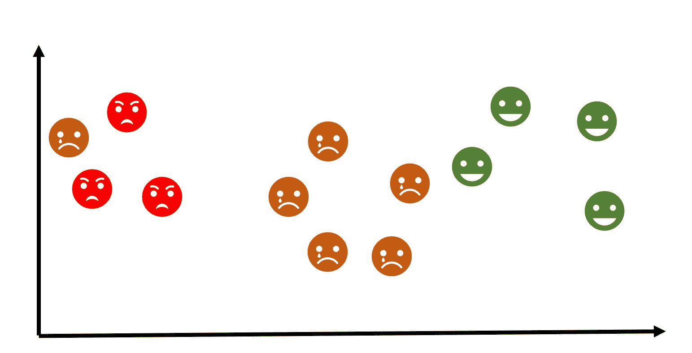
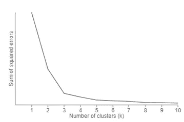
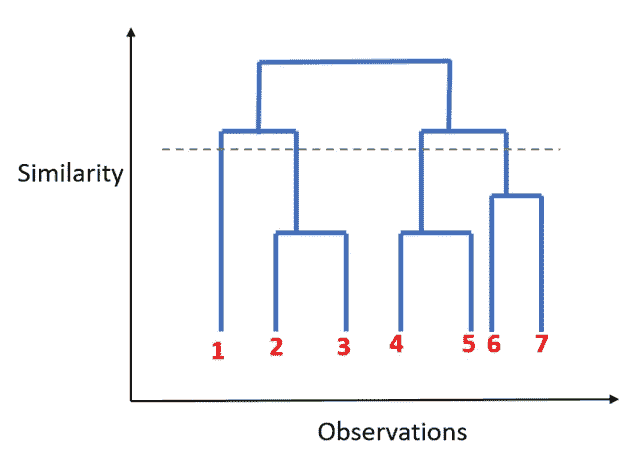

# 聚类——无监督学习

> 原文：<https://towardsdatascience.com/clustering-unsupervised-learning-788b215b074b?source=collection_archive---------0----------------------->

## 机器学习

> ***什么是聚类？***

“聚类”是将相似的实体组合在一起的过程。这种无监督机器学习技术的目标是找到数据点中的相似性，并将相似的数据点分组在一起。

> **为什么使用聚类？**

将相似的实体分组在一起有助于描述不同组的属性。换句话说，这将让我们深入了解不同群体的潜在模式。对未标记的数据进行分组有许多应用，例如，您可以识别不同的客户群/细分市场，并以不同的方式营销每个客户群，以最大化收益。另一个例子是将属于相似主题的文档分组在一起。当你处理大量的变量时，聚类也被用来减少数据的维数。

> **聚类算法是如何工作的？**

有许多算法被开发来实现这一技术，但对于这篇文章，让我们坚持机器学习中最流行和最广泛使用的算法。

1.  k 均值聚类

2.分层聚类

## k 均值聚类

1.  它以 K 作为输入开始，这是你想要找到的聚类数。将 K 个质心放置在空间中的任意位置。
2.  现在，使用数据点和质心之间的欧几里德距离，将每个数据点分配给与其接近的聚类。
3.  将聚类中心重新计算为分配给它的数据点的平均值。
4.  重复 2 和 3，直到没有进一步的变化发生。

现在，你可能会想，我如何在第一步决定 K 的值。

其中一种方法叫做**肘**法，可以用来决定一个最优的聚类数。这里，您将对 K 值范围运行 K 均值聚类，并在 Y 轴上绘制“*解释的方差百分比*”，在 X 轴上绘制“ *K* ”。

在下面的图片中，你会注意到，当我们在 3 之后添加更多的集群时，它并没有给出更好的数据建模。第一个集群增加了很多信息，但在某个点上，边际增益将开始下降。

Elbow Method

## **层次聚类**

与 K 均值聚类*不同，分层聚类从将所有数据点指定为自己的聚类开始。顾名思义，它构建层次结构，在下一步中，它组合两个最近的数据点，并将其合并为一个集群。*

1.将每个数据点分配给自己的聚类。

2.使用欧几里德距离找到最接近的聚类对，并将它们合并到单个聚类中。

3.计算两个最近的聚类之间的距离，并进行组合，直到所有项目都聚集到一个聚类中。

在这种方法中，您可以通过注意哪些垂直线可以被水平线切割而不与聚类相交并覆盖最大距离来决定最佳聚类数。

**Dendogram**

> **使用聚类算法时要记住的事情:**

*   将变量标准化，以便所有变量都在相同的范围内。这在计算距离时很重要。
    在形成聚类之前处理离群数据，因为它会影响数据点之间的距离。

如果你从这篇文章中学到了什么，那么请❤点击下面，这样其他人会在媒体上看到它。