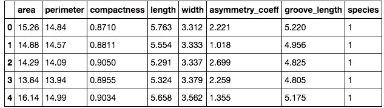
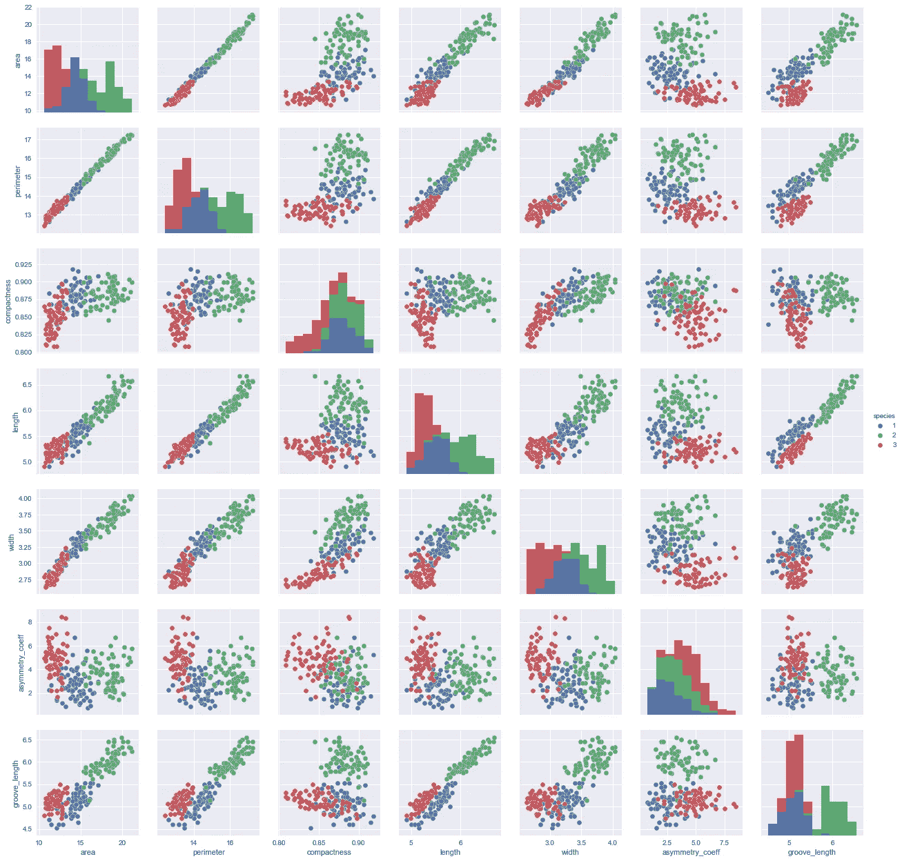

# 集群:为什么要使用它

> 原文：<https://towardsdatascience.com/clustering-why-to-use-it-16d8e2fbafe?source=collection_archive---------3----------------------->

作为一名没有编程背景的数据科学新生，我喜欢用简单的方式解释复杂的主题。好像在我的节目开始前自言自语。好吧，我希望你们都准备好了一些集群。

让我们从什么是集群开始？事实上，你已经做过很多次了。这是寻找相似之处并将这些相似点放入一个组(或集群)的行为。让我们都回想一下上次出去吃饭的情形。你首先要弄清楚的是你想要什么类型的食物，墨西哥的、中国的、意大利的等等。你正在制造具有这些属性的多个餐馆的集群。

现在来看一个更加数据科学的例子，我将观察种子的不同属性，看看对这些属性进行聚类是否有助于预测种子是否属于某个物种。

直接进入代码，我们需要导入库来执行下面几行。我还将在底部读取我的数据集

```
%matplotlib inline 

**import** **pandas** **as** **pd**
**import** **numpy** **as** **np**
**from** **sklearn** **import** cluster
**from** **sklearn** **import** metrics
**from** **sklearn.metrics** **import** pairwise_distances
**import** **matplotlib.pyplot** **as** **plt**
**import** **matplotlib**
matplotlib.style.use('ggplot') 

**import** **seaborn** **as** **sns**seeds = pd.read_csv("../assets/datasets/seeds.csv")
```

看看我的数据框的前几行，这就是它的样子。使用 pandas 查看这一点的代码是 seeds.head()，它将显示前 5 行



```
seeds.species.nunique()
```

然后，我查看了我的“物种”列中独特值的数量，这是“目标值”列(我们试图预测的东西)。我们的数据集中有三个物种

```
*# Plot the Data to see the distributions/relationships*
cols = seeds.columns[:-1]
sns.pairplot(seeds, x_vars=cols, y_vars= cols, hue='species')
```



这是一个散点图，显示了我们不同的变量是如何相互联系的，颜色(或我上面设置的色调)是每个不同的物种。因此，你可以开始看到，一般来说，对于我们的大多数变量(预测)，种子往往与它们自己的物种聚集在一起。

因为我们有一个目标值，所以我们可以在这里停止聚类，但是很多时候我们会在没有目标值的时候使用聚类。因此，我将放弃我们的目标，看看我们的聚类是否会发现差异，并很好地预测哪些种子应该聚集在一起。

```
X = seeds.drop("species", axis = 1)**from** **sklearn.metrics** **import** pairwise_distances
**from** **sklearn** **import** cluster, datasets, preprocessing, metrics
X_scaled = preprocessing.normalize(X,axis=0)
```

我放弃了目标值，我还从 sklearn 导入了几个库，这样我就可以规范化我的数据。规范化数据是组织数据库的属性和关系以缩放范围[0，1]内的所有数值变量的过程。我们这样做是为了使 permiter 等值为 15 的列不会比紧致度等值低于 1 的列更重要

```
**from** **sklearn.cluster** **import** KMeans

k = 3
kmeans = cluster.KMeans(n_clusters=k)
kmeans.fit(X_scaled)
```

我使用 kmeans 集群来解决这个问题。它设置随机质心(每组的中心点),这些质心将不断移动，直到它们位于一组点的中心，以使所有点的平均距离尽可能小。

```
inertia = kmeans.inertia_
**print** 'Silhouette Score:', metrics.silhouette_score(X_scaled, labels, metric='euclidean')
```

我在上面所做的是查看两个不同的指标来分析我们的聚类方法做得有多好。惯性是每个聚类的误差平方和。因此，惯性越小，集群越密集(所有点越靠近)

轮廓分数从-1 到 1，显示了聚类之间的距离以及聚类的密度。你的轮廓分数越接近 1，你的聚类就越明显。如果你的分数是 1，把你的集群想象成完美的小球，它们彼此远离，没有分类失误。

聚类可以用在很多问题上，不管你有没有目标值，都有助于寻求洞见，看到关系。