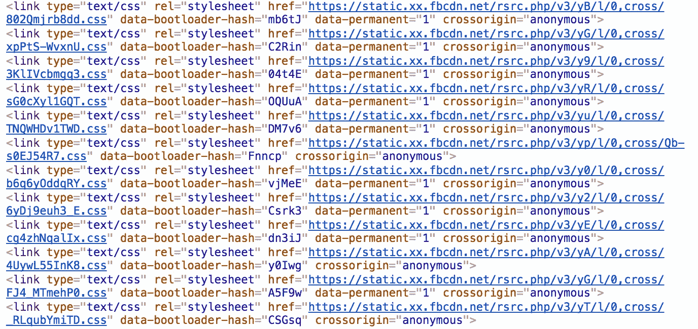
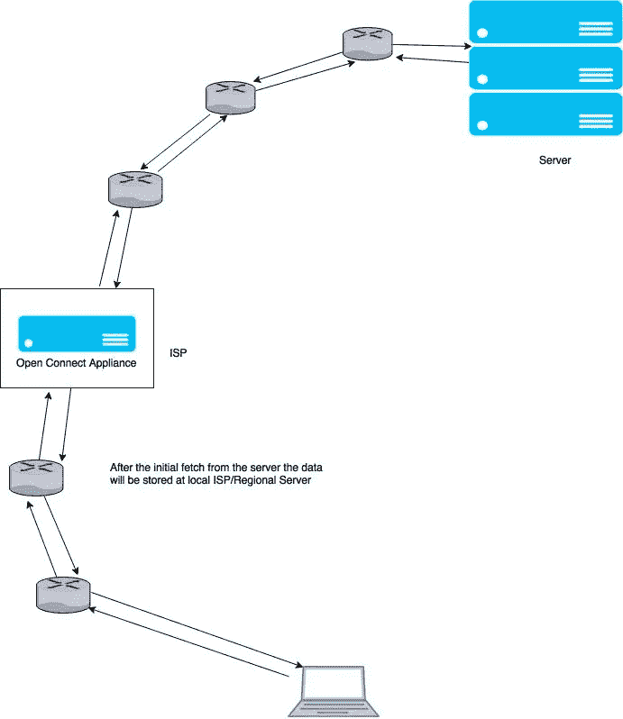

# CDN —内容交付网络

> 原文：<https://towardsdatascience.com/cnd-content-delivery-networks-b4e6998216cc?source=collection_archive---------3----------------------->

## 什么，为什么，怎么做？

[CDN Connectivity](https://www.google.com/url?sa=i&rct=j&q=&esrc=s&source=images&cd=&cad=rja&uact=8&ved=0ahUKEwiEuv2g3_LVAhUNSI8KHa15BnkQjRwIBw&url=https%3A%2F%2Fservandosilva.com%2Fwhat-is-a-cdn-and-how-it-boosted-my-roi-by-200%2F&psig=AFQjCNGpT2MCv3n7LipW3uxaC55CfySpog&ust=1503762833539216)

# 什么？

什么是 CDN？Well 是一个专注于传递内容的复杂网络。什么内容？你从一个流行的网络服务上下载的几乎所有内容都会通过 CDN 传送。例如，FaceBook、网飞和 YouTube 使用内容交付网络来服务数十亿从其服务器请求数据的用户。CDN 背后的主要思想是以改善空间(基于位置)和时间(基于访问时间)位置的方式分发内容。

> **举个例子** 通常网飞会在世界各地不同的 ISP 为服务器用户安装冗余服务器。这些服务器被称为**开放连接设备**，根据访问权限在本地保存内容。任何到达网飞核心的新东西都会被推送到这些网站上，这样当地用户就能及时了解最新的展览目录。

[An **Open Connect Appliance**](https://www.cyberoam.com/cyberoamiview.html)

# 为什么？

想想网飞或 FaceBook 的故事。世界各地的大量用户不断请求内容，显然，由于许多原因，拥有一个庞大的服务器群不是一个解决方案。

*   单点故障(SPOF)
*   网络延迟
*   成本(ISP 必须跳过许多 BG——连接不同 ISP 的边界网关。这要花费！！)
*   需要故障安全冗余

此外，如果您检查 FaceBook 的 DOM(文档对象模型),您可以看到以下内容。

Content Loaded over CDN

FaceBook 的图像通常使用 Akamai CDN 渲染。这里 可以找到更多使用 Akamai [**的人。**](https://www.akamai.com/uk/en/our-customers.jsp)

# 怎么会？

> cdn 大多是相互对话的分布式系统。根据分布式系统的[定义](https://en.wikipedia.org/wiki/Distributed_computing)，整个系统对任何到达它的人来说都是一个端点。

## 简化过程

How CDN get updates

## 全局重定向器

在 cdn 上讨论全局重定向器的概念很重要。这些是 ISP 级别或区域级别的重定向，用于到达具有所请求内容的最近的服务器。

> 键入[www.google.com](http://www.google.com)，你将被重定向到 [www.google.lk](http://www.google.lk) (因为我是在斯里兰卡写的)。这是全局重定向。

## 为什么打开 Connect Appliances

为什么**ISP**没有一个单独的服务器机架来缓存所有的东西，为什么**cdn**把他们自己的设备推到 **ISP** 的场所？如果互联网服务提供商知道你的请求，他们将不得不打开并通过互联网查看你请求的内容。现代网络实施 HTTPS，这使得这不可能。如果他们要打开你的请求，他们必须是一个中间人，这将再次在浏览器中失败，因为这将使 SSL 证书验证失败。因此 **CDN** 发布自己的设备，以更安全可靠的方式完成任务。

> 对于互联网服务提供商来说，这听起来可能是一项令人讨厌的任务，因为他们需要在自己的场所安装一些机顶盒。嗯**不是！！**这是因为拥有这样的设备将使他们能够减少通过 **ISP** 并到达 **WWW** 的请求数量。这是一个巨大的成本降低。最终 CDN 和 ISP 都很开心，我们也是。

感谢您的阅读。希望你学到了新东西。干杯！:-)