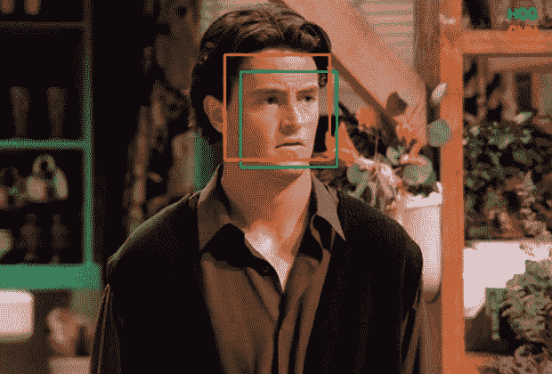
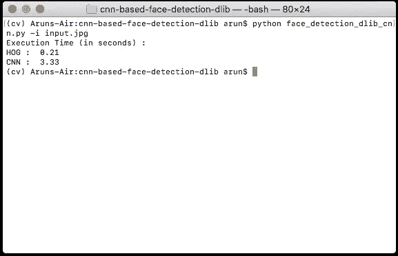
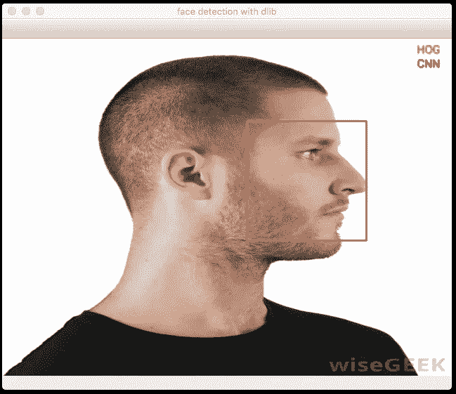
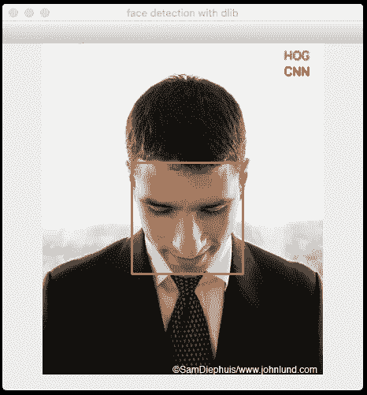
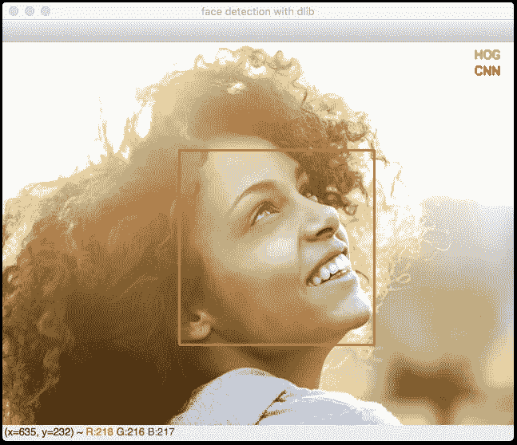
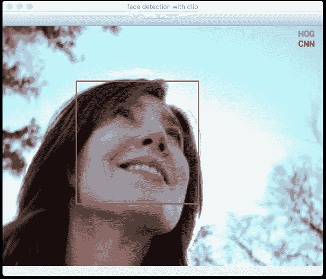
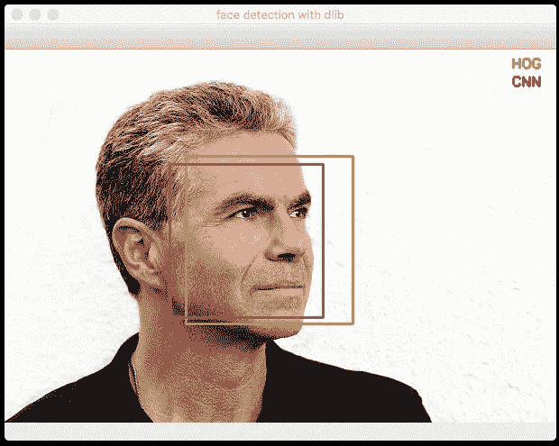
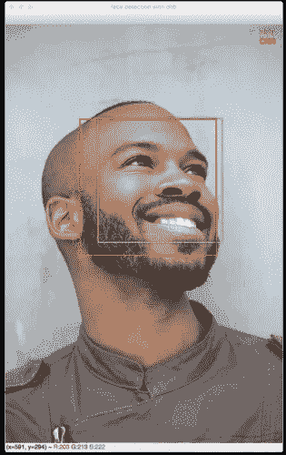
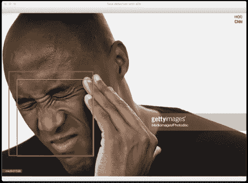

# 基于 CNN 的人脸检测器

> 原文：<https://towardsdatascience.com/cnn-based-face-detector-from-dlib-c3696195e01c?source=collection_archive---------3----------------------->



Image Source: Google Images

如果你对任何类型的图像处理、计算机视觉或机器学习感兴趣，你很有可能在旅途中的某个地方遇到/使用过 dlib。

根据 dlib 的 [github 页面](http://github.com/davisking/dlib)介绍，dlib 是*一个用 C++制作真实世界机器学习和数据分析应用的工具包。*虽然这个库最初是用 C++编写的，但它有很好的、易于使用的 Python 绑定。

我主要使用 dlib 进行 ***面部检测*** 和 ***面部标志检测*** 。dlib 中的正面人脸检测器效果真的很好。它很简单，开箱即用。

该检测器基于*梯度方向直方图(HOG)* 和*线性 SVM。*(解释这个检测器如何工作超出了这篇博文的范围。可能是改天讨论的话题)

虽然基于 HOG+SVM 的人脸检测器已经存在了一段时间，并聚集了大量的用户，但我不确定我们中有多少人注意到了 dlib 中基于 CNN(卷积神经网络)的人脸检测器。老实说，我没有。我是在浏览 dlib 的 github 资源库时偶然发现的。

我当时的想法是，

> ****哇。是否优于现有的检测器？有多准确？它能全方位检测人脸吗？它能在实时视频上运行吗？****

**嗯，这就是这篇文章的内容。试图找出上述问题的答案。**

**如果你曾经在 dlib 中使用过基于 HOG 的人脸检测器，你可能知道它不会检测奇数角度的人脸。它应该是一个很好的"*正面*"人脸检测器，它确实是。**

**它可以检测到人脸，即使它们的正面并不十分突出。这对于正面人脸检测器来说非常有用。但是你只能期待这么多。**

**同时，基于 CNN 的检测器能够检测几乎所有角度的人脸。不幸的是，它不适合实时视频。它应该在 GPU 上执行。为了获得与基于 HOG 的检测器相同的速度，您可能需要运行强大的 Nvidia GPU。**

**然而，这不应该阻止我们在静止图像上尝试它。**

**在这篇文章的剩余部分，我将向你展示如何在图像上使用基于 CNN 的人脸检测器，并将结果与基于 HOG 的检测器和现成的 Python 代码进行比较。**

**让我们直接开始编码吧。**

## **入门指南**

**让我们从导入必要的包开始。如果您尚未安装这些软件包，您可以通过在终端中键入以下命令来安装它们。**

**`pip install opencv-python dlib argparse time`**

**(argparse 和 time 更有可能预装在 Python 中)**

**如果您没有使用 Python 的虚拟环境，我强烈建议您开始使用它。需要起点的可以查看我之前的[帖子](https://medium.com/@arunponnusamy/setting-up-deep-learning-environment-the-easy-way-on-macos-high-sierra-f1b6331ffc40)。**

## **命令行参数**

**这个脚本需要两个命令行参数。**

*   **输入图像**
*   **模型重量**

**您可以通过在终端中键入以下命令来获取模型权重文件。**

**`wget [http://arunponnusamy.com/files/mmod_human_face_detector.dat](http://arunponnusamy.com/files/mmod_human_face_detector.dat)`**

**默认情况下，如果您没有提供任何特定的路径，代码会在当前目录中查找模型文件。**

**例如，您可以通过键入以下命令来运行**

**`python cnn-face-detector-dlib.py -i input.jpg`**

**(如果*input.jpg*和*模型权重文件*都在与 python 脚本相同的当前目录中，这将起作用)**

**或者你可以通过输入，**

**`python cnn-face-detector-dlib.py -i <path-to-image-input> -w <path-to-weights-file>`**

***(python CNN-face-detector-dlib . py-I ~/Downloads/input . jpg-w ~/Downloads/mmod _ human _ face _ detector . dat)***

**( ***我假设你已经安装了最新版本的 Python。*必须是 3.0+)****

## **初始化**

**读取提供的输入图像，并检查其类型是否为*无。*如果是，打印错误声明并退出程序。**

**初始化基于 HOG 和基于 CNN 的人脸检测器，我们将应用于输入图像。**

**对于基于 HOG 的，我们不需要提供任何文件来初始化。它是预先构建在 dlib 内部的。只需调用方法就足够了。**

**对于基于 CNN 的，我们需要提供权重文件来初始化。**

## **应用猪脸检测**

**让我们在输入图像上应用检测器。**

**`faces_hog = hog_face_detector(image, 1)`**

**1 是对图像进行向上采样的次数。默认情况下，1 适用于大多数情况。(对图像进行上采样有助于检测较小的面部)**

**`time.time()`可以用来测量以秒为单位的执行时间。**

**一旦检测完成，我们可以在检测到的人脸上循环。要在检测到的人脸上绘制方框，我们需要向 OpenCV 提供(x，y) —左上角和(x+w，y+h) —右下角。**

**dlib 和 OpenCV 中的矩形格式有点不同。我们可以在这里使用 [*skimage*](http://scikit-image.org/) 将 dlib 矩形对象直接叠加在图像上。但是当我们用 OpenCV 处理实时视频时，熟悉 dlib 和 OpenCV 之间的转换将会很有帮助。**

```
**cv2.rectangle(image, (x,y), (x+w,y+h), (0,255,0), 2)**
```

**上面的线将在输入图像上检测到的人脸上绘制一个矩形。(0，255，0)代表 *BGR* 顺序中盒子的颜色(本例中为绿色)。2 代表线条的*粗细*。**

## **应用 CNN 人脸检测**

**除了检测器返回矩形对象之外，这个过程与前面的检测器几乎相同。让我们用红色来区分 CNN 检测到的人脸。**

## **显示结果**

**为了区分 HOG 和 CNN 检测器的检测，让我们在图像的右上角写下哪种颜色是哪种颜色。**

**`cv2.imshow()`将显示运行脚本时的输出图像。**

**`cv2.waitKey()`指定显示窗口关闭前应等待的时间。例如`cv2.waitKey(500)`将显示 500 毫秒(0.5 秒)的窗口。如果你不传递任何数字，它会一直等到你按下任何键。**

**`cv2.imwrite()`将输出图像保存到磁盘。**

**一旦我们完成了显示，释放所有的窗口是一个好的习惯。**

**完整的代码可在[这里](https://gist.github.com/arunponnusamy/7013c8617f97937250cb2c2de57c9b11)获得。**

## **执行时间**

**给你一个执行时间的概念，对于一个 620x420 的图像， **HOG** 花费大约 **0.2 秒**，而 **CNN** 花费大约 **3.3 秒**在 CPU 上( *Intel i5 双核 1.8GHz* )。**

****

**Execution time on CPU (in seconds)**

**根据您的硬件设置和映像的大小，确切的数量可能会有所不同。底线是 HOG 需要不到一秒钟，而 CNN 只需要几秒钟。**

## **检测奇数角度的人脸**

**重要的部分来了。**

****基于 CNN 的检测器可以检测到基于 HOG 的检测器可能检测不到的奇数角度的人脸吗？****

**嗯，答案是“ ***差不多*** ”。(我还没有经过严格的测试来给出一个自信的“*是”。但是据我测试，它对非正面的图像非常有效。***

**让我们看一些例子，其中基于 HOG 的检测器失败，但 CNN 能够检测。**

****************

**这样的例子不胜枚举。**

**这并不是说基于 HOG 的检测器对非正面图像完全不起作用。事实上，它确实检测到一些非正面图像，如下图所示。**

************

**All the images above are taken from Google Images. I do not own the copyright.**

## **摘要**

**在这篇文章中，我们研究了 dlib 的基于 CNN 的人脸检测器，并与广泛使用的基于 HOG+SVM 的人脸检测器进行了比较。**

**我们观察到，基于 CNN 的检测器对于非正面人脸在奇数角度下工作得非常好，而基于 HOG 的检测器很难工作。**

**不幸的是，基于 CNN 的检测器计算量很大，目前不适合实时视频。如果您已经注意到检测器函数调用(`dlib.cnn_face_detection_model_v1()`)，它显示 v1 是版本 1。这意味着作者很有可能会推出轻量级的、可用于实时应用程序的下一个版本。**

**让我们期待 dlib 下一个版本中的轻量级版本。**

**好了，暂时就这些了。欢迎在下面的评论中分享你的想法，或者你可以在 twitter 上联系我，电话:[@ ponnum Samy _ arun](http://twitter.com/ponnusamy_arun)。**

**如果你对这篇文章感兴趣，你可以[订阅](http://eepurl.com/dtoOc9)我的[博客](http://arunponnusamy.com)来获得新文章上线的通知。(别担心，我每个月只发表一两篇文章)**

**干杯。**

## **更新:**

**如果你关心实时性能，检查一下 [cvlib](http://cvlib.net) 中的人脸检测器。它可以检测(几乎)所有角度的人脸，并能够处理实时输入。**