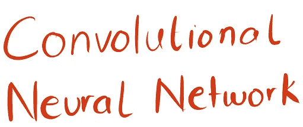
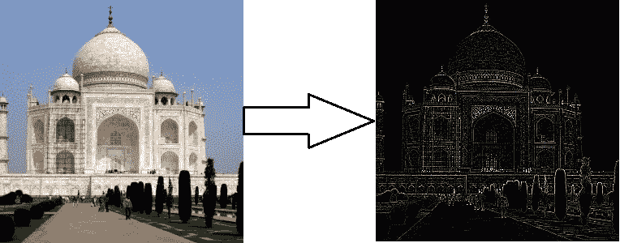
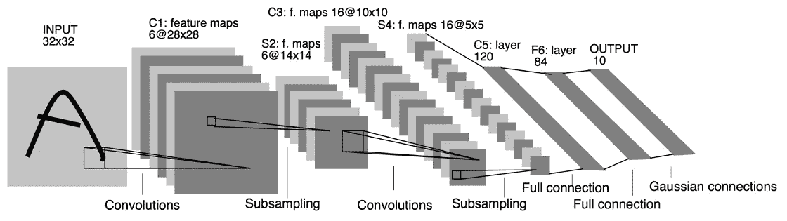
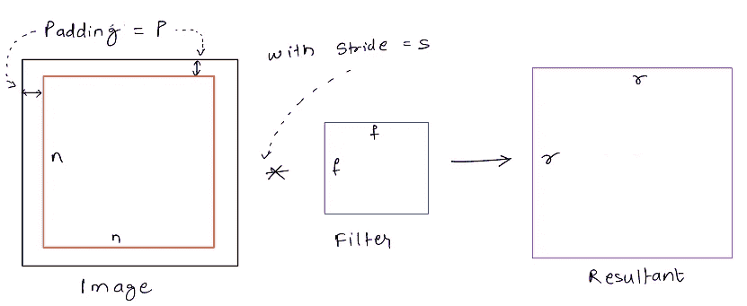
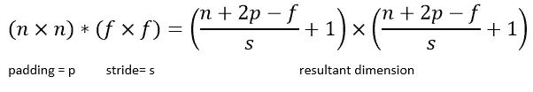

# 卷积神经网络— I

> 原文：<https://towardsdatascience.com/cnn-part-i-9ec412a14cb1?source=collection_archive---------1----------------------->

在我们进入完整的卷积神经网络之前，让我们先了解基本的底层概念，然后在此基础上进行构建。

本帖将解释以下内容:

*   卷积概念
*   卷积神经网络
*   交错回旋

# 卷积概念

对于那些上过数字信号/图像处理课程的人来说，他们应该对协解的概念比较熟悉。对于我们其他人，让我们快速浏览一下这个概念，这样我们就可以深入到实际的`cnn`实现中。

如果你有一个城市的图像，有很多如下的建筑，你想从图像中提取所有的边缘，你会怎么做？

Fig 1\. Edge detection on an image using convolution. Note how all the edges separating different colours and brightness levels have been identified

每当需要修改一个信号以从中提取一组所需的特征时，该过程被称为**滤波**。现在，为了进行滤波，需要另一组信号，我们以某种方式将其施加/应用于原始信号 S，称为**滤波器** (F)。这些滤镜也可以称为**遮罩**，因为它们帮助我们“遮罩”除了我们想要的图像特征之外的所有图像特征！

现在，所有的**遮罩**都可以显示出图像所需的效果，如果它们以下面动画演示的方式与图像像素卷积的话。

Fig 2\. GIF demonstrating result of filter convolution on an image. [Source](https://www.coursera.org/learn/convolutional-neural-networks/home/)

为了更好地理解卷积，请参考这篇[文章](http://aishack.in/tutorials/image-convolution-examples/)。

# 卷积神经网络

Fig 3\. Architecture of LeNet a Convolutional Neural Network here for digits recognition. Each plane is a feature map ie a set of units whose weights are constrained to be identical. [Source](https://www.google.co.in/url?sa=t&rct=j&q=&esrc=s&source=web&cd=3&ved=0ahUKEwj1htDahv_ZAhXMuY8KHT4DAa4QFgg2MAI&url=http%3A%2F%2Fvision.stanford.edu%2Fcs598_spring07%2Fpapers%2FLecun98.pdf&usg=AOvVaw1r5QRjS6yPaYsenIJ6-SLm)

上图来自`[Prof Yann Lecun](http://yann.lecun.com/)`的原始论文，展示了卷积网络中的所有基本组件和数据流。

以可量化的形式来说，每个 CNN 都有以下组件/层:

*   输入图像
*   卷积层
*   池层(最大池或平均池)
*   变平
*   完全连接层(默认神经网络)

我们将在随后的文章中更深入地探讨以上每一层的细节。

# 交错回旋

当我们处理非常大的图像的卷积时，并不总是需要对图像的每个像素进行卷积。因此，我们可以将后续卷积设置为在垂直轴或水平轴上移动一个以上的像素。

Fig 4\. Effect of strided convolutions on an image dimensions

在随后的回旋中的这种移动被称为`stride`，因此命名为跨步回旋。

如果我们有一个尺寸为`n x n`的图像，带有一个填充`p`，它与尺寸为`f x f`的滤波器进行卷积，步长为`s`，那么输出尺寸可以使用下面的通用公式来确定:

Fig 5\. Equation governing the resultant image/signal dimension after applying a filter (f x f) with padding (p) and stride (s)

PS:在数学卷积运算中，我们翻转一个被卷积的信号，就像在镜子里看到的一样。我们上面使用的运算实际上是互相关，但一般在深度学习卷积中是用于它的术语！

# 结论

在这篇文章中，我们已经理解了帮助我们建立整个卷积神经网络的基本概念。我们讲述了卷积如何使用不同的过滤器或遮罩处理图像数据。此外，我们还谈到了 CNN 的各种构件，以及步长卷积如何影响图像/数据的维度。

> 在下一篇文章中，我将更详细地介绍卷积，以及它如何应用于具有许多过滤器的体积。

*原载于 2017 年 11 月 10 日*[*mandroid 6 . github . io*](https://mandroid6.github.io/2017/11/10/Convolutional-Neural-Networks-I/)*。*

在推特上关注我:[https://twitter.com/mandroid_6](https://twitter.com/mandroid_6)

## 查看我关于机器学习和深度学习的其他帖子:[https://medium.com/@razzormandar](https://medium.com/@razzormandar)