# Code2Pix —面向图形用户界面的深度学习编译器

> 原文：<https://towardsdatascience.com/code2pix-deep-learning-compiler-for-graphical-user-interfaces-1256c346950b?source=collection_archive---------7----------------------->

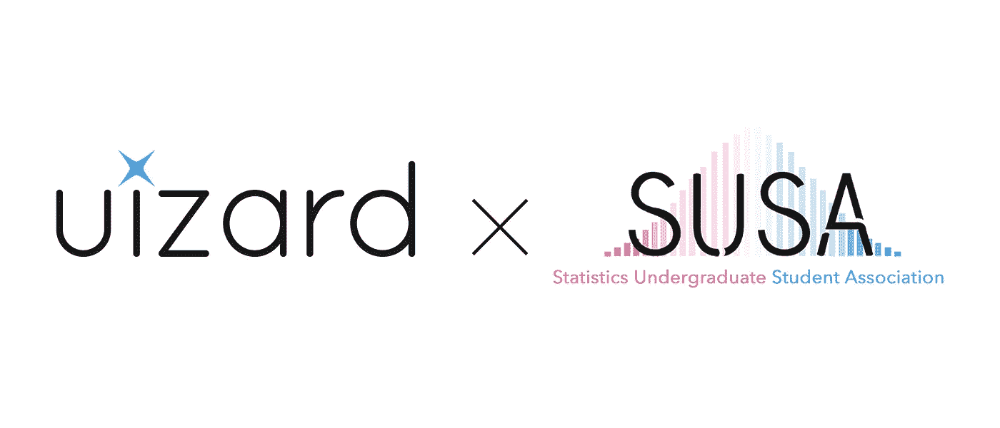

你好！我叫诺亚·冈多拉，是加州大学伯克利分校的二年级学生。我现在展示的是加州大学伯克利分校统计学本科生协会( [SUSA](https://github.com/SUSA-org) )与 [Uizard](https://uizard.io/) 合作的原创研究。

在 SUSA，我带领另外 4 名加州大学伯克利分校的本科生在 2018 年春季学期开展了这个项目。接下来的作品是我们小组许多看不见的工作、失败和乐趣的高潮。我们希望你会喜欢阅读我们的研究！

*这篇博客分为 6 个部分，还有一个简短的致谢部分。*

# TL；DR —摘要

我们为从文本描述生成图形用户界面(GUI)的问题提供了深度学习解决方案。这项研究可用于提高 pix 2 代码的准确性，以及从图形用户界面生成代码的未来模型(相反的任务)；这个问题在人机交互文献中被称为用户界面逆向工程。此外，中间工作暗示了跨多个平台工作的单一文本到 GUI 编译器的可能性。

# 1 —简介

当我第一次读到 [Pix2Code paper](https://arxiv.org/abs/1705.07962) 的时候，我震惊了。托尼·贝尔特拉梅利(Tony Beltramelli)一个人提出了深度学习的新应用，实现了一种方法，并将其开源。该论文提出了一种深度学习模型，能够将图形用户界面的草图转化为实际代码。这对我来说似乎是革命性的。我想这是我看到的事情之一，突然我明白了为什么这么多人对机器学习感兴趣——我真的觉得这是“人工智能”

Pix2Code 是机器学习工程的一个非常了不起的壮举。为了改善它，托尼建议试验一个补充项目。称为 Code2Pix，它的作用与 Pix2Code 相反。Pix2Code 来自 GUI，并把它们转换成特定领域语言(DSL)的文本描述。Code2Pix 接受 DSL 中的文本描述并生成 GUI。因此，Code2Pix 实际上是一个能够呈现接口的深度学习“编译器”。为了避免与真正的编译器混淆，我们将它称为**深度学习渲染器**。

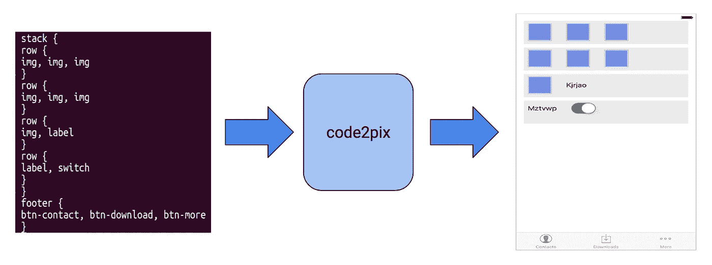

Simplified visual description of code2pix’s inputs and outputs. This particular example is from the iOS dataset provided in the original pix2code repo.

本着 Pix2Code 的精神，我们正在发布与这个项目相关的所有代码。我们希望我们能激励其他工程师参与这个项目，并通过对社区的贡献来帮助这个领域向前发展。

# 2 —为什么选择 Code2Pix？

我们开始通过建立一个生成式对抗性神经网络(GAN)来改进 Tony 的模型 Pix2Code。最近在这一领域的 [工作](https://arxiv.org/abs/1703.10476)表明，相互竞争的神经网络(GANs)可以为图像提供比标准模型更好的字幕。这就需要一个 ***发生器*** 模型和一个 ***鉴别器*** 模型来工作。Pix2Code 可用于生成用户界面的代码(DSL ),我们可以使用 Code2Pix 来查看字幕与真实图像的接近程度。Pix2Code 是生成器，Code2Pix 是鉴别器。它们一起可以形成一个 GAN，它能够比 Pix2Code 本身更准确地为 GUI 生成代码。

Code2Pix 的工作与任何普通的渲染器一样。事实上，任何处理用户界面代码的渲染器都是“代码到像素”系统。但是 Code2Pix 不一样，因为它是可微的。这意味着我们可以使用我们的深度学习渲染器 Code2Pix，通过其各层传播错误信号来训练其他深度学习模型。这对于标准渲染器是不可能的。

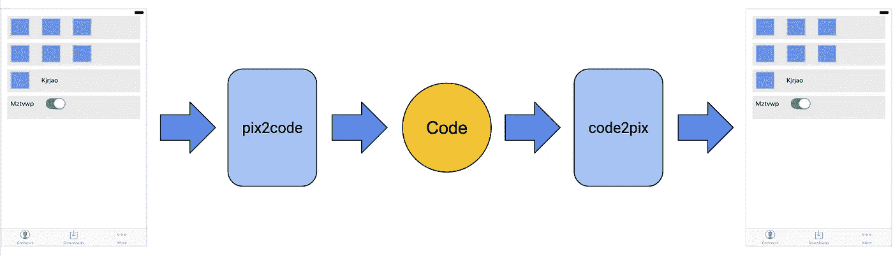

Pix2Code GAN architecture. This is an example of how Code2Pix could be used in conjunction with Pix2Code to improve Pix2Code accuracy in subsequent research.

# 3 —解决代码 2 修复

这是领导这个项目最有趣也是最令人羞愧的部分。我们最初的方法花了我们 2-3 个月的时间来构建和迭代，但是最后一步没有使用我们之前的任何工作。最终的工作模型被证明是一个非常简单，几乎是幼稚的方法。尽管如此，我认为我们的过程值得分享，出于教育目的，以及展示一个有趣的和相对较新的应用程序，使用深度学习进行跨平台用户界面设计。此外，我们相信这个项目是一个很好的例子，简单优雅的解决方案往往比复杂的解决方案表现得更好。

## 方法

把代码变成图片的问题可以分解成三块。首先，我们需要使用 DSL 来捕获用户界面，以降低问题的复杂性，并使使用深度学习系统变得可行。其次，我们将为每个数据集创建一个自动编码器。第三，我们将使用 Code2Pix 模型中自动编码器的解码器部分，将编码空间转换为呈现 GUI 的像素。

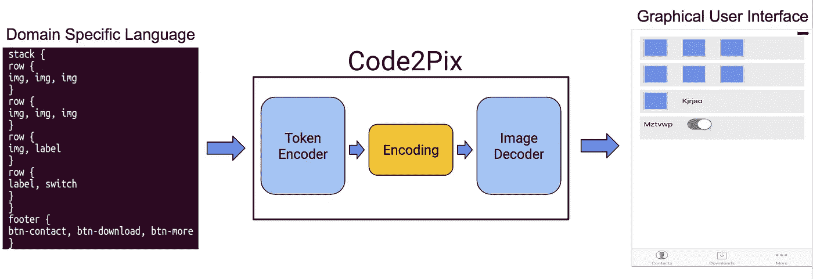

Our approach to building code2pix. Separate the model into two distinct portions. One for handling the textual information, and the other for constructing the GUI. We refer to these respectively as the “token encoder” and the “image decoder.”

幸运的是，Tony 已经创建了一种领域特定语言(在这种情况下，DSL 可以被视为用户界面的伪代码)，可以将[编译](https://github.com/tonybeltramelli/pix2code/tree/master/compiler)为每个数据集的实际代码(即原生 iOS、原生 Android、web HTML/CSS)。Pix2Code 和 Code2Pix 使用相同的领域特定语言，捕捉每个数据集的基本特性。这解决了我们的第一步。如果你想知道这是怎么做到的，[看看这里。](https://github.com/tonybeltramelli/pix2code/tree/master/compiler/assets)

我们的下一步是训练自动编码器，目标是使用自动编码器模型的一部分作为 Code2Pix 中的“图像解码器”。

## 自动编码器

这些是深度学习中的特殊模型，在数据集上训练，作为解决该数据上的任务的先驱。自动编码器学习将数据压缩为低维编码，然后还学习将编码解压缩为原始数据。它们是了解数据重要特征的好方法。编码器部分通常会被导入到其他深度学习架构中，以传输它学习编码的特征。这就是所谓的**迁移学习**。我们对解码器部分特别感兴趣，因为它学习解释抽象的有意义的编码，并将它们转换成用户界面的图片。

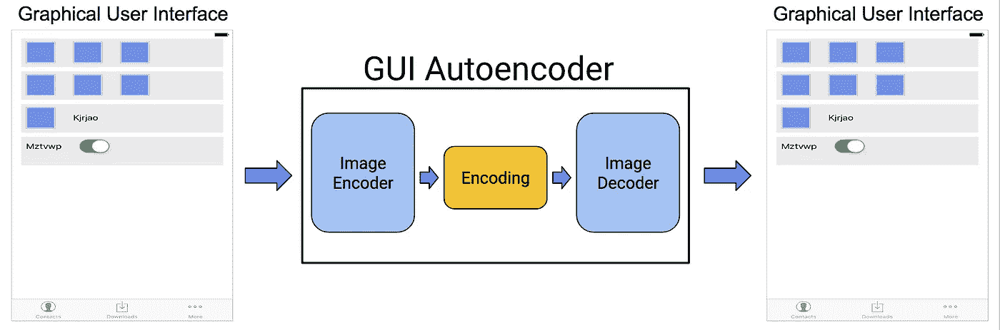

If we train an autoencoder that can compress and decompress GUIs, then we get a free “image decoder” to use in code2pix.

我们尝试了标准的自动编码器架构来解决这一任务，但学到的解码器在解决我们的任务时不是很有用。因此，我们设计了一个新的架构:一个多头模型来同时解决所有三个数据集(Android、iOS 和 Web)的任务。在这个被称为“Hydra”的模型中，解释图像编码的解码器依赖于图像来自的数据集。例如，要通过模型传递 Android 图像，我们将手动选择通过 Android 解码器头来获得最终结果。

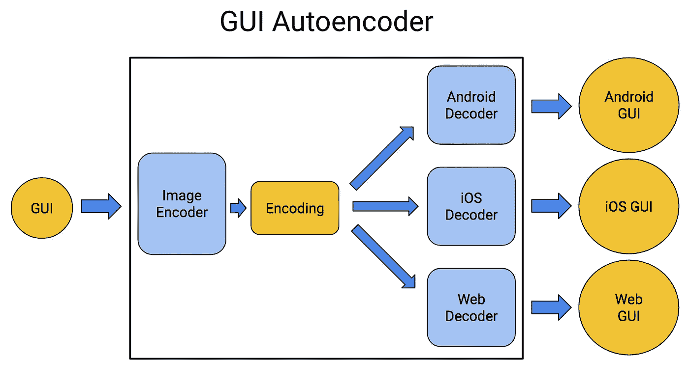

The specific autoencoder design we used shared the same image encoder between all three image decoders. This ended up being a very efficient model, and produced generalizable image decoders.

我们在 Code2Pix 模型设计中使用解码器头。为了查看编码器和解码器头的具体底层架构，我们将读者引向我们的 [Github repo](https://github.com/ngundotra/code2pix) 。

## 走向通用的跨平台用户界面

我们的 Hydra autoencoder 学习了嵌入技术，这使我们相信系统可以编译通用用户界面。根据我们的 autoencoder，下面的图片是 3 张图片在不同平台上的样子。例如，最左边的一栏是 Android GUI 在 iOS 和 Web 上的样子。

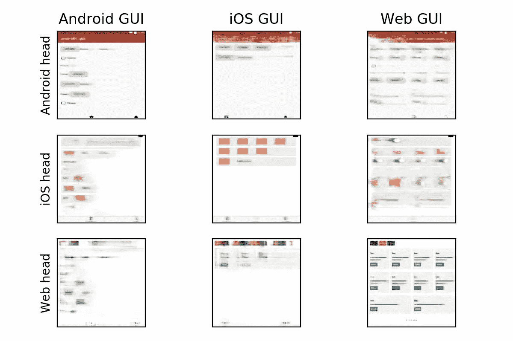

Three different images in three columns being interpreted similarly between each platform. The left column is an Android image, middle is an iOS image, and the right column is a Web image. Each row represents what that image would look like on a different platform.

左右两栏显示出惊人的结构相似度。在左栏中，iOS 头看到的 Android 按钮为橙色框，web 头看到的按钮与绿色按钮相同。在右栏中，我们可以看到 Android 和 iOS head 都捕捉到了 Web GUI 的基本分段结构，使用按钮和滑块的组合来复制 Web 的 div 元素。

每个图像在解释到新平台时仍然保留结构的事实给了人们希望，有一天可能会有一个深度学习编译器，能够在 Android、iOS 和 Web 后端之间无缝翻译用户界面代码。这是一个非常简单、不完善的模型，但是随着时间和经验的增加，它可能会产生更复杂的结果。这些结果表明，由自动编码器学习的编码空间具有足够的结构，在未来的应用中是有用的。

为了验证嵌入空间的结构，我们查询模型以在不同的图像之间进行插值。借鉴著名的[“国王男人+女人=王后”](https://www.technologyreview.com/s/541356/king-man-woman-queen-the-marvelous-mathematics-of-computational-linguistics/) [的论文](http://arxiv.org/abs/1509.01692)，我们做了自己的“用户界面代数”

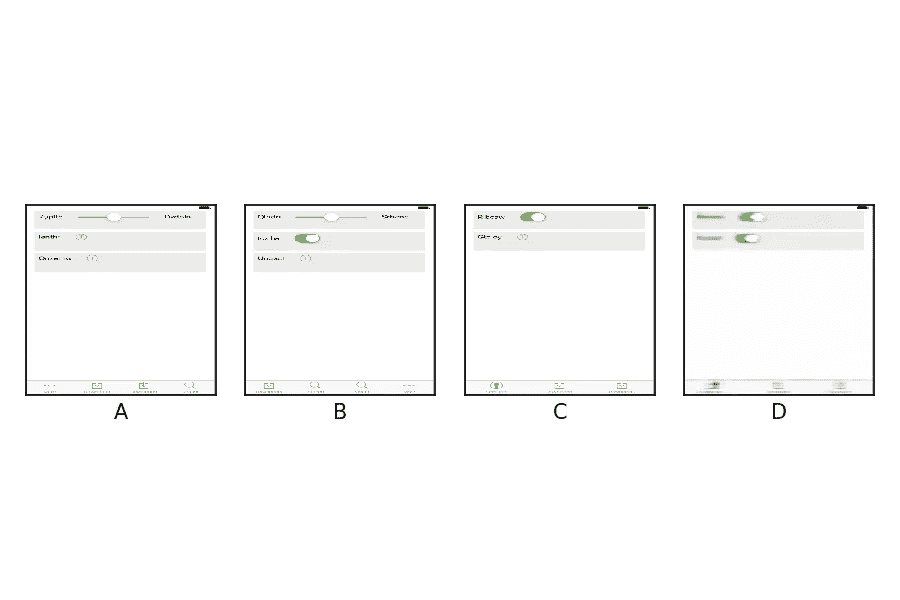

“A is to B as C is to D.” Here we compute B — A + C = D in order to obtain the result above. The main difference between B and A is the toggle in the second row. By adding B — A to C, we can see D now has a button in the second row.

我们注意到，并不是所有的图像组合都像上面的例子一样清晰。然而，这只是更大目标的第一步:真正的用户界面代数和跨 Android、iOS 和 Web 界面工作的 GUI 编译器。

More Eyecandy: Using the Web decoder to translate between two different Web GUIs.

## Code2Pix 模型设计

在分析了自动编码器的编码之后，我们准备进入最后一步。我们希望将模型设计过程构建为一个编码器-解码器的动态过程。必须有一部分模型来解释代码标记，并且它必须与一个模型进行通信，该模型再次将编码解码成实际的图片。

我们一开始试图从 Pix2Code 模型中导入预训练的 LSTMs(深度学习层，非常擅长学习顺序数据)，但这并没有显示出任何前景。然后我们对卷积层进行了实验，最后使用 1D 卷积层对来自特定领域语言的代码标记进行编码。我们通过将序列的每个 DSL 令牌转换为一个 hot 表示来训练我们的模型，然后将它们连接起来以创建一个矩阵，然后我们可以将这个矩阵提供给 Code2Pix 模型。我们将填充序列归零，这样它们都具有相同的长度。

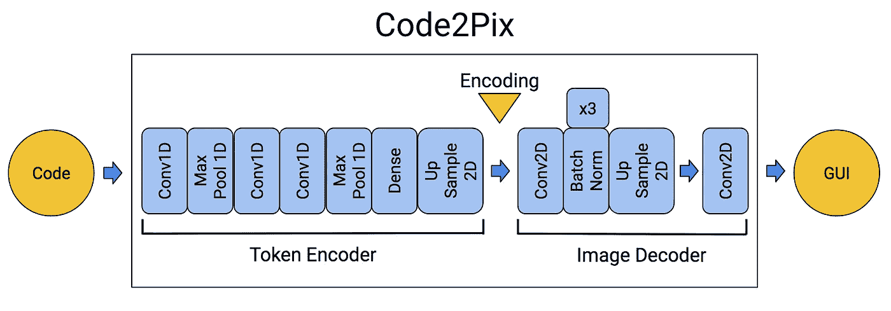

Final architecture for the Code2Pix model.

# 4-代码 2 修复结果

该模型训练速度非常快，并且为所有三个图像产生令人惊讶的干净输出图像。为单个数据集训练 Code2Pix 大约需要 55 个历元，在两个英伟达 GTX 1080 上大约需要 30 分钟。有趣的是，该模型在 iOS 和 Web 数据集上表现同样出色，但难以为 Android 数据集生成细粒度的细节。

这个最终架构的一个令人惊讶的结果是，预训练的图像解码器根本没有帮助训练 Code2Pix 模型。事实上，*在没有预训练重量的情况下训练*模型和*在有预训练重量的情况下训练*一样快。一个自然的结论是，对于这个任务和数据集，这是一个非常稳定的模型架构。下一个假设是，像素到像素问题的编码向量空间实际上不同于文本到像素问题的编码向量空间。因此，在 GUI 到 GUI 问题上使用预先训练的权重并不能为模型提供有价值的信息来更快地学习 DSL 到 GUI 问题。

以下图片是从我们的验证数据集中选择的示例。

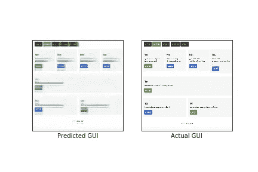

(Web) Corresponding code: header { btn-inactive btn-active btn-inactive btn-inactive btn-inactive } row { quadruple { small-title text btn-green } quadruple { small-title text btn-red } quadruple { small-title text btn-red } quadruple { small-title text btn-orange } } row { single { small-title text btn-green } } row { double { small-title text btn-red } double { small-title text btn-green } }

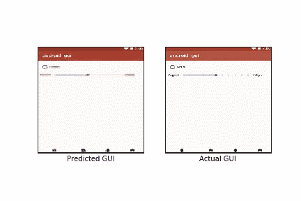

(Android) Corresponding code: stack { row { radio } row { label slider label } } footer { btn-notifications btn-home btn-notifications btn-home }

我们看到这个的时候真的很开心。为这个模型给出的文本描述相对复杂，图片也相对复杂——但是模型抓住了这一点。鉴于 Code2Pix 模型是如此简单，它能够达到如此高的分辨率这一事实是非常令人惊讶的。

Code2Pix 在生成 Android 图像的清晰分辨率图像时遇到了最大的麻烦。Android 图像可能比其他 GUI 有更复杂的细节，比如滑块上的点。

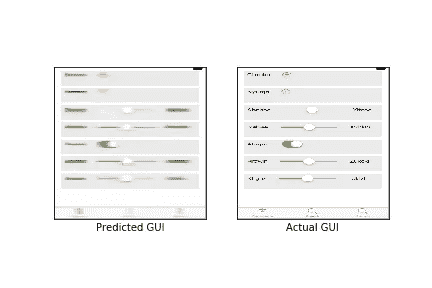

(iOS) Corresponding code: stack { row { label btn-add } row { label btn-add } row { label slider label } row { label slider label } row { label switch } row { label slider label } row { label slider label } } footer { btn-download btn-search btn-search }

iOS 的图像比 Android 的干净得多。此外，iOS Code2Pix 模型能够处理更复杂的文本描述。

# 5 —限制

我们的深度学习渲染器的表达能力受到数据集和领域特定语言的限制。DSL 必须与合成数据集一起手工制作，以扩展深度学习编译器可以支持的 UI 元素的数量和种类。此外，深度学习编译器生成的图像不如真实图像清晰。我认为这与模型学习在一些看起来模糊的 UI 元素上“对冲赌注”有关，比如滑块。有可能这只是一个假象，可以通过一些微调或更多数据来消除。

但问题是，这些实验只是开始。从事这些项目感觉就像学习如何进行化学实验。现在，我们只是把氢和氧结合起来制造水，但是我们还有很长的路要走。我们甚至还没有开始研究火箭燃料。如果说 [Uizard 的演示](https://www.youtube.com/watch?v=VsU5XMQEg1g&ab_channel=tonybeltramelli)向我们展示了什么，那就是未来有太多的东西等待着我们。

# 6-回顾:犯过的错误，吸取的教训

在这个项目中，我们重新认识到了基础知识的重要性。在解决 Code2Pix 的过程中，我们进行了自底向上的开发，构建了最终在最终模型中不一定需要的自动编码器。我们可以从构建 Code2Pix 的基线模型开始。这可以加速我们的模型开发过程。

此外，我个人犯的最大错误是一个技术上的失误。在开发最终的 Code2Pix 模型时，我未能验证数据是否被正确加载。结果是(x，y)对在加载时不匹配。这花费了我们 2-3 周的宝贵模型设计和应用程序优化时间。我学到了什么？对数据管道流程进行单元测试，或使用其他验证流程。例如，我可以只导入 Pix2Code 的数据管道过程。相反，我们的研究代码有 3-4 种不同的数据加载方式，不幸的是只有 2-3 种有效。不要再犯同样的错误。

总的来说，我学到的更重要的经验教训是那些难以表达的软经验教训，它们现在已经融入了我的职业道德。调整我的沟通技巧，减少微观管理，有时不均衡的信任发展，以及控制我在团队会议中的冗长设置。这些都是有趣的课程！

# 承认

非常感谢我在 SUSA 的团队对我的领导能力的信任，以及为此投入的大量工作。感谢 Samyak Parajuli、Luke Dai、Ajay Raj、Aismit Das、Dennis Yang 和 jap jot Singh——感谢你们，与你们一起工作充满了乐趣。

没有 Tony Beltramelli 的大力指导和指导，我们不可能完成这个项目。感谢托尼对我们的指导！

感谢您的阅读！如果您对我们的研究有更多问题，请随时发送电子邮件至`noah.gundotra@berkeley.edu`。如果你有兴趣在 Uizard 工作，看看他们的[职业页面](https://uizard.io/career)！