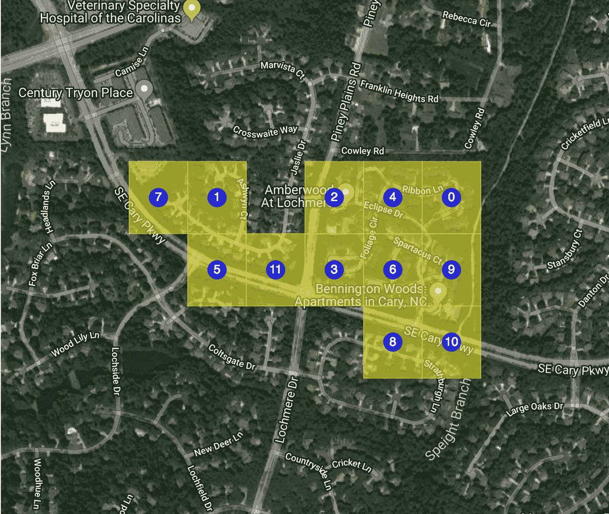

# 整理您的工作流程

> 原文：<https://towardsdatascience.com/codify-your-workflow-377f5f8bf4c3?source=collection_archive---------14----------------------->

## 设计和数据科学

## 从长远来看，对我的工作流程进行编码可以节省时间和精力，但这也要求我首先明确我的工作流程是什么。

**编辑:我最近重构了这篇文章的代码，并将其发布为******python 包。****

**我想我和大多数数据科学家一样，在项目中我倾向于重复做某些事情:我检查某些模式，或者我绘制某些东西，或者我试图理解某些关系。有时是因为我犯了足够多的错误，所以我发现自动防范它是值得的。有时候是因为我发现，就我个人而言，看待问题的某些方式有助于我理解这个问题。在任何情况下，我的任何给定项目的大部分工作流经常看起来非常类似于我以前项目的大部分工作流。毫不奇怪，我发现减少这些重复活动的开销很有用。**

**虽然自从我学会如何编码以来，我已经理解了通过自动化减少开销的价值，但是我从来没有得到多少关于如何做的建议。这只是我得到的一些东西。在这篇文章中，我试图总结我学到的一些东西，并且我将使用我工作流程中最近自动化部分的一些代码作为例子。**

# **逻辑美**

**好的设计建议至少在维特鲁威写了[十本关于建筑的书](https://books.google.com/books?id=wYhAAAAAYAAJ&printsec=frontcover)(仍然值得一读)之后就已经存在了，他在书中说好的设计实现了稳固、有用和愉悦。将前两个理念转化为工作流自动化设计是相对容易的:无论我们构建什么，它都应该以我们需要的规模、速度和质量一致地完成我们希望它做的工作。但是我认为最后一个理想——快乐——通常会决定一个可行的设计和一个好的设计。 [Fred Brooks 认为](https://books.google.com/books?id=0qG4TQi-e-4C&printsec=frontcover)在技术设计的背景下，愉悦应该被认为是“逻辑美”，并且认为 ***一个逻辑美的产品是一个最小化脑力劳动的产品。*****

**我认为最小化脑力劳动是数据科学工作流的一个有趣的目标，因为数据行业最近的许多尴尬似乎都是由从业者没有花费足够的脑力思考他们的设计决策的潜在后果而引起的。 ***所以我们需要仔细选择哪些区域的脑力劳动要最小化*** 。这意味着一个好的设计的第一步是，不管听起来有多老套，决定我们想要完成什么。**

**想想开车吧。我尽可能高效地开车去我要去的地方。一辆设计良好的汽车应该能够让我尽可能地将注意力集中在与实现我的目标最直接相关的事情上。这意味着尽量减少其他事情上的精神负担。换句话说，当我开车时，我应该能够集中精力在正确的地方转弯，避开行人或灯柱之类的东西。我不应该专注于确保发动机运转，或者换挡，或者刹车如何工作。如果我把车用于其他目的，我可能会专注于这些事情，但它们对于完成我选择的特定目的来说并不合适。一个好的设计不应该分散我的注意力，也不应该阻止我去关注那些可能妨碍我实现目标的事情。**

**得体是谈论相关性的一种有点过时的方式。布鲁克斯将设计中的得体定义为“不要引入无关紧要的东西。”我发现根据我在类比中使用的权衡来考虑适当性是很有用的。如果做某件事能确保我不被阻止实现我的目标，那么它对那个目标来说是恰当的。如果做某件事只是为了达到目的，那对这个目的来说是不合适的。如果不能避开行人或灯柱，我将无法到达我想去的地方。如果我乘汽车、步行、滑板、自行车、飞机或火车旅行，那是真的。没有内燃机不一定会阻止我去我想去的地方；因此，这种设计是不合适的，不管它在实现上有多方便。所以在我们定义了我们的目标之后，定义什么是适合这个目标的:作为一个经验法则，如果它能让我们前进，它可能是也可能不是合适的；如果能阻止我们前进，那就是正当的。 ***好的设计能最大限度地减少不符合我们预期目的的任务所耗费的脑力*** *。***

***正交性*是逻辑美的另一个组成部分。布鲁克斯对此总结为“不要把独立的东西联系起来”。换句话说:我避开行人和灯柱的能力部分取决于能否看到这些东西，部分取决于能否操纵汽车避开它们。挡风玻璃的功能和方向盘的功能应该相互独立。一个不能保持独立性的设计将是一个糟糕的设计。因此，在我们定义了工作流的适当组件之后，我们将依赖性最小化。 ***好的设计会将合适的组件与不合适的组件分开，这样我们就不会不小心将花费在真正需要我们全神贯注的事情上的精力减到最少。同样，好的设计让不合适的组件相互隔离，这样我们就不会意外地以我们没有预料到的方式减少脑力劳动。*****

**通用性是我在继续讲这个例子之前要讲的最后一个原则。布鲁克斯将其总结为“不要限制固有的东西。”换句话说，轮胎(或引擎或电线等。如果没有一个很好的理由，就不应该设计成只适合那辆车。 ***好的设计在限制一个功能可以应用的用例之前需要一个理由。*** 这使得我们更容易适应意料之外的需求，而无需重新构建整个产品。**

**所以，总结一下:**

1.  **决定我们想要达到什么目的。**
2.  **确定哪些任务适合完成该目的。**
3.  **通过将适当的任务与不适当的任务分开，以及将不适当的任务彼此分开，来最小化依赖性。**
4.  **在保持适当性或正交性的同时，尽可能将每个任务规划为通用的。**

**遵循上述原则的设计往往在逻辑上是美丽的，因为它们在所有正确的地方最小化了我们的精神努力。**

# **工作流设计的一个极简例子**

**我经常处理地理位置数据，并且经常需要绘制这些数据。有时我需要绘制形状，有时我需要点。有时我需要在卫星图像的背景下看到这些物体，以获得一些粗略的背景，有时我需要道路或标签的更详细的背景。我通常不得不一周几次使用这种工作流程。有时候我一天要经历上百次。无论如何，我必须经常这样做，这是减少脑力劳动的好方法。所以我只有一个目的:在一张图片上用图形表示经度和纬度对，这张图片表示这些坐标的真实环境。这个目的定义了适当性:任何实际上没有在图片上放置形状的东西对我的目的来说都是不适当的，因此花费在那件事情上的精神努力应该被最小化。就目前的例子而言，界定目的和正当性相对容易。情况并非总是如此。**

**现在我需要担心正交性。想象一下，和一个完全没有技术专长的人说话。我通常会想象，要么是我最早的一位经理将所有涉及代码的事情都描述为“新奇”,要么是我母亲仍然拒绝得到电子邮件地址，要么是一名主修人文学科的大学新生。你明白了。我的任务创造了一系列问题，我想象中的新手会认为这些问题对于创造我想要的结果是必要的和充分的。如果我想象中的新手可以说“但是你为什么需要 X 的答案？”，这意味着我包含了一个不必要的问题。如果我想象中的新手可以说“但是我不明白 X，Y，Z 的答案将如何导致结果”，那意味着我要么错过了一个问题，要么没有问对问题。我喜欢用一个虚构的新手作为共鸣板的原因是，当我试图设计所有东西时，我往往会变得太专业太快。因为我知道如何实现事情，所以我的大脑比它应该做的更快地跳到实现问题上。如果你有一个真正有血有肉的新手愿意并且能够成为你的传声筒，那就用那个人，而不是一个想象出来的人。**

**如果我的目标是在图片上得到形状，那么我只有三个问题:**

*   **我在哪里得到形状？**
*   **我在哪里得到照片？**
*   **我如何得到图片上的形状？**

**很基本的问题，对吧？但是这些基本问题迫使我从基本构件的角度来思考，这使得保持正交性变得更加容易。如果我最终构建的任何东西的运行方式是，在不改变我如何将这些形状放在图片上的情况下，我无法改变我如何获得这些形状，那么我可能构建的东西是错误的。功能的不同部分应该尽可能的独立。**

**现在我有了正交分量，我想让它们尽可能通用。为此，我需要用例。在我需要做的三件事情中，我已经偏向于偏好的方式，但是从长远来看，如果我能想出尽可能多的方式——偏好的或不偏好的——我会更好。我可能不会实现对我列出的所有用例的支持:这将取决于项目的约束(主要是我有多少时间、多少资源和多少竞争优先级)。最好还是预先知道尽可能多的用例——通常，在实现对关键用例的支持的过程中，支持额外的、还不需要的用例只是理所当然的事情。这可以减少沮丧和路上浪费的时间。以下是当前示例的一些用例:**

**我从哪里得到这些形状？**

*   **[经度/纬度对](https://en.wikipedia.org/wiki/Geographic_coordinate_system)**
*   **[知名正文](https://en.wikipedia.org/wiki/Well-known_text)**
*   **[匀称的物体](https://shapely.readthedocs.io/en/latest/)**
*   **[地理哈希](https://en.wikipedia.org/wiki/Geohash)**

****从哪里获取图片？****

*   **[谷歌地图](https://developers.google.com/maps/)**
*   **[网络地图切片服务](https://en.wikipedia.org/wiki/Web_Map_Tile_Service)**

**我如何得到图片上的形状？**

*   **[散景](https://bokeh.pydata.org/en/latest/)**
*   **[地理视图](http://geo.holoviews.org/) / [全息视图](http://holoviews.org/)**
*   **[Matplotlib](https://matplotlib.org/)**
*   **[leaf . js](http://leafletjs.com/)(通过[叶](http://folium.readthedocs.io/en/latest/))**

**当然，这个列表并不详尽。如果我有更多的时间来考虑，我可以建立一个更完整的清单，可能会更好。但是由于我的时间有限，还有其他事情要做，我很满足于每个问题至少有两个答案。我真正想做的是避免只关注眼前需求的短视行为。**

# **从设计到实施**

**您可以跳到这一节的底部来查看我实现的完整代码，但是先通读一下这个讨论来理解我做了什么可能会有所帮助。**

**我选择完全依靠散景库来绘制图片上的形状，因为我已经知道并喜欢这个库——它很容易快速启动并运行。同样，我选择完全依靠谷歌地图来获取图片，因为它为卫星图像、地图和这两种东西的注释版本提供了单一来源，还因为 Bokeh 已经提供了一种调用谷歌地图 API 的便捷方式。**

**我很少在工作流程的这些部分上花费精力，因为精心制作可视化的外观和感觉——选择背景图像，决定绘制什么形状，以及设计和注释这些形状——都符合我的目的，所以我想尽可能地保持对这些事情的细粒度控制。**

**我实现的 Python 类有一个“prepare_plot”方法，它在很大程度上只接受传递给该方法实例化的 Bokeh“gmapplot”对象的可选关键字参数:**

**该类还有一个“add_layer”方法，用于在图片上放置形状:**

**这个方法调用只有两个必需的参数。一个是标签，告诉该方法该形状应该引用什么数据源(同样，稍后会详细介绍)。另一个是散景模型——我最常用的两个模型是“面片”,用于绘制多边形，和“圆”,用于绘制坐标对。有一个可选的“工具提示”参数，它采用一个字符串或一个元组列表来[创建当鼠标悬停在一个形状上时应该出现的工具提示](https://bokeh.pydata.org/en/latest/docs/user_guide/tools.html#hovertool)。所有其他关键字参数都被传递给散景模型，这让我可以更好地控制形状的外观。大多数散景模型允许形状的边框和区域采用不同的样式。例如，如果我想要一个带有黑色边框的红点，我会将“填充颜色”设置为红色，将“线条颜色”设置为黑色。同样，如果我想填充 50%透明，但边框是 0%透明，我会设置'填充阿尔法'为 0.5 和'线阿尔法'为 1.0。通常，我希望填充和线条的样式相同，所以“add_layer”方法接受额外的关键字。如果我将‘alpha’设置为 0.5，那么‘fill _ alpha’和‘line _ alpha’都将被设置为 0.5。这是脑力劳动的一个小小的减少，但这种减少足以方便。**

**然而，我所做的大部分脑力劳动都与准备绘图数据有关。我提到的获取形状的所有四个用例——经度/纬度对、知名文本、shapely 对象和 geo hashes——是我在日常工作中经常遇到的用例。我发现我研究数据的很多时间并没有花在真正理解情节上，而是花在将数据转换成我需要的格式上。当我不得不在分析过程中中途切换数据源类型时，我尤其会产生大量开销(例如，我可能设置了一个工作流来绘制地理坐标对，然后突然发现我需要绘制地理散列；这要求我重组我的部分工作流程)。**

**“添加源”方法需要数据和标签:**

**数据可以是包含我提到的四种输入值之一的列表，也可以是一个数据帧，其中一列包含这些输入值(并且必须明确指定该列)。该方法执行四个基本功能:**

*   **它调用` _process_input_value `,自动验证输入类型(geohash vs. coordinate pair 等。)并将其格式化为一个 x 坐标列表和一个 y 坐标列表。在众所周知的文本或表示多重多边形或一些其他多重几何图形集合的有形状的对象的情况下，它将格式化列表的列表。` _process_input_value '方法作为一个切换面板，完全消除了适当格式化输入值的开销，假设值是受支持的类型之一。**
*   **它向输入值追加元数据。在数据帧输入的情况下，不包含输入值的数据帧的每一列都将被用作元数据。在列表输入的情况下，任何关键字参数都将被用作元数据(假设参数是与输入值列表长度相同的列表。**
*   **它扩展了源数据帧以适应多种形状。如果输入值类似于一个多面，它会将其分割成单独的面，并将多面的元数据追加到每个单独的面。这类似于 SQL 中分解数组的概念。**
*   **完成上述所有处理后，它调用` _set_coordinate_bounds `,更新绘图边界(最小和最大 x 和 y 值)。确定谷歌地图缩放级别时会参考这些界限。**

**这个类还做了很多其他的事情，但是在大多数情况下，这个类本身的结构只不过是我的工作流程的三个关键部分的实例化:获取形状，获取图片，将形状放到图片上。因为我使用一些合理的设计原则(目的→适当性→正交性→一般性)来编写工作流，所以扩展该类以适应新的需求相对容易。例如，我想扩展这个类来使用 WMTS 地图而不是谷歌地图。由于该类的设计方式，我可以或多或少地只对“prepare_plot”方法进行修改，而不做其他任何事情。如果我想使用传单或 Matplotlib 或其他东西来渲染情节，这将需要一些更广泛的更新，但效果仍然不会波及整个代码库。**

**然而，最大的好处不在于我如何编写代码，而在于我是否编写了任何代码。是的，从长远来看，对我的工作流程进行编码可以节省时间和精力，但是 ***它也要求我首先明确我的工作流程是什么*** 。在编写这段代码的过程中，我发现了工作流中让我不开心的几件事。例如，当我想要绘制多边形而不是点(或点而不是多边形)时，我讨厌花费大量时间来管理数据，所以我将“add_source”方法更改为始终假定多边形，并将“add_layer”方法更改为每当使用假定点数据但引用包含多边形数据的数据源的散景模型时自动计算质心并更新数据源。我在没有意识到的情况下，将关于数据的多边形与点结构的假设融入到了工作流中。通过整理我的工作流程，我认识到了这个假设，决定不喜欢它，并删除了它。**

**整理我的工作流程会让我的工作流程更好，而让我的工作流程更好会让我成为更好的程序员。在明确考虑代码和工作流的设计时，我让旧的工作更容易用于新的问题，并与同事分享我的工作。**

# **代码**

**我想不言而喻，这段代码并不是我之前概述的设计原则的完美体现。设计是一个方向，而不是终点。我痛苦地意识到代码有多少需要改进的地方！**