# 初学者的深度学习编码——线性回归(第三部分):梯度下降训练

> 原文：<https://towardsdatascience.com/coding-deep-learning-for-beginners-linear-regression-gradient-descent-fcd5e0fc077d?source=collection_archive---------6----------------------->

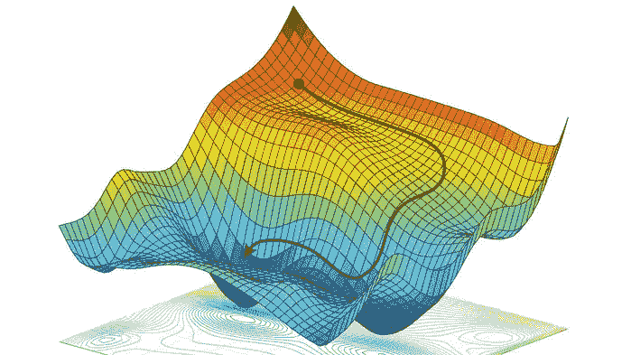

Source: [https://reconsider.news/2018/05/09/ai-researchers-allege-machine-learning-alchemy/](https://reconsider.news/2018/05/09/ai-researchers-allege-machine-learning-alchemy/)

这是系列“**初学者深度学习编码**”的第 5 篇文章。你可以在这里找到所有文章、*的*链接，以及第一篇文章* *底部关于下一篇文章* [*预计发布日期的一般信息。*它们也可以在我的](https://medium.com/@krzyk.kamil/coding-deep-learning-for-beginners-start-a84da8cb5044)[开源文件夹— **MyRoadToAI**](https://github.com/FisherKK/F1sherKK-MyRoadToAI) 中找到，还有一些迷你项目、演示、教程和链接。*

# 目标

在本文中，我将**解释用梯度下降**训练机器学习算法的概念。大多数监督算法都在利用它——尤其是所有的神经网络。这是一个至关重要的话题，也是开始机器学习的人需要克服的最大障碍之一。这是因为它是基于微积分的**，有些人在学校没有学过，或者他们的知识生锈了。**

但是不要担心，即使你对数学不熟悉或者根本不懂微积分，你仍然可以理解它，学习它，并使用它。我会告诉你怎么做！

# 靠蛮力训练

由于上一篇文章中介绍的成本函数，已经可以训练模型来预测克拉科夫公寓的价格。**模型只使用了公寓的尺寸**，所以它的形式并不太复杂:

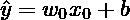

其中:

*   *ŷ* —预测房价，
*   *x*—户型，
*   *w* —分配给公寓大小的重量，
*   *b* —偏置。

下标“0”代表特征在数据集 *X* 的每个矢量中的位置，为了提高可读性，省略了该下标。

训练过程的目标是**找到 *w* 和 *b* 参数的组合，为此成本函数返回尽可能小的误差**。

为了提高模型性能，会做一些非常幼稚的事情。在许多**迭代**中，参数将通过一个小的固定**步长**改变，并且不知道参数值是否应该改变以及在哪个**方向**上改变。因此，将计算所有可能组合的成本值，以找到最佳修改，这就是为什么它被称为“暴力训练”**在每次训练迭代中，可以对参数执行三个动作**:**增加、减少、不变。**有**两个参数**，这意味着每次迭代将有 **3 = 9 组参数来检查**，并对其进行预测，计算成本。模型将使用成本最低的设置进行更新。

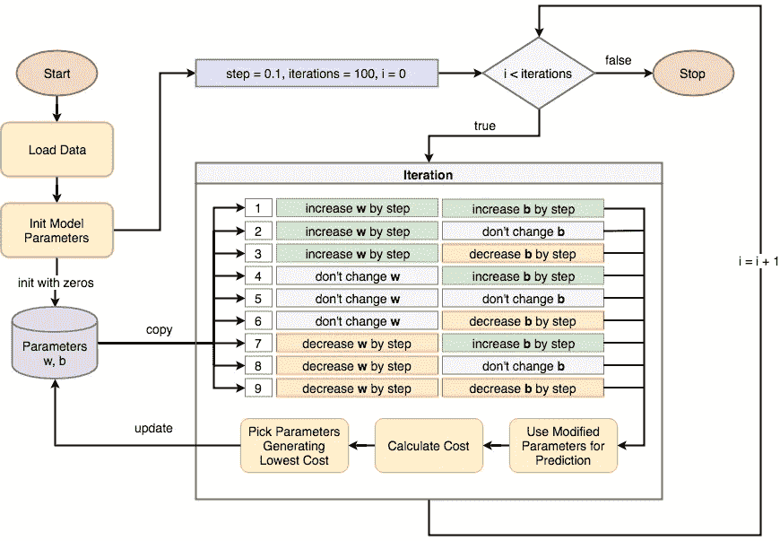

Training with Brute Force — diagram showing how to train model with two parameters (w and b) without using Gradient Descent algorithm.

让我们实现它，看看结果。大多数操作已经在上一篇文章中编码了，因此只剩下训练循环需要实现。

Full code available under this [link](https://gist.github.com/FisherKK/7c19abce0bab8c2a90384f632cc71c52#file-a5_brute_force_training_full-py).

只有两个参数，代码已经足够复杂，可以省略一些部分来提高可读性。隐藏部分的实现与图中所示非常相似——唯一的区别是数学运算符从`+=`变为`-=`,或者有时根本不使用。

代码片段以从`copy`模块导入`deepcopy`函数开始。需要复制存储在`model_parameters`字典中的模型参数及其内容。在任何训练发生之前，函数`predict`和`mse`使用`model_parameters`通过计算其初始误差来测量模型的潜力。

然后`model_parameters`被复制九次。每个副本都以不同的方式(加法、减法、无变化)被`step`值修改，然后用于预测。根据`candidate_pred`的正确性，副本具有作为`candidate_error`变量分配给它的成本值。误差和参数存储在`candidates`和`errors`列表中。在计算了每个候选项并测量了它们的性能后，使用成本最低的一组参数来代替`model_parameters`。它发生`iterations`次，默认设置为 100。请注意，函数`train`没有返回任何结果，并且`model_parameters`被就地修改。

在所有这些之后，可以对加载的数据和初始化的模型参数使用`train`函数，以便找到将误差最小化的值:

可以将简单的`print`函数添加到`train`函数体中，并显示训练过程如何改变模型参数(如果您以前没有这样做，请查看此[链接](https://gist.github.com/FisherKK/7c19abce0bab8c2a90384f632cc71c52#file-a5_brute_force_training_full-py)以获得完整代码):

```
Initial state:
 - error: [75870.4884482]
 - parameters: {'w': array([0.]), 'b': 0.0}

Iteration 0:
 - error: [73814.2609893]
 - parameters: {'w': array([0.1]), 'b': 0.1}

Iteration 20:
 - error: [38764.28631114]
 - parameters: {'w': array([2.1]), 'b': 2.1}

Iteration 40:
 - error: [15284.92972772]
 - parameters: {'w': array([4.1]), 'b': 4.1}

Iteration 60:
 - error: [3376.19123904]
 - parameters: {'w': array([6.1]), 'b': 6.1}

Iteration 80:
 - error: [1753.32046443]
 - parameters: {'w': array([7.1]), 'b': 8.1}

Final state:
 - error: [1741.85716443]
 - parameters: {'w': array([7.1]), 'b': 10.0}
```

**误差随着每次迭代而减小。**这是因为所有的训练样本都在每次迭代中使用——但是在以后的文章中会有更多的介绍。另一个重要的观察结果是训练结束后**误差值不等于零。**仅仅用线性函数是不可能遍历所有的点的。

最后，可以显示训练的结果，并查看模型如何能够估算公寓价格:

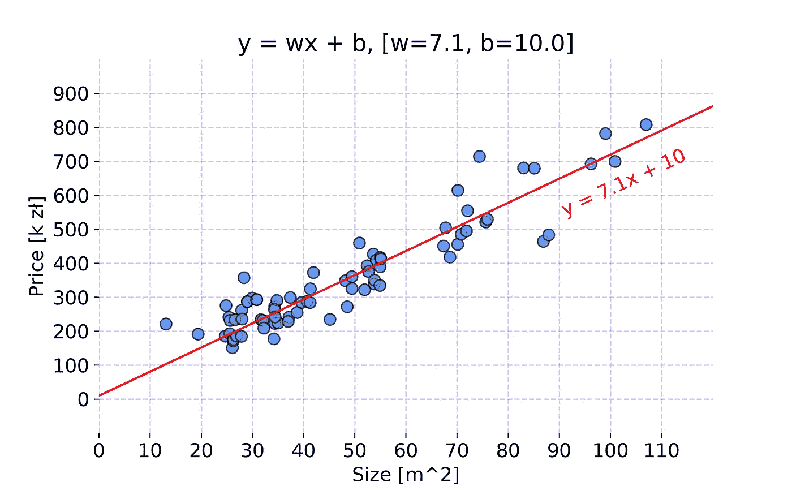

Model projection after training. Code used to create the chart is available [here](https://gist.github.com/FisherKK/55e4a1d52df1951fdb2ba4a7ba89ffa2).

## 结论

训练这样一个简单的模型并找到可以在给定数据上表现良好的参数，不需要任何复杂的技术。但是**目前的方法有很多局限性**:

*   一大堆**样板代码**。
*   **在每次迭代中需要测试太多的组合。这个模型只使用了两个参数。想象一下在像神经网络这样的模型中会发生什么，其中参数的数量有时以百万计——3⁰⁰⁰⁰⁰⁰不是一个好数字…**
*   **改变参数的步骤**对于每个参数是固定的**。**其值的范围也是未知的，**有时 0.1 可能太大，有时可能太小。**
*   **每个参数应该改变的方向是未知的，**这就是为什么必须尝试所有可能的改变。它需要大量的计算能力，并且非常慢。

# 衍生工具的作用

矛盾的是，当涉及到重用已经发明的涉及梯度下降的机器学习概念时，理解**哪些导数可以用于比能够计算它**更重要。 [Andrew Trask](https://twitter.com/iamtrask?ref_src=twsrc%5Egoogle%7Ctwcamp%5Eserp%7Ctwgr%5Eauthor) 在他的书[“探索深度学习”](https://www.manning.com/books/grokking-deep-learning)中提供了非常好的关于什么是衍生品以及它如何运作的直觉。本文的解释将使用类似的推理。

## 直觉

想象有两根杆子伸出墙外。让我们将它们命名为杆 A 和杆 b。杆 A 比杆 b 短两倍。为了了解杆之间的关系，进行了两个实验:

*   首先，杆 A 被推入墙中。可以观察到的是，木棒 B 的长度随着木棒 A 一起缩短，但是缩短了两倍。
*   其次，杆 A 被拉出墙壁，其长度增加。结果，杆 B 也伸长了，但速度快了两倍。

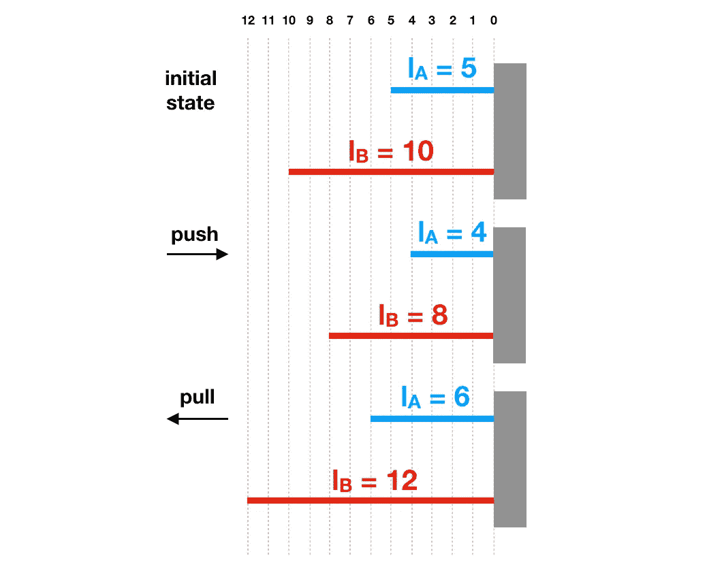

现在让我们试着**用数学方程的形式描述两杆之间的关系。**在两种情况下，都可以观察到杆 B 的长度总是杆 A 的两倍:

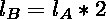

其中:

*   *l_A* —杆 A 的长度，
*   *l_B* —杆 B 的长度

稍等片刻，想想**数字 2 在这个等式中的作用。**是 *l_B* 相对于 *l_A* 的导数，可以写成:

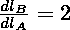

从中可以学到什么？

*   **导数描述了一个变量被修改时，另一个变量是如何变化的。**那么在这种情况下，当杆 A 的长度被修改时，杆 B 的长度以什么因子延伸或收缩。
*   **计算两个变量之间的导数。**
*   **当导数为正值时，两个值的变化方向相同。如果杆 A 延伸，那么杆 B 也延伸，因为 2 是正数。反之亦然，**如果导数为负值，则值向相反方向变化。****

请记住:

> 对于可微函数，有可能找到两个变量之间的关系——当一个变量通过使用导数被修改时，一个变量改变了多少以及在什么方向上改变。

考虑到之前关于“暴力学习”的问题，导数有一些有趣的性质可以用来解决这些问题。

# **梯度下降**

求 [**凸函数**](https://en.wikipedia.org/wiki/Convex_function) **最小值的一种迭代优化**算法。**它基于微积分— **依赖于一阶导数**的性质来寻找在什么**方向**和用什么**幅度系数来修改函数。****

在之前的文章中提到，用于测量机器学习模型性能的**成本函数**需要是可微分的。如果不是这种情况，那么梯度下降算法不能应用。

让我们以均方误差函数为例，它被广泛用作回归模型的成本函数。


*   i —样品指数，
*   ŷ —预测值，
*   y —期望值，
*   m —数据集中的样本数量。

预测值 *ŷ* 可以用公寓价格近似模型的公式代替。让我们也稍微调整一下使用的命名法，如**用大写字母 *J*** *来命名机器学习模型的错误非常流行。*

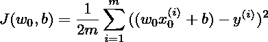

现在很容易看出**误差值取决于 *w* 和 *b* 系数**。参数 ***m* ， *x* ， *y* 可以被视为常量，其值是已知的，并由训练模型的数据集**确定。

已经说过，计算任何两个函数参数之间的导数是可能的，并且它将提供当一个参数改变时另一个参数改变的信息。 *J 的派生结果:*

*   关于参数 *w* 提供了如何调整参数 *w* 的值以最小化或最大化 *J、*的值的信息

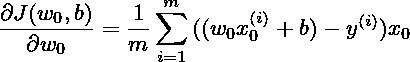

*   关于参数 *b* 提供了如何调整参数 *b* 的值以最小化或最大化 *J.* 的值的信息

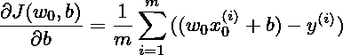

**如果模型有更多的参数，那么需要计算更多的导数。这就是微积分派上用场的时刻。在大多数情况下，使用梯度下降算法不需要数学。**机器学习、详细计算或代码实现中使用的各种函数的衍生物** [**在 web**](https://en.wikipedia.org/wiki/Activation_function) **中全局呈现。****

首先，在网上查找答案是很好的。使用微积分的能力肯定会导致更好地理解各种机器学习机制是如何工作的。它还将提供检查其他人的代码的能力。

如果你想知道这两个导数是如何计算出来的，那么试试这篇博文或者看看伊恩·古德菲勒的书《深度学习》的第 106 页(T2)。

## 几何解释

可以考虑在给定点处曲线切线的**斜率的导数。“梯度”一词的同义词是“坡度”**

模型参数值通常在开始时是随机的。它们的值**在**误差曲线**(对于一个参数的模型)**误差曲面**(对于两个参数的模型)或**误差超平面**(对于两个以上的参数)上强加点**的位置。梯度下降算法的目标是**找到参数值，因此该点总是出现在最低区域**，因为那里的误差值最低。

以下是展示单参数模型如何根据随机生成的数据进行迭代改进的可视化效果。有两种情况:

*   随机化的权重值太小，需要增加，

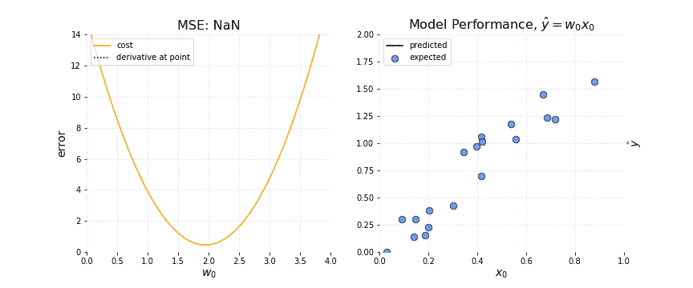

*   随机权重值太大，需要减小。


有一些重要的观察结果:

*   请注意，**权重值太小，则导数为负**，而**权重值太大，则导数为正**。因此，**为了最小化误差函数，需要从权重中减去导数，以使该点更接近全局最小值**。如果加上导数，误差反而会增加。
*   **随着权重更新使误差值更接近全局最小值，导数值正在减少**。从几何角度来看，这也是正确的，因为切线的**“斜率”也随着每次迭代变得不那么陡**。
*   点与点之间的距离称为**梯度步长**。请注意，导数值远大于 x 轴上的重量值。如果第一个陈述为真，从重量中减去导数值不会以如此小的数字改变重量值。这是因为**当使用梯度下降更新参数时，只需要使用导数的很小一部分来保持数值稳定性，并且不会跳过全局最小值**。应该使用导数的哪一部分或者梯度步长应该有多大由**学习速率**超参数决定。

当学习率太大时，数值开始从曲线反弹，误差无限增加:


如果模型依赖于两个参数而不是一个参数，那么为了显示误差值，需要额外的轴(用于附加参数)。这自动将可视化从 2D 平面带到 3D 表面。下面是在网上找到的一个很好的例子，说明这种错误表面可能是什么样子:

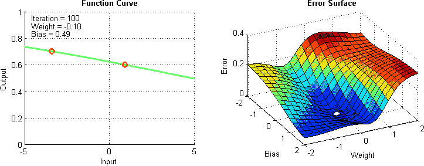

Source: [https://towardsdatascience.com/improving-vanilla-gradient-descent-f9d91031ab1d](/improving-vanilla-gradient-descent-f9d91031ab1d)

对于两个以上的参数，可视化是非常困难和棘手的。通常，依靠诸如 [PCA](https://en.wikipedia.org/wiki/Principal_component_analysis) 等降维方法是很重要的。幸运的是，数学与此非常相似，可以扩展到任意数量的参数。

## 更新规则

为了更新模型参数，从而实现**收敛**，必须迭代应用以下数学公式:

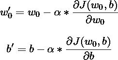

其中:

*   w’—新重量值，
*   b’—新偏差值，
*   w —当前重量值，
*   b —电流偏置值，
*   α —学习率，
*   dJ(w_0，b)/dw_0—J 关于 w _ 0 的导数，
*   dJ(w0，b)/db—J 相对于 b 的导数。

应该更新参数，直到成本函数值不再降低，并且如果当前模型状态已经令人满意，则可以停止整个过程。

## **实施**

让我们编写使用**梯度下降**算法的新`train`函数:

由于仅使用特定点的导数值`0.0005`,参数变化很小。它接管`20000`迭代以获得好的结果。如果输入数据事先经过[标准化](https://en.wikipedia.org/wiki/Normalization_(statistics))，则整个过程可以加速。

在每次迭代期间，计算每个数据样本的部分梯度，并对整个数据集求和。此后，累积的梯度被平均并用于在**梯度步骤**结束时更新参数(参数被更新的迭代)。

现在新的`train`功能可以像以前一样使用**:**

这产生以下结果:

```
Initial state:
 - error: [75870.4884482]
 - parameters: {'w': array([0.]), 'b': 0.0}

Iteration 0:
 - error: [13536.3070032]
 - parameters: {'w': array([10.17501967]), 'b': array([0.17843399])}

Iteration 4000:
 - error: [1737.28457739]
 - parameters: {'w': array([7.09101188]), 'b': array([10.96966037])}

Iteration 8000:
 - error: [1707.33242182]
 - parameters: {'w': array([6.9583785]), 'b': array([18.67110985])}

Iteration 12000:
 - error: [1692.21685452]
 - parameters: {'w': array([6.86415678]), 'b': array([24.14215949])}

Iteration 16000:
 - error: [1684.5886765]
 - parameters: {'w': array([6.79722241]), 'b': array([28.02875048])}

Final state:
 - error: [1680.73973307]
 - parameters: {'w': array([6.74968272]), 'b': array([30.78917543])}
```

比较这两种训练方法没有意义。蛮力训练的主要问题是效率低下。**在梯度下降算法的情况下，模型迭代地达到收敛** **，不需要检查所有可能的修改。在处理复杂的问题——高维数据时，这将带来巨大的不同。**

最后让我们看看模型投影:

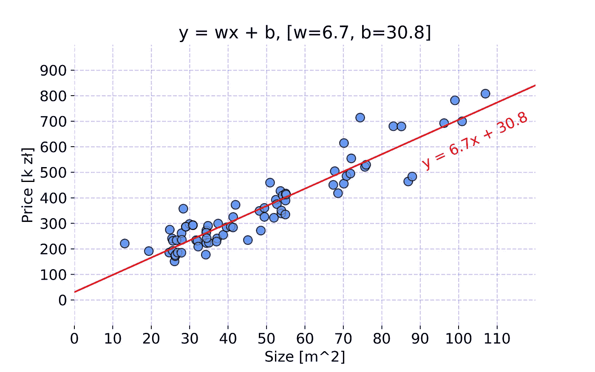

Model projection after training. Code used to create the chart is available [here](https://gist.github.com/FisherKK/ff1489616c25f2295c594040dd9212c3).

# 摘要

我们非常接近创建我们的第一个机器学习模型——线性回归，用 Python 从头开始编写，能够预测克拉科夫公寓的价格。利用已经提供的知识，你可以自己创造最终的解决方案！

在本文中，我已经向您展示了**训练循环如何工作**以及**如何使用成本函数**来找到模型的最佳参数。然后指出了现有方法的诸多缺点。在下一部分，我们解释了**什么是导数，以及它在**中的用途。我已经从理论、数值和几何角度告诉过你什么是**梯度下降算法，**使用均方误差函数示例作为解释的帮助。最后，我已经把解释过的概念变成了代码，并用它来训练我们的模型的单一特征——公寓大小。

我们现在缺的是… **泛化**。所有的概念和代码片段都是针对一维数据的简单问题而提出的。这种简化当然是有意的。在下一篇文章中，**,我将向你展示如何重构所有这些概念，使它们适用于任何数量的特性，并且永远不需要再次编辑！**通过矩阵乘法可以实现，整个过程称为**向量化**。

# 下一篇文章

期待下一篇**2018 年 8 月 30 日左右**。