# 初学者的编码深度学习—线性回归(第一部分):初始化和预测

> 原文：<https://towardsdatascience.com/coding-deep-learning-for-beginners-linear-regression-part-1-initialization-and-prediction-7a84070b01c8?source=collection_archive---------2----------------------->

这是“**初学者深度学习编码**”系列的第 3 篇文章。在这里，你可以在第一篇文章 *的底部找到所有文章*、*议程的*链接，以及关于下一篇文章* [*预计发布日期的一般信息。*它们也可以在我的](https://medium.com/@krzyk.kamil/coding-deep-learning-for-beginners-start-a84da8cb5044)[开源文件夹— **MyRoadToAI**](https://github.com/FisherKK/F1sherKK-MyRoadToAI) 中找到，还有一些迷你项目、演示、教程和链接。*

你也可以[在我的个人网站](https://kamilkrzyk.com/article/coding_deep_learning_series/2018/08/01/coding-deep-learning-for-begginers-linear-regression-initialization-and-prediction)上阅读这篇文章，为了提高可读性(支持代码语法高亮、LaTeX 方程式等等)，我的个人网站由 [Jekyll](https://jekyllrb.com/) 主办。

# 为什么是线性回归？

你们中的一些人可能想知道，为什么关于解释和编码神经网络的系列文章是从**基本机器学习算法**开始的，比如线性回归。从那里入手是很有道理的。首先，它是一个非常简单的算法，因此读者可以掌握对基本机器学习概念的**理解，例如*监督学习*、*成本函数*和*梯度下降*。此外，在学习线性回归之后，理解逻辑回归算法是非常容易的，不管你信不信，可以将它归类为小型神经网络。在接下来的几篇文章中，您将会看到所有这些，甚至更多！**

# 工具

让我们介绍一下**最流行的库**，它们可以在每一个基于 Python 的机器学习或数据科学相关项目中找到。

*   [NumPy](http://www.numpy.org/) —一个科学计算库，非常适合多变量微积分&线性代数。提供 [ndarray](https://docs.scipy.org/doc/numpy-1.14.0/reference/generated/numpy.ndarray.html) 类，可与 **Python 列表进行比较，可被视为矢量或矩阵**。
*   [Matplotlib](https://matplotlib.org/)—**数据可视化工具包**，允许创建各种 2d 和 3d 图形。
*   [熊猫](https://pandas.pydata.org/)—这个库是 Matplotlib 和 NumPy 库的包装器。它提供了[数据帧](https://pandas.pydata.org/pandas-docs/stable/generated/pandas.DataFrame.html)类。它**将 NumPy 矩阵视为表**，允许通过附加的名称访问行和列。在**数据加载、保存、争论和探索过程**中非常有帮助。提供一个功能接口，使部署更快。

使用 [Python PyPi](https://pypi.org/project/pip/) 可以单独安装每个库。它们将以下列别名导入到每篇文章的代码中。

# 什么是线性回归？

这是一个**监督学习算法**，其目标是**基于给定的数据输入**预测连续的数值。从几何角度来看，每个数据样本都是一个点。线性回归试图**找到线性函数**的参数，因此**所有点与直线之间的距离尽可能小**。用于参数更新的算法称为**梯度下降**。

Training of Linear Regression model. The left graph displays the change of linear function parameters over time. The plot on the right renders the linear function using current parameters (source: [Siraj Raval GitHub](https://github.com/llSourcell/linear_regression_live)).

例如，如果我们有一个由某个特定区域的公寓属性及其价格组成的数据集，可以使用线性回归算法来查找一个数学函数，该函数将尝试根据其属性来估计不同公寓(在数据集之外)的价值。

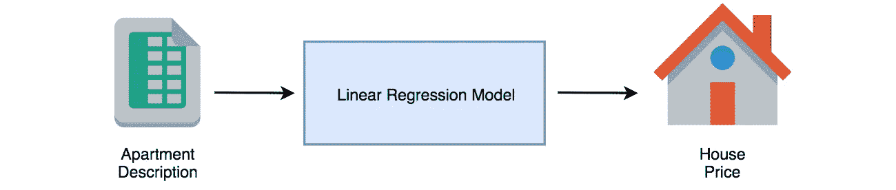

另一个例子是根据销售数据预测杂货店的食品供应量。这样，企业可以减少不必要的食物浪费。**这种映射对于任何相关的输入输出数据对都是可以实现的。**

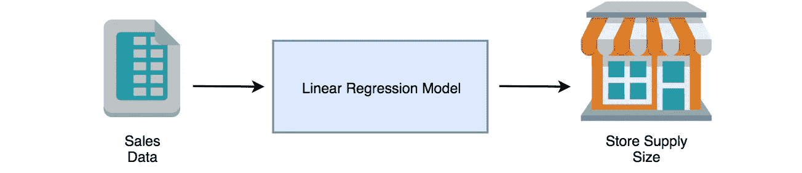

# 数据准备

在编码线性回归部分之前，最好有一些问题要解决。在像 [UCI 知识库](https://archive.ics.uci.edu/ml/index.php)或 [Kaggle](https://www.kaggle.com/) 这样的网站上可以找到很多数据集。在经历了许多之后，没有一个适合本文的研究案例。

为了获得数据，我进入了波兰网站 [dominium.pl](https://www.dominium.pl/pl/szukaj/mieszkania/nowe) ，这是一个在我居住的克拉科夫市寻找公寓的搜索引擎。我完全随机选择了 76 套公寓，写下它们的属性并保存到**。csv 文件**。目标是**训练能够预测克拉科夫公寓价格的线性回归模型**。

数据集在我的 Dropbox 上的这个[链接](https://www.dropbox.com/s/1octs0jg5o5j82o/cracow_apartments.csv?dl=0)下。

## 加载数据

让我们从读取数据开始。csv 文件转换为熊猫的 DataFrame 对象并显示一些数据行。为了达到这个目的，将使用 read_csv 函数。数据用冒号分隔，这就是添加`sep=","`参数的原因。函数 [head](https://pandas.pydata.org/pandas-docs/stable/generated/pandas.DataFrame.head.html) 以易读的 HTML 表格的形式呈现前五行数据。

代码的输出如下所示:

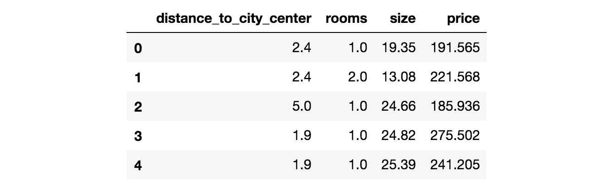

DataFrame visualisation in [Jupyter Notebook](http://jupyter.org/).

如表中所示，有四个特征**描述公寓属性:**

*   **distance _ to _ city _ center**-步行从住所到[克拉科夫主广场](https://en.wikipedia.org/wiki/Main_Square,_Krak%C3%B3w)的距离，用谷歌地图测得，
*   **房间** -公寓房间数，
*   **面积** -户型面积以平方米计量，
*   **价格** -目标值(需要模型预测的)，以波兰国家货币计量的公寓成本——[兹罗提](https://en.wikipedia.org/wiki/Polish_z%C5%82oty)。

## 可视化数据

始终理解数据的结构非常重要。功能越多越难。在这种情况下，[散点图](https://en.wikipedia.org/wiki/Scatter_plot)用于**显示目标和训练特征**之间的关系。

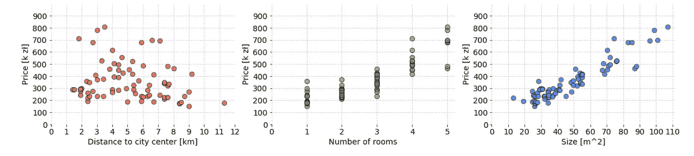

Charts show whole data from cracow_apartments.csv. It was prepared with Matplotlib library in Jupyter Notebook. The code used to create these charts can be found under this [link](https://gist.github.com/FisherKK/0113b1eda361856a1cd29ad4fbd180d2).

根据需要显示的内容，一些其他类型的可视化(例如[盒状图](https://en.wikipedia.org/wiki/Box_plot))和技术可能是有用的(例如[聚类](https://en.wikipedia.org/wiki/Cluster_analysis))。这里，可以观察到特征之间的**线性相关性**——随着 x 轴上值的增加，y 轴上的值也相应地线性增加或减少。这很好，因为如果不是这样(例如，关系将是指数的)，那么将很难拟合一条穿过所有点的线，并且应该考虑不同的算法。

# 公式

线性回归**模型是一个数学公式**，它以**的数值向量**(单个数据样本的属性)作为输入，并使用它们**进行预测**。

将相同的陈述映射到所呈现的问题的上下文中，有 76 个样本包含 Cracow 公寓的属性，其中每个样本从数学角度来看都是向量。每个**特征向量与目标值**配对(公式的预期结果)。

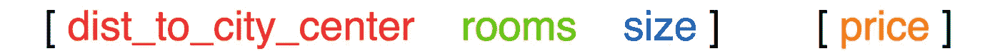

根据该算法，**每个特征都分配有一个权重参数。**表示其对模型的**重要性**。目标是找到权重值，因此每个公寓数据都满足以下等式。

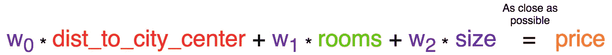

等式的左侧是一个线性函数**。如**操纵权重值可以改变线条的角度**。虽然，还是缺少了一个元素。当前函数总是通过坐标系的(0，0)点。为了解决这个问题，增加了另一个可训练参数。**

**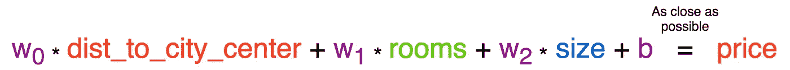**

**该参数被命名为**偏差，它赋予公式在 y 轴上上下移动的自由度**。**

**紫色参数属于模型，用于预测每个传入的样本。这就是为什么找到一种对所有样品都最有效的解决方案是必要的。形式上，该公式可以写成:**

**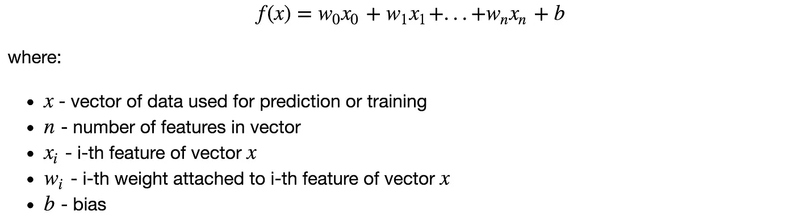**

# **初始化**

**这是一个创建**第一个模型版本的阶段**。初始化后的模型已经可以用于预测，但如果没有训练过程，结果将远远不是好的。有两件事要做:**

*   ****在代表权重和偏差参数的代码**中创建变量，**
*   ****决定模型参数的初始值**。**

**模型参数的初始值对于神经网络来说是非常重要的。在线性回归**的情况下，参数值可以在开始时设置为零**。**

**函数`init(n)`返回包含模型参数的字典。根据数学公式下方图例中的术语， *n 是用于描述数据样本的特征数*。NumPy 库的 [zeros](https://docs.scipy.org/doc/numpy-1.14.0/reference/generated/numpy.zeros.html) 函数使用它来返回一个 ndarray 类型的向量，该向量有 n 个元素，每个元素都赋有零值。Bias 是一个设置为 0.0 和**的标量，将变量保持为浮点数而不是整数**是一个好习惯。相应地，权重和偏差都可以在“w”和“b”字典键下访问。**

**对于 Cracow 公寓数据集，有三个特征描述每个样本。下面是调用`init(3)`的结果:**

**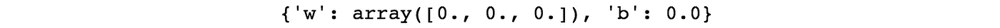**

# **预言；预测；预告**

**模型可以使用创建的模型参数进行预测。公式已经显示出来了。现在是时候把它变成 Python 代码了。首先，每个特征都必须乘以其相应的权重并求和。那么偏差参数需要加到前面操作的乘积上。结果是一个预测。**

**函数`predict(x, parameters)`有两个参数:**

*   **代表数据样本的特征向量`x`(例如单身公寓)，**
*   **Python 字典`parameters`存储了模型的参数及其当前状态。**

# ****组装****

**让我们将创建的所有代码部分放在一起，并显示在结果中。**

****只有一个特征用于预测**什么简化公式形成:**

**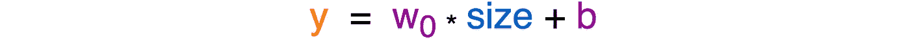**

**这是有意为之，因为**显示超过 1-2-3 维的数据的结果变得很麻烦**，除非使用[降维](https://en.wikipedia.org/wiki/Dimensionality_reduction)技术(例如 [PCA](https://en.wikipedia.org/wiki/Principal_component_analysis) )。从现在起，出于学习目的，所有代码开发将只在**尺寸**特征上进行。当线性回归代码完成时，将显示使用所有功能的结果。**

**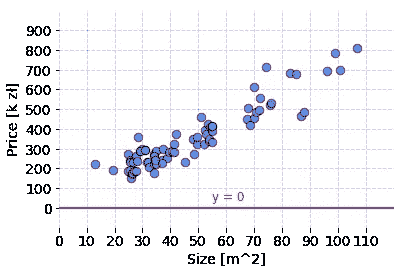**

**Line used to fit the data by Linear Regression model with current parameters. Code for visualisation is available under this [link](https://gist.github.com/FisherKK/a78a54d4fa9bdd56c9512f24b98df5f9).**

**模型参数用零值初始化，这意味着公式的输出将总是等于零。因此，`prediction`是一个包含 76 个零值的 Python 列表，它们分别是每套公寓的预测价格。但是现在没关系。**使用并解释梯度下降训练后，模型行为将会改善。****

**代码片段的额外收获是:**

*   **模型使用的特征和目标值存储在`features`和`target` Python 列表中。由于这一点，如果要使用一组不同的特性，就不需要修改整个代码。**
*   **使用 [as_matrix](http://pandas.pydata.org/pandas-docs/stable/generated/pandas.DataFrame.as_matrix.html) 函数可以将 DataFrame 对象解析为 ndarray。**

# **摘要**

**在本文中，我介绍了我将在整个文章系列中使用的工具。然后我提出了我要用线性回归算法解决的问题。最后，我展示了如何创建线性回归模型并使用它进行预测。**

**在下一篇文章中，我将解释如何比较参数集和测量模型性能。最后，我将展示如何用梯度下降算法更新模型参数。**

# ****下一篇****

**下一篇文章可点击[这里](https://medium.com/@krzyk.kamil/coding-deep-learning-for-beginners-linear-regression-part-2-cost-function-49545303d29f)。**