# 初学者深度学习编码—线性回归(第二部分):代价函数

> 原文：<https://towardsdatascience.com/coding-deep-learning-for-beginners-linear-regression-part-2-cost-function-49545303d29f?source=collection_archive---------1----------------------->

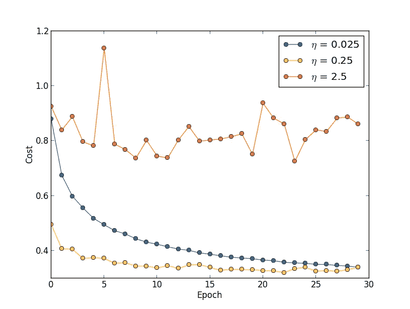

Evaluating model performance during training process. (Source [http://neuralnetworksanddeeplearning.com/](http://neuralnetworksanddeeplearning.com/chap3.html))

这是“**初学者深度学习编码**”系列的第 4 篇文章。在这里，你可以在第一篇文章 *的底部找到所有文章*、*议程的*链接，以及关于下一篇文章* [*预计发布日期的一般信息。*它们也可以在我的](https://medium.com/@krzyk.kamil/coding-deep-learning-for-beginners-start-a84da8cb5044)[开源文件夹— **MyRoadToAI**](https://github.com/FisherKK/F1sherKK-MyRoadToAI) 中找到，还有一些迷你项目、演示、教程和链接。*

你也可以[在我的个人网站](https://kamilkrzyk.com/article/coding_deep_learning_series/2018/08/08/coding-deep-learning-for-begginers-linear-regression-cost-function)上阅读这篇文章，为了提高可读性(支持代码语法高亮、LaTeX 方程式等等)，我的个人网站由 [Jekyll](https://jekyllrb.com/) 主办。

# 概述

上一篇文章介绍了线性回归实施完成后将要解决的问题。目标是预测克拉科夫公寓的价格。数据集由三个特征描述的样本组成:**到城市中心的距离**、**房间**和**大小**。为了简化可视化并提高学习效率，将只使用尺寸特征。

此外，给出并解释了线性回归模型背后的数学公式。为了使方程完整，它的参数需要有指定的值。然后，该公式准备好返回任何给定输入样本的数值预测。

这里描述的两个步骤称为**初始化**和**预测**。两者都被**转化为独立的 Python 函数，并用于创建线性回归模型**，其中所有参数都被初始化为零，并用于根据大小参数预测公寓价格。

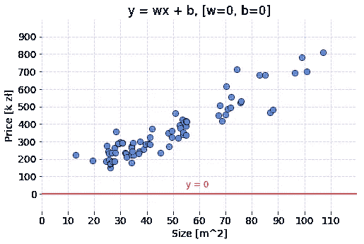

Code used to prepare the graph is available under this [link](https://gist.github.com/FisherKK/942fa9aaaa95be04f75a316a5824343c).

# 下一个要解决的问题

由于模型的所有权重和偏差都等于零，具有当前参数的模型将为面积参数的每个值返回零。现在让我们修改参数，看看模型的投影是如何变化的。

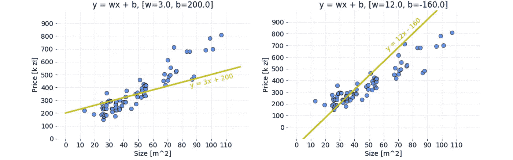

Code used to prepare these graphs is available under this [link](https://gist.github.com/FisherKK/73eb3ff38fccc865b730ac74cb692b5a).

有两组参数会导致线性回归模型为每个大小要素值返回不同的公寓价格。由于数据具有线性模式，在适当校准参数后，模型可以成为价格的精确近似值。

## 要回答的问题

对于哪一组参数，模型返回更好的结果？

*   橙色:`w = 3`，`b = 200`
*   石灰:`w = 12`，`b = -160`

即使有可能通过视觉判断正确猜出答案，**计算机也不会想象——它会比较这些值**。这就是成本函数的用处。

# 价值函数

这是一个函数，**测量机器学习模型**对于给定数据的性能。成本函数量化了预测值和期望值之间的误差，并且**以单个实数**的形式呈现。根据问题的不同，成本函数可以用许多不同的方法来构成。成本函数的目的是:

*   **最小化**——那么返回值通常称为**成本**、**损失**或**错误**。目标是找到成本函数返回尽可能少的模型参数值。
*   **最大化**——然后它产生的价值被命名为**奖励**。目标是找到返回数尽可能大的模型参数值。

**对于依赖梯度下降优化模型参数的算法，每个函数都必须是可微分的。**

# 剪裁成本函数

给定一个使用以下公式的模型:

其中:

*   ŷ -预测值，
*   用于预测或训练的数据的 x 向量，
*   重量级。

注意*偏置参数被故意省略*。让我们试着找出权重参数的值，所以对于下面的数据样本:

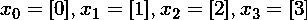

模型的输出尽可能接近:

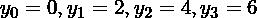

现在是时候为权重参数分配一个随机值，并可视化模型的结果。让我们暂时选择`w = 5.0`。

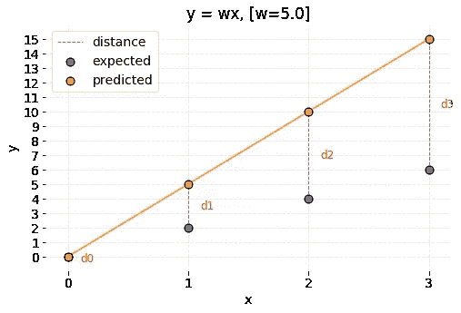

Code used to prepare the graph is available under this [link](https://gist.github.com/FisherKK/86f400f6d88facbf5375286db7029ca2).

可以观察到模型预测与预期值不同。怎么用数学表达？最直接的方法是将两个值相减，看运算结果是否等于零。任何其他结果都意味着值不同。**接收数字的大小提供了关于**错误有多严重的信息。从几何角度来看，可以说**误差是坐标系**中两点之间的距离。让我们将距离定义为:

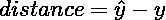

根据公式，计算预测值和期望值之间的误差:

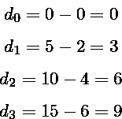

如前所述，成本函数是描述模型性能的单一数字。因此，让我们总结错误。

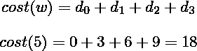

然而，现在想象有一百万个点而不是四个。对于在较大数据集上进行预测的模型来说，累积误差会比在较小数据集上进行预测的模型大。因此，这些模型无法进行比较。这就是为什么它必须以某种方式缩放。正确的想法是**将累积误差除以点数**。这样陈述成本是模型对给定数据集产生的误差的平均值。

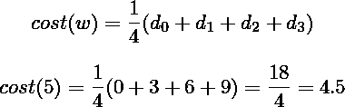

不幸的是，这个公式还没有完成。在此之前，**所有情况都必须考虑**，所以现在让我们尝试选择较小的权重，看看创建的成本函数是否有效。现在，权重即将被设置为`w = 0.5`。

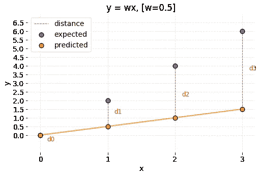

Code used to prepare the graph is available under this [link](https://gist.github.com/FisherKK/15eb3f36444fb3dd4ed64c21ab300bfc).

预测又一次落空了。然而，与前一种情况相比，不同之处在于预测点低于预期点。数字上的预测更小。成本公式将出现故障，因为计算出的距离为负值。

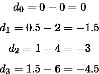

成本值也是负的:

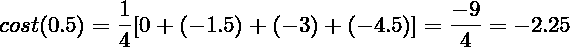

说距离可以有负值是不正确的。可以对高于或低于预期结果的预测附加更大的惩罚(一些成本函数就是这样做的，例如 RMSE)，但**值不应为负，因为它会抵消正误差**。那么将不可能适当地最小化或最大化成本函数。

那么用距离的绝对值来修正问题怎么样？在将距离表示为:

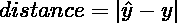

每个重量值的成本为:

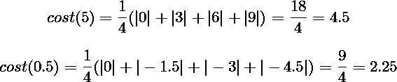

现在，权重`w = 5.0`和`w = 0.5`的成本都计算正确了。可以比较这些参数。成本值越小，模型对`w = 0.5`的效果越好。

创建的函数称为 [**平均绝对误差**](https://en.wikipedia.org/wiki/Mean_absolute_error) **。**

# 绝对平均误差

测量一组预测中**平均误差大小的回归度量，不考虑它们的方向。换句话说，它是预测和预期结果之间绝对差异的平均值，其中所有个体偏差都具有同等重要性**。

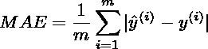

其中:

*   i -样本索引，
*   ŷ -预测值，
*   y -期望值，
*   m -数据集中的样本数。

有时可能会看到预测值和期望值互换的公式形式，但工作原理是一样的。

让我们把数学变成代码:

该函数将两个相同大小的数组作为输入:`predictions`和`targets`。公式的参数`m`是样本数，等于发送数组的长度。由于数组具有相同的长度，因此可以同时迭代两个数组。计算每个`prediction`和`target`之间的差值的绝对值，并加到`accumulated_error`变量上。在收集了所有对的误差后，累加的结果由参数`m`平均，该参数返回给定数据的平均误差。

# 均方误差

最常用和最先解释的**回归指标之一**。**预测和预期结果之间的均方差。**换句话说，MAE 的一种变化，其中不是取差值的绝对值，而是取它们的平方。

在 MAE 中，部分误差值等于坐标系中点之间的距离。**关于 MSE，每个部分误差相当于由测量点之间的几何距离产生的正方形的面积。**所有区域面积相加并平均。

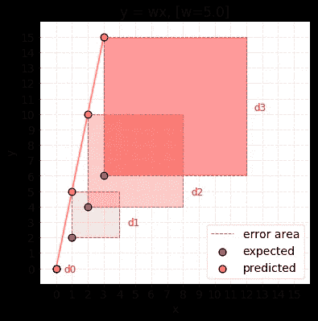

Code used to prepare the graph is available under this [link](https://gist.github.com/FisherKK/fcd05b0eb3a3d12a680f03c68c5fdb40).

MSE 公式可以写成这样:

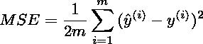

*   i -样本索引，
*   ŷ -预测值，
*   y -期望值，
*   m -数据集中的样本数。

MSE 公式有不同的形式，其中分母中没有除以 2。它的存在让 MSE 推导演算更干净。

使用绝对值计算方程的导数是有问题的。MSE 代之以使用指数运算，因此具有良好的数学性质，这使得与 MAE 相比其导数的计算更容易。当使用依赖于梯度下降算法的模型时，它是相关的。

MSE 可以用 Python 编写如下:

与上一段中介绍的`mae(predictions, targets)`功能的唯一区别是:

*   `prediction`和`target`之差的平方，
*   `2`在求平均分母中。

# MAE 和 MSE 的区别

有更多的回归度量可以用作成本函数，用于测量试图解决回归问题的模型的性能(估计值)。MAE 和 MSE 看起来比较简单，很受欢迎。

## 为什么有这么多指标？

每个指标都以独特的方式处理观察结果和预期结果之间的差异。**例如，不同的指标，如 RMSE，对低于预期值的预测比高于预期值的预测惩罚力度更大。它的使用可能会导致创建一个返回夸大估计值的模型。**

MAE 和 MSE 是如何对待这两点之间的差异的？为了验证这一点，我们来计算不同重量值的成本:

Table presents the errors of many models created with different weight parameter. Cost of each model was calculated with both MAE and MSE metrics.

并显示在图表上:

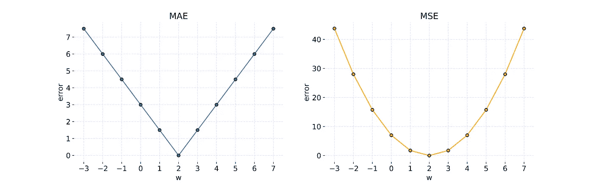

The graphs show how metric value change for different values of parameter w. Code used to prepare these graphs is available under this [link](https://gist.github.com/FisherKK/ca707f8af758917dd38bc978aab37169).

可以观察到:

*   MAE 不会给点与点之间的距离增加任何额外的权重——误差增长是线性的。
*   MSE **误差随着距离**值的增大呈指数增长。这是一个度量标准，即**对远离的点增加一个巨大的惩罚，而对接近**预期结果的点增加一个最小的惩罚。误差曲线具有抛物线形状。

此外，通过检查各种重量值，有可能发现误差等于零的参数。如果使用`w = 2.0`来构建模型，那么预测看起来如下:

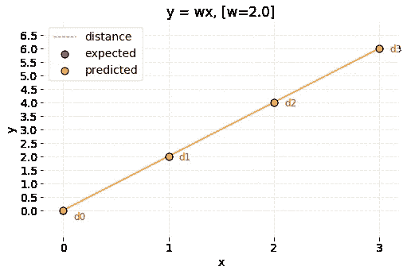

Code used to prepare the graph is available under this [link](https://gist.github.com/FisherKK/ece7aa7a6d15a04e2d07293c45c1bd84).

**当预测和预期结果重叠**时，则每个合理的**成本函数值等于零**。

# **回答**

是时候回答这样一个问题了，哪一组参数，**橙**和**石灰**能更好地估计克拉科夫公寓的价格。让我们**用 MSE 来计算两个模型**的误差，看看哪个更低。

在前一篇文章中解释了大部分代码。不是调用`init(n)`函数，而是手动创建参数字典用于测试目的。注意，这一次两个模型都使用了偏差。函数`predict(x, parameters)`用于不同`parameters`参数的相同数据。然后名为`orange_pred`和`lime_pred`的结果预测成为`mse(predictions, targets)`函数的参数，该函数分别返回每个模型的误差值。

结果如下:

*   橙色: **4909.18**
*   石灰: **10409.77**

这意味着 **orange parameters 以更小的成本创造了更好的模型**。

# 摘要

在本文中，我解释了成本函数的概念——一种允许我们评估模型参数的工具。我已经向您介绍了两个最常用的回归度量 MAE 和 MSE。

在下一篇文章中，我将向您展示如何使用梯度下降算法来训练模型参数。

# 下一篇文章

下一篇文章可从[这里](/coding-deep-learning-for-beginners-linear-regression-gradient-descent-fcd5e0fc077d)获得。