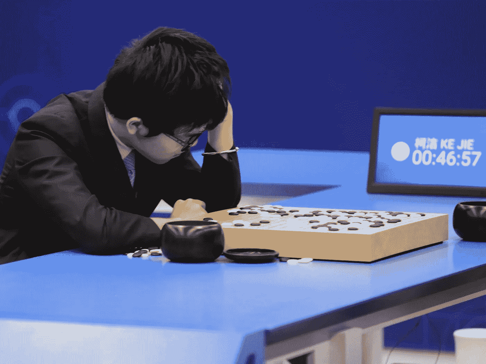
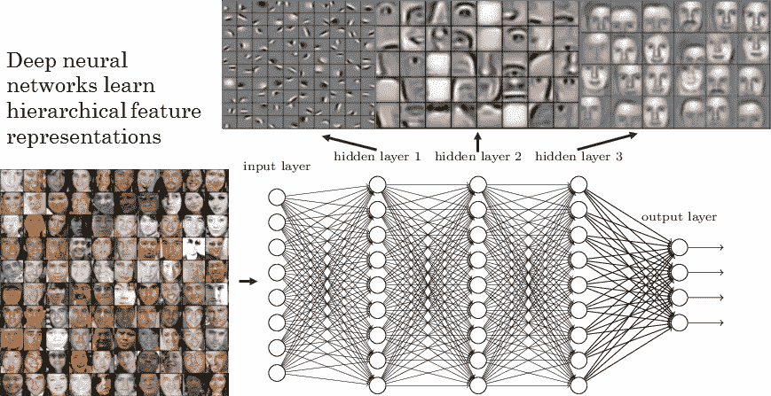
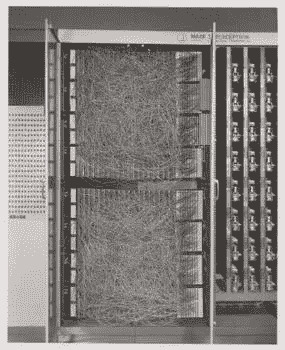
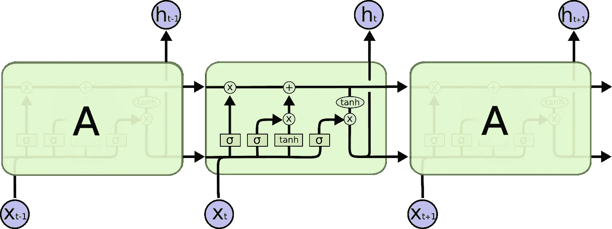
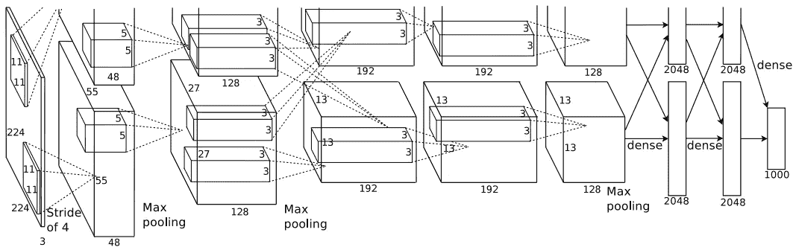

# 面向初学者的编码深度学习—开始！

> 原文：<https://towardsdatascience.com/coding-deep-learning-for-beginners-start-a84da8cb5044?source=collection_archive---------0----------------------->

## 基于直觉的一系列关于神经网络的文章，献给希望理解代码背后的基本数学的程序员和希望知道如何将数学转化为代码的非程序员。

这是“**初学者深度学习编码**”系列的第一篇文章。你可以在这里找到*到所有文章*、*日程的链接，以及底部关于下一篇文章* **预计发布日期的一般信息。它们也可以在我的[开源文件夹— **MyRoadToAI**](https://github.com/FisherKK/F1sherKK-MyRoadToAI) 中找到，还有一些迷你项目、演示、教程和链接。**

你也可以[在我的个人网站](https://kamilkrzyk.com/article/coding_deep_learning_series/2018/02/12/coding-deep-learning-for-begginers-start)上阅读这篇文章，该网站由 [Jekyll](https://jekyllrb.com/) 主办，目的是提高可读性(支持代码语法高亮显示、LaTeX 方程式等等。

如果你读了这篇文章，我假设你*想了解*最有前途的技术之一——深度学习**。声明 [**艾是新电**](https://medium.com/@Synced/artificial-intelligence-is-the-new-electricity-andrew-ng-cc132ea6264) 最近越来越流行了。科学家们认为，随着*蒸汽*发动机*发动机*，后来的*电力*以及最后的*电子*已经*彻底改变了这个行业，后来的一个*人工智能*即将再次改造它。几年后，机器学习的基础知识将成为任何开发人员的必备技能。即使是现在，我们也可以观察到[编程语言](https://research.hackerrank.com/developer-skills/2018/)越来越受欢迎，这些语言主要用于机器学习，如 Python 和 r。***

## 具有魔力的技术

在过去的几年里，深度学习的应用在许多领域取得了巨大的进步，引起了人们的惊讶，他们没有想到技术和世界变化如此之快。

让我们从 2016 年 3 月[超级计算机 AlphaGo](https://deepmind.com/research/alphago/) 与最强围棋选手之一、18 次世界冠军李·塞多尔之间的历史比赛说起。人工智能以 4 比 1 的[结果](https://en.wikipedia.org/wiki/AlphaGo_versus_Lee_Sedol)结束了胜利。这场比赛对围棋界产生了巨大的影响，因为 AlphaGo 发明了全新的棋步，让人们试图理解和再现它们，并创造了如何玩游戏的全新视角。但这还没完，2017 年 [DeepMind 推出了 AlphaGo Zero](https://deepmind.com/blog/alphago-zero-learning-scratch/) 。已经不可战胜的机器的新版本**能够在没有任何初始数据或人类帮助的情况下学习一切。所有这些的计算能力比它的前身少 4 倍！**

AlphaGo versus Ke Jie in May 2017 (source: The Independent)

可能你们中的许多人已经听说过无人驾驶汽车项目，该项目已经开发了几年，由像 [Waymo](https://waymo.com/) (谷歌)[特斯拉](https://www.tesla.com/autopilot)，[丰田](http://www.thedrive.com/sheetmetal/17440/toyota-to-unveil-semi-autonomous-platform-3-0-at-the-2018-consumer-electronics-show)，[沃尔沃](https://www.volvocars.com/au/about/innovations/intellisafe/autopilot)等公司开发。还有[自动驾驶卡车](https://www.technologyreview.com/s/603493/10-breakthrough-technologies-2017-self-driving-trucks/)已经[在美国的一些高速公路上使用](https://www.wired.com/story/embark-self-driving-truck-deliveries/)。许多国家都在慢慢准备在自己的道路上引入自动驾驶汽车，但预计未来十年将达到高峰。

但是自主飞行汽车怎么样呢？就在最近，Udacity 宣布了他们新的 Nanodegree 项目，开发者可以学习如何成为飞行汽车工程师并创造自动飞行汽车！

 [## 飞行汽车和自主飞行| Udacity

### 掌握工作就绪的自主飞行软件工程技能，因为你处理先进的挑战，写真正的代码…

www.udacity.com](https://www.udacity.com/course/flying-car-nanodegree--nd787) 

最近，由于人工智能语音识别的改进，像 Google Home 或 Google Assistant 这样的语音界面成为全新的开发分支。

Google Advertisement on Google Assistant product.

未来，人工智能将通知你因为交通而提前离开家，购买电影票，重新安排日历会议，控制你的家等等，比你想象的更近。

当然，这个列表还可以更长:[人工智能能够用多种方言复制人类语言](https://deepmind.com/blog/wavenet-launches-google-assistant/)，[人工智能比人类更擅长诊断癌症](https://www.newyorker.com/magazine/2017/04/03/ai-versus-md)，[人工智能开创哈利波特新篇章](https://www.geek.com/tech/ai-generated-harry-potter-chapter-wins-the-internet-1725679/) …

提到所有这些的关键点是让你明白，这些发明中的每一项都使用了深度学习技术。总而言之，深度学习目前在以下任务中表现出色:

1.  图像识别
2.  自动驾驶汽车
3.  像围棋、[象棋](https://www.theguardian.com/technology/2017/dec/07/alphazero-google-deepmind-ai-beats-champion-program-teaching-itself-to-play-four-hours)、[扑克](http://www.zdnet.com/article/researchers-reveal-how-poker-playing-ai-beat-the-worlds-top-players/)这样的游戏，但最近还有[电脑游戏](https://www.theverge.com/2017/8/11/16137388/dota-2-dendi-open-ai-elon-musk)
4.  [语言翻译](https://www.theverge.com/2016/9/27/13078138/google-translate-ai-machine-learning-gnmt)(但仅限几种语言)
5.  [语音识别](https://9to5google.com/2017/06/01/google-speech-recognition-humans/)
6.  手写文本分析

这仅仅是个开始，因为技术每天都在变得大众化，随着越来越多的人能够使用它，越来越多的研究被完成，越来越多简单的想法被测试。

## 那么什么是深度学习呢？

这是基于学习数据表示的机器学习算法的子集，称为**神经网络**。基本想法是这样一个算法以数字数据的形式显示现实的一部分。在这个过程中，**它在积累经验，并试图对给定的数据建立自己的理解**。这种理解具有**层次结构**，就像算法具有**层**一样。第一层学习最简单的事实，并连接到下一层，下一层使用前一层的经验来学习更复杂的事实。**层数称为模型的深度**。图层越多，模型可以学习的数据表示就越复杂。

Neural Network that is used for face detection. It learns hierarchy of representations: corners in first layer, eyes and ears in the second layer, and faces in the third layer (source: strong.io)

## 深度学习真的是新技术吗？

你们中的一些人可能认为深度学习是最近开发的技术。那不完全正确。深度学习有非常丰富的历史，并且根据哲学观点有各种各样的名称。一百多年前，在第一个数学概念建立之前，人们就梦想着智能机器。经历了三次发展浪潮。

在第一波浪潮中，深度学习被称为[控制论](https://en.wikipedia.org/wiki/Cybernetics)。现代深度学习的第一个前辈是受神经系统研究启发的线性模型——[神经科学](https://en.wikipedia.org/wiki/Neuroscience)。神经元(1943 年)的第一个[概念，即神经网络的最小部分，是由麦卡洛克-皮特提出的，试图实现大脑功能。几年后，弗兰克·罗森布拉特将这个概念变成了第一个可训练的模型——马克 1 感知机。](https://pdfs.semanticscholar.org/5272/8a99829792c3272043842455f3a110e841b1.pdf)

Mark 1 Perceptron (source: Wikipedia)

但是人们很难用当时可用的理论来描述大脑行为。这就是为什么在接下来的 20 年里人们对它们的兴趣下降了。

第二次浪潮始于 80 年代，名为[连接主义](https://en.wikipedia.org/wiki/Connectionism)，但术语神经网络也开始被更频繁地使用。主要的想法是，当神经元大量聚集在一起时，可以实现更智能的行为。这个概念是由 Hinton 提出的，被称为[分布式表示(1986)](https://www.cs.toronto.edu/~hinton/absps/families.pdf) 。它仍然是今天深度学习的核心。第二次浪潮的另一个伟大成就是 Yann LeCun (1987) 发明的[反向传播——这是一种核心算法，直到今天仍用于训练神经网络参数。同样在 1982 年](http://yann.lecun.com/exdb/publis/pdf/lecun-88.pdf)[约翰·霍普菲尔德](https://en.wikipedia.org/wiki/John_Hopfield)发明了递归神经网络，在 1997 年 LSTM[的额外介绍后，今天被用于语言翻译](http://www.bioinf.jku.at/publications/older/2604.pdf)。这几年对神经网络的大肆宣传已经结束，因为各种投资者对在产品中实现人工智能的期望没有实现。

Image of LSTM cell based Recurrent neural Network (source: [http://colah.github.io/posts/2015-08-Understanding-LSTMs/](http://colah.github.io/posts/2015-08-Understanding-LSTMs/))

第三次浪潮始于 2006 年。那时，电脑成了每个人都能买得起的更普通的东西。得益于各种群体，例如游戏玩家，强大的 GPU 市场不断增长。每个人都可以上网。公司开始更加关注分析——以数字形式收集数据。作为一个副作用，研究人员有更多的数据和计算能力来进行实验和验证理论。因此，由于 Geoffrey E. Hinton 成功训练了多层神经网络，这又是一个巨大的进步。从那时起，许多不同的多层神经网络结构的建议开始出现。科学家将神经网络的层数称为“深度”——层数越多，就越深。非常重要的是在图像分类竞赛 ILSVRC-2012 中使用了卷积神经网络 [AlexNet](https://papers.nips.cc/paper/4824-imagenet-classification-with-deep-convolutional-neural-networks.pdf) 。它为许多行业提供了可靠的图像检测机制，使许多机器能够看到自动驾驶汽车，从而彻底改变了许多行业。

Structure of AlexNet CNN (source: Alex Krizhevsky, Ilya Sutskever, Geoffrey E. Hinton, “ImageNet Classification with Deep Convolutional Neural Networks”, 2012)

2014 年，Ian Goodfellow 引入了一种新型的神经网络，称为[生成对抗网络](https://arxiv.org/abs/1406.2661)。在这种结构中，两个神经网络相互竞争。第一个网络试图模仿一些数据分布。第二个网络的作用是辨别它收到的数据是真是假。第一个网络的目标是欺骗第二个网络。竞争提高了第一网络的性能，并使任何类型的数据——图像、音乐、文本、语音——的生成成为可能。

GAN used to transfer style of one image into another (source: [https://github.com/lengstrom/fast-style-transfer](https://github.com/lengstrom/fast-style-transfer))

我想就这样了。第三波持续到今天，这取决于我们能走多远！

## 我为什么要创作这个系列的文章？

我真的对机器学习，尤其是深度学习充满热情。我的梦想是成为机器学习专家——与人合作解决问题并使知识大众化的人。我每天都在努力达到这个目标，这个博客是其中的一部分。所以跟我一起学习吧！

在我看来，获得这项技术的最大问题是，它是在大学和实验室由高水平的博士科学家开发的，并且仍然部分停留在那里。这是可以理解的，因为一切都强烈基于[线性代数](https://en.wikipedia.org/wiki/Linear_algebra)、[概率](https://en.wikipedia.org/wiki/Probability)和[信息论、](https://en.wikipedia.org/wiki/Information_theory) [数值计算](https://en.wikipedia.org/wiki/Numerical_analysis)。但是为了成为一名车手，你不需要了解发动机，对吗？人们仍然相信，要在这个领域工作，你需要有博士学位，但是在软件工程方面，这种观念已经开始改变。

对拥有这些技能的人的需求将会变得如此之大，以至于不可能让每个人都拥有博士头衔。这就是为什么为了让人们使用它，必须有人能把它翻译给别人，同时跳过复杂的证明，科学的符号，并增加更多的直觉。

## 我希望向你展示的是

我的目标是对与深度学习相关的大多数热门话题提供强有力的理解。在挑选内容的时候，我不想保护你——我想向你展示更复杂的东西，同时，尽我所能为你提供理解它们的直觉。我的主要任务是让你理解这些算法是如何工作的，并教你如何从头开始编码。就像 Mark Dao ust(tensor flow 的开发者项目工程师)曾经对我说的那样:

> 每个人都应该从头开始编写一次神经网络代码…但只能编写一次…

所以会有很多代码我打算仔细解释。在这些主题中，你可以期待我将向你展示如何使用我们所学的迷你项目。知识跟随着实践真的很重要。

这种方法将是自下而上的:

*   底层——基础(和解释的)数学变成 Python NumPy 代码，
*   中级——tensor flow(TF . nn 和 tf.layer 模块),我已经向您展示的大部分内容都可以在一行代码中自动完成，
*   高层——非常流行的框架，可以让你非常快速地创建神经网络——Keras。

这个项目将只关注多层感知器。已经有很多工作要做了。如果它成功了，我可能会考虑对卷积神经网络、递归神经网络和生成对抗神经网络进行扩展。

# 议程

将来，您可以看到涵盖以下主题的文章(顺序可能会改变):

1.  [【25 . 07 . 2018】机器学习的类型](https://medium.com/@krzyk.kamil/coding-deep-learning-for-beginners-types-of-machine-learning-b9e651e1ed9d)
2.  [【1 . 08 . 2018】线性回归(第一部分):初始化和预测](/coding-deep-learning-for-beginners-linear-regression-part-1-initialization-and-prediction-7a84070b01c8)
3.  [【8 . 08 . 2018】线性回归(第二部分):成本函数](https://medium.com/@krzyk.kamil/coding-deep-learning-for-beginners-linear-regression-part-2-cost-function-49545303d29f)
4.  [【23 . 08 . 2018】线性回归(第三部分):梯度下降训练](/coding-deep-learning-for-beginners-linear-regression-gradient-descent-fcd5e0fc077d)
5.  [30.08.2018]线性回归(第四部分):矢量化
6.  [06.09.2018]线性回归(第 5 部分):可重复使用的分类器的创建

要涵盖的概念:

*   逻辑回归和激活函数
*   多层感知器的思想
*   用例子详细解释反向传播
*   梯度检查
*   为神经网络准备数据—标准化、规范化
*   激活功能及其背后的直觉
*   Softmax，一个热编码
*   权重初始化、消失渐变、爆炸渐变
*   随机梯度下降，小批量，批量梯度下降
*   乐观主义者
*   调谐超参数
*   学习曲线、过度拟合、偏差
*   正规化的方法——退出、批量正规化