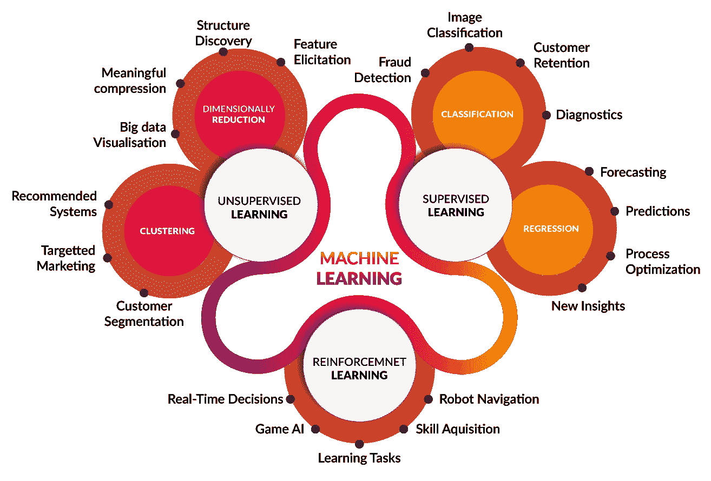
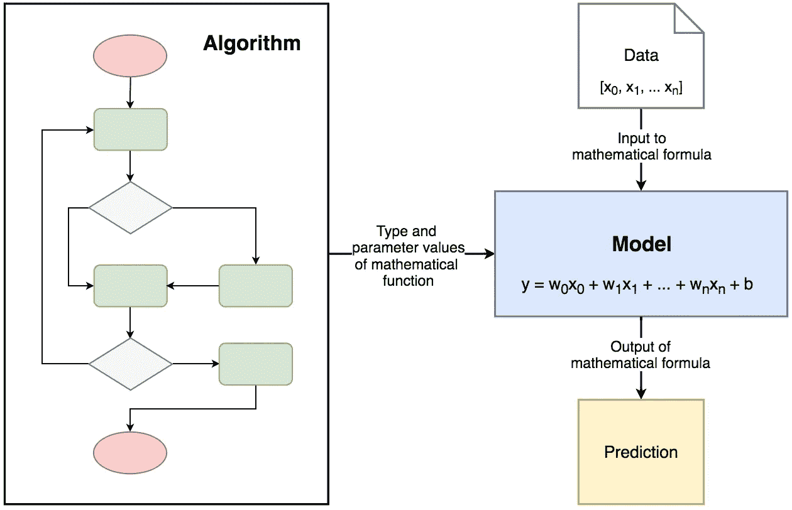
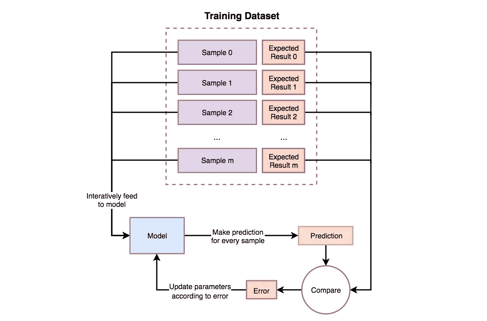
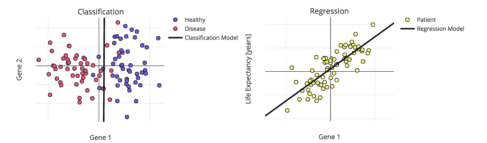
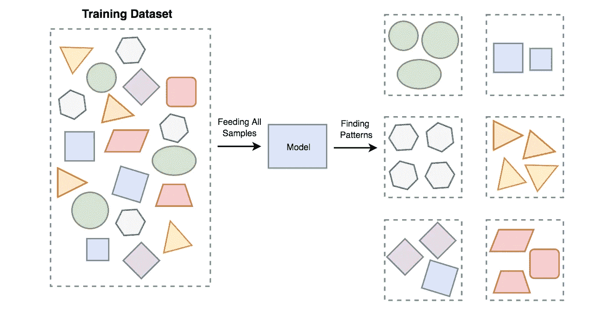
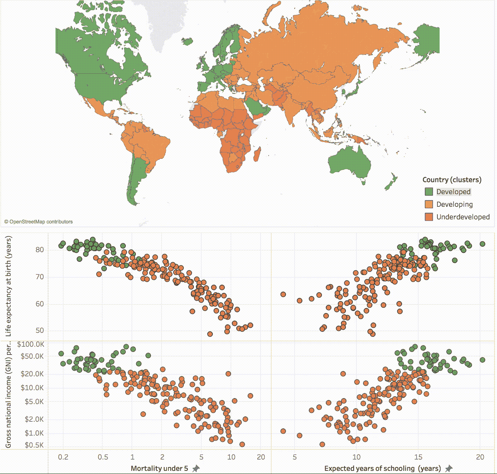
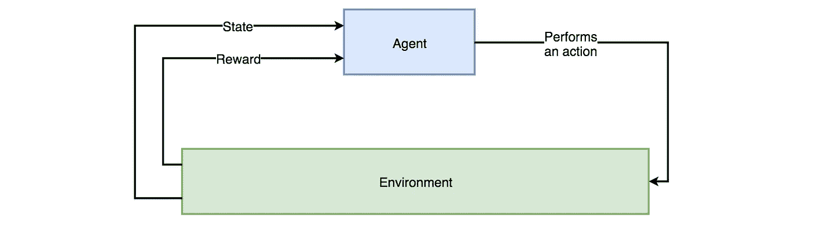
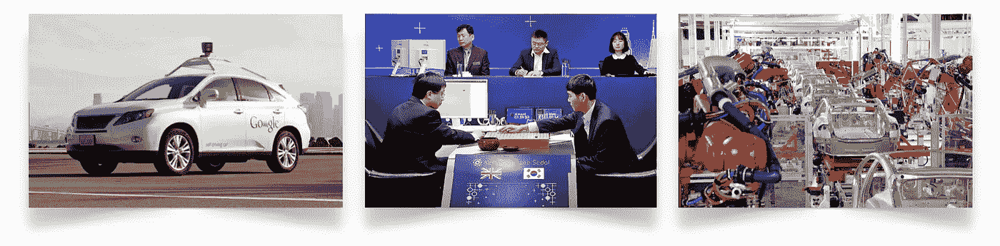

# 面向初学者的编码深度学习

> 原文：<https://towardsdatascience.com/coding-deep-learning-for-beginners-types-of-machine-learning-b9e651e1ed9d?source=collection_archive---------2----------------------->

Image source: [http://www.cognub.com/index.php/cognitive-platform/](http://www.cognub.com/index.php/cognitive-platform/)

## 机器学习的类型

这是系列“**初学者深度学习编码**”的第二篇文章。在这里，你可以在第一篇文章 *的底部找到所有文章*、*议程的*链接，以及关于下一篇文章* [*预计发布日期的一般信息。*它们也可以在我的](https://medium.com/@krzyk.kamil/coding-deep-learning-for-beginners-start-a84da8cb5044)[开源文件夹— **MyRoadToAI**](https://github.com/FisherKK/F1sherKK-MyRoadToAI) 中找到，还有一些迷你项目、演示、教程和链接。*

你也可以[在我的个人网站](https://kamilkrzyk.com/article/coding_deep_learning_series/2018/07/25/coding-deep-learning-for-begginers-types-of-machine-learning)上阅读这篇文章，为了提高可读性(支持代码语法高亮、LaTeX 方程式等等)，我的个人网站由 [Jekyll](https://jekyllrb.com/) 主办。

# 目标

进入机器学习领域并不是一件容易的事情。我很想**爱护读者**。这就是为什么有时你会看到只关注理论的文章。因为长文章不鼓励学习，所以我会把它们保持在**5-8 分钟的阅读时间**。我不能把所有东西都放在一篇文章里——代码片段、数学、术语——因为那样会减少对基本概念的解释。我相信将知识分成更小的部分并扩展到更多的文章中会使学习过程更顺利，因为没有必要停下来走弯路。

# 机器学习模型

从“模型”的定义开始，这个定义从现在开始会经常出现。如*线性回归*、*逻辑回归*、*决策树*等名称。只是算法的名字。那些只是理论上的概念，描述了为了达到特定的效果应该做些什么。模型是一个**数学公式**，它是机器学习**算法实现**的一个结果(在这些文章的情况下——在代码中)。它有可测量的参数，可用于预测。可以通过修改模型的参数来训练模型，以便获得更好的结果。可以说，模型是机器学习系统从训练数据中学到的东西的表示。

Diagram visualising difference between Machine Learning Algorithm and Machine Learning Model.

# 机器学习的分支

机器学习有三个最常见的类别:

*   监督学习
*   无监督学习
*   强化学习

## 监督学习

**需要由示例输入输出对**组成的 **数据集的算法组。每一对由用于进行预测的**数据样本**和被称为**标签**的预期结果组成。“受监督的”一词来源于标签需要由**人类管理者**分配给数据的事实。**

在训练过程中，样本被反复输入到模型中。对于每个样本，模型使用参数的当前状态并返回预测。预测与标签相比较，其差异称为误差。**误差是对模型的反馈，说明哪里出了问题，以及如何自我更新，以减少未来预测中的误差。**这意味着模型将根据其创建所基于的算法改变其参数值。

Diagram demonstrating how Supervised Learning works.

监督学习模型**试图找到参数值，使它们能够在历史数据上表现良好**。然后，它们**用于对未知数据**进行预测，这些数据不是训练数据集的一部分。

监督学习可以解决两个主要问题:

*   **分类**—*为输入的*数据样本分配类别的过程。示例用途:预测一个人是否生病，检测欺诈交易，人脸分类器。
*   **回归**—*预测输入数据样本的连续数值*的过程。示例用途:评估房价，预测杂货店食品需求，温度预测。

Example of Classification and Regression models.

## 无监督学习

试图**从非标记数据**中得出推论的一组算法(不参考已知或标记的结果)。在无监督学习中，**没有正确答案**。基于这种算法的模型可以用来发现未知的数据模式和数据结构本身。

Example of Unsupervised Learning concept. All data is fed to the model and it produces an output on it’s own based on similarity between samples and algorithm used to create the model.

无监督学习最常见的应用是:

*   **模式识别和数据聚类**—*将相似数据*样本划分并分组在一起的过程。组通常被称为簇。示例用途:超市分割、用户群分割、信号去噪。
*   **降低数据维度** -数据维度是描述数据样本所需的特征数量。降维是一个*过程，将特征压缩成所谓的主值*，简洁地传达相似的信息。通过仅选择几个组件，减少了特征的数量，并且在此过程中丢失了一小部分数据。示例用途:通过减少计算次数来加速其他机器学习算法，在数据中找到一组最可靠的特征。

Dividing data from various countries around the world into three clusters representing Developed, Developing and Underdeveloped nations (source: [Tableau blog](https://www.tableau.com/about/blog/2016/7/uncover-patterns-your-data-tableau-10s-clustering-feature-56373)).

## 强化学习

机器学习算法的分支，产生所谓的**代理**。代理角色与经典模型略有不同。它**从环境中接收信息，并通过执行**动作**对其做出反应**。信息以数字数据的形式提供给代理，称为**状态，**状态被存储，然后用于选择正确的动作。因此，代理人会收到一个**奖励**，奖励可以是正的，也可以是负的。奖励是代理可以用来更新其参数的反馈。

代理人的培训是一个**试错**的过程。为了学习，它需要在各种情况下找到自己，并在每次采取错误行动时受到惩罚。优化目标可以根据强化学习方法以多种方式设定，例如基于*价值函数*、*梯度策略*或*环境模型*。

Interaction between Agent and Environment.

强化学习的应用范围很广。他们中的大多数是发明，经常被认为是人工智能最具创新性的成就。

Example of solutions where Reinforcement Learning is used. From self-driving cars through various games such as Go, Chess, Poker or computer ones — Dota or Starcraft, to manufacturing.

模拟 3D 模型的运动是一项复杂的任务。这种模型需要在给定的环境中与不同的模型进行交互。强化学习正越来越多地被用作解决这一问题的工具，因为它产生的结果对人眼来说似乎非常可信，并且算法能够自动适应描述环境的规则。

Main video accompanying the SIGGRAPH 2018 paper: “DeepMimic: Example-Guided Deep Reinforcement Learning of Physics-Based Character Skill”.

# **总结**

仅此而已。在下一篇文章中，我将解释线性回归算法的基础和实现，这是一种基本的监督学习算法。

# 下一篇文章

下一篇文章可在[这里](https://medium.com/@krzyk.kamil/coding-deep-learning-for-beginners-linear-regression-part-1-initialization-and-prediction-7a84070b01c8)。