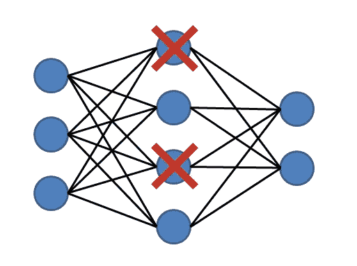
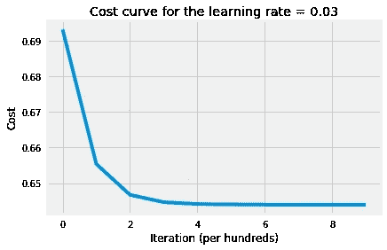
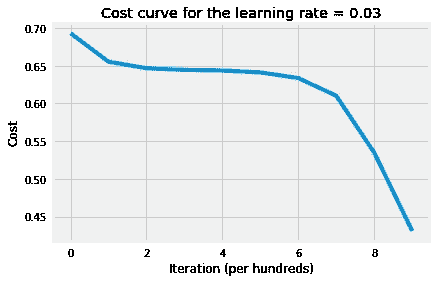

# 编码神经网络—辍学

> 原文：<https://towardsdatascience.com/coding-neural-network-dropout-3095632d25ce?source=collection_archive---------3----------------------->



**Figure 1:** Dropout

**辍学**是一种正规化技术。在每次迭代中，我们随机关闭每层上的一些神经元(单元),并且在前向传播和反向传播中都不使用这些神经元。由于在每次迭代中被丢弃的单元将是随机的，学习算法将不知道在每次迭代中哪些神经元将被关闭；因此，强制学习算法分散权重，而不是专注于某些特定特征(单元)。此外，退出有助于通过以下方式改善泛化误差:

*   因为我们在每次迭代中丢弃一些单元，这将导致更小的网络，这反过来意味着更简单的网络(正则化)。
*   可以看作是装袋技术的近似。每一次迭代都可以被看作是不同的模型，因为我们在每一层随机放置不同的单元。这意味着误差将是来自所有不同模型(迭代)的误差的平均值。因此，平均来自不同模型的误差，特别是如果这些误差是不相关的，将减少总误差。在误差完全相关的最坏情况下，在所有模型中求平均值根本没有帮助；然而，我们知道在实践中，误差在某种程度上是不相关的。因此，它总是会改善泛化误差。

我们可以在每一层使用不同的概率；然而，输出层将总是具有`keep_prob = 1`，而输入层具有高`keep_prob`，例如 0.9 或 1。如果一个隐藏层有`keep_prob = 0.8`，这意味着；在每次迭代中，每个单元有 80%的概率被包含，20%的概率被删除。

在计算机视觉问题中经常使用 Dropout，因为我们有很多特征，但没有很多数据。此外，相邻的特征(像素)通常不会增加很多信息。所以，模型总是会出现过拟合的情况。

为了说明 dropout 如何帮助我们减少泛化错误，我们将使用我们在以前的帖子中使用的相同数据集。该数据集有猫和非猫的图像。我们将尝试建立一个神经网络来分类图像是否有猫。每幅图像的 RGB 比例为 64 x 64 像素。让我们导入数据，看看形状以及来自训练集的猫图像样本。

```
# Import training data
train_dataset = h5py.File("../data/train_catvnoncat.h5")
X_train = np.array(train_dataset["train_set_x"])
Y_train = np.array(train_dataset["train_set_y"])

# Plot a sample image
plt.imshow(X_train[50])
plt.axis("off");

# Import test data
test_dataset = h5py.File("../data/test_catvnoncat.h5")
X_test = np.array(test_dataset["test_set_x"])
Y_test = np.array(test_dataset["test_set_y"])

# Transform data
X_train = X_train.reshape(209, -1).T
X_train = X_train / 255
Y_train = Y_train.reshape(-1, 209)

X_test = X_test.reshape(50, -1).T
X_test = X_test / 255
Y_test = Y_test.reshape(-1, 50)

# print the new shape of both training and test datasets
print("Training data dimensions:")
print("X's dimension: {}, Y's dimension: {}".format(X_train.shape, Y_train.shape))
print("Test data dimensions:")
print("X's dimension: {}, Y's dimension: {}".format(X_test.shape, Y_test.shape))Training data dimensions:
X's dimension: (12288, 209), Y's dimension: (1, 209)
Test data dimensions:
X's dimension: (12288, 50), Y's dimension: (1, 50)
```


**Figure 2:** Sample image

现在，我们将编写在前向传播和反向传播上应用压差所需的函数。请注意，我们将利用我们在以前的帖子中编写的函数，如`initialize_parameters`。

```
def drop_out_matrices(layers_dims, m, keep_prob):
    np.random.seed(1)
    D = {}
    L = len(layers_dims)

    for l in range(L):
        # initialize the random values for the dropout matrix
        D[str(l)] = np.random.rand(layers_dims[l], m)
        # Convert it to 0/1 to shut down neurons corresponding to each element
        D[str(l)] = D[str(l)] < keep_prob[l]
        assert(D[str(l)].shape == (layers_dims[l], m))
    return D

def L_model_forward(
   X, parameters, D, keep_prob, hidden_layers_activation_fn="relu"):
    A = X                           # since input matrix A0
    A = np.multiply(A, D[str(0)])
    A /= keep_prob[0]
    caches = []                     # initialize the caches list
    L = len(parameters) // 2        # number of layer in the network

    for l in range(1, L):
        A_prev = A
        A, cache = linear_activation_forward(
            A_prev, parameters["W" + str(l)], parameters["b" + str(l)],
            hidden_layers_activation_fn)
        # shut down some units
        A = np.multiply(A, D[str(l)])
        # scale that value of units to keep expected value the same
        A /= keep_prob[l]
        caches.append(cache)

    AL, cache = linear_activation_forward(
        A, parameters["W" + str(L)], parameters["b" + str(L)], "sigmoid")
    AL = np.multiply(AL, D[str(L)])
    AL /= keep_prob[L]
    caches.append(cache)
    assert(AL.shape == (1, X.shape[1]))

    return AL, caches

def L_model_backward(
   AL, Y, caches, D, keep_prob, hidden_layers_activation_fn="relu"):
    Y = Y.reshape(AL.shape)
    L = len(caches)
    grads = {}

    # dA for output layer
    dAL = np.divide(AL - Y, np.multiply(AL, 1 - AL))
    dAL = np.multiply(dAL, D[str(L)])
    dAL /= keep_prob[L]

    grads["dA" + str(L - 1)], grads["dW" + str(L)], grads[
        "db" + str(L)] = linear_activation_backward(
            dAL, caches[L - 1], "sigmoid")
    grads["dA" + str(L - 1)] = np.multiply(
        grads["dA" + str(L - 1)], D[str(L - 1)])
    grads["dA" + str(L - 1)] /= keep_prob[L - 1]

    for l in range(L - 1, 0, -1):
        current_cache = caches[l - 1]
        grads["dA" + str(l - 1)], grads["dW" + str(l)], grads[
            "db" + str(l)] = linear_activation_backward(
                grads["dA" + str(l)], current_cache,
                hidden_layers_activation_fn)

        grads["dA" + str(l - 1)] = np.multiply(
            grads["dA" + str(l - 1)], D[str(l - 1)])
        grads["dA" + str(l - 1)] /= keep_prob[l - 1]

    return grads

def model_with_dropout(
        X, Y, layers_dims, keep_prob, learning_rate=0.01, num_iterations=3000,
        print_cost=True, hidden_layers_activation_fn="relu"):
    # get number of examples
    m = X.shape[1]

    # to get consistents output
    np.random.seed(1)

    # initialize parameters
    parameters = initialize_parameters(layers_dims)

    # intialize cost list
    cost_list = []

    # implement gradient descent
    for i in range(num_iterations):
        # Initialize dropout matrices
        D = drop_out_matrices(layers_dims, m, keep_prob)

        # compute forward propagation
        AL, caches = L_model_forward(
            X, parameters, D, keep_prob, hidden_layers_activation_fn)

        # compute regularized cost
        cost = compute_cost(AL, Y)

        # compute gradients
        grads = L_model_backward(
            AL, Y, caches, D, keep_prob, hidden_layers_activation_fn)

        # update parameters
        parameters = update_parameters(parameters, grads, learning_rate)

        # print cost
        if (i + 1) % 100 == 0 and print_cost:
            print(f"The cost after {i + 1} iterations : {cost:.4f}.")
        # append cost
        if i % 100 == 0:
            cost_list.append(cost)

    # plot the cost curve
    plt.plot(cost_list)
    plt.xlabel("Iteration (per hundreds)")
    plt.ylabel("Cost")
    plt.title(f"Cost curve for the learning rate = {learning_rate}")

    return parameters
```

最后，我们准备好建立我们的神经网络。首先，我们将建立一个完全连接的网络，没有掉线。也就是说，`keep_prob = 1`。接下来，我们将建立另一个网络。最后，我们将比较两个网络的泛化误差，并看看丢弃技术如何帮助我们改善泛化误差。

```
# setup layers dimensions, number of examples, and keep probabilities list
m = X_train.shape[0]
keep_prob = [1, 1, 1, 1]
layers_dims = [m, 10, 10, 1]

# train NN with no dropout
parameters = model_with_dropout(X_train, Y_train, layers_dims,      keep_prob=keep_prob, learning_rate=0.03, num_iterations=1000, hidden_layers_activation_fn="relu")

# print the test accuracy
print("The training accuracy rate: {}".format(accuracy(X_train, parameters, Y_train, "relu")[-7:]))
print("The test accuracy rate: {}".format(accuracy(X_test, parameters, Y_test, "relu")[-7:]))The cost after 100 iterations : 0.6555.
The cost after 200 iterations : 0.6468.
The cost after 300 iterations : 0.6447.
The cost after 400 iterations : 0.6442.
The cost after 500 iterations : 0.6440.
The cost after 600 iterations : 0.6440.
The cost after 700 iterations : 0.6440.
The cost after 800 iterations : 0.6440.
The cost after 900 iterations : 0.6440.
The cost after 1000 iterations : 0.6440.
The training accuracy rate: 65.55%.
The test accuracy rate: 34.00%.
```



**Figure 3:** Cost curve with no dropout

```
# setup keep probabilities list
keep_prob = [1, 0.5, 0.5, 1]

# train NN with no dropout
parameters = model_with_dropout(X_train, Y_train, layers_dims,      keep_prob=keep_prob, learning_rate=0.03, num_iterations=1000, hidden_layers_activation_fn="relu")

# print the test accuracy
print("The training accuracy rate: {}".format(accuracy(X_train, parameters, Y_train, "relu")[-7:]))
print("The test accuracy rate: {}".format(accuracy(X_test, parameters, Y_test, "relu")[-7:]))The cost after 100 iterations : 0.6555.
The cost after 200 iterations : 0.6467.
The cost after 300 iterations : 0.6445.
The cost after 400 iterations : 0.6437.
The cost after 500 iterations : 0.6412.
The cost after 600 iterations : 0.6338.
The cost after 700 iterations : 0.6108.
The cost after 800 iterations : 0.5367.
The cost after 900 iterations : 0.4322.
The cost after 1000 iterations : 0.3114.
The training accuracy rate: 74.16%.
The test accuracy rate: 44.00%.
```



**Figure 4:** Cost curve with dropout

以上结果表明，有丢包的网络测试准确率提高了 30%。请注意，这只是一个说明性的例子，以显示辍学技术的有效性。在这个例子中，我们选择了任意的概率；然而，我们可以调整每一层上的丢弃概率，以产生最佳的验证损失和准确性。

# 结论

Dropout 是一种非常有效的正则化技术，在*卷积神经网络*中被大量使用。以下是一些要点:

*   使用梯度检测时设置`keep_prob = 1`；不然就不行了。
*   辍学仅在培训期间使用。不要在测试/预测新示例时使用它。
*   `keep_prob`越低→神经网络越简单。随着`keep_prob`的减少，偏差增加，方差减少。因此，具有更多神经元的层预期具有较低的`keep_prob`以避免过度拟合。
*   在计算上，这是一种改善泛化误差和帮助解决过度拟合的廉价方法。
*   人们可以调整`keep_prob`来获得手头任务的最佳结果。

创建这篇文章的源代码可以在[这里](https://github.com/ImadDabbura/blog-posts/blob/master/notebooks/Coding-Neural-Network-Dropout.ipynb)找到。帖子的灵感来自 deeplearning.ai 课程。

*原载于 2018 年 5 月 20 日*[*imaddabbura . github . io*](https://imaddabbura.github.io/posts/coding-nn/dropout/Coding-Neural-Network-Dropout.html)*。*