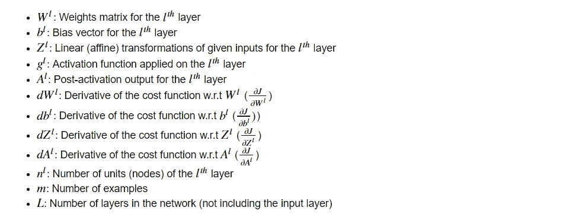
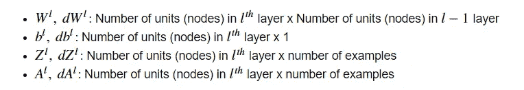
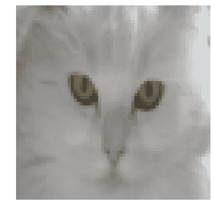
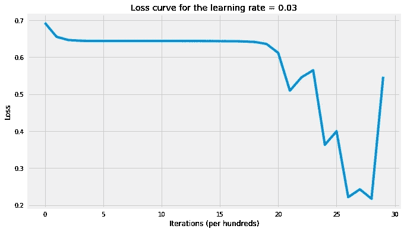
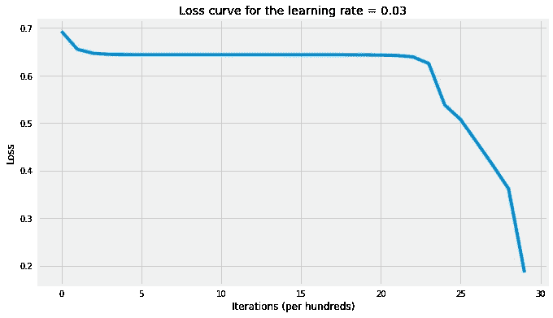

# 编码神经网络——前向传播和反向传播

> 原文：<https://towardsdatascience.com/coding-neural-network-forward-propagation-and-backpropagtion-ccf8cf369f76?source=collection_archive---------1----------------------->

**为什么是神经网络？**

根据*通用逼近定理*，给定足够大的层和期望的误差范围，神经网络可以逼近、学习和表示任何函数。神经网络学习真正功能的方式是在简单的基础上建立复杂的表示。在每个隐藏层上，神经网络通过首先计算给定输入的仿射(线性)变换，然后应用非线性函数来学习新的特征空间，该非线性函数又将成为下一层的输入。这一过程将继续下去，直到我们到达输出层。因此，我们可以将神经网络定义为从输入端通过隐含层流向输出端的信息流。对于一个三层神经网络，学习的函数将是: *f(x) = f_3(f_2(f_1(x)))* 其中:

*   *f1(x)*:在第一个隐藏层学习的函数
*   *F2(x)*:在第二隐藏层学习的函数
*   *F3(x)*:在输出层学习的功能

因此，在每一层上，我们学习不同的表现，随着后面的隐藏层变得更加复杂。下面是一个 3 层神经网络的例子(我们不考虑输入层):


**Figure 1:** Neural Network with two hidden layers

比如计算机不能直接理解图像，不知道如何处理像素数据。然而，神经网络可以在识别边缘的早期隐藏层中建立图像的简单表示。给定第一个隐藏层输出，它可以学习拐角和轮廓。给定第二个隐藏层，它可以学习鼻子等部位。最后，它可以学习对象身份。

由于**真相从来都不是线性的**并且表示对于机器学习算法的性能非常关键，神经网络可以帮助我们建立非常复杂的模型，并将其留给算法来学习这种表示，而不必担心特征工程，这需要从业者花费非常长的时间和精力来策划一个好的表示。

这篇文章有两部分:

1.  神经网络编码:这需要编写所有的助手函数，使我们能够实现一个多层神经网络。在这样做的时候，我会尽可能地解释理论部分，并给出一些实现上的建议。
2.  应用:我们将实现我们在第一部分中编写的关于图像识别问题的神经网络，看看我们构建的网络是否能够检测图像中是否有猫或狗，并看到它在工作:)

这篇文章将是一系列文章中的第一篇，涵盖了在 numpy 中实现神经网络，包括*梯度检查，参数初始化，L2 正则化，丢失*。创建这篇文章的源代码可以在[这里](https://nbviewer.jupyter.org/github/ImadDabbura/blog-posts/blob/master/notebooks/Coding-Neural-Network-Forwad-Back-Propagation.ipynb)找到。

```
# Import packages
import h5py import
matplotlib.pyplot as plt
import numpy as np
import seaborn as sns
```

# I .神经网络编码

# 正向传播

输入 *X* 提供初始信息，然后传播到每层的隐藏单元，并最终产生输出 y^.。网络的架构需要确定其深度、宽度和每层使用的激活函数。**深度**是隐藏层数。**宽度**是每个隐藏层上的单元(节点)数量，因为我们不控制输入层和输出层的尺寸。有相当多组激活函数，如*整流线性单元、Sigmoid、双曲线正切等*。研究已经证明，更深的网络优于具有更多隐藏单元的网络。因此，培养一个更深层次的关系网(收益递减)总是更好，也不会有坏处。

让我们首先介绍一些将在本文中使用的符号:



接下来，我们将以通用形式写下多层神经网络的维度，以帮助我们进行矩阵乘法，因为实现神经网络的主要挑战之一是获得正确的维度。



我们需要实现前向传播的两个方程是:这些计算将发生在每一层上。

# 参数初始化

我们将首先初始化权重矩阵和偏差向量。值得注意的是，我们不应该将所有参数初始化为零，因为这样做会导致梯度相等，并且每次迭代的输出都是相同的，学习算法不会学到任何东西。因此，将参数随机初始化为 0 到 1 之间的值很重要。还建议将随机值乘以小标量，如 0.01，以使激活单元处于活动状态，并位于激活函数导数不接近零的区域。

# 激活功能

对于哪种激活功能在特定问题上效果最好，没有明确的指导。这是一个反复试验的过程，人们应该尝试不同的功能集，看看哪一个最适合手头的问题。我们将介绍 4 种最常用的激活功能:

*   **乙状结肠函数(**σ**)**:*g(z)*=*1/(1+e^{-z})*。建议仅在输出图层上使用，这样我们可以很容易地将输出解释为概率，因为它将输出限制在 0 和 1 之间。在隐藏层上使用 sigmoid 函数的一个主要缺点是，在其域的大部分上，梯度非常接近于零，这使得学习算法学习起来缓慢且困难。
*   **双曲正切函数**:*g(z)*=*(e^z -e^{-z})/(e^z+e^{-z})*。它优于 sigmoid 函数，在 sigmoid 函数中，其输出的平均值非常接近零，换句话说，它将激活单元的输出集中在零附近，并使值的范围非常小，这意味着学习速度更快。它与 sigmoid 函数共有的缺点是在域的好的部分上梯度非常小。
*   **整流线性单元(ReLU)**:*g(z)**= max { 0，z}* 。接近线性的模型易于优化。由于 ReLU 与线性函数有许多相同的性质，它在大多数问题上都表现得很好。唯一的问题是导数没有定义在 *z = 0* ，我们可以通过在 *z = 0* 将导数赋值为 0 来解决这个问题。然而，这意味着对于 z ≤ 0，梯度为零，再次无法学习。
*   **漏整流线性单元**:*g(z)*=*max {α* z，z}* 。它克服了 ReLU 的零梯度问题，并为 *z* ≤ 0 指定了一个小值 *α* 。

如果你不确定选择哪个激活函数，从 ReLU 开始。接下来，我们将实现上面的激活函数，并为每个函数绘制一个图表，以便更容易地看到每个函数的域和范围。

# 正向输送

给定来自前一层的输入，每个单元计算仿射变换 *z = W^Tx + b* ，然后应用激活函数 *g(z)* ，例如 ReLU 元素方式。在这个过程中，我们将存储(缓存)在每一层上计算和使用的所有变量，以便在反向传播中使用。我们将编写将在 L 模型正向传播中使用的前两个助手函数，以使其更易于调试。请记住，在每一层上，我们可能有不同的激活函数。

# 费用

我们将使用二元**交叉熵**成本。它使用对数似然法来估计其误差。代价是:上述代价函数是凸的；然而，神经网络通常会陷入局部极小值，不能保证找到最优参数。我们将在这里使用基于梯度的学习。

# 反向传播

允许信息通过网络从成本回溯，以计算梯度。因此，以相反的拓扑顺序从最终节点开始循环遍历节点，以计算最终节点输出相对于每条边的节点尾部的导数。这样做将帮助我们知道谁对最大的错误负责，并在那个方向上改变参数。下面的导数公式将帮助我们编写反向传播函数:因为 *b^l* 总是一个向量，所以总和将是跨行的(因为每一列都是一个例子)。

# 二。应用

我们将要处理的数据集有 209 张图片。每幅图像的 RGB 比例为 64 x 64 像素。我们将建立一个神经网络来分类图像是否有猫。因此，*∈*{ 0，1}* 。*

*   *我们将首先加载图像。*
*   *显示猫的样本图像。*
*   *改变输入矩阵的形状，使每一列都成为一个示例。此外，由于每张图片的大小为 64 x 64 x 3，因此每张图片有 12，288 个特征。因此，输入矩阵应为 12，288 x 209。*
*   *将数据标准化，这样梯度就不会失控。此外，它将有助于隐藏单位有类似的价值范围。现在，我们将每个像素除以 255，这应该不成问题。但是，最好将数据标准化为平均值为 0，标准差为 1。*

```
*Original dimensions:
--------------------
Training: (209, 64, 64, 3), (209,)
Test: (50, 64, 64, 3), (50,)New dimensions:
---------------
Training: (12288, 209), (1, 209)
Test: (12288, 50), (1, 50)*
```

**

***Figure 3:** Sample image*

*现在，我们的数据集已准备好用于测试我们的神经网络实现。先写**多层模型**函数，用预定义的迭代次数和学习速率实现基于梯度的学习。*

*接下来，我们将训练两个版本的神经网络，其中每个将在隐藏层上使用不同的激活函数:一个将使用整流线性单元( **ReLU** )，第二个将使用双曲正切函数( **tanh** )。最后，我们将使用从两个神经网络中获得的参数对训练示例进行分类，并计算每个版本的训练准确率，以查看哪个激活函数在这个问题上效果最好。*

```
*# Setting layers dims
layers_dims = [X_train.shape[0], 5, 5, 1]# NN with tanh activation fn
parameters_tanh = L_layer_model( X_train, y_train, layers_dims, learning_rate=0.03, num_iterations=3000, hidden_layers_activation_fn="tanh")# Print the accuracy
accuracy(X_test, parameters_tanh, y_test, activation_fn="tanh")The cost after 100 iterations is: 0.6556 
The cost after 200 iterations is: 0.6468
The cost after 300 iterations is: 0.6447
The cost after 400 iterations is: 0.6441
The cost after 500 iterations is: 0.6440
The cost after 600 iterations is: 0.6440
The cost after 700 iterations is: 0.6440
The cost after 800 iterations is: 0.6439
The cost after 900 iterations is: 0.6439
The cost after 1000 iterations is: 0.6439
The cost after 1100 iterations is: 0.6439
The cost after 1200 iterations is: 0.6439
The cost after 1300 iterations is: 0.6438
The cost after 1400 iterations is: 0.6438
The cost after 1500 iterations is: 0.6437
The cost after 1600 iterations is: 0.6434
The cost after 1700 iterations is: 0.6429
The cost after 1800 iterations is: 0.6413
The cost after 1900 iterations is: 0.6361
The cost after 2000 iterations is: 0.6124
The cost after 2100 iterations is: 0.5112
The cost after 2200 iterations is: 0.5288
The cost after 2300 iterations is: 0.4312
The cost after 2400 iterations is: 0.3821
The cost after 2500 iterations is: 0.3387
The cost after 2600 iterations is: 0.2349
The cost after 2700 iterations is: 0.2206
The cost after 2800 iterations is: 0.1927
The cost after 2900 iterations is: 0.4669
The cost after 3000 iterations is: 0.1040 'The accuracy rate is: 68.00%.'*
```

**

***Figure 4:** Loss curve with tanh activation function*

```
*# NN with relu activation fn
parameters_relu = L_layer_model( X_train, y_train, layers_dims, learning_rate=0.03, num_iterations=3000, hidden_layers_activation_fn="relu")# Print the accuracy
accuracy(X_test, parameters_relu, y_test, activation_fn="relu")The cost after 100 iterations is: 0.6556
The cost after 200 iterations is: 0.6468
The cost after 300 iterations is: 0.6447
The cost after 400 iterations is: 0.6441
The cost after 500 iterations is: 0.6440
The cost after 600 iterations is: 0.6440 
The cost after 700 iterations is: 0.6440 
The cost after 800 iterations is: 0.6440 
The cost after 900 iterations is: 0.6440 
The cost after 1000 iterations is: 0.6440 
The cost after 1100 iterations is: 0.6439 
The cost after 1200 iterations is: 0.6439 
The cost after 1300 iterations is: 0.6439 
The cost after 1400 iterations is: 0.6439 
The cost after 1500 iterations is: 0.6439 
The cost after 1600 iterations is: 0.6439 
The cost after 1700 iterations is: 0.6438 
The cost after 1800 iterations is: 0.6437 
The cost after 1900 iterations is: 0.6435 
The cost after 2000 iterations is: 0.6432 
The cost after 2100 iterations is: 0.6423 
The cost after 2200 iterations is: 0.6395 
The cost after 2300 iterations is: 0.6259 
The cost after 2400 iterations is: 0.5408 
The cost after 2500 iterations is: 0.5262 
The cost after 2600 iterations is: 0.4727 
The cost after 2700 iterations is: 0.4386 
The cost after 2800 iterations is: 0.3493 
The cost after 2900 iterations is: 0.1877 
The cost after 3000 iterations is: 0.3641'The accuracy rate is: 42.00%.'*
```

**

***Figure 5:** Loss curve with ReLU activation function*

*请注意，上述准确率预计会高估概化准确率。*

# *结论*

*这篇文章的目的是一步一步地编写深度神经网络，并解释其中的重要概念。我们现在并不关心准确率，因为我们可以做很多事情来提高准确率，这将是后续帖子的主题。以下是一些要点:*

*   *即使神经网络可以表示任何函数，它也可能因为两个原因而无法学习:*

1.  *优化算法可能无法找到期望(真实)函数的参数的最佳值。它会陷入局部最优。*
2.  *由于过拟合，学习算法可能发现不同于预期函数的不同函数形式。*

*   *即使神经网络很少收敛，总是陷入局部极小值，它仍然能够显著降低成本，并以高测试精度提出非常复杂的模型。*
*   *我们在这篇文章中使用的神经网络是标准的全连接网络。然而，还有另外两种网络:*

1.  *卷积神经网络:不是所有的节点都连接在一起。图像识别类最好。*
2.  *递归神经网络:有一个反馈连接，模型的输出反馈到它自己。它主要用于序列建模。*

*   *完全连接的神经网络也会忘记前面步骤中发生的事情，并且也不知道关于输出的任何事情。*
*   *我们可以使用交叉验证来调整许多超参数，以获得最佳的网络性能:*

1.  *学习率(α):决定每次参数更新的步长。*

*A.小α会导致收敛缓慢，并且可能会在计算上变得非常昂贵。*

*B.大的α可能会导致超调，我们的学习算法可能永远不会收敛。*

*2.隐藏的层数(深度):隐藏的层数越多越好，但是要付出计算的代价。*

*3.每层隐藏单元的数量(宽度):研究证明，每层大量的隐藏单元并不能改善网络。*

*4.激活函数:在不同的应用程序和领域中，在隐藏层上使用的函数是不同的。这是一个反复试验的过程，尝试不同的功能，看看哪一个效果最好。*

*5.迭代次数。*

*   *标准化数据将有助于激活单元具有相似的值范围，并避免梯度失控。*

**原载于 2018 年 4 月 1 日*[*imaddabbura . github . io*](https://imaddabbura.github.io/posts/coding-nn/fwd-bkwd-propagation/Coding-Neural-Network-Forwad-Back-Propagation.html)*。**