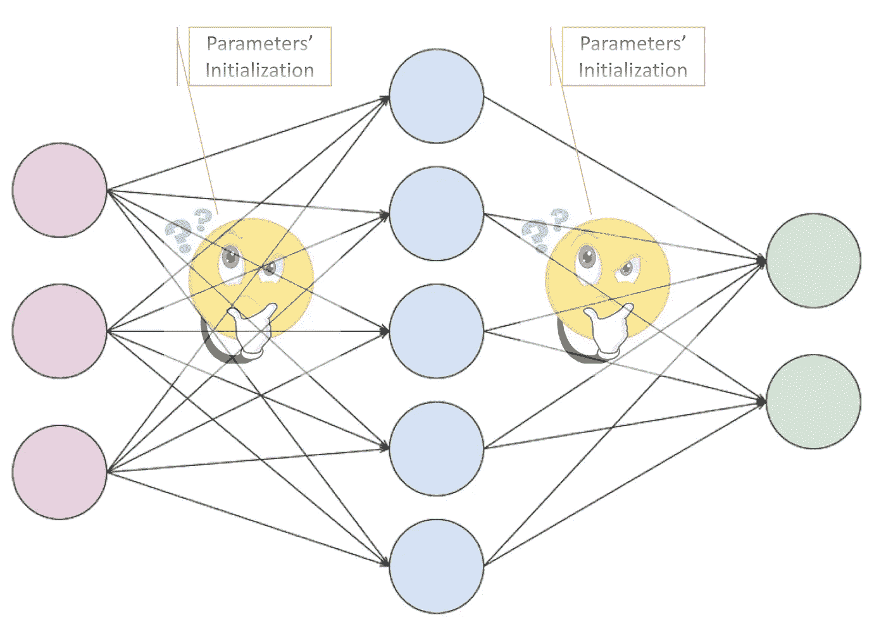
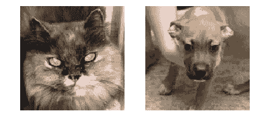
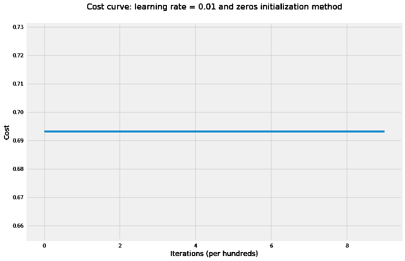
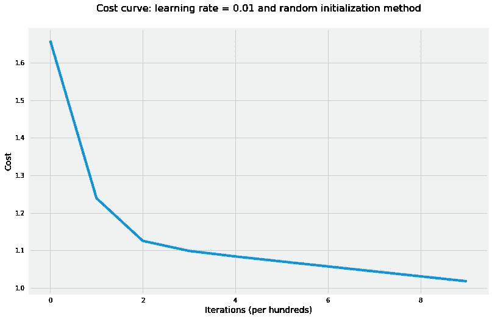
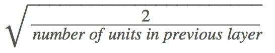
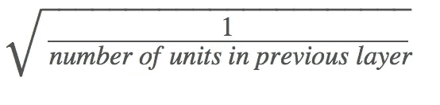
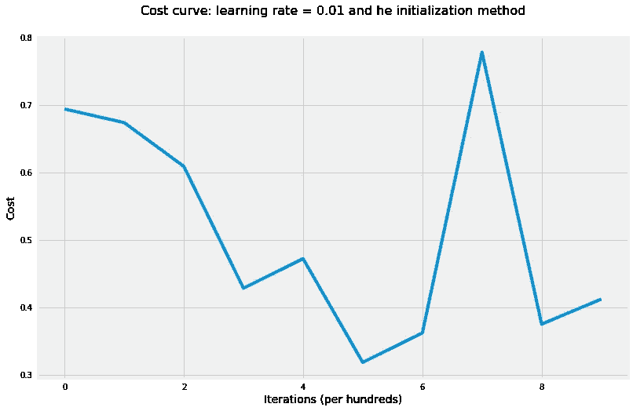
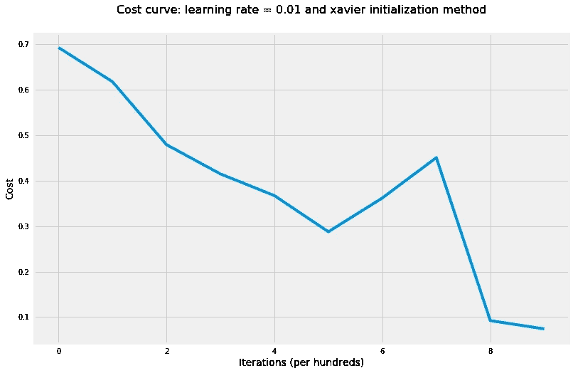

# 编码神经网络——参数初始化

> 原文：<https://towardsdatascience.com/coding-neural-network-parameters-initialization-f7c2d770e874?source=collection_archive---------4----------------------->



在机器学习/深度学习的背景下，优化是改变模型参数以提高其性能的过程。换句话说，它是在预定义的假设空间中寻找最佳参数以获得最佳性能的过程。有三种优化算法:

*   非迭代优化算法，仅求解一个点。
*   本质上是迭代的优化算法，并且收敛到可接受的解决方案，而不管参数初始化，例如应用于逻辑回归的梯度下降。
*   本质上是迭代的优化算法，应用于一组具有非凸损失函数的问题，如神经网络。因此，参数的初始化对于加快收敛速度和降低错误率起着至关重要的作用。

在这篇文章中，我们将看看参数初始化的三种不同情况，看看这是如何影响错误率的:

1.  将所有参数初始化为零。
2.  将参数初始化为标准正态分布或均匀分布的随机值，并乘以一个标量，如 10。
3.  基于以下内容初始化参数:

*   泽维尔推荐。
*   何推荐。

我们将使用我们在 [*“编码神经网络-正向传播和反向传播”*](/coding-neural-network-forward-propagation-and-backpropagtion-ccf8cf369f76) 帖子中编写的函数来初始化参数，计算正向传播和反向传播以及交叉熵成本。

为了说明上述情况，我们将使用猫和狗的数据集，该数据集由 50 幅猫的图像和 50 幅狗的图像组成。每幅图像的 RGB 色标为 150 像素 x 150 像素。因此，我们将拥有 67，500 个特征，其中输入矩阵中的每一列都是一幅图像，这意味着我们的输入数据将具有 67，500 x 100 的维度。

在启动辅助函数之前，让我们先加载数据并展示两幅图像的样本。



**Figure 1:** Sample images

我们现在将编写所有帮助函数，帮助我们基于不同的方法初始化参数，并编写 L 层模型，用于训练我们的神经网络。

# 将所有参数初始化为零

在这里，我们将初始化所有的权重矩阵和偏差为零，看看这将如何影响错误率以及学习参数。

```
# train NN with zeros initialization parameters
layers_dims = [X.shape[0], 5, 5, 1]
parameters = model(X, Y, layers_dims, hidden_layers_activation_fn="tanh", initialization_method="zeros") accuracy(X, parameters, Y,"tanh")The cost after 100 iterations is: 0.6931471805599453
The cost after 200 iterations is: 0.6931471805599453
The cost after 300 iterations is: 0.6931471805599453
The cost after 400 iterations is: 0.6931471805599453
The cost after 500 iterations is: 0.6931471805599453
The cost after 600 iterations is: 0.6931471805599453
The cost after 700 iterations is: 0.6931471805599453
The cost after 800 iterations is: 0.6931471805599453
The cost after 900 iterations is: 0.6931471805599453
The cost after 1000 iterations is: 0.6931471805599453 The accuracy rate is: 50.00%.
```



**Figure 2:** Cost curve using zero intialization method

如成本曲线所示，神经网络什么都没学到！这是因为所有神经元之间的对称性导致所有神经元在每次迭代中都具有相同的更新。因此，不管我们运行优化算法多少次迭代，所有的神经元仍然会得到相同的更新，并且不会发生学习。因此，在初始化参数时，我们必须**打破对称性**，以便模型在梯度下降的每次更新时开始学习。

# 用大随机值初始化参数

如果从标准正态分布或均匀分布初始化随机值，没有很大的区别，所以我们将在我们的例子中使用标准正态分布。此外，我们将随机值乘以一个大的数，比如 10，以表明将参数初始化为大值可能会导致我们的优化具有更高的错误率(在某些情况下甚至会发散)。现在让我们训练我们的神经网络，其中所有的权重矩阵已经使用下面的公式初始化:`np.random.randn() * 10`

```
# train NN with random initialization parameters
layers_dims = [X.shape[0], 5, 5, 1]
parameters = model(X, Y, layers_dims, hidden_layers_activation_fn="tanh", initialization_method="random") accuracy(X, parameters, Y,"tanh")The cost after 100 iterations is: 1.2413142077549013
The cost after 200 iterations is: 1.1258751902393416
The cost after 300 iterations is: 1.0989052435267657
The cost after 400 iterations is: 1.0840966471282327
The cost after 500 iterations is: 1.0706953292105978
The cost after 600 iterations is: 1.0574847320236294
The cost after 700 iterations is: 1.0443168708889223
The cost after 800 iterations is: 1.031157857251139
The cost after 900 iterations is: 1.0179838815204902
The cost after 1000 iterations is: 1.004767088515343 The accuracy rate is: 55.00%.
```



**Figure 3:** Cost curve using random initialization method

这里的随机初始化是有帮助的，但是损失函数仍然具有很高的值，并且可能需要很长时间来收敛并达到非常低的值。

# 基于 He 和 Xavier 的建议初始化参数

我们将探讨两种初始化方法:

*   当应用于隐藏层的激活函数是校正线性单元(ReLU)时，明凯 He 方法是最好的应用。因此每个隐藏层上的权重将具有以下方差:var(W^l )= 2/n^(l-1).我们可以通过将标准正态分布的随机值乘以



*   当应用于隐藏层的激活函数是双曲正切时，最好应用 Xavier 方法，使得每个隐藏层上的权重具有以下方差:var(W^l )= 1/n^(l-1).我们可以通过将标准正态分布的随机值乘以



我们将使用这两种方法训练网络，并观察结果。

```
# train NN where all parameters were initialized based on He recommendation
layers_dims = [X.shape[0], 5, 5, 1]
parameters = model(X, Y, layers_dims, hidden_layers_activation_fn="tanh", initialization_method="he") accuracy(X, parameters, Y,"tanh")The cost after 100 iterations is: 0.6300611704834093
The cost after 200 iterations is: 0.49092836452522753
The cost after 300 iterations is: 0.46579423512433943
The cost after 400 iterations is: 0.6516254192289226
The cost after 500 iterations is: 0.32487779301799485
The cost after 600 iterations is: 0.4631461605716059
The cost after 700 iterations is: 0.8050310690163623
The cost after 800 iterations is: 0.31739195517372376
The cost after 900 iterations is: 0.3094592175030812
The cost after 1000 iterations is: 0.19934509244449203The accuracy rate is: 99.00%.
```



**Figure 4:** Cost curve using He initialization method

```
# train NN where all parameters were initialized based on Xavier recommendation
layers_dims = [X.shape[0], 5, 5, 1]
parameters = model(X, Y, layers_dims, hidden_layers_activation_fn="tanh", initialization_method="xavier") accuracy(X, parameters, Y,"tanh")accuracy(X, parameters, Y, "tanh")The cost after 100 iterations is: 0.6351961521800779
The cost after 200 iterations is: 0.548973489787121
The cost after 300 iterations is: 0.47982386652748565
The cost after 400 iterations is: 0.32811768889968684
The cost after 500 iterations is: 0.2793453045790634
The cost after 600 iterations is: 0.3258507563809604
The cost after 700 iterations is: 0.2873032724176074
The cost after 800 iterations is: 0.0924974839405706
The cost after 900 iterations is: 0.07418011931058155
The cost after 1000 iterations is: 0.06204402572328295The accuracy rate is: 99.00%.
```



**Figure 5:** Cost curve using Xavier initialization method

应用这四种方法的结果表明，参数的初始值在实现低成本值以及收敛和获得较低的训练错误率方面起着巨大的作用。如果我们有测试数据，这同样适用于测试错误率。

# 结论

深度学习框架可以更容易地在不同的初始化方法之间进行选择，而不用担心我们自己实现它。尽管如此，理解参数初始值在网络整体性能中的关键作用还是很重要的。以下是一些关键要点:

*   精心选择的参数初始化值导致:

1.  加速梯度下降的收敛。
2.  增加梯度下降的可能性，以找到更低的训练和泛化错误率。

*   因为我们处理的是非凸损失函数的迭代优化算法，不同的初始化会导致不同的结果。
*   随机初始化用于打破对称性，确保不同的隐藏单元可以学习不同的东西。
*   不要初始化太大的值。
*   明凯 He (He)初始化适用于具有 ReLU 激活函数的神经网络。
*   Xavier 初始化适用于具有双曲正切激活函数的神经网络。

创建这篇文章的源代码可以在[这里](https://github.com/ImadDabbura/blog-posts/blob/master/notebooks/Coding-Neural-Network-Parameters-Initialization.ipynb)找到。

*原载于 2018 年 4 月 20 日*[*imaddabbura . github . io*](https://imaddabbura.github.io/posts/coding-nn/param-initialization/Coding-Neural-Network-Parameters-Initialization.html)*。*