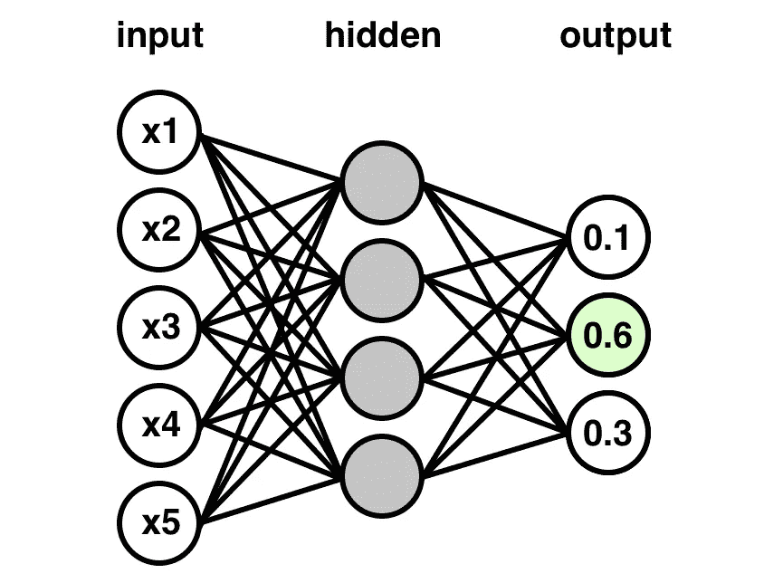

# 从头开始编写神经网络分类器

> 原文：<https://towardsdatascience.com/coding-up-a-neural-network-classifier-from-scratch-977d235d8a24?source=collection_archive---------0----------------------->

A single-layer fully-connected neural network used for classification

TensorFlow、Keras 和 Pytorch 等高级深度学习库通过隐藏神经网络的许多繁琐的内部工作细节，在使深度学习从业者的生活变得更容易方面做了出色的工作。尽管这对深度学习很有好处，但它也有一个小缺点，那就是让许多基础知识不足的新手去别处学习。我们在这里的目标是简单地提供一个从零开始编写的 ***1 隐藏层全连接神经网络分类器*** (没有深度学习库)，以帮助消除您可能对神经网络的神秘黑盒感觉。该项目的 Github repo 位于:

> 【https://github.com/ankonzoid/NN-scratch】T5[T6](https://github.com/ankonzoid/NN-scratch)

所提供的神经网络对描述属于三类小麦的谷粒的几何属性的数据集进行分类(您可以很容易地用您自己的定制数据集替换它)。假设 L2 损失函数，并且在隐藏层和输出层中的每个节点上使用 sigmoid 传递函数。权重更新方法使用德尔塔规则，该规则是具有 L2 范数的梯度下降。

在本文的剩余部分，我们将概述我们的代码构建和训练用于类预测的神经网络的一般步骤。更多我关于深度学习和强化学习的博客、教程、项目，请查看我的[**Medium**](https://medium.com/@ankonzoid)**和我的 [**Github**](https://github.com/ankonzoid) **。****

# **我们从零开始构建单层神经网络分类器的步骤**

## **1.设置多重交叉验证**

**对于我们的 N 重交叉验证，我们随机排列所有 N 个示例索引，然后将大小为~N/n 的连续块作为我们的折叠。每个折叠充当许多交叉验证实验之一的测试集，而补体指数充当训练集。**

## **2.建立和训练神经网络模型**

**我们有两个完全连接的权重层:一个连接输入层节点和隐藏层节点，另一个连接隐藏层节点和输出层节点。如果没有任何偏差项，这应该总计为网络中的(n _ input * n _ hidden+n _ hidden * n _ output)个权重。我们通过对正态分布进行采样来初始化每个权重。**

**每个节点(神经元)有 3 个属性存储在内存中:一个将自身连接到其输入节点的**权重**列表，一个通过前向传递一些输入计算的**输出**值，以及一个代表其在输出层的后向传播分类不匹配误差的**增量**值。这三个属性相互交织，并通过以下三个过程循环进行更新:**

**(A)向前传递训练示例，以在给定当前节点**权重**的情况下更新节点**输出**。每个节点输出计算为其前一层输入(无偏置项)的加权和，后跟一个 sigmoid 传递函数。**

**(B)在给定当前节点**权重**的情况下，反向传递分类错误以更新节点**增量**。为了更多地了解这些德尔塔，我们建议阅读[https://en.wikipedia.org/wiki/Delta_rule](https://en.wikipedia.org/wiki/Delta_rule)，因为我们使用的德尔塔规则方程是从对 L2 损失函数应用梯度下降得到的。**

**(C)我们使用更新的节点**输出**和**增量**来执行前向传递以更新当前的**权重**。**

**对于每个训练时期，对每个训练实例执行(A ) → ( B ) → ( C)的训练循环过程。**

## **3.进行班级预测**

**经过训练后，我们可以简单地使用该模型，通过将文本示例向前传递到训练好的神经网络中，获得输出的 argmax，来对我们的测试示例进行分类预测。准确度分数是网络正确分类的实例数除以实例总数的直观分数(在来自 n 重交叉验证的训练和测试集中)。**