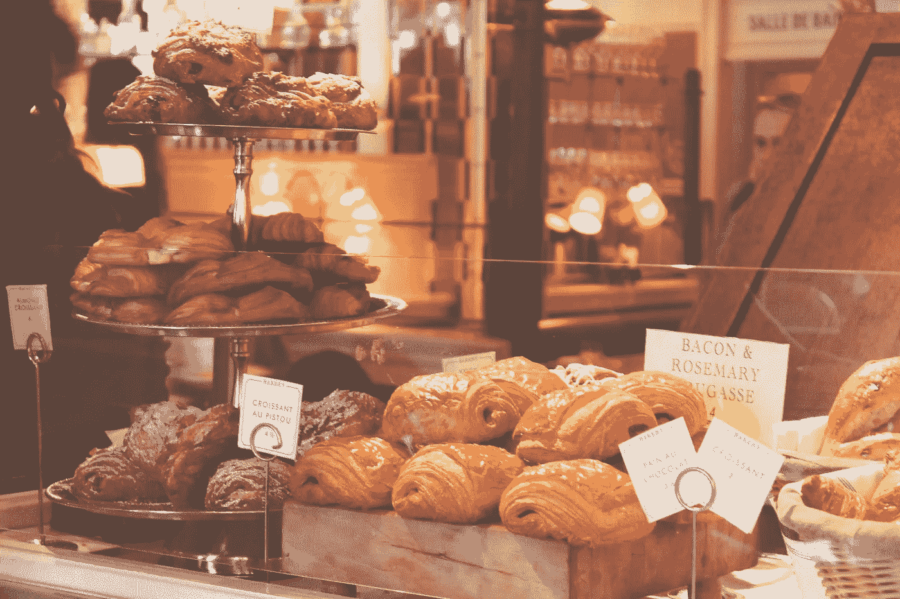

# 咖啡，伟大的连接器！

> 原文：<https://towardsdatascience.com/coffee-the-great-connector-69b4eaf99b58?source=collection_archive---------21----------------------->

## 使用 Python 和图论分析面包店的交易数据

Image from [pexels.com](http://www.pexels.com)

面包店有一种魔力。咖啡和面包的味道，温暖，色彩，*数据！*人们来来去去，再回来买咖啡、面包、糕点等各种组合。我们能否利用这些交易数据来发现模式，并深入了解哪些项目在我们的烘焙食谱中更为*重要？*

我使用了一个面包店的交易数据集和一些图论来可视化经常一起购买的物品，看看我是否能提取出任何见解。

## 数据集

我使用了一个名为“面包店交易”的数据集的数据，出于我不知道的原因，这个数据集在 Kaggle 中不再可用。数据集包含了从 2016 年 10 月 30 日到 2017 年 4 月 9 日这段时间内苏格兰一家面包店的每笔交易的数据。总共有 94 个不同项目的 9，531 个交易。

## 图论方法

每个交易可以包括多个项目。我的方法是基于数据集中的所有交易创建一个数学图。如果事务包括面包和咖啡，我在面包节点和咖啡节点之间添加了一个连接(即边)。如果面包和咖啡同时出现在不止一个交易中，我会为每个交易增加一个面包-咖啡边缘的权重。如果一个事务包含 3 个项目，那么我为每个(无序的)项目对添加一条边。

在上述过程的最后，我得到了一个*无向加权图*，其中的节点代表了数据集中观察到的所有唯一项目。节点 *x* 和节点 *y* 之间的边表示项目 *x* 和 *y* 在同一事务中出现的次数。请注意，该图还包括在交易中单独出现的项目的自身边。最后，直觉上，两个节点之间的边的权重越高，这两个项目就越“接近”。我也通过为每条边分配一个*距离*来捕捉它，这个距离是边的权重的倒数。因此，两个项目一起出现的事务越多，该边的权重就越大，这两个节点之间的距离就越小。

因此，如果面包和咖啡一起出现在 10 个交易中，面包-咖啡边的权重将是 10，其距离将是 0.1。

利用图论中的一些基本概念，我的目标是发现在图结构中处于中心位置的商品，希望中心位置能告诉我们一些关于顾客如何购买这些商品的有意义的信息。

## 代码

我使用了 python 包 **networkx** ，这是我在用 python 创建和分析图形时最喜欢的选择。你可以在[这里](https://github.com/yortos/bakery/blob/master/bakery.ipynb)找到包含所有代码的 jupyter 笔记本。

# 结果

就像我上面提到的，我检查了每一笔交易，并为交易中出现的每一对商品添加了一条无向边。只有一个项目的事务在图中为该项目添加了一个自边。得到的图有 94 个节点(等于数据集中出现的唯一项目的数量)和 1104 条加权边(包括自边)。这里有一些有趣的花絮。

1.  ***图形连接*。**如果您忽略交易中出现的几个“项目”,如“调整”,但显然不是实际项目，则生成的图表是连接的。
2.  咖啡和面包可以搭配任何食物。 在计算唯一邻居时，Coffee 有 79 个唯一邻居，这意味着它至少出现在一个交易中，数据集中有 94 个唯一条目中的 79 个。如果不算咖啡的话，93 分之 78。面包以 75 度紧随其后。茶、蛋糕和果汁的度数分别为 68、64 和 58。
3.  ***但是咖啡什么都配*更*！*它的加权度为 7，285，而面包的加权度为 4，722。茶和蛋糕仍然排在第三和第四位(分别是 2572 和 1997)，但现在我们的糕点排在前五位，果汁勉强进入前十。**
4.  果汁有更多的朋友，但糕点是更好的朋友，因为它的种类更少。 从上面的第 2 点和第 3 点我们可以看出，尽管糕点在交易中伴随着较少的项目(糕点在图中具有更少的唯一邻居)，但是糕点具有更高的加权度。这意味着糕点可以搭配很少的食物，但是*可以很好的搭配这些食物。*
5.  ***咖啡的介数中心性最高。*** 手中有了一个结构良好的图，我们就可以计算出各种节点的中心性度量。这里我只阐述**中间中心性**和**特征向量中心性的结果。**让我们从中间性开始(见下面的特征向量中心性)。中间中心性大致意味着一个节点在两个其他节点之间充当桥(或桥的一部分)的次数。对于图中的每两个节点，我计算了它们之间的 Dijkstra 最近路径，其中“最近”意味着最小化路径中边的距离之和的路径。这产生了一组 4，186 条路径(92 选择 2 种组合。我们只有 92 个项目，而不是 94 个，因为那是最大连接组件的大小)。然后我数了每一项在这些最接近的路径中出现了多少次。这个数字大致代表了每个节点的介数中心性。到目前为止，咖啡的中间中心度最高，出现在 3950 条路径中，而面包的中间中心度为 1012 条。茶，斯堪的纳维亚和艺术托盘分别以 529，190 和 182 的路径关闭了前 5 名。
6.  ***咖啡具有最高的特征向量中心性。*** 也许图中最广泛使用的中心性概念是特征向量中心性。这个中心性粗略地指示了所有其他节点*说*该节点在图中的中心程度。因此，这不仅是关于你在图中的中心位置，也是关于你的邻居 T21 的中心位置。这是谷歌最初的 PageRank 算法背后的主要思想。计算事务图的特征向量中心性向我们显示，Coffee 具有最高的中心性，但是与中间中心性相比，前 5 名更加接近。面包、茶、蛋糕和果汁是前五名中剩下的不到 0.2 个单位(这个指标从 0 到 1)。

这种图论方法还可以应用于哪些数据集，它能告诉我们什么？

*你可以在这里* *找到 jupyter 笔记本的所有代码和数据集* [*。*](https://github.com/yortos/bakery/blob/master/bakery.ipynb)

感谢阅读！