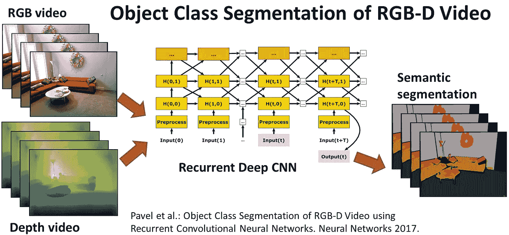

# 认知机器人:学习环境感知

> 原文：<https://towardsdatascience.com/cognitive-robotics-learning-environment-perception-9f13ebfd89be?source=collection_archive---------3----------------------->

Image source: Autonomous Intelligent Systems Group, [University of Bonn](http://www.ais.uni-bonn.de/research.html)

为了让机器人成功地感知和理解它们的环境，必须教会它们以目标导向的方式行动。虽然绘制环境几何图形是许多移动机器人应用的必要先决条件，但理解环境的语义将使新的应用成为可能，这需要更高级的认知能力。

波恩 大学 [**自主智能系统组的负责人斯文·贝恩克**，正在通过结合密集几何建模和语义分类来解决机器人学的这一领域。通过这个，环境的 3D 语义地图被建立。Sven 的团队已经展示了认知机器人在多个具有挑战性的应用领域中的语义环境感知的效用，包括家政服务、太空探索、搜索和救援以及捡垃圾箱。](http://www.ais.uni-bonn.de/behnke/)

在 6 月 28 日至 29 日在阿姆斯特丹 举行的 [**机器智能峰会上，Sven 将分享他和他的团队为学习任务开发的方法的专业知识，如表面分类、物体的检测、识别和姿态估计，以及将操作技能转移到新物体。为了了解更多信息，我在峰会前问了他几个问题。**](https://www.re-work.co/events/machine-intelligence-summit-amsterdam-2017)

你能告诉我们更多关于你的工作吗？

波恩大学的自主智能系统小组研究认知机器人和深度学习。我们为半结构化领域开发了多个机器人系统，如家政服务、搜索和救援、空中检查、太空探索、捡垃圾和踢足球。我们工作的主要重点是感知，即解释 3D 激光扫描仪和 RGB-D 相机等机器人传感器的测量结果，以获得适合规划机器人行动的环境模型。

我们还研究了机器人系统中运动和操纵以及学习的有效规划。我们将我们的开发集成到自主执行复杂任务的系统中。我们团队 NimbRo 的机器人在多个机器人比赛和挑战中表现出色，包括 DARPA 机器人挑战赛、RoboCup 足球和@Home、欧洲机器人挑战赛、亚马逊采摘挑战赛、DLR SpaceBot 杯和 MBZIRC。

**您认为是什么主导因素推动了认知机器人技术的最新发展和普及？**

传感方面的进步，如负担得起的 RGB-D 相机和小型 3D 激光扫描仪，以及计算方面的进步，如微型电脑和可编程图形处理器，构成了环境语义感知的基础。语义感知是通过收集大型注释数据集和执行例如图像分类、对象检测、姿态估计、语义分割等的深度学习方法来实现的。这些语义感知与高效的同步定位和地图创建方法(SLAM)相结合以获得 3D 语义地图。

另一个有利因素是更轻、更顺从的驱动，这允许人-机器人协作和身体接触。规划方面的进步，例如通过分层的、组合的方法，使得实时的自适应机器人动作的鲁棒生成成为可能。最后，更好的连接和云服务将认知机器人嵌入更大的基础设施。

认知机器人的哪些现在或未来潜在的应用最让你兴奋？

目前，高级驾驶辅助系统和自动驾驶汽车肯定是影响最大的认知机器人应用。使用协作机器人的灵活工业自动化正在获得动力。我最感兴趣的是认知服务机器人，它结合了半结构化环境中的鲁棒移动性、类似人类的操纵技能和直观的多模态人机交互。这种机器人可能会彻底改变餐馆和医疗保健等专业服务行业，但也可以在日常环境中提供帮助和做家务。

**你觉得未来哪些行业会被认知机器人最大程度地颠覆？**

所有人类重复劳动的行业都会受到影响。工业生产、农业、交通和物流领域的自动化程度将大幅提高。还有专业服务，如清洁、转售、餐馆、护理设施等。会越来越依赖认知机器人助手。一旦认知机器人变得负担得起，它们也将在我们的家中提供帮助。

**在接下来的五年里，我们可以期待看到认知机器人技术的哪些发展？**

我期待着功能的增加和成本的降低，这将使越来越多的应用领域成为可能，并创造一个认知机器人产业。

另一个令人兴奋的发展可能是人类和认知机器人系统之间更紧密的共生关系，这不仅是为了补偿身体或认知缺陷，也是为了提高生活质量和增强人类能力。

> Sven Behnke 将在 6 月 28 日至 29 日在阿姆斯特丹举行的**机器智能峰会上发表讲话，同时还将举行 [**自动驾驶汽车机器智能峰会**](https://www.re-work.co/events/machine-intelligence-in-autonomous-vehicles-summit-amsterdam-2017) 。会见领先的专家并向他们学习人工智能将如何影响交通、制造、医疗保健、零售等领域。现在门票有限，在这里注册参加。**

**其他确认的演讲者包括 Roland Vollgraf，研究负责人，**Zalando Research**；Neal Lathia，高级数据科学家，**Skyscanner**；科学主任 Alexandros Karatzoglou，**télefonica**；Ingo Waldmann，高级研究科学家，**UCL**；以及深度学习能力中心主任 Damian Borth， **DFKI** 。点击查看更多演讲者和话题。**

**机器智能峰会和自动驾驶汽车中的机器智能峰会也将于 11 月 9 日至 10 日在香港举行。**

***本次采访中表达的观点可能不代表 RE WORK 的观点。因此，有些观点甚至可能与 RE WORK 的观点相左，但发布这些观点是为了鼓励辩论和全面的知识共享，并允许不同的观点呈现给我们的社区。***