# 口红推荐的协作嵌入

> 原文：<https://towardsdatascience.com/collaborative-embeddings-for-lipstick-recommendations-98eccfa816bd?source=collection_archive---------8----------------------->

## Sephora SEA 机器学习案例研究

对于一家电子商务公司来说，花时间和精力去了解客户行为，对客户和公司本身来说都是一种双赢的策略。

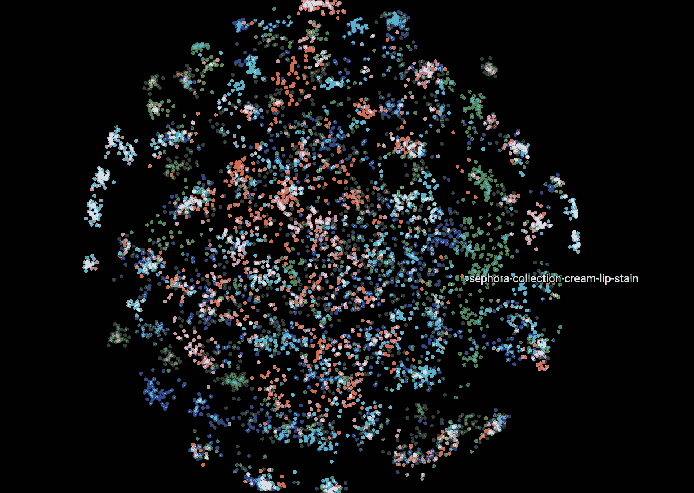

Embeddings: turning beauty products into vectors

例如，执行良好的产品策划是销量**和多样性**的**关键驱动力**，也是客户参与品牌的关键驱动力。它还能让购物者花更少的时间浏览他们真正想要的东西。

在我的公司 Sephora SEA，我们利用客户生成的数据来更好地了解我们的业务，并为我们的客户创造愉快的购物体验。

在这个故事中，

*   我演示了如何将来自自然语言处理 (NLP)的**研究思想，更准确地说是来自*手套*论文【1】的研究思想，移植到**项目到项目** **产品推荐系统中。****
*   我展示了如何利用丝芙兰电子平台上的**顾客浏览数据**来*了解美容产品的* **密集表示**，也就是*又名。嵌入。*
*   我用嵌入的**可视化**和**基础代数**研究了*通过算法*学到了什么。
*   我介绍了推荐系统离线评估的度量标准，并给出了不同方法的基准。

在行业中已经有相当多的嵌入式应用记录[4][5]。本案例研究旨在补充那些特别关注**产品发现**和**嵌入代数**的案例。

这篇文章的布局是

*   **0 |单词嵌入入门**
*   **1 |构建协同推荐系统**
*   **2 |离线基准**
*   **3 |产品发现的嵌入代数**
*   **4 |视角**

# 0 |单词嵌入入门

NLP 中的一个主要挑战在于文本数据的数学表示。

一个产生有趣结果的简单方法在于单词的**一键编码**:对于给定的词汇集***【V******| V |***，每个单词都用它在 ***V*** *中的位置来表示。*

反过来，一个文档***【d】***由它的字 ***W*** 中的 ***V*** 中的位置来表示。结果是一个长度为“在 ***V*** 中的字数”的*稀疏*向量，除了在 ***W*** 的位置之外，所有系数都为零。

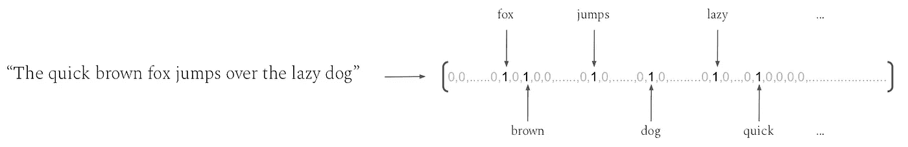

Example of one-hot encoding of a sentence. Semantic and syntactic similarities are omitted.

一键编码的问题是，它认为单词是完全离散的实体，完全由其拼写定义:**它忽略了单词的语义和句法相似性**。

例如，在这个模型中，“狗”与“拉布拉多”的不同之处就像它与任何其他单词的不同之处一样，比如“滑板”。

提出*密集*(≠稀疏)，低维(∼30 到 300)单词表示，具有语义和句法规则，在 2001 年首次成为感兴趣的领域[2]，并在 2013 年开始广泛流行[3]。

这些表示被称为 ***嵌入*** 。

这个想法在于使用**巨大的文本语料库**来学习那些嵌入，目的是在相同上下文中经常出现的**单词应该具有相似的向量**。

特别是，GloVe 算法[1]因其简单性和有效性而脱颖而出:它建议将问题视为矩阵分解问题。

要分解的矩阵是单词到单词共现矩阵:a ***|V|×|V|*** 矩阵，其中每个系数是两个单词在同一**上下文**中出现的次数。

> "词汇和美容产品都是可以放入语境中的独立实体."

注意:上下文的定义取决于用户。例如，可以使用 3 个单词的滑动窗口。

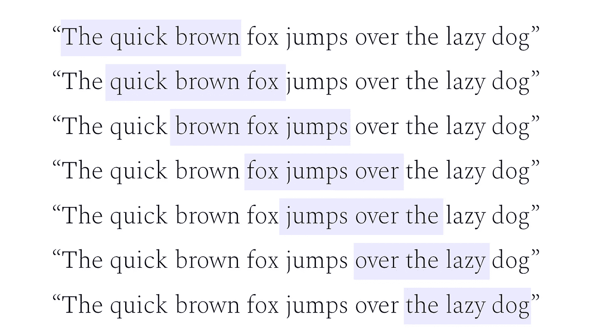

Context generation with 3-word-long sliding window

词语和美容产品都是可以放入语境中的独立实体。

对于电子商务中的美容产品，上下文可以由以下内容组成:

*   结账篮
*   意愿列表共现
*   产品浏览会话上的滑动窗口
*   和许多其他信号

听起来手套的**原理可以用来衍生产品的密集表示**。让我们看看如何做到这一点。

# 1 |建立协同推荐系统

在本案例研究中，我们的输入信号将完全来自客户浏览会话，其中产品上下文由滑动窗口生成。

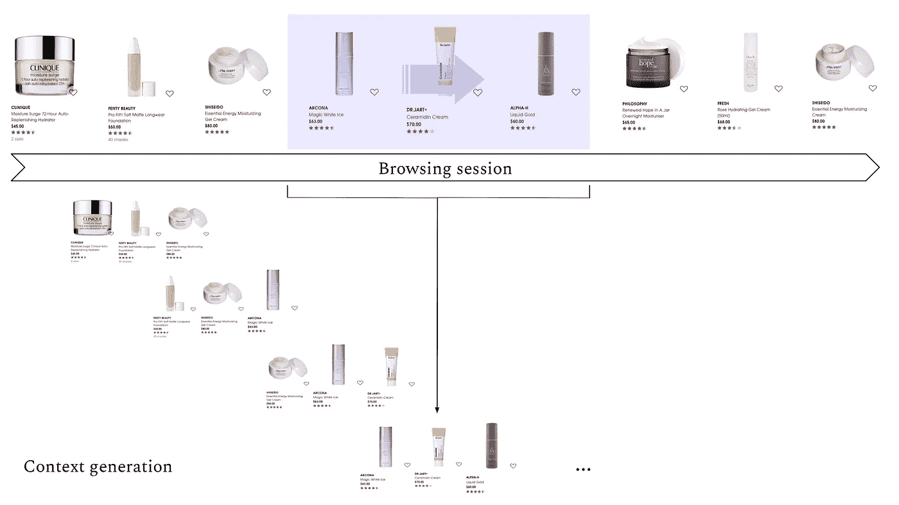

How contexts can be derived from browsing sessions

从这个上下文生成方案中，我们可以导出一个产品共现矩阵 ***X*** 。

The co-occurrence matrix

该矩阵是输入数据的汇总，也是我们将使用的唯一信号。

直觉上，

*   **强相关产品**应具有**高共现**编号
*   **强相关产品**出现在**相似语境**中。它们与产品目录中的产品的共现特征应该相似。
*   **非常受欢迎的产品**可能会与目录中的许多产品出现强烈的同现号。但这并不意味着它们与所有产品都相关。这相当于 NLP 中的 [*停用词*](https://en.wikipedia.org/wiki/Stop_words) 。

## 模型

*GloVe* 建议的是将 ***log(X)*** 分解为**具有加性偏差的嵌入矩阵的点积**。关于这个模型的细节和原因的更多信息，我强烈建议你参考最初的[论文](https://nlp.stanford.edu/pubs/glove.pdf)。

在本案例研究中，我们选择考虑一个与要学习的参数密切相关的分解模型:

*   嵌入矩阵 ***E*** ，大小为|***V***|×***D***。 ***D*** 是嵌入物的尺寸。注意，**t39】dt41】≪|**t43】vt45】|。****
*   偏置向量 ***b*** ，大小为| ***V*** |。我们稍后会看到，这是一种产品*流行偏见*，它有助于应对过度流行产品的影响。

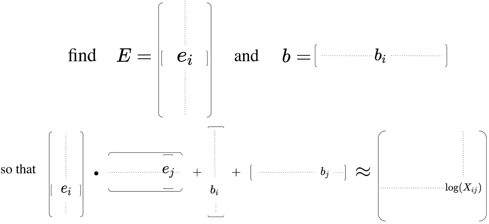

The factorisation model

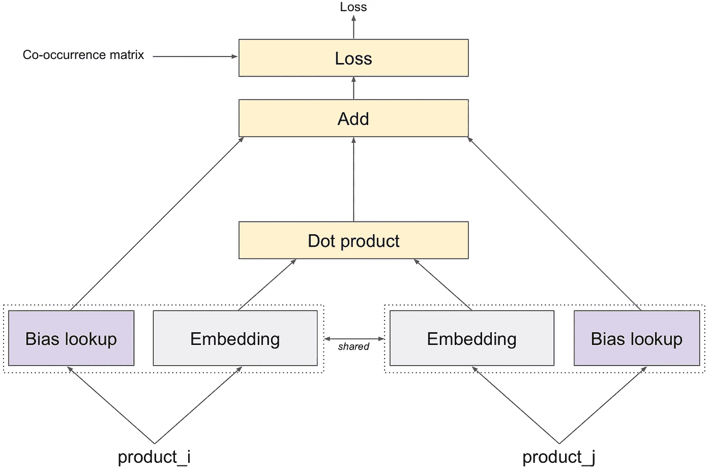

Representation as a (very) shallow neural network

相应的目标函数(损失最小化)为:

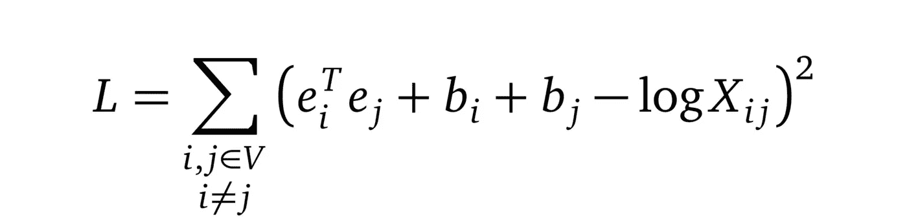

Objective function

参数***【E】***和 ***b*** 可以通过例如[小批量随机梯度下降](https://en.wikipedia.org/wiki/Stochastic_gradient_descent)来学习:该算法将迭代地查看小批量的产品对，并相应地利用同现计数来优化它们相应的嵌入和偏差。

一旦嵌入被学习，向量相似性的一个**普通度量**是*余弦相似性*。

因此，它可以用于导出完全协作的项目到项目推荐系统。

Cosine similarity for embeddings

## 可视化

像 [Tensorboard 投影仪](https://projector.tensorflow.org/)这样的工具可以帮助可视化 2D 或 3D 投影中的嵌入。

> 这里有一些关于你如何自己使用它的提示

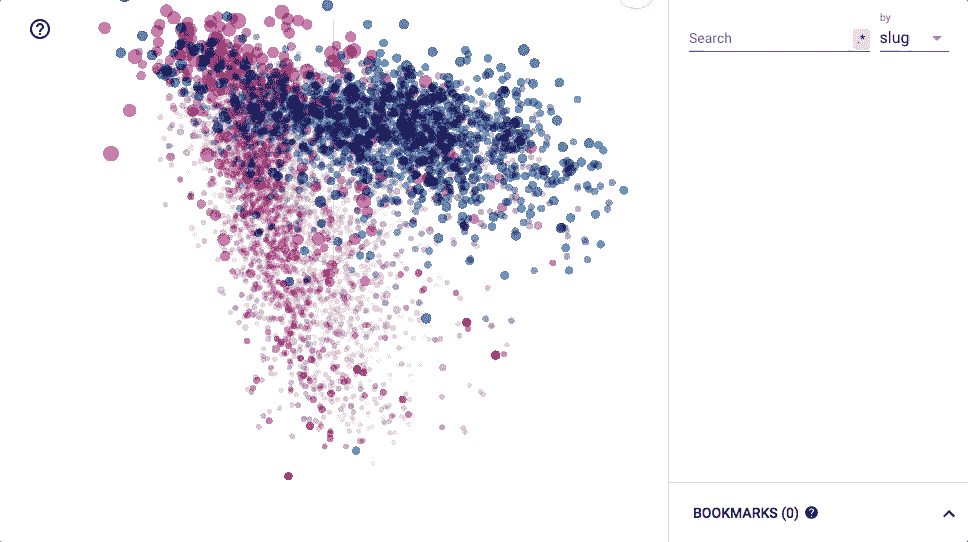

Tensorboard projector for 3D embeddings visualisation. Each point is a product. Its colour corresponds to its highest-level category.

另一个我个人喜欢的可视化是在色标上绘制嵌入系数值。以某种方式订购产品有助于展示有趣的图案。

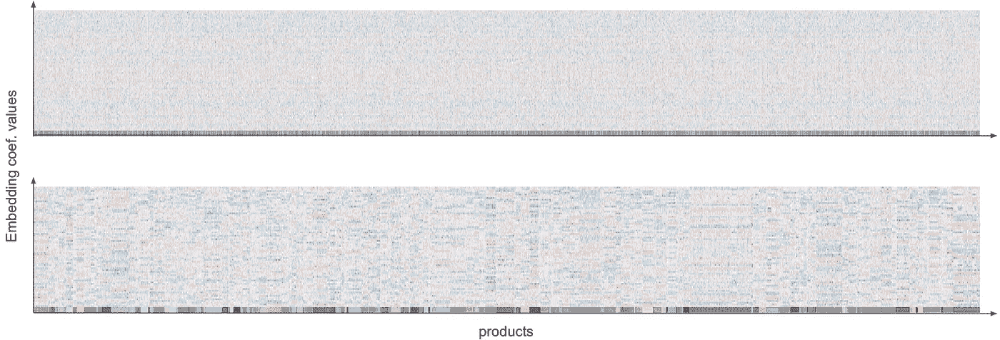

On the top plot, the products are randomly ordered. On the bottom plot, they are ordered according to brand. The latter exhibits horizontal patterns and shows how brand information was implicitly learnt. Note that the bottom ruler indicates brand.

偏见 ***b*** 怎么样？这些对应什么？

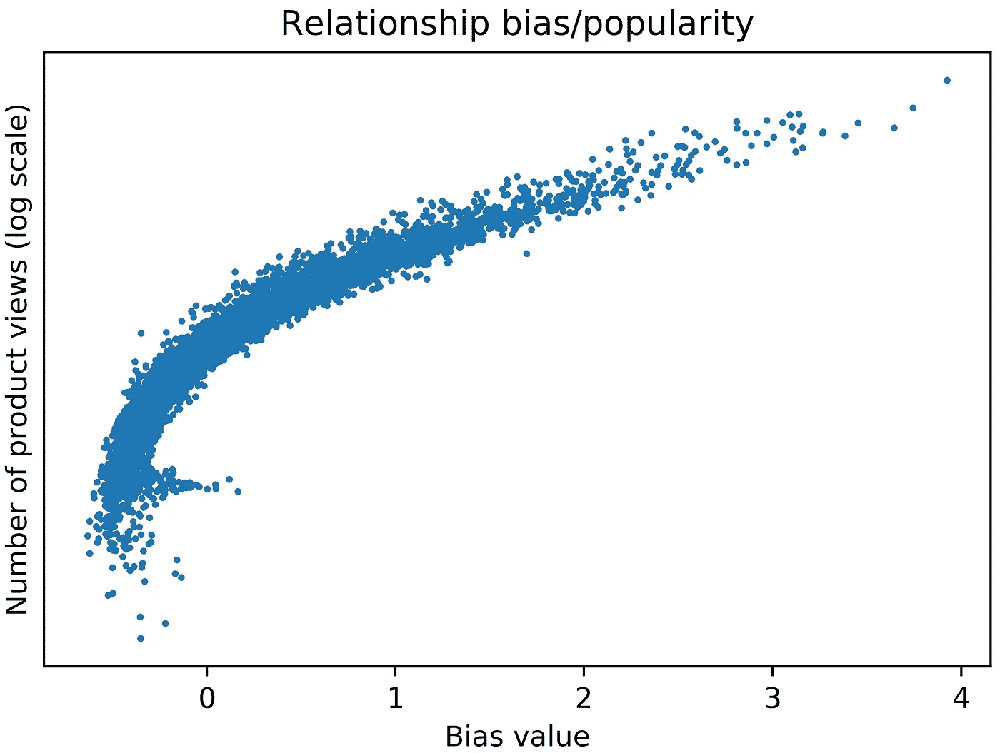

当绘制学习偏见与产品受欢迎程度(在视图中)的关系时，有一个明显的相关性。手套策略允许将流行性从嵌入中抽象出来，这确实是一个很好的特性。

## 定性示例

一些单品对单品推荐示例:

## 更进一步:加入边信息

嵌入成功地学习了一些产品关联。特别是，推断出了产品**元数据**(品牌、类别、范围、属性、益处……)。如果该信息已经可用，则可以将其集成到学习逻辑中。

例如，在美容产品的情况下，我们可以查看产品的**品牌**及其**类别**。

举个例子，

这些元数据的嵌入也可以被学习并用于丰富产品向量表示。

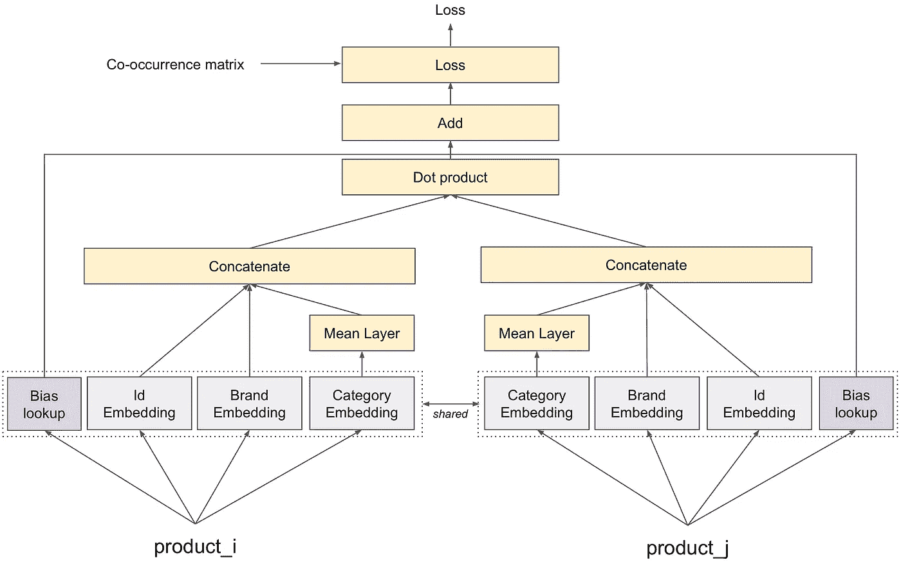

GloVe for product representation learning, with side-information. The mean layer following the category embedding layer is to manage multi-category products.

注意，每种元数据类型的影响都可以通过为它们各自的嵌入选择维度来监控(维度越高，影响越强)。

这种架构在非常稀疏的共生矩阵或*冷启动* ( *ie)的情况下非常有用。*新引入)项，因为它**弥补了缺乏与产品元数据的协作数据**。

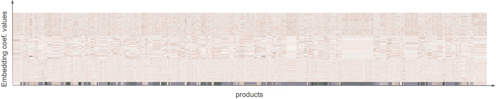

Embeddings learnt with a GloVe-like strategy with side-information. Products are ordered by brand. The bottom ruler represents brand. The concatenated brand and category embeddings are clearly visible.

另一种方法[6]是将元数据实体视为产品本身:具有相同品牌的产品更接近于相同的品牌嵌入。优点是预测时的架构类似于没有边信息的网络。

# 2 |离线基准测试

为了评估推荐的性能，没有什么比现场测试更好的了，无论是通过 A/B 测试(见我的[前一篇](/the-art-of-a-b-testing-5a10c9bb70a4))还是强化学习。

尽管如此，你仍然可以通过分割你的训练集并尝试预测下一次购买/观看来验证你的算法。

虽然这些基准测试的准确性很重要，但一个经常被**忽略的**考虑因素是推荐项目的多样性。

## 关于长尾产品

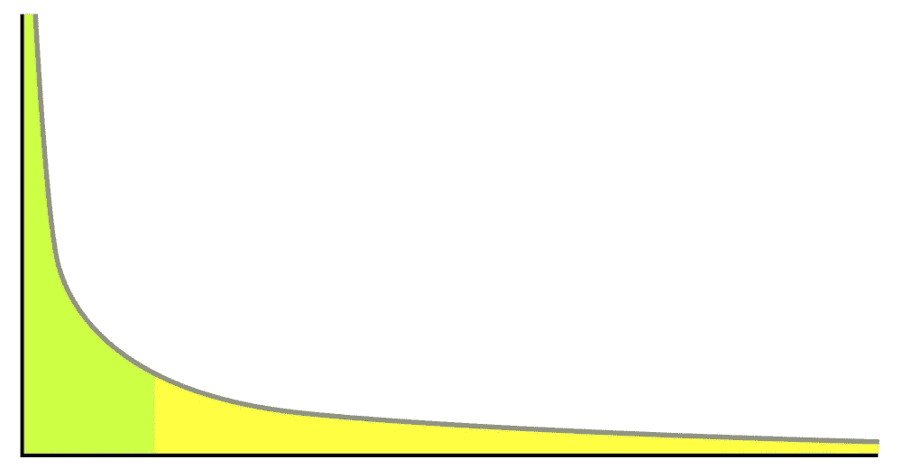

Illustration of a long tail (from [wikipedia](https://en.wikipedia.org/wiki/Long_tail)). In our current context, X-axis: products ordered by descending popularity. Y-axis: popularity

在绝大多数零售公司中，受欢迎程度(例如以购买数量来衡量)远远不是同质的。

相对较少的产品会占据销售额的大部分。

其余产品不常购买，代表收入机会(长尾产品)。

## 可发现性的度量

应对这类产品的一种方法是通过推荐来确保它们的可发现性。因此，我们着眼于系统对每个产品的公平性。

为此，对于给定的推荐系统 ***R*** ，我们为每个产品 ***i*** 引入一个可发现性评分( *dscore* )。

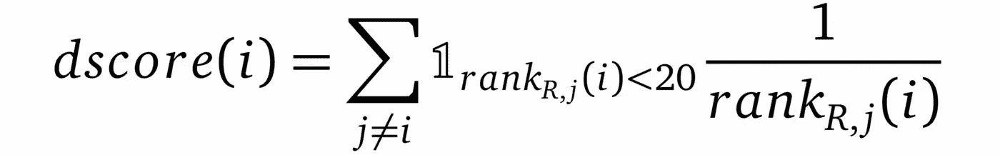

This dscore measures how well product i is being represented in the other products’ recommendations. The rank function is the rank of product i in recommendations coming from j, under system R.

人们可以查看目录中所有产品的 *dscore* 的重新分配，按降序 *dscore* 排序。再一次，再分配很可能是尾巴形的，但是**尾巴越重，所有产品的代表就越公平**。

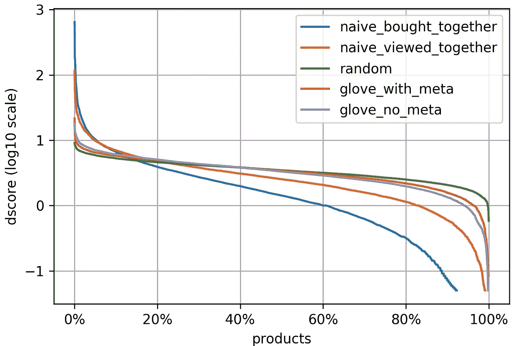

Repartition of dscores for all products, ordered in descending dscore, given different recommender systems

## 评论

*   天真的*一起购买/观看*推荐系统简单地包括，对于一个产品，查看在相同的收银台/观看环境中出现最多的产品。
*   包含了一个**随机**推荐系统的基线曲线。毫无意外，它实现了**最佳发现性能**，代价是**大部分不相关的推荐**。它提醒我们不能只考虑这个评估指标。
*   *一起购买*实现最差的发现性能，主要是因为在考虑篮子时，共生矩阵的稀疏性更大。在这种情况下，冷启动产品更有可能出现。
*   *一起看*比*一起买*获得更好的发现性能，这要归功于更密集的同现矩阵。但是，它受到产品流行偏见的限制。
*   *GloVe* 实现了更好的发现性能，这要归功于在学习算法中集成了流行度偏差(如上所示)。此外，注入产品元数据使冷启动产品更容易被发现。

在前面的定性例子中，你可能会认为推荐大多来自同一个品牌。

虽然按品牌购买美容产品并不罕见，但这些建议可能会让顾客保持循环，并影响其他品牌的发现。

让我们看看解决这个问题的方法。

# **3 |产品发现的嵌入代数**

嵌入有一个令人惊讶的特性，基本代数(平均值、和、差)可以用它们来执行，同时使人类理解。

这是令人惊讶的，因为这种考虑没有出现在模型中。

让我们看几个美容产品的例子。

## 产品超群

从学习到的产品嵌入中，你实际上可以通过平均来自同一品牌的产品向量来导出品牌的嵌入。

品牌相似性和品牌映射可以从那里计算出来。

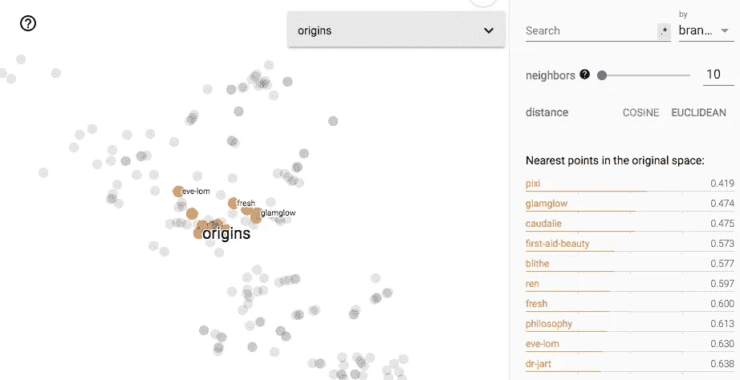

Brand embeddings visualised in Tensorboard Projector (2D t-SNE projection)

## 与品牌无关的表述

如果我们只对产品的功能和好处感兴趣，而对品牌不感兴趣，那会怎样？我们能想出*品牌不可知的*向量表示和*品牌不可知的*推荐器吗？

实现这一点的一个方法是，对于一个给定的产品，从它的嵌入中提取它的品牌向量表示。

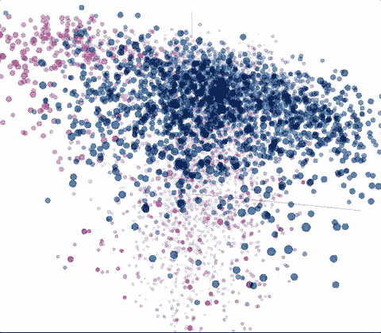

3D projection of the original embeddings. Each colour corresponds to a product’s highest-level category.

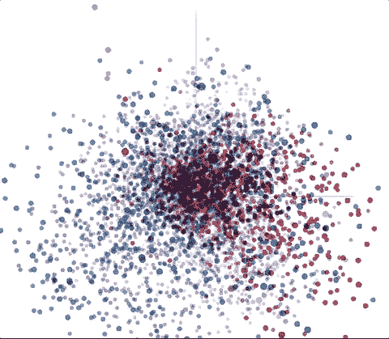

3D projection of brand-agnostic embeddings. Notice how their were shifted to a more spherical catalogue projection.

让我们看一些定性的例子。

## 相同的产品，但来自另一个品牌

如果您已经熟悉了嵌入，那么您很可能在 NLP 中遇到过几乎太常用的例子

> “国王”——“男人”+“女人”=“女王”

是的，嵌入可以用于某种类型的问题回答。在前面的例子中，*什么是“女人”什么是“国王”什么是“男人”？→《女王》*

以丝芙兰 SEA 为例，**是否可以利用嵌入来推荐类似的产品，但在丝芙兰**(丝芙兰系列)的品牌中？

*即。*

> “Fenty Beauty Pro Filt ' r Soft Matte Longwear 粉底”——“Fenty Beauty”+“丝芙兰系列”=？

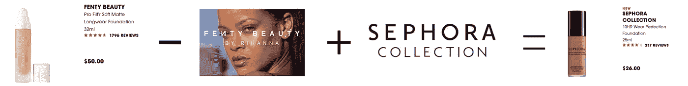

In practice, it really outputs interpretable results!

和以前一样，一些定性的例子，

# 4 |候选人

我在这个案例研究中提出的框架实际上对许多情况非常适用。**你所需要的就是为你要嵌入的对象导出同现上下文**。

最重要的是，上下文的定义可以像您希望的那样灵活。在这里，我只考虑了浏览会话，但也可以混合其他信号。

此外，我只展示了单品到单品的推荐，但是通过平均嵌入输入产品，来自客户过去购买或当前购物篮的推荐是完全可以实现的。

## 参考

[1] Pennington 等人，[GloVe:Global Vectors for Word Representation](https://nlp.stanford.edu/pubs/glove.pdf)，2014
【2】Bengio 等人，[一种神经概率语言模型](https://papers.nips.cc/paper/1839-a-neural-probabilistic-language-model.pdf)，2001
【3】miko lov 等人，[Vector Space 中单词表示的高效估计](https://arxiv.org/pdf/1301.3781.pdf)，2013
【4】[Mihajlo Grbovic](https://medium.com/u/a655fe1c6831?source=post_page-----98eccfa816bd--------------------------------)，[列出搜索排名中的嵌入](https://medium.com/airbnb-engineering/listing-embeddings-for-similar-listing-recommendations-and-real-time-personalization-in-search-601172f7603e) (Airbnb [用 Uber Eats 发现食物:构建查询理解引擎](https://eng.uber.com/uber-eats-query-understanding/)，2018 年 6 月
【6】Vasile 等人， [Meta-Prod2Vec -产品嵌入使用边信息进行推荐](http://Product Embeddings Using Side-Information for Recommendation)，2016