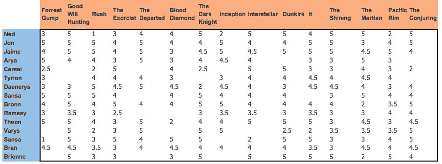
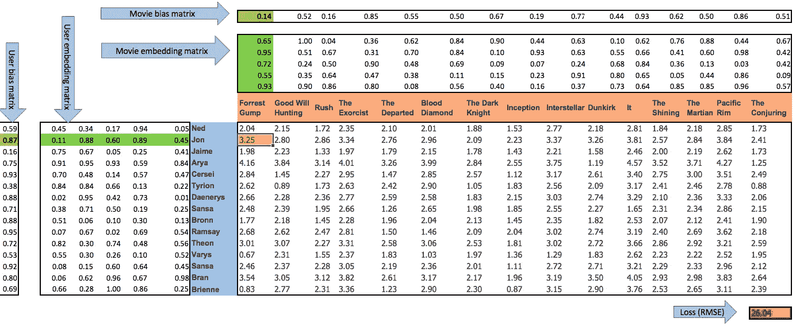
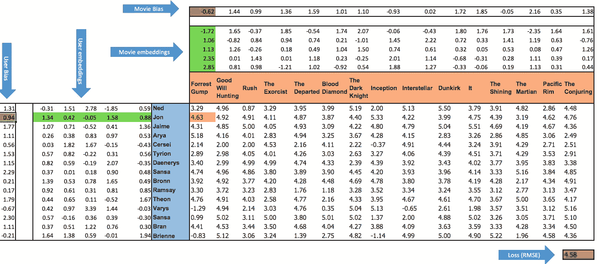

# 协作过滤和嵌入—第 1 部分

> 原文：<https://towardsdatascience.com/collaborative-filtering-and-embeddings-part-1-63b00b9739ce?source=collection_archive---------1----------------------->

推荐系统就在我们身边。从网飞、亚马逊到 even Medium，每个人都在试图理解我们的口味，这样他们就能促使我们持续参与。你会惊讶于这背后的工作量。让我们试着理解开发推荐系统的一种方法的机制。

# 介绍

在这一系列文章中，我将解释协作过滤，这是开发自动推荐系统的一种非常常见的技术(尽管用例不限于推荐)。然而，使这个讨论有趣的是我们如何在实现这个技术的同时理解一个更一般的**嵌入**的概念。如果你没有听说过这个术语，不用担心，在这篇文章结束时你会有一个好主意。

## **第一部分:**

*   协同过滤背后的基本思想
*   一个在 excel 中实现协同过滤的简单算法(是的你没看错！！)
*   理解嵌入和偏差的概念

## 第二部分:

*   利用 [**fastai**](https://github.com/fastai/fastai/tree/master/fastai) 库实现协同过滤
*   解释和可视化嵌入

[**协同过滤和嵌入—第二部分**](/collaborative-filtering-and-embeddings-part-2-919da17ecefb)

这篇文章中提出的大多数想法都来自于**杰瑞米·霍华德**作为[T21](https://www.usfca.edu/data-institute)**数据研究所的一部分进行的 [**深度学习 MOOC**](http://course.fast.ai/) - **v2** 。这篇文章只是我尝试分享我在这个课程中学到的一些惊人的东西。**

现在，事不宜迟，让我们开始吧…

# 什么是协同过滤？

Figure 1: Collaborative filtering [1]

在**推荐系统**的上下文中，协同过滤是一种通过分析与所述用户相似的用户的喜好来预测用户兴趣的方法。通过**协作多个观点**来过滤模式的想法是它被称为协作过滤的原因。

> 协同过滤方法的基本假设是，如果一个人 *A* 在一个问题上与一个人 *B* 有相同的观点，那么 A 在另一个问题上比随机选择的人更有可能有 B 的观点
> 
> ——维基百科[2]

协同过滤是一个通用的概念，有几种算法来实现它。查看这篇比较不同算法性能的文章。

 [## 协同过滤的各种实现

### 利用协同过滤构建推荐系统的不同方法比较

medium.com](https://medium.com/@pgrover3/various-implementations-of-collaborative-filtering-100385c6dfe0) 

一种这样的算法是**概率矩阵分解。**不要被名字吓到。我们将使用 excel 中的虚拟示例来理解这一点。

# Excel 中的协同过滤

## 方案

如图 2 所示，我们有不同用户对不同电影的评分数据，评分范围为 0-5。空白单元格表示用户尚未对电影进行评级。我们的目标是尽可能地模拟这个系统。

Figure 2: Original ratings

## 模型

Figure 3

在图 3 中，您可以看到完整的框架。让我们试着去理解用户-电影**(乔恩-阿甘)的特定组合在这里发生了什么。**

本质上，这个模型就是这个等式:

***模型预测的评分(黄色单元格中的 3.25)= 2 个绿色矢量(嵌入矢量)的点积+ 0.14(电影偏差)+ 0.87(用户偏差)***

类似地，我们将预测每个用户-电影组合的评分，除了那些在实际数据中不存在**用户-电影评分的组合。基于此，我们将通过比较预测评级和实际评级来计算损失( **RMSE(均方根误差)**(在我们的例子中:底部的红色单元格)。**

很明显，我们的预测是基于这些 **2 个嵌入矩阵和 2 个偏差矩阵**。但是里面的数字呢，它们看起来是随机的，实际上是随机初始化的。那么，什么样的正确数字会让我们的预测接近实际的收视率呢？

是的，你猜对了。**我们将通过使用某种优化算法**使损失最小化来学习这些数字。事实上，这可以在 excel 中完成！！

## 梯度下降

转到**数据→解算器**，您将看到以下窗口。在**设置目标**中选择**损失单元**，在**可变单元**中选择**嵌入和偏置矩阵范围**。点击求解，求解器将通过最小化损失开始学习嵌入和偏差矩阵中的正确值。

Figure 4

Figure 5 : Predicted ratings using collaborative filtering

我们可以在图 5 中看到，求解器已经学习了嵌入和偏差矩阵中的值。我们的损失从 **26.04** 减少到 **4.58** 。我们从模型中得到的预测似乎也接近实际的收视率。所以现在我们有了一个看起来运行良好的模型。但是我们仍然不知道它为什么有效。基本上这个算法背后有 3 个关键的想法。

# 嵌入

> 关键思想#1:找到每个用户和每部电影作为嵌入的正确表示

是时候解决房间里的大象了。我们来看一个具体的例子。这里，**乔恩**和**阿甘**由**向量**(求解器已经学习的一串 5 个数字)表示。这些向量被称为**嵌入**。本质上在一个 **5 维**向量空间中，乔恩和阿甘由这两个嵌入向量表示。

Embedding : Jon

Embedding : Forrest Gump

> 嵌入是特定实体的多维向量表示

**这种将实体表示为高维向量的方式是关键。这种表示可以捕捉不同实体之间的复杂关系。**

## 为什么是 5？

嵌入向量的维数没有特定的规则，更多的是关于实验。维度应该足以捕捉实体的复杂性。一维或二维向量可能无法捕捉 Jon 的复杂性。但也不应该过高。我们的乔恩和阿甘没那么复杂。

## 嵌入向量中数字背后的直觉

您可以将这些数字视为捕捉它所代表的实体的不同特征。比如乔恩 **(1.34)** 中的第一个数字，可能代表他有多喜欢**奇幻小说**。而《阿甘正传》中的第一个数字 **(-1.72)** 告诉了我们在多大程度上可以把阿甘当做**幻想**(由于数字是负数，所以非常少)。

注意:从理论上讲，这是一个思考嵌入向量中的数字的好方法，但是我们永远不能真正说出每个数字实际上在捕捉什么。我们可以做一个有根据的猜测。

# 嵌入空间的封闭性

> 关键思想#2:如果一部电影和一个用户在一个向量空间中很接近，那么用户很可能会给这部电影很高的评价

捕捉接近度有不同的方法:**点积，欧氏距离，余弦相似度**。在我们的例子中，我们使用了**点积**。

# 偏见的作用

> 关键思想#3:实体有一个独立于它与其他实体的交互的固有性质

简而言之，一些用户比其他人更挑剔。类似地，一些电影可以被普遍认为是好的，并且会被大多数用户评价很高。这些信息是通过偏见获得的。

# 该模型的建议

现在，我们有了一个训练有素的模型，它已经为每个用户和电影学习了正确的嵌入和偏好。考虑这样一种情况，我们必须向用户推荐一组电影中的一部电影(假设该组中的所有电影都没有被该用户看到)。

使用计算出的嵌入和偏差，我们可以预测用户将对该组中的每部电影给出的评级。所建议的电影将是具有最高预测等级的电影。

***预测评分=嵌入向量点积(用户、电影)+用户偏差+电影偏差***

**链接到 excel 文件:**[https://github . com/shik 3519/collaborative-filtering/blob/master/collab _ filter . xlsx](https://github.com/shik3519/collaborative-filtering/blob/master/collab_filter.xlsx)。受此文件启发→[3]

# 结束注释

这篇文章中讨论的方法肯定不是实现协同过滤的最佳方式。使用神经网络有更好的执行算法，但是嵌入的核心思想是共同的。

看看这篇文章，它讨论了神经网络的实现以及其他很多东西。

 [## 协同过滤的各种实现

### 利用协同过滤构建推荐系统的不同方法比较

medium.com](https://medium.com/@pgrover3/various-implementations-of-collaborative-filtering-100385c6dfe0) 

# 接下来

在[的下一篇文章](/collaborative-filtering-and-embeddings-part-2-919da17ecefb)中，我将讨论我们如何使用由[杰瑞米·霍华德](https://medium.com/u/34ab754f8c5e?source=post_page-----63b00b9739ce--------------------------------) 等人开发的名为 [**fastai**](https://github.com/fastai/fastai/tree/master/fastai) 的库来实现协同过滤。这个库构建在 [**pytorch**](http://pytorch.org/) 之上，专注于更容易实现的**机器学习和深度学习模型**。

此外，我们将了解如何使用[**【t-SNE】**](https://en.wikipedia.org/wiki/T-distributed_stochastic_neighbor_embedding)******和**[**Bokeh**](https://bokeh.pydata.org/en/latest/)**(*Python 交互式可视化库，面向现代 web 浏览器进行演示*)。下面是一个什么在商店的预告。******

************

******[**【协同过滤与嵌入—第二部分**](/collaborative-filtering-and-embeddings-part-2-919da17ecefb)******

# ****更多资源****

**** [## 一口气学习实体嵌入

### 也许不会，除非你经常打破屏住呼吸的世界纪录！从好的方面来看，实体…

medium.com](https://medium.com/@apiltamang/learning-entity-embeddings-in-one-breath-b35da807b596)  [## 结构化深度学习

### 快的

towardsdatascience.com](/structured-deep-learning-b8ca4138b848)  [## 面向程序员的深度学习——36 小时免费课程

### fast.ai 面向编码员的实用深度学习 MOOC。学习 CNN，RNNs，计算机视觉，NLP，推荐系统…

course.fast.ai](http://course.fast.ai/lessons/lesson4.html) 

# 参考

[1][https://commons . wikimedia . org/wiki/File % 3a collaborative _ filtering . gif](https://commons.wikimedia.org/wiki/File%3ACollaborative_filtering.gif)

[2][https://en.wikipedia.org/wiki/Collaborative_filtering](https://en.wikipedia.org/wiki/Collaborative_filtering)

[3][https://github . com/fastai/fastai/blob/master/courses/dl1/excel/collab _ filter . xlsx](https://github.com/fastai/fastai/blob/master/courses/dl1/excel/collab_filter.xlsx)

[4][http://www . wired . co . uk/article/how-do-netflixs-algorithms-work-machine-learning-helps-to-predict-what-viewers-will-like](http://www.wired.co.uk/article/how-do-netflixs-algorithms-work-machine-learning-helps-to-predict-what-viewers-will-like)****