# 协作过滤和嵌入—第 2 部分

> 原文：<https://towardsdatascience.com/collaborative-filtering-and-embeddings-part-2-919da17ecefb?source=collection_archive---------3----------------------->

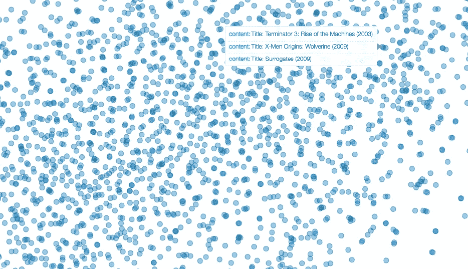

Movie embeddings

在第一部分的[中，我已经介绍了**协同过滤**背后的基本思想以及**嵌入**和**偏差**的概念。建议您在继续之前阅读该帖子。](/collaborative-filtering-and-embeddings-part-1-63b00b9739ce)

[**协同过滤和嵌入—第一部分**](/collaborative-filtering-and-embeddings-part-1-63b00b9739ce)

在这一部分，我将讨论我们如何使用由[杰瑞米·霍华德](https://medium.com/u/34ab754f8c5e?source=post_page-----919da17ecefb--------------------------------) 等人开发的一个名为 [**fastai**](https://github.com/fastai/fastai/tree/master/fastai) 的库来实现协同过滤。这个库建立在 [**pytorch**](http://pytorch.org/) 的基础上，专注于更容易实现的**机器学习和深度学习模型**。

此外，我们将了解如何使用[**【t-SNE】**](https://en.wikipedia.org/wiki/T-distributed_stochastic_neighbor_embedding)**[](https://plot.ly/)****和**[**Bokeh**](https://bokeh.pydata.org/en/latest/)**(*Python 交互式可视化库，面向现代 web 浏览器进行演示*)。******

******这篇文章中提出的大多数想法都来自于 [**深度学习 MOOC**](http://course.fast.ai/) - **v2** 由**杰瑞米·霍华德**作为 [**数据研究所**](https://www.usfca.edu/data-institute) **的一部分进行的。这篇文章只是我尝试分享我在这个课程中学到的一些惊人的东西。********

# ****资料组****

****我用过[**movie lens**](https://grouplens.org/datasets/movielens/)**【1】**数据集( [ml-latest-small](http://files.grouplens.org/datasets/movielens/ml-latest-small.zip) )。该数据集描述了来自电影推荐服务 [MovieLens](http://movielens.org/) 的**五星**评级和自由文本标记活动。它包含 **100004 评级**和 **1296 标签应用**横跨 **9125 部电影**。这些数据是由 **671 位用户**在 1995 年 1 月 09 日至 2016 年 10 月 16 日之间创建的。****

****我们将使用两个文件:`ratings.csv`和`movies.csv`****

# ****使用 fastai 的协同过滤****

****开始之前，我们需要两件东西:****

*   ****支持 GPU 的机器(本地或 AWS)****
*   ****在你的机器上安装 fastai 库:`pip install fastai`****

****注意:在这篇文章的最后，我已经详细解释了如何为 fastai 设置你的系统****

****下面是使用 fastai 实现的一步一步的代码演练。底层算法和我们在 [**第一部分**](https://medium.com/p/63b00b9739ce/edit) 讨论过的一样。****

## ****步骤 1:数据加载****

****我们正在看 2 个文件:**收视率和电影******

****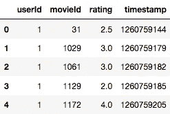****

****Figure 1: Ratings****

******评分**包含不同用户对不同电影的评分。****

****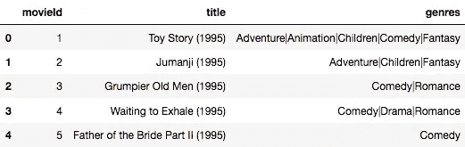****

****Figure 2: Movies****

******电影**包含关于电影的元数据。`movieid`是连接 2 个数据集的关键。****

## ****第二步:模特训练****

```
**#fastai function
**val_idxs = get_cv_idxs(len(ratings))** #get validation indices** 
```

****我们将把数据分为训练集和验证集。我们的验证是原始数据集的 20%。****

```
****wd=2e-4** #weight decay
**n_factors** = 50 #dimension of embedding vector**
```

****我们将使用 [**重量衰减**](https://metacademy.org/graphs/concepts/weight_decay_neural_networks#focus=weight_decay_neural_networks&mode=learn) 来减少**过度拟合**。我们还必须定义我们的**嵌入向量**的维度。****

```
**#fastai function
**cf = CollabFilterDataset.from_csv(path, 'ratings.csv', 'userId', 'movieId', 'rating')** #creating a custom data loader**
```

****现在我们必须为协同过滤创建一个数据对象。你可以把它看作是将原始数据转换成模型所要求的形式的东西。`from_csv`意味着输入应该是一个 **csv 文件**。****

****函数的参数:****

*   ****`path`:CSV 文件的位置路径****
*   ****`ratings.csv`:CSV 文件的名称。它应该是图 1 所示的**长格式******
*   ****`userID/movieID`:2 个实体的列名****
*   ****`rating`:要预测的因变量的列名****

```
**#create a learner (model) and specify the batch size and optimizer 
**learn = cf.get_learner(n_factors, val_idxs, 64, opt_fn=optim.Adam)** 
#fastai function**
```

****下一步是创建一个模型对象，它是我们已经创建的数据对象的函数。`learner`在 fastai 库中与 model 同义。该函数采用以下参数:****

*   ****`n_factors`:嵌入向量的维数(在我们的例子中为**50******
*   ****`val_idxs`:验证时必须考虑的 ratings.csv 文件中的行索引****
*   ****`batch size`:梯度下降的每一步传递给优化器的行数。在我们的例子中，每次迭代将传递 64 行数据****
*   ****`opt_fn`:我们想要使用的优化器。在我们的例子中我们使用的是 [**亚当**](http://ruder.io/optimizing-gradient-descent/) **。在这个库中，你可以访问不同的优化器******

****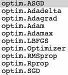****

****Figure 3: Optimisers****

```
**#training with learning rate as 1e-2 
**learn.fit(1e-2, 2, wds=wd, cycle_len=1, cycle_mult=2, use_wd_sched=True)** 
#fastai function**
```

****训练的最后一步是实际训练模型。在`learner`对象上调用`fit`训练模型并学习嵌入和偏置矩阵中的**正确值。******

****函数的参数:****

*   ****`learning rate` : 1e-2 是我们用于优化的学习率****
*   ****`wd`:通过重量衰减****
*   ****`cycle_len/cycle_mult`:这些是 fastai 的好东西，整合了最先进的**学习率计划**方法。*帖子末尾包含与此相关的有用文章的链接。*****
*   ****`use_wd_sched`:是否使用体重衰减时间表****

****当您运行上面的代码时，模型将开始训练，如下所示。您可以在每个时期后观察**训练(左)和验证(右)损失**。我们优化的损失函数是`MSE (Mean squared error)`。****

****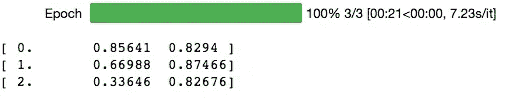****

****Figure 4: Model training****

## ****步骤 3:验证预测****

```
****preds = learn.predict()** #prediction on validation
**math.sqrt(metrics.mean_squared_error(y,preds))** #calculating RMSE**
```

****我们将使用训练好的模型来预测验证并计算 **RMSE** 。我们得到了一个 **~.90** 的 RMSE，与该数据集的当前[基准](https://www.librec.net/release/v1.3/example.html)相当。****

```
****y=learn.data.val_y** #actual ratings for validation
**sns.jointplot(preds, y, kind='hex', stat_func=None);****
```

****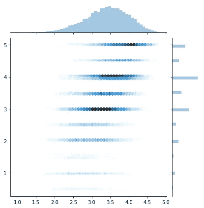****

****Figure 5: Predictions (y) vs Actual (x) (Ratings)****

****我们还可以看到，我们从模型预测与实际收视率相符。****

****现在，我们将尝试解释嵌入和偏见，看看它们是否捕捉到一些有意义的信息。****

# ****解释嵌入和偏见****

****我们将把重点放在电影的嵌入和偏见上，因为我们有电影的**实际名称**。****

## ****电影嵌入****

****我们知道我们的嵌入向量的维数是 **50** 。可视化这样的高维向量是困难的，几乎是不可能的。****

****[**t-分布式随机邻居嵌入(t-SNE)**](https://en.wikipedia.org/wiki/T-distributed_stochastic_neighbor_embedding) 是一种有效的方法，可以在较低的维度上可视化它们，同时保持这些向量之间的**空间关系**。****

****使用上面的代码，我已经将嵌入向量的维数减少到 **2 (t-SNE 分量)**。下面我们可以看到为 3000 部电影嵌入的 2 个 t-SNE 组件。每个点代表一部电影。****

****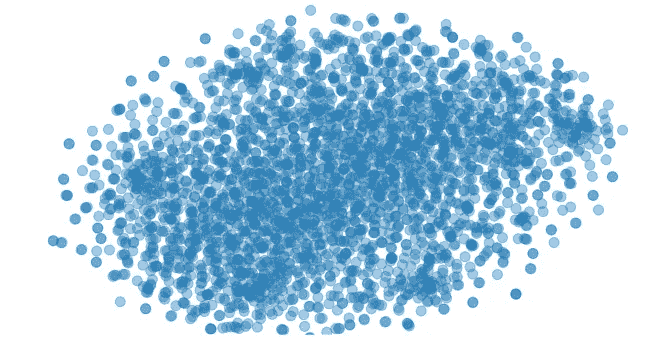****

****y-tsne vs x-tsne components of embedding vectors (3000 movies)****

****你可以在这里玩这个剧情:[**http://tsne.getforge.io/**](http://tsne.getforge.io/)****

****进一步放大我们可以看到来自同一个系列的**电影在**嵌入空间**非常接近(几乎重叠)。这表明嵌入不仅仅是为了减少损失而优化的一些数字。******

> **我们希望同一个系列的电影在风格、导演、演员等方面或多或少有些相似。嵌入空间的紧密性反映了嵌入正在捕捉这些特征**

**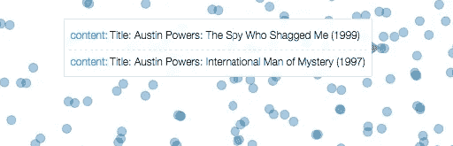****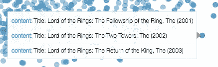******

## **电影偏见**

**电影偏差可以被认为是对电影实际质量的一种度量**，针对不同用户的不同分级模式进行调整**。**

> **偏见可以被认为是电影实际上有多好/受欢迎的代表**

**让我们看看这是否反映在我们模型的偏差中**

**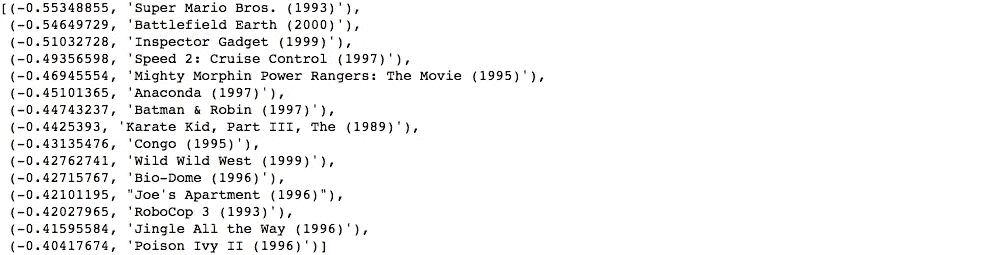**

**Bottom 15 movies based on bias**

**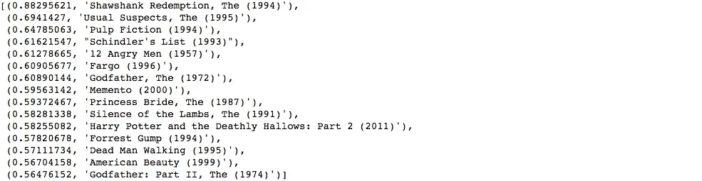**

**Top 15 movies based on bias**

**看着这个列表，我想大多数人都会同意这个列表看起来或多或少是合适的，并且更接近我们的大多数期望。**

> **基于偏见对电影进行排名比仅仅平均所有用户给出的评级更有意义。与名字相反，它实际上使排名不偏不倚**

## **嵌入聚类(基于评级)**

**对我来说，这是最有趣的部分。下面我挑选了一个评价电影数量最多的用户( **userID:547** )。现在我在尝试看看用户给出的评分和不同电影的嵌入向量之间有没有什么看得见的关系。**

**猜猜看…**

**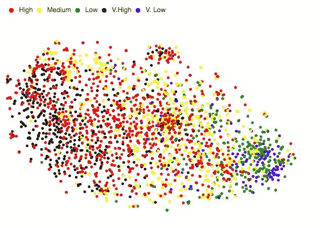**

**t-SNE components of movie embeddings clustered by ratings (userID: 547)**

**很明显，**高评级(黑与红)**的电影集中在嵌入空间的一部分。类似地，那些**等级低的电影(绿色和蓝色**)集中在空间的另一部分。**

***链接到 html 文件的情节。下载并在浏览器中打开:*[https://github . com/shik 3519/collaborative-filtering/blob/master/t-SNE _ cluster _ rating . html](https://github.com/shik3519/collaborative-filtering/blob/master/t-SNE_cluster_rating.html)**

## **嵌入聚类(基于偏差)**

**类似地，我也尝试过根据电影偏好对电影嵌入进行聚类。**期望具有相似偏差(如所讨论的无偏流行度的度量)的电影在嵌入空间中应该是接近的。****

**我们可以在下图中看到。**

**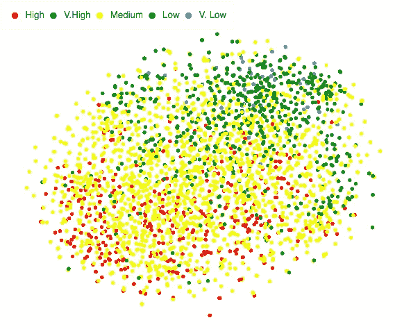**

**t-SNE components of movie embeddings (clustered by movie bias)**

> **好(或坏)的电影都有一些共同的特征，这些特征被嵌入捕捉到了**

***链接到绘图的 html 文件。下载并在浏览器中打开:*[https://github . com/shik 3519/collaborative-filtering/blob/master/t-SNE _ emb _ cluster _ bias . html](https://github.com/shik3519/collaborative-filtering/blob/master/t-SNE_emb_cluster_bias.html)**

**我觉得很新奇，所以我试着想象电影嵌入的三个 t-SNE 组件。每个点代表一部电影，点的大小和颜色取决于偏差。**

**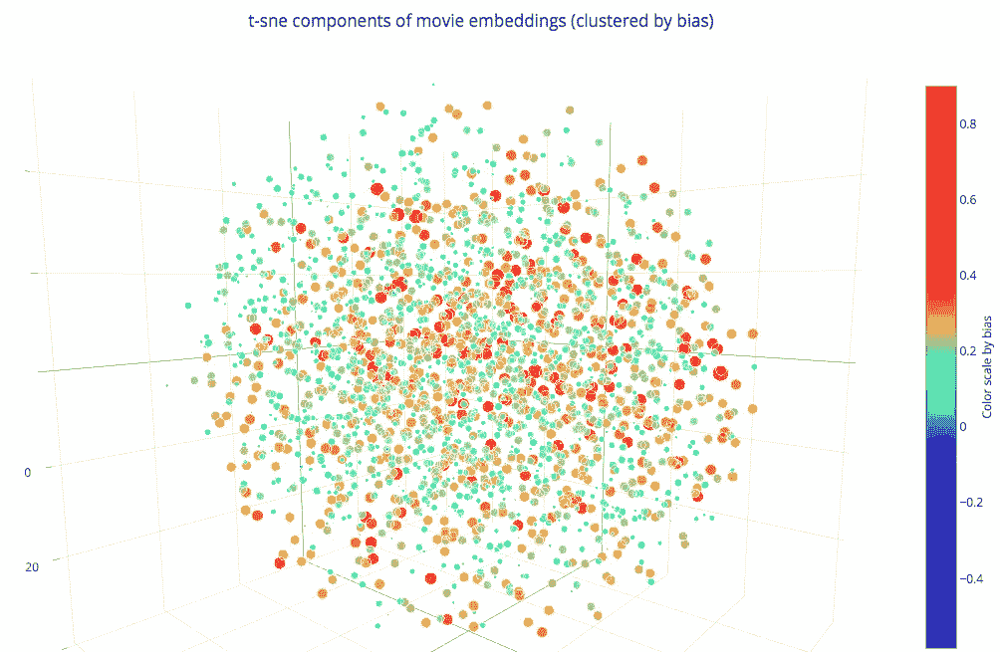**

**下面是实际剧情的链接:**[https://plot.ly/~shik1470/2/](https://plot.ly/~shik1470/2/)****

****链接到用于此图的数据:[https://github . com/shik 3519/collaborative-filtering/blob/master/t-SNE 1 . CSV](https://github.com/shik3519/collaborative-filtering/blob/master/t-sne1.csv)****

# ****最后的想法****

****到现在为止，我想你会有点相信嵌入的想法是非常强大的。这个概念可以扩展到任何有大量分类变量的结构化数据问题。****

> ****分类变量的每一级可以被表示为高维向量，该向量可以捕获标签或一位热码编码未能捕获的关系。标签或一个热编码假设每个实体都是相互独立的，如果你仔细想想，肯定不是这样。****

****这是另一个关于在结构化环境中使用嵌入的很酷的帖子，你一定要看看。****

****[](/structured-deep-learning-b8ca4138b848) [## 结构化深度学习

### 快的

towardsdatascience.com](/structured-deep-learning-b8ca4138b848) 

# 有用的资源

1.  **学习率选择和调度:**

[](https://techburst.io/improving-the-way-we-work-with-learning-rate-5e99554f163b) [## 提高我们的工作方式和学习速度。

### 一.导言

techburst.io](https://techburst.io/improving-the-way-we-work-with-learning-rate-5e99554f163b) [](/estimating-optimal-learning-rate-for-a-deep-neural-network-ce32f2556ce0) [## 估计深度神经网络的最佳学习速率

### 学习率是用于训练深度神经网络的最重要的超参数之一。

towardsdatascience.com](/estimating-optimal-learning-rate-for-a-deep-neural-network-ce32f2556ce0) [](https://medium.com/38th-street-studios/exploring-stochastic-gradient-descent-with-restarts-sgdr-fa206c38a74e) [## 探索重新开始的随机梯度下降(SGDR)

### 这是我第一篇深度学习的博文。我在 2017 年 1 月左右开始了我的深度学习之旅，在我听说了…

medium.com](https://medium.com/38th-street-studios/exploring-stochastic-gradient-descent-with-restarts-sgdr-fa206c38a74e) 

2.t-SNE:

[](https://distill.pub/2016/misread-tsne/) [## 如何有效地使用 t-SNE

### 一种流行的探索高维数据的方法叫做 t-SNE，是由范德马滕和辛顿提出的…

蒸馏. pub](https://distill.pub/2016/misread-tsne/) [](https://medium.com/@luckylwk/visualising-high-dimensional-datasets-using-pca-and-t-sne-in-python-8ef87e7915b) [## 在 Python 中使用 PCA 和 t-SNE 可视化高维数据集

### 任何与数据相关的挑战的第一步都是从探索数据本身开始。这可以通过查看…

medium.com](https://medium.com/@luckylwk/visualising-high-dimensional-datasets-using-pca-and-t-sne-in-python-8ef87e7915b) [](https://www.kaggle.com/ykhorramz/lda-and-t-sne-interactive-visualization) [## LDA 和 T-SNE 交互式可视化

### 使用 NIPS 2015 论文中的数据

www.kaggle.com](https://www.kaggle.com/ykhorramz/lda-and-t-sne-interactive-visualization) 

3.**法斯泰:**

*   【https://github.com/fastai/fastai】Github 回购库:[](https://github.com/fastai/fastai)
*   [**fastai 笔记本上的协同过滤**](https://github.com/fastai/fastai/blob/master/courses/dl1/lesson5-movielens.ipynb)

**设置 fastai 的说明:**

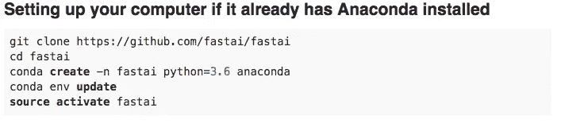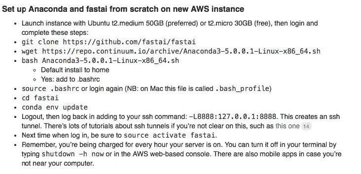

4. [**本帖 GitHub 回购**](https://github.com/shik3519/collaborative-filtering) **:** 本回购包含本帖中显示的笔记本和剧情

# 参考文献和引文

[1] F .麦克斯韦·哈珀和约瑟夫·康斯坦。2015.电影镜头数据集:历史和背景。ACM 交互式智能系统汇刊(TiiS) 5，4，第 19 篇(2015 年 12 月)，19 页。http://dx.doi.org/10.1145/2827872****