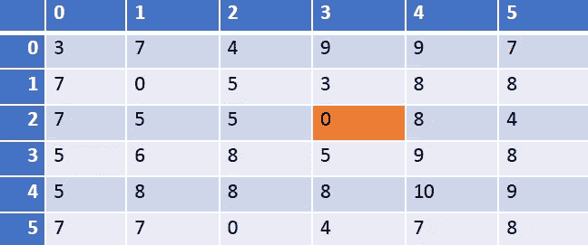
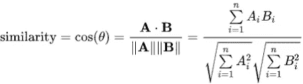
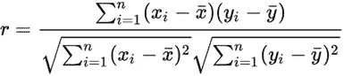
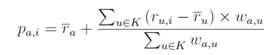
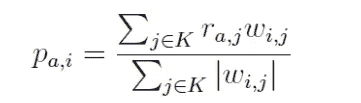
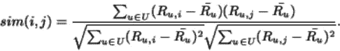

# 基于协同过滤的推荐系统举例..

> 原文：<https://towardsdatascience.com/collaborative-filtering-based-recommendation-systems-exemplified-ecbffe1c20b1?source=collection_archive---------1----------------------->

在我的上一篇文章中，我对推荐系统做了简单的解释，举例说明了各种类型的推荐系统。在这篇文章中，我将使用 **Python** 实现一些这类推荐系统的简单例子。

给定下面的用户项目评级矩阵 M，其中 6 个用户(行)对 6 个项目(列)进行了评级。评级可以取 1-10 之间的整数值，0 表示没有评级。(注意，我们对行和列使用 Python 中使用的从零开始的索引。但是，对于用户输入，user_id 将占用 1–6 之间的数字，item_id 将占用 1–6 之间的数字。假设，我们必须发现用户 3 是否会喜欢项目 4。因此，用户 3 成为我们的目标用户或活动用户，项目 4 是目标项目。

sample user-ratings matrix

# 基于用户的协同过滤

首先，我们必须预测用户 3 对项目 4 的评分。在基于用户的 CF 中，我们会找到与用户 3 最相似的 k=3 个用户。常用的相似性度量有余弦、皮尔逊、欧几里德等。这里我们将使用[余弦相似度](https://en.wikipedia.org/wiki/Cosine_similarity)，其定义如下:

和，[皮尔逊相关](https://en.wikipedia.org/wiki/Pearson_correlation_coefficient)，定义为:

在 sklearn 中， [NearestNeighbors](http://scikit-learn.org/stable/modules/generated/sklearn.neighbors.NearestNeighbors.html#sklearn.neighbors.NearestNeighbors) 方法可以用来基于各种相似性度量来搜索 k 个最近邻居。

查看我的 **Jupyter 笔记本下面嵌入的**，

 [## csaluja/JupyterNotebooks-中号

### 在 GitHub 上创建一个帐户，为 JupyterNotebooks-Medium 开发做出贡献。

github.com](https://github.com/csaluja/JupyterNotebooks-Medium/blob/master/CF%20Recommendation%20System-Examples.ipynb) 

***findksimilarrusers****函数使用此方法返回活动用户的 k 近邻的相似度和索引。函数***predict _ user based****使用基于用户的 CF 方法进一步预测用户 3 将给予项目 4 的评级。预测计算为邻居平均值偏差的加权平均值，并将其添加到活跃用户的平均评级中。偏差用于调整与用户相关的偏差。由于某些用户可能总是倾向于给所有项目高或低的评级，所以会出现用户偏差。**

****

**其中 p(a，I)是项目 I 的目标或活动用户 a 的预测，w(a，u)是用户 a 和 u 之间的相似性，K 是最相似用户的邻域。**

# **基于项目的协同过滤**

**在这种方法中，使用余弦相似性度量来计算项目对之间的相似性。活跃用户 *a* 的目标项目 *i* 的评分可以通过使用简单加权平均来预测，如下所示:**

****

**其中 K 是活动用户 a 评价的最相似项目的邻域，w(i，j)是项目 *i* 和*j*之间的相似度**

**在 Jupyter Notebook embed 中检查，函数***findksimilaritems****使用利用余弦相似度的[最近邻居](http://scikit-learn.org/stable/modules/generated/sklearn.neighbors.NearestNeighbors.html#sklearn.neighbors.NearestNeighbors)方法来查找与项目 *i.* 相似的 k 个项目，函数***predict _ item based****使用基于项目的 CF 方法(上面的公式)进一步预测用户 3 将给予项目 4 的评分。****

# ***[调整后的余弦相似度](http://www10.org/cdrom/papers/519/node14.html)***

***将余弦相似性度量用于基于项目的 CF 方法不考虑用户评级的差异。调整后的余弦相似性通过从每个共同评级对中减去相应用户的平均评级来弥补这一缺陷，并且定义如下***

******

***为了在 Python 中实现调整后的余弦相似度，我定义了一个名为 *computeAdjCosSim，*的简单函数，该函数返回调整后的余弦相似度矩阵，给定评级矩阵。函数***findksimilaritems _ adj cos***和***predict _ item based _ adj cos***利用调整后的余弦相似度来寻找 k 个相似项目并计算预测评分。***

**功能***re commenditem***提示用户选择推荐方式(基于用户(余弦)、基于用户(相关)、基于项目(余弦)、基于项目(调整余弦)。基于所选择的方法和相似性度量，该功能预测指定用户和项目的评级，并且还建议是否可以向用户推荐该项目。如果用户尚未对该项目进行评级，并且如果预测评级大于 6，则向用户推荐该项目。如果评级小于 6，则不向用户推荐该项目。**

# **相似性度量的选择**

**在选择相似性度量时，一些有用的线索是**

**当您的数据受到用户偏差/不同用户评级尺度的影响时，请使用 Pearson**

**如果数据稀疏(许多评级未定义)，请使用余弦**

**如果您的数据不稀疏并且属性值的数量很大，请使用欧几里得**

**对基于项目的方法使用调整余弦来调整用户偏差**

# **推荐系统的评价**

**评价推荐系统的评价指标有很多。然而，最流行和最常用的是 RMSE(均方根误差)。函数 ***评估者*** 使用 sklearn 的[均方误差](http://scikit-learn.org/stable/modules/generated/sklearn.metrics.mean_squared_error.html)函数计算预测额定值和实际额定值之间的 RMSE，并显示所选进近的 RMSE 值。(为了解释简单，使用了小数据集，因此没有将其分成训练集和测试集；本帖也不考虑交叉验证)。**

**在用户基数很大的应用程序中，基于用户的方法面临可伸缩性问题，因为它们的复杂性随着用户数量的增加而线性增长。基于项目的方法解决了这些可伸缩性问题，根据项目相似性推荐项目。混合技术利用了各种此类方法的优势，并以多种方式将它们结合起来以实现更好的性能。**

***感谢阅读。这篇文章是为了分享我对推荐系统的理解，欢迎任何关于改进这个实现的反馈。***