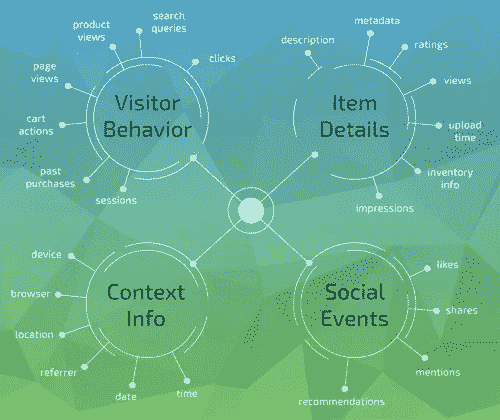

# 变形应用的协同过滤

> 原文：<https://towardsdatascience.com/collaborative-filtering-for-morphing-applications-af4f9f7cc259?source=collection_archive---------9----------------------->

## ecSys 第一周:这篇文章是对论文' ***【协同过滤推荐系统】*** 的简要总结和个人评论，发表在'**【自适应网络'**这本书上，作者是本·斯查费、丹·弗兰科斯基、乔恩·赫洛克和施罗德·森，2007 年。这篇博客是作为智利天主教大学**推荐系统** (IIC3633)课程的每周读物而写的。

收到推荐在每个消费产品中都很常见，我们经常从朋友那里得到推荐，比如一部很酷的电视剧或一本鼓舞人心的书。但不仅仅是人，像 Amazon.com 这样的网站向你推荐相机，或者 Spotify 告诉你一个你从未听说过的团体。但是 Amazon.com 怎么知道你会喜欢那台相机，或者 Spotify 上关于那个团体的信息呢？他们主要使用协同过滤系统，预测你是否会喜欢一个产品。

协同过滤(CF)系统的一些想法试图模仿口碑相传的行为，让用户向其他可能喜欢该项目的人发送推荐，或者你可以看看你信任的某个朋友给出的评级:这被称为主动 CF。但由于这些依赖于人们做工作的系统的存在，还有自动 CF (ACF)，其中使用不同算法的计算机生成推荐。
由于我们经常有一个与我们品味相似的朋友，我们可以从他那里获得推荐，常见的 ACF 系统也试图这样做，并寻找与每个人的品味相似的用户或物品。为了确定两个人是否相似，他们比较他们给出的评分，他们越接近，那么这个人就越相似。

但是如何为一个新用户做推荐，或者像脸书的宣传那样，没有给出评级？现在在网页上跟踪用户交互变得非常普遍。例如，看一个产品的描述所花的时间，在 Instagram 上滚动时你停留的图片，你首先注意到的新闻的位置(通过鼠标的位置或点击它们来识别)。
以上例子是*隐性*的信息收集方法，不一定完全可靠。也许你花了很多时间阅读亚马逊上某个产品的描述，结果却发现它并不是你所需要的，但是你的主页上却显示了这个产品。但是，对于用户和提供商来说，相关信息仍然可以通过这种方法获得，并且不一定产生产品的推荐。

Behavior gathering. Source: [http://www.gravityrd.jp/en/technology](http://www.gravityrd.jp/en/technology)

与这个主题相关，我认为作者没有为 CF 系统添加一个有趣的使用案例(可能只是因为这些跟踪实现的新颖性)。我们经常听说脸书优秀的 A/B 测试系统，它允许他们决定，例如，哪种布局对他们的用户更有吸引力。诸如此类的事情，几乎不能被用户评价，因为他们可能不会注意到大的差异，允许提供一个更令人满意的应用程序体验。

如果我们可以基于用户配置文件个性化整个应用程序结构，会怎么样？一些用户可能喜欢不同的 SAP 仪表板，一些用户可能讨厌脸书视频的自动播放(并且不知道它可以被禁用)。正如我们可以为购买者的兴趣生成一个配置文件一样，通过使用跟踪实现，实际上不同的应用程序可以交付给使用它时具有相似行为的用户组。有了**变形应用**，我们不仅可以满足大多数人的偏好，还可以满足几乎所有人的偏好，并提高应用的整体满意度。

为了建立用户档案，我们可以跟踪的一个例子是:

*   执行一个动作所花费的时间(越少越好)。
*   花在应用上的时间(时间越多越享受)。
*   点击链接的数量。
*   等等。

当然，也有许多必须面对的困难，比如实现这种变形应用程序的方法，或者允许我们跟踪感兴趣的行为的系统，但也有一个好的部分，这将是过去几年在推荐系统方面取得的进展，一旦收集到正确的数据，它将允许匆忙建立简档。

*感谢您的阅读，如果您喜欢这篇文章，您可以点击这里的***在它的 Steemit 链接上投稿。任何更正，评论，相关阅读我都会欣然接受。对于这篇文章，我并不打算曲解或指出这篇文章的大部分内容(如果不是全部的话)是基于什么样的原著。**