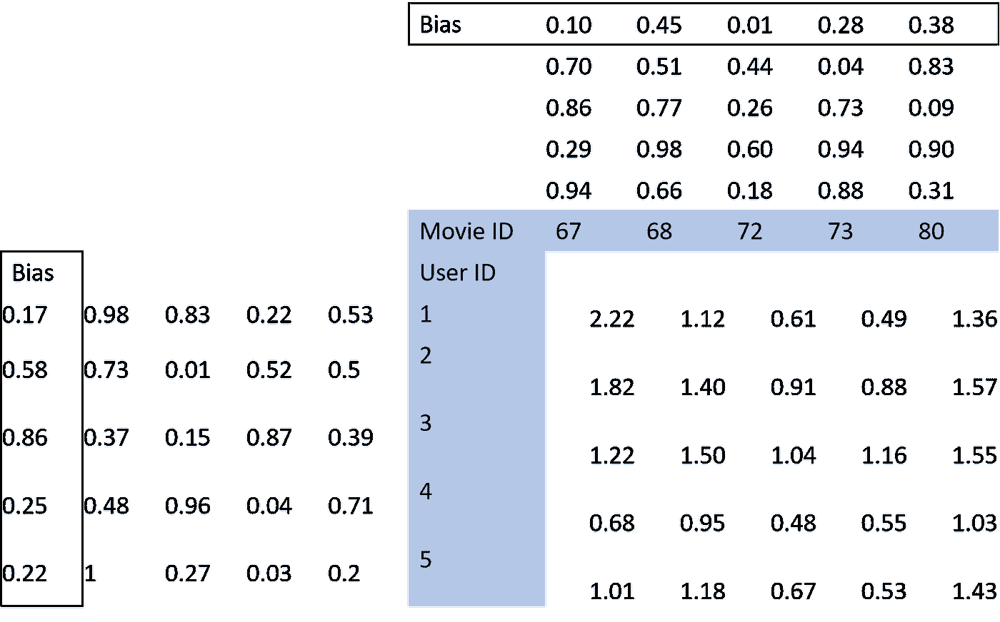
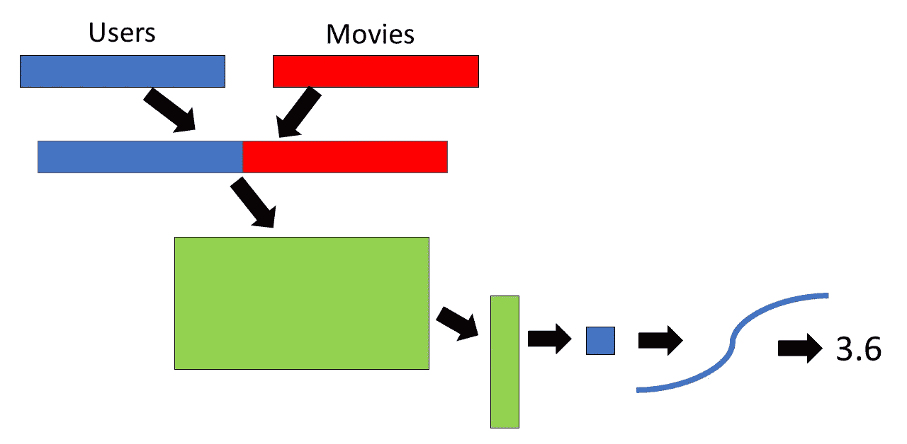

# 协同过滤:从浅到深的学习

> 原文：<https://towardsdatascience.com/collaborative-filtering-from-shallow-to-deep-learning-680926d5d844?source=collection_archive---------3----------------------->

协同过滤通常用于创建推荐系统(例如，网飞演出/电影推荐)。当前最先进的协同过滤模型实际上使用了一种非常简单的方法，结果证明效果很好。在这篇文章中，我将概述这些利用“浅层学习”的最新模型，然后介绍一种更新的方法(在我看来很有前途！)，它利用了深度学习。在这篇文章中，我将使用 [**MovieLens 数据集**](https://grouplens.org/datasets/movielens/) 作为例子，其中包含用户对电影的评级。我还在我的 [**Github**](https://github.com/zachmonge) 上提供的脚本中演示了如何使用浅层和深层协同过滤，所以如果你想使用这些模型，请查看我的 Github！这个脚本利用了优秀的深度学习库 fastai(写在 PyTorch 之上)和 PyTorch。

# **浅薄的学问**

当前最流行的协同过滤模型利用了一种叫做嵌入矩阵的东西。嵌入矩阵包含多维信息。例如，假设我们有一个包含三个因素的电影嵌入矩阵。这三个因素可能对应于电影的动作片程度、电影的浪漫程度以及电影是否更像纪录片。当然，这些因素可以对应于任何东西(并且不一定容易解释)，嵌入矩阵通常包含许多因素。正是这些矩阵在训练协作过滤模型时被更新。使用 MovieLens 数据集示例，通过我们的标准协作过滤技术，我们将拥有用户和电影的嵌入矩阵(见下图)。矩阵的大小将是用户或电影的数量乘以我们选择的因素的数量。关于选择嵌入矩阵中因子的数量，这需要一些试错法。在我的[**Github**](https://github.com/zachmonge) 上的示例脚本中，嵌入因子的数量被设置为 50。在训练开始之前，这些嵌入矩阵中的值被随机初始化。在训练期间，这些值被更新以减少损失(即，使预测评级更接近实际评级)。在训练的每次迭代期间，对于每个用户对电影的评级，取相应向量的点积。这个点积就是预测评级。点积是针对每个用户对每部已评级电影的评级(注意:未被用户评级的电影被设置为 0)，并将预测评级与实际评级进行比较。然后，使用随机梯度下降(或随机梯度下降的近似变体)来更新嵌入矩阵内的值，以减少损失函数。除了嵌入矩阵之外，现有技术的协同过滤模型包含偏差项，其本质上是考虑总是给出更高或更低评级的某些用户或者总体上被给出更高或更低评级的电影(即，好电影或坏电影)。这些偏置项被加到点积上。

这就是最先进的协同过滤模型的全部内容。正如你所看到的，所有这些背后的数学非常简单，如果你看一看我的 Github 上发布的附带脚本，你会看到使用 fastai 库，只需几行代码就可以创建和训练一个最先进的协作过滤模型。

# **深度学习**

好了，我们已经介绍了当前最先进的协同过滤模型，它工作得很好，并利用了“浅层学习”，但该领域的下一步是什么？一个有前途的方向可能是深度学习的协同过滤，因为(1)深度学习在其他工作领域(例如，计算机视觉)非常成功，以及(2)它允许更大的模型规格，这乍听起来真的很烦人，但可能允许机器学习实践者创建适合他们数据集的模型。据我所知，深度学习协同过滤的想法最初是在 [fastai MOOC](http://www.fast.ai/) 中提出的，我认为这是该领域一个非常令人兴奋的方向！在进入深度学习协同过滤的细节之前，我必须承认，使用示例 MovieLens 数据集，浅层学习模型优于深度学习模型。然而，我认为只要对模型的架构进行足够的修改，并使用正确的数据集(可能是更大的数据集——我只使用了 MovieLens 数据集的一部分),深度学习的协同过滤可以胜过浅层学习模型。

在这里，我将检查一个只有一个隐藏层的模型，但是这些模型可以按照你想要的任何方式定制！注意:我确实尝试添加了更多的层，对于这个数据集，一个隐藏层模型表现得最好。

就像之前一样，我们首先用随机初始化的权重为电影和用户创建一个嵌入矩阵(大小是用户或电影的数量乘以指定数量的因子)。然后，对于每个用户和相应的电影嵌入因子向量，我们连接这些向量(见下图)。在示例脚本中，在这一点(0.05)有一点点下降，以防止过度拟合。然后，我们将级联的嵌入因子向量乘以另一个矩阵，该矩阵的嵌入因子大小为*2(在该示例中，必须是这个，因为这是级联的嵌入向量中的列数)乘以某个其他数(在该示例中，我有 10)。然后，矩阵乘积通过整流线性单位激活函数(ReLU 这是负值被改成 0 的一种花哨说法)；这在深度学习中非常常见，会使函数变得非线性。同样，为了防止过度拟合，我们应用更多的压差。然后，我们取矩阵乘积(经过 ReLU 和 dropout ),并将其乘以一个具有其他行数(在本例中也是 10 行)和一列的矩阵。因此，矩阵乘法的输出将是一个数字，这正是我们想要的，因为我们试图预测一个评级。然后，将该预测评级通过 sigmoid 函数(乘以[(最大评级-最小评级)+最小评级])，以使预测值更接近数据集中的实际预测值。这对于单个用户和评级的所有事情都是重复的，就像之前一样，预测值与实际值进行比较，我们的模型中的值通过反向传播的随机梯度下降进行更新(就像任何深度学习问题一样)。

这里需要注意的是，我没有提到任何关于偏差的东西，这是因为 PyTorch 中的线性层已经考虑了偏差，所以我们不必担心它。

同样，正如我之前提到的，深度学习模型比浅层学习模型做得更差，但我相信这个框架是一个有前途的工作路线。如果你想试试这篇文章中提到的例子，看看我的 [**Github**](https://github.com/zachmonge) 。我期待听到读者的评论，或许还能看到协同过滤与深度学习的其他用途。