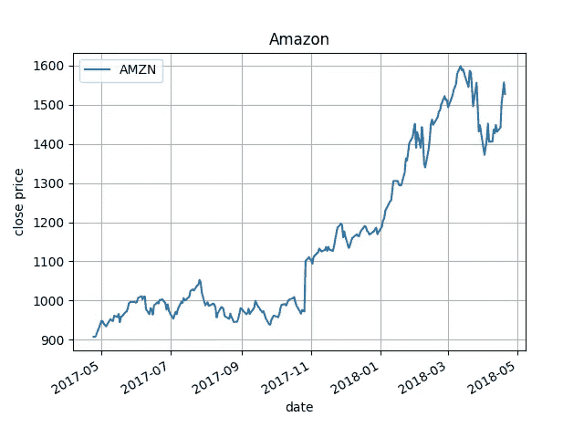

# 通过熊猫图书馆获取交易数据🐼

> 原文：<https://towardsdatascience.com/collect-trading-data-with-pandas-library-8904659f2122?source=collection_archive---------4----------------------->


“A street sign pointing to Wall Street in black and white” by [Chris Li](https://unsplash.com/@chrisli?utm_source=medium&utm_medium=referral) on [Unsplash](https://unsplash.com?utm_source=medium&utm_medium=referral)

(我的[博客](https://kylelix7.github.io/collecting-trading-data-with-pandas/)里也有这个帖子)

[*Pandas*](https://pandas.pydata.org/) 是一个开源库，为 [Python](https://www.python.org/) 编程语言提供高性能、易于使用的数据结构和数据分析工具。Pandas 是最受欢迎的交易策略开发工具之一，因为 Pandas 有各种各样的数据收集、操作和分析工具。

对于相信交易的定量分析师，他们需要访问股票价格和交易量，以便计算技术指标的组合(例如，SMA、BBP、MACD 等)。)进行策略。幸运的是，这些数据可以通过 REST APIs 在许多平台上获得(例如 [IEX](https://iextrading.com/developer/) 、 [Quandl](https://www.quandl.com/) )。更幸运的是，pandas_datareader 为您从这些平台收集数据提供了一致的简单 API。在这个故事中，我将介绍如何用熊猫收集股票数据。

先决条件:Python 3

步骤 1:环境设置(虚拟环境)

```
python3 -m venv tutorial-env
source ~/tutorial-env/bin/activate
pip install panda
pip install pandas_datareader
pip install matplotlib
pip install scipy
```

(不要忘记激活环境“source ~/tutorial-env/bin/activate”或选择 IDE 中的虚拟 env)

步骤 2:代码(获取数据并转储到 csv 文件)

```
**import** matplotlib.pyplot **as** plt
**import** pandas_datareader.data **as** web
# collect data for Amazon from 2017-04-22 to 2018-04-22
start = **'2017-04-22'** end = **'2018-04-22'** df = web.DataReader(name=**'AMZN'**, data_source=**'iex'**, start=start, end=end)
print(df)
df.to_csv(**"~/workspace/{}.csv"**.format(symbol))
```

数据帧的输出

```
open       high        low    close    volume
date                                                         
2017-04-24   908.680   909.9900   903.8200   907.41   3122893
2017-04-25   907.040   909.4800   903.0000   907.62   3380639
2017-04-26   910.300   915.7490   907.5600   909.29   2608948
2017-04-27   914.390   921.8600   912.1100   918.38   5305543
2017-04-28   948.830   949.5900   924.3335   924.99   7364681
2017-05-01   927.800   954.4000   927.8000   948.23   5466544
2017-05-02   946.645   950.1000   941.4130   946.94   3848835
2017-05-03   946.000   946.0000   935.9000   941.03   3582686
2017-05-04   944.750   945.0000   934.2150   937.53   2418381
...
```

在本例中，相应的 csv 文件保存在输出目录(~/workspace/AMZN.csv)中。

步骤 3:可视化用 matplotlib 收集的内容

```
*# select only close column* close = df[[**'close'**]]
*# rename the column with symbole name* close = close.rename(columns={**'close'**: symbol})
ax = close.plot(title=**'Amazon'**)
ax.set_xlabel(**'date'**)
ax.set_ylabel(**'close price'**)
ax.grid()
plt.show()
```



就是这样！现在您已经下载了用于分析的股票数据。

整个例子

```
**import** pandas_datareader.data **as** web
**import** matplotlib.pyplot **as** plt

*# collect data for Amazon from 2017-04-22 to 2018-04-22* start = **'2017-04-22'** end = **'2018-04-22'** symbol=**'AMZN'** df = web.DataReader(name=symbol, data_source=**'iex'**, start=start, end=end)
df.index = df.index.to_datetime()
print(df)
df.to_csv(**"~/workspace/{}.csv"**.format(symbol))
*# select only close column* close = df[[**'close'**]]
*# rename the column with symbole name* close = close.rename(columns={**'close'**: symbol})
ax = close.plot(title=**'Amazon'**)
ax.set_xlabel(**'date'**)
ax.set_ylabel(**'close price'**)
ax.grid()
plt.show()
```

如果你想了解更多关于机器学习的知识，educative.io 中有一系列[有用的课程。这些课程包括像基本的 ML，NLP，图像识别等主题。](https://www.educative.io/profile/view/6083138522447872?aff=VEzk)

最后一句话，如果你觉得用 Excel 更舒服，并且有兴趣轻松地分析股票，[广墨](https://medium.com/u/4619b91648bc?source=post_page-----8904659f2122--------------------------------)有一个关于用 [Intrinio](http://docs.intrinio.com/excel-addin#getting-your-access-key) Excel addin 收集数据的[帖子](https://medium.com/@guangmo/a-simple-approach-to-data-driven-stock-analysis-152d4ad3c72c)。

推荐阅读:

[动手机器学习](https://www.amazon.com/gp/product/1492032646/ref=as_li_tl?ie=UTF8&camp=1789&creative=9325&creativeASIN=1492032646&linkCode=as2&tag=blog023b-20&linkId=e6994d31d10e7ac4d35d9889cfe5622e)

[用于数据分析的 Python:与熊猫、NumPy 和 IPython 的数据角力](https://www.amazon.com/gp/product/1491957662/ref=as_li_tl?ie=UTF8&camp=1789&creative=9325&creativeASIN=1491957662&linkCode=as2&tag=blog023b-20&linkId=be0bbd6ab4fd578397d9c14facc76911)

[对冲基金真正在做什么](https://www.amazon.com/gp/product/1631570897/ref=as_li_tl?ie=UTF8&camp=1789&creative=9325&creativeASIN=1631570897&linkCode=as2&tag=blog023b-20&linkId=d7bb68173b008df1b500073e3a8d054e)

我的帖子:

[我关于金融和科技的帖子](https://medium.com/@fin.techology/my-posts-about-finance-and-tech-7b7e6b2e57f4?source=your_stories_page---------------------------)

[我的 YouTube 频道](https://bit.ly/3bBOjtJ)

[我关于 FAANG 访谈的帖子](https://medium.com/@fin.techology/my-posts-about-faang-interview-20e529c5f13f?source=your_stories_page---------------------------)

[从 CRUD web 应用开发到语音助手中的 SDE——我正在进行的机器学习之旅](https://medium.com/@fin.techology/from-crud-app-dev-to-sde-in-voice-assistant-my-ongoing-journey-to-ml-4ea11ec4966e?)

[全栈开发教程:将 AWS Lambda 无服务器服务集成到 Angular SPA 中](/full-stack-development-tutorial-integrate-aws-lambda-serverless-service-into-angular-spa-abb70bcf417f)

[全栈开发教程:用运行在 AWS Lambda 上的无服务器 REST API 提供交易数据](/full-stack-development-tutorial-serverless-rest-api-running-on-aws-lambda-a9a501f54405)

[全栈开发教程:在 Angular SPA 上可视化交易数据(1)](/full-stack-development-tutorial-visualize-trading-data-on-angular-spa-7ec2a5749a38)

[强化学习:Q 学习简介](https://medium.com/@kyle.jinhai.li/reinforcement-learning-introduction-to-q-learning-444c951e292c)