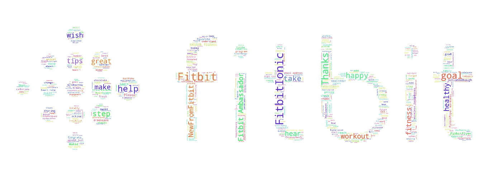
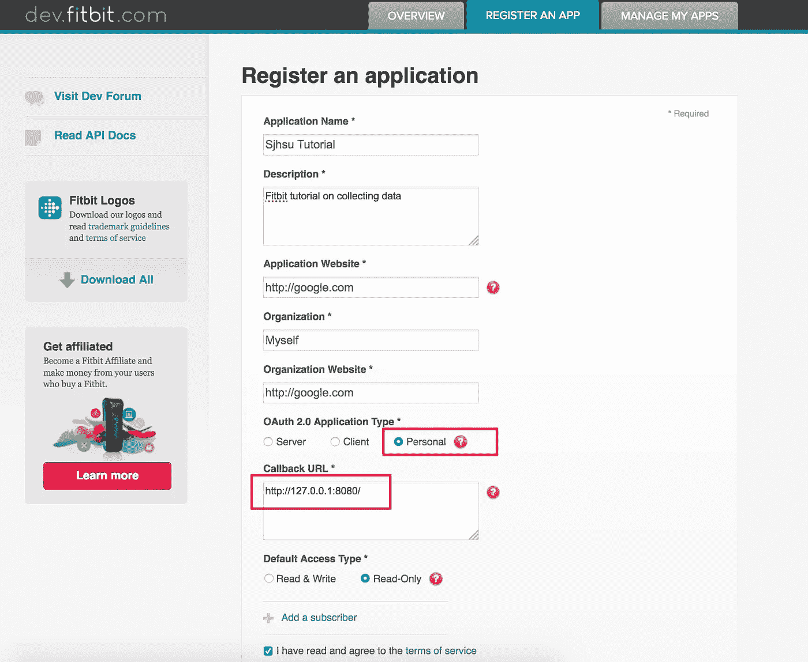
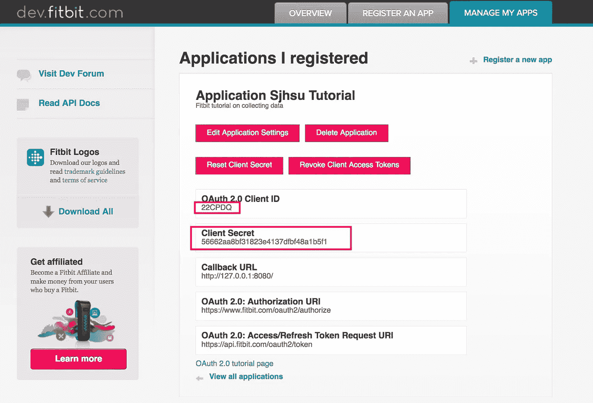
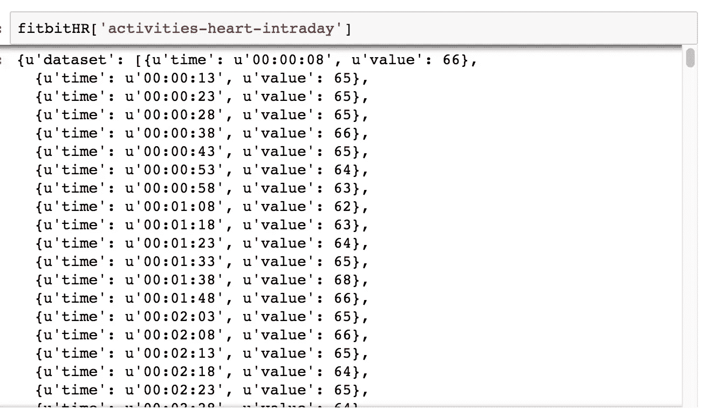
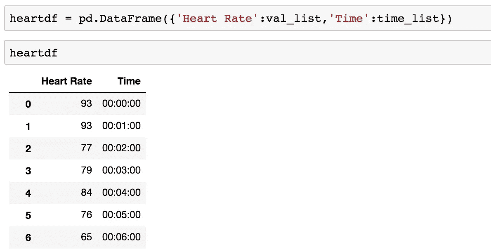
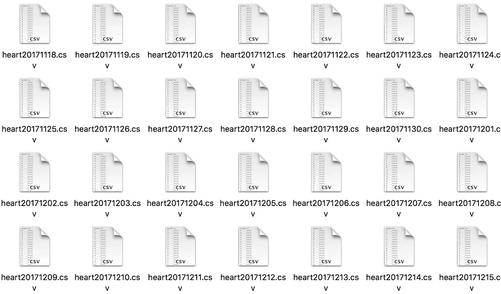
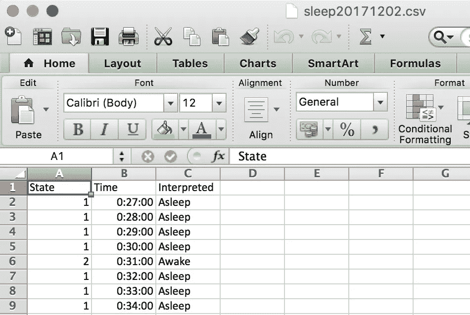
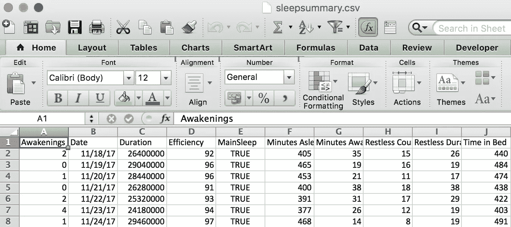

# 使用 Python 收集您自己的 Fitbit 数据

> 原文：<https://towardsdatascience.com/collect-your-own-fitbit-data-with-python-ff145fa10873?source=collection_archive---------0----------------------->



Python Generated Fitbit Cloud

所以你在圣诞假期有了你的 Fitbit，你也有了一些新年决心。你上网查看仪表盘上的图表，但还是不满意。你想要更多的数据、更多的图表和更多的信息。好了，不多说，因为我将教你如何收集你自己的 Fitbit 数据，只用一点 Python 代码。有了这个教程，你可以得到你难以捉摸的分分钟数据(也称为日内数据)，这是你第一次得到 Fitbit 时不容易得到的。

**第一步**:设置你的账户并创建应用程序

你需要做的第一件事是创建一个 [Fitbit 账户](https://www.fitbit.com/)。一旦你完成了这些，你就可以去 dev.fitbit.com 的 T4。在“管理”下，转到“注册应用程序”。这将引导您进入一个如下所示的页面:



Application Registration

对于应用网站和组织网站，可以用“http://”或“https://”开头的任何名称命名。其次，确保 OAuth 2.0 应用程序类型为“个人”，因为这是允许我们下载当天数据的关键。最后，确保回调 URL 是“http://127.0.0.1:8080/”，以便让我们的 Fitbit API 正确连接。之后，点击协议框并提交。

**注意**:根据应用程序的不同，我们可能需要一个额外的步骤来填写表格，以便在[这个链接](https://dev.fitbit.com/build/reference/web-api/help/)获得我们当天数据的许可。Fitbit 支持个人项目和任何其他非营利研究，因此这些应该已经可以调用，但商业应用程序可能需要更长时间才能获得批准。

之后，您将被重定向到如下页面:



Registered Application

我们将从这个页面中需要的部分是 OAuth 2.0 客户端 ID 和客户端密码。

**第二步:**API

一旦第一步完成，我们的下一步是使用一个 [Fitbit 非官方 API](https://github.com/orcasgit/python-fitbit) 。点击右侧的绿色按钮下载回购文件，然后解压文件。然后，打开命令行，将目录切换到包含解压缩文件的目录，并快速运行“sudo pip install-r requirements/base . txt”。

现在我们终于准备好开始编码了。首先，我们需要导入必要的包，并引入之前的 Client_ID 和 Client_Secret 来授权我们自己。

```
import fitbit
import gather_keys_oauth2 as Oauth2
import pandas as pd 
import datetimeCLIENT_ID = '22CPDQ'
CLIENT_SECRET = '56662aa8bf31823e4137dfbf48a1b5f1'
```

使用 ID 和 Secret，我们可以获得授权我们获取数据的访问和刷新令牌。

```
server = Oauth2.OAuth2Server(CLIENT_ID, CLIENT_SECRET)
server.browser_authorize()ACCESS_TOKEN = str(server.fitbit.client.session.token['access_token'])
REFRESH_TOKEN = str(server.fitbit.client.session.token['refresh_token'])auth2_client = fitbit.Fitbit(CLIENT_ID, CLIENT_SECRET, oauth2=True, access_token=ACCESS_TOKEN, refresh_token=REFRESH_TOKEN)
```


What the page should look like after authorization and signing in

我们进去了。…但没那么快。我们已经验证了自己的身份，但仍未获得数据。在开始之前，我有一个方便的技巧，可以节省大量的手工输入:许多调用都需要日期格式(YYYY-MM-DD)作为字符串格式。因此，如果您每天收集数据，我们必须每天手动更改该字符串。相反，我们可以导入有用的“datetime”包，让它替我们格式化。

```
yesterday = str((datetime.datetime.now() - datetime.timedelta(days=1)).strftime("%Y%m%d"))yesterday2 = str((datetime.datetime.now() - datetime.timedelta(days=1)).strftime("%Y-%m-%d"))today = str(datetime.datetime.now().strftime("%Y%m%d"))
```

**第三步**:采集数据

我们现在终于可以调用我们的数据了。

```
fit_statsHR = auth2_client.intraday_time_series('activities/heart', base_date=yesterday2, detail_level='1sec')
```



Heart Rate Data

虽然这些数据对我们来说是可读的，但它还不能保存在我们的电脑上。以下代码读取字典格式并遍历字典值——在将两者组合成一个[熊猫数据帧](https://pandas.pydata.org/pandas-docs/stable/generated/pandas.DataFrame.html)之前，将各自的时间和值保存为列表。

```
time_list = []
val_list = []for i in fit_statsHR['activities-heart-intraday']['dataset']:
    val_list.append(i['value'])
    time_list.append(i['time'])heartdf = pd.DataFrame({'Heart Rate':val_list,'Time':time_list})
```



Our Newly Created Fitbit pandas data frame

现在终于可以在本地保存我们的数据了。考虑到未来，我们将一次一个数据地调用我们的数据(1 个文件= 1 天)，所以我们希望有一个良好的命名约定，以防止任何未来的混淆或覆盖数据。我的首选格式是 heartYYYMMDD.csv。以下代码获取我们的心脏数据帧，并将其作为 csv 文件保存在/Downloads/python-fitbit-master/Heart/目录中。

```
heartdf.to_csv('/Users/shsu/Downloads/python-fitbit-master/Heart/heart'+ \
               yesterday+'.csv', \
               columns=['Time','Heart Rate'], header=True, \
               index = False)
```



Small army of heart rate files

但是等等！还有更多！

阅读[文档](https://python-fitbit.readthedocs.io/en/latest/)，我们还可以收集很多其他数据，比如:

我们的睡眠日志数据:

```
"""Sleep data on the night of ...."""fit_statsSl = auth2_client.sleep(date='today')
stime_list = []
sval_list = []for i in fit_statsSl['sleep'][0]['minuteData']:
    stime_list.append(i['dateTime'])
    sval_list.append(i['value'])sleepdf = pd.DataFrame({'State':sval_list,
                     'Time':stime_list})sleepdf['Interpreted'] = sleepdf['State'].map({'2':'Awake','3':'Very Awake','1':'Asleep'})
sleepdf.to_csv('/Users/shsu/Downloads/python-fitbit-master/Sleep/sleep' + \
               today+'.csv', \
               columns = ['Time','State','Interpreted'],header=True, 
               index = False)
```



Sleep Log

或者我们的睡眠总结:

```
"""Sleep Summary on the night of ...."""fit_statsSum = auth2_client.sleep(date='today')['sleep'][0]ssummarydf = pd.DataFrame({'Date':fit_statsSum['dateOfSleep'],
                'MainSleep':fit_statsSum['isMainSleep'],
               'Efficiency':fit_statsSum['efficiency'],
               'Duration':fit_statsSum['duration'],
               'Minutes Asleep':fit_statsSum['minutesAsleep'],
               'Minutes Awake':fit_statsSum['minutesAwake'],
               'Awakenings':fit_statsSum['awakeCount'],
               'Restless Count':fit_statsSum['restlessCount'],
               'Restless Duration':fit_statsSum['restlessDuration'],
               'Time in Bed':fit_statsSum['timeInBed']
                        } ,index=[0])
```



Sleep Summary

这就是开始收集所有 Fitbit 数据所需的全部内容！所以，再玩一会儿，阅读 Python Fitbit 文档，完全沉浸其中，找到出路，看看你的心脏数据有多棒。如果你想知道如何利用这些数据，这里有一个[链接](https://medium.com/@shsu14/what-i-learned-from-analyzing-my-fitbit-data-61125d85af40)指向我对自己心脏数据的分析。

感谢您花时间阅读我的教程，并随时在 [LinkedIn](https://www.linkedin.com/in/stephenjhsu/) 上发表评论或联系，因为我将发布更多关于数据挖掘和数据科学的教程。

参考资料:

1.  [Orcas Fitbit API Github](https://github.com/orcasgit/python-fitbit)
2.  [Python-Fitbit 文档](http://python-fitbit.readthedocs.io/en/latest/)
3.  [官方 Fitbit API 文档](https://dev.fitbit.com/build/reference/web-api/)
4.  [Fitbit 日内访问表](https://dev.fitbit.com/build/reference/web-api/help/)
5.  [个人 Github 与所有代码](https://github.com/stephenjhsu/fitbit)
6.  [熊猫数据框文档](https://pandas.pydata.org/pandas-docs/stable/generated/pandas.DataFrame.html)