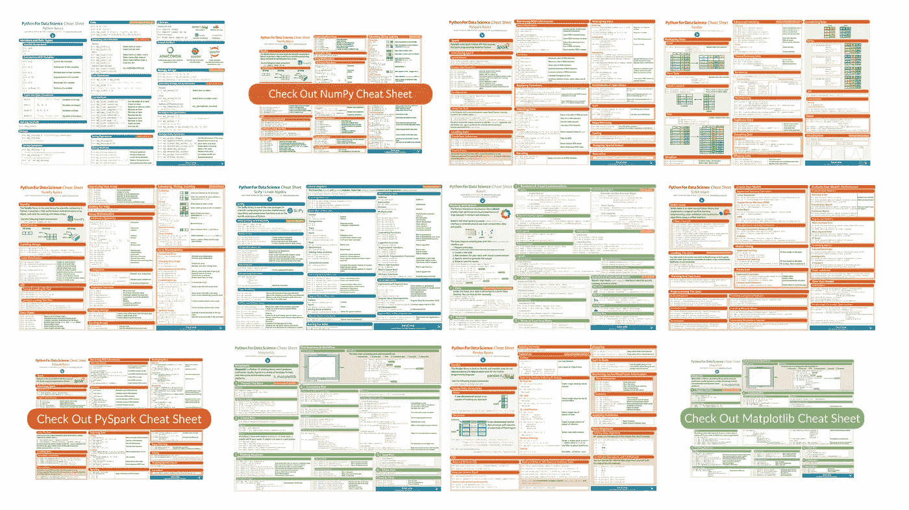

# 收集数据科学备忘单

> 原文：<https://towardsdatascience.com/collecting-data-science-cheat-sheets-d2cdff092855?source=collection_archive---------0----------------------->

正如你可能已经知道的，我已经专门为那些刚刚开始接触数据科学的人或者那些在处理数据科学问题时需要额外帮助的人制作了 Python 和 R 备忘单。

现在，您可以在 DataCamp 社区的一个地方找到它们。

**你可以在这里** **找到所有的小抄** [**。**](https://www.datacamp.com/community/data-science-cheatsheets)

概括地说，这些是迄今为止我们已经制作并与社区分享的数据科学备忘单:

**基础知识**

*   [Python 基础知识备忘单](https://www.datacamp.com/community/tutorials/python-data-science-cheat-sheet-basics)
*   [Scipy 线性代数备忘单](https://www.datacamp.com/community/blog/python-scipy-cheat-sheet)

**数据操作**

*   [NumPy 基础知识备忘单](https://www.datacamp.com/community/blog/python-numpy-cheat-sheet)
*   [熊猫基础知识小抄](https://www.datacamp.com/community/blog/python-pandas-cheat-sheet)
*   [熊猫数据扯皮小抄](https://www.datacamp.com/community/blog/pandas-cheat-sheet-python)
*   [xts 备忘单](https://www.datacamp.com/community/admin/blog/xts-cheat-sheet)
*   [data.table 备忘单](https://www.datacamp.com/community/tutorials/data-table-cheat-sheet) ( *更新！*)
*   [Tidyverse 小抄](https://www.datacamp.com/community/blog/tidyverse-cheat-sheet-beginners)

**机器学习、深度学习、大数据**

*   [sci kit-学习备忘单](https://www.datacamp.com/community/blog/scikit-learn-cheat-sheet)
*   [Keras 备忘单](https://www.datacamp.com/community/blog/keras-cheat-sheet)
*   [PySpark RDD 小抄](https://www.datacamp.com/community/blog/pyspark-cheat-sheet-python)
*   [PySpark SparkSQL 备忘单](https://www.datacamp.com/community/blog/pyspark-sql-cheat-sheet)

**数据可视化**

*   [Matplotlib 备忘单](https://www.datacamp.com/community/blog/python-matplotlib-cheat-sheet)
*   [Seaborn 小抄](https://www.datacamp.com/community/blog/seaborn-cheat-sheet-python)
*   [散景小抄](https://www.datacamp.com/community/blog/bokeh-cheat-sheet-python) ( *更新！*)

**IDE**

*   [Jupyter 笔记本小抄](https://www.datacamp.com/community/blog/jupyter-notebook-cheat-sheet)

尽情享受，随意分享！

PS。您是否看到了另一份想要推荐的数据科学备忘单？让我们在这里了解**！**