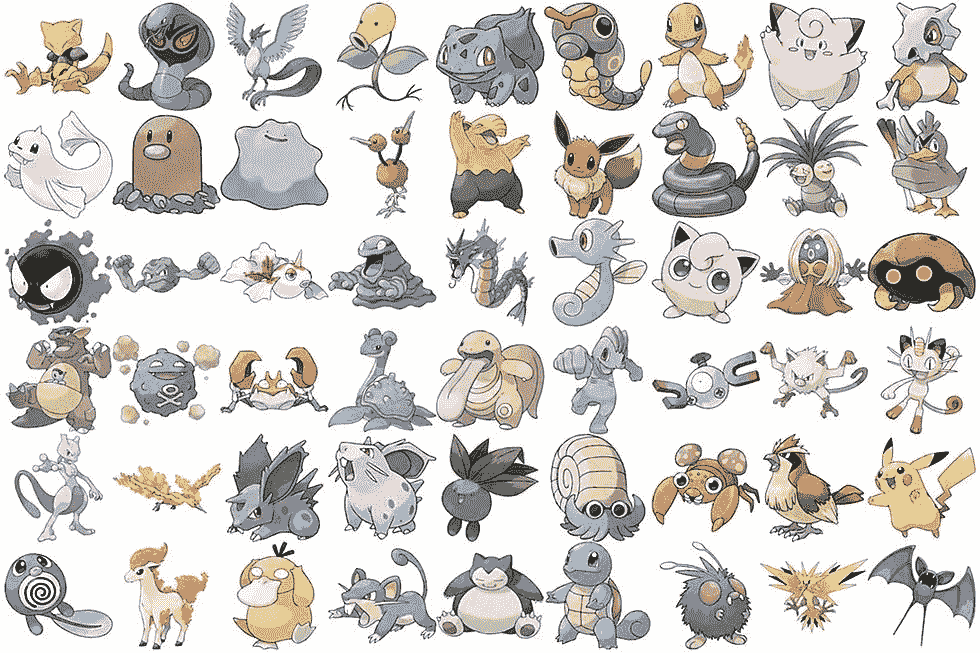
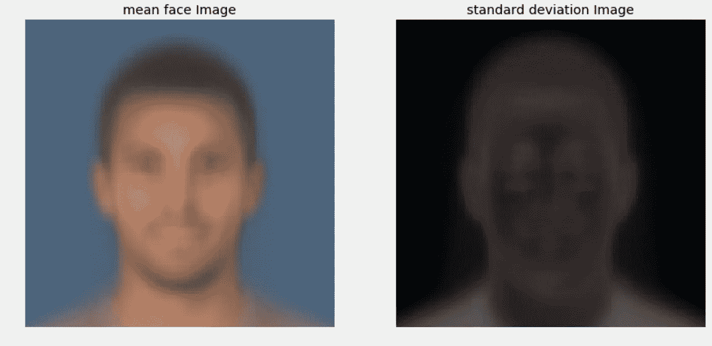
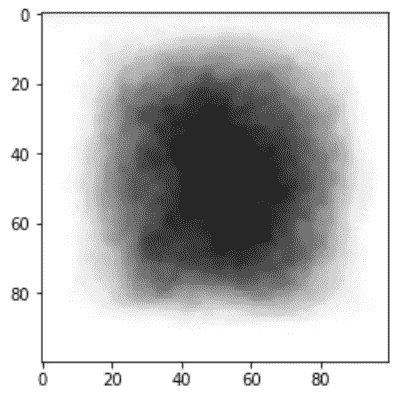
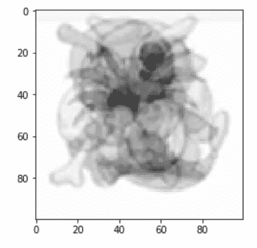
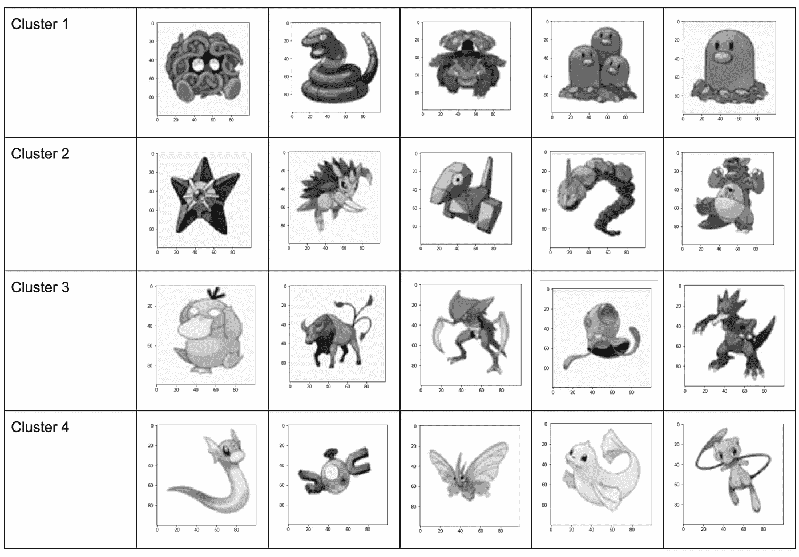

# 口袋妖怪图像的均值聚类

> 原文：<https://towardsdatascience.com/color-difference-clustering-on-pokemon-images-68c6f0a3245b?source=collection_archive---------7----------------------->



Developing strategies to group similar Pokemon Images

探索性算法是在数字属性上明确定义的，通过提供描述性统计的摘要，然后是可视化，如直方图、散点图和其他一些可能与问题相关的内容。然而，简单的摘要更容易与图像数据集混淆。

图像数据聚类，也称为图像检索，有许多有趣的算法，如使用自动编码器来获得图像相似性。然而，这些算法很难实现，并且需要一些时间来训练。本文的目的是尝试一个简单的概念，根据与平均图像的距离对相似图像进行分组。

在浏览 Kaggle 内核时，我看到了一个非常有趣的想法，即使用“平均图像”对国际足联球员数据库中的人脸图像进行聚类:



在面部数据集上，平均面部图像的概念是相当直观的，然而，我怀疑这将如何转化为其他数据集。

尽管如此，我还是开始了这个项目，来看看在一个由口袋妖怪图像组成的数据集上，普通的图像会是什么样子。我最初的反应是，这种方法实现起来比构建卷积自动编码器简单得多，因此，如果这能产生有意义的聚类，它将是有用的。

在本文中，我们将探索一个包含 150 个原始口袋妖怪图像的数据集，并根据它们与平均图像的差异对它们进行聚类。本文将进一步探讨均值图像的使用，以及如何使用它在图像数据中形成聚类。

图像聚类的一个潜在应用可能是改进数据扩充算法。图像聚类对于改进用于添加数据的生成对抗网络(GANs)的使用非常有用。我们将从本文中导出的集群中进行采样，而不是从整个数据集中进行采样。

以下是我们将遵循的形成口袋妖怪图像集群的工作流程:

```
# Load Images
# Calculate Mean Image
# Calculate Distance from Mean to each Image
# Sort by Distance
# Select Clusters based on Distance Quantiles
```

我已经在 Github [上传了我在这里使用的口袋妖怪图片](https://github.com/CShorten/PokemonGANs):

*所有代码都是用 Python 写的*

```
# Load Pokemon Imagesfrom PIL import Image
import numpy as np
import os
from random import shuffle
from tqdm import tqdm
import matplotlib.pyplot as pltDIR_NAME = './Pokemon'
IMG_SIZE = 100pokemon = []
for img in tqdm(os.listdir(DIR_NAME)):
    path = os.path.join(DIR_NAME, img)
    if "DS_Store" not in path:
        img = Image.open(path)
        img = img.convert('L')
        img = img.resize((IMG_SIZE, IMG_SIZE), Image.ANTIALIAS)
        pokemon.append(np.array(img))

print(type(pokemon[0]))
print(pokemon[0].shape)
plt.imshow(pokemon[0], cmap = 'gist_gray')
plt.show()
```

*现在我们已经加载了图像，我们想要计算整个数据集的平均图像:*

```
# Calculate Mean Image
sums = np.zeros((100, 100))
for x in range(len(pokemon)):
    for i in range(100):
        for j in range(100):
            sums[i][j] += pokemon[x][i][j]
#print(sums)
for idx in range(100):
    for idy in range(100):
        sums[idx][idy] /= len(pokemon)
#print(sums)
plt.imshow(sums, cmap='gist_gray')
plt.show()
```

平均图像:



前 5 幅图像的平均图像:



```
# Define Distance functiondef SquaredDistance(x, y):
    return (x-y)**2
def ImageDistance(img1, img2):
    distance = 0
    for i in range(100):
        for j in range(100):
            distance += SquaredDistance(img1[i][j], img2[i][j])      
    return distance
```

我们将使用距离的平方来计算每个口袋妖怪与平均口袋妖怪图像的距离。

```
# Calculate Distance from Mean Image to each Imagemean_image = sums
Distance_Dict = {}
for i in range(len(pokemon)):
    Distance_Dict[i] = ImageDistance(mean_image, pokemon[i])
```

本词典采用以下形式:

```
0: distance from image 0 to mean image
1: distance from image 1 to mean image
...
150: distance from image 150 to mean image
```

现在，我们根据这个排序的分区对字典和集群进行排序:

```
import operator
sorted_d = sorted(Distance_Dict.items(), key=operator.itemgetter(1))
print(sorted_d)
```

最后，让我们想象一下每个集群中的一些图像，看看我们在这里做了什么…



总之，使用均值距离来形成聚类并没有什么好处。虽然它在基于图像的集中暗度对图像进行聚类方面做得很好，但它没有捕捉到我们在图像聚类中想要的任何视觉相似性(除了第一组中的 Diglet 和 Dugtrio)。我很高兴能继续研究图像检索和相似性技术，以形成更有意义的基于除颜色密度之外的视觉特征的图像簇，感谢阅读！

# [CShorten](https://medium.com/@connorshorten300)

Connor Shorten 是佛罗里达大西洋大学计算机科学专业的学生。对软件经济学、深度学习和软件工程感兴趣。