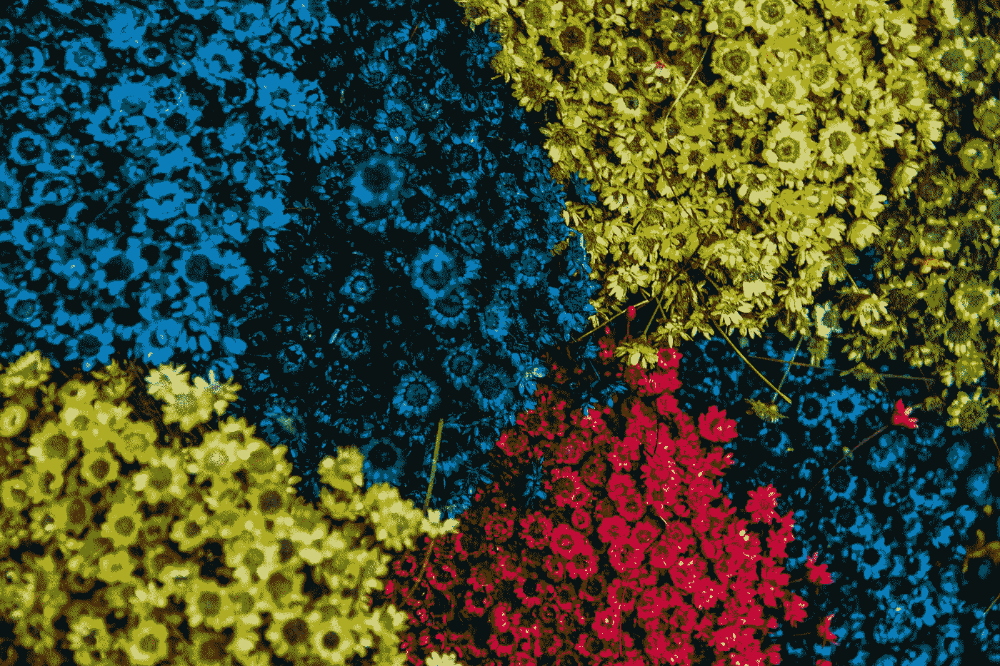
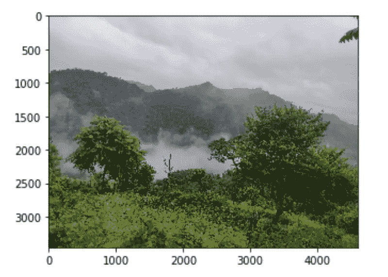
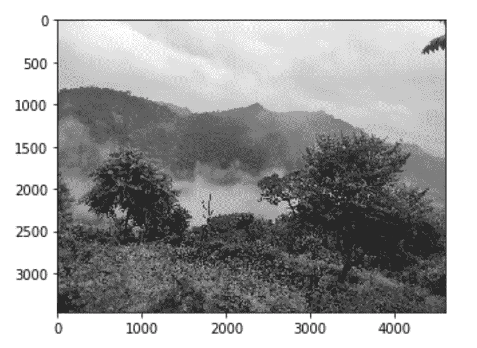
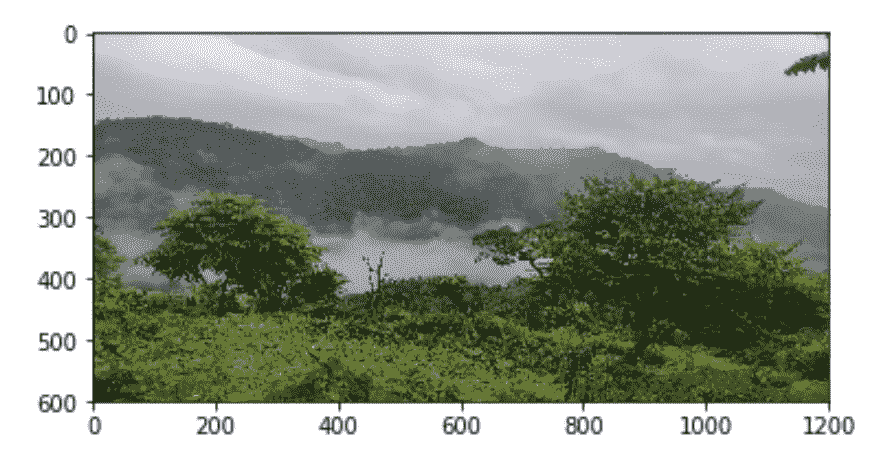
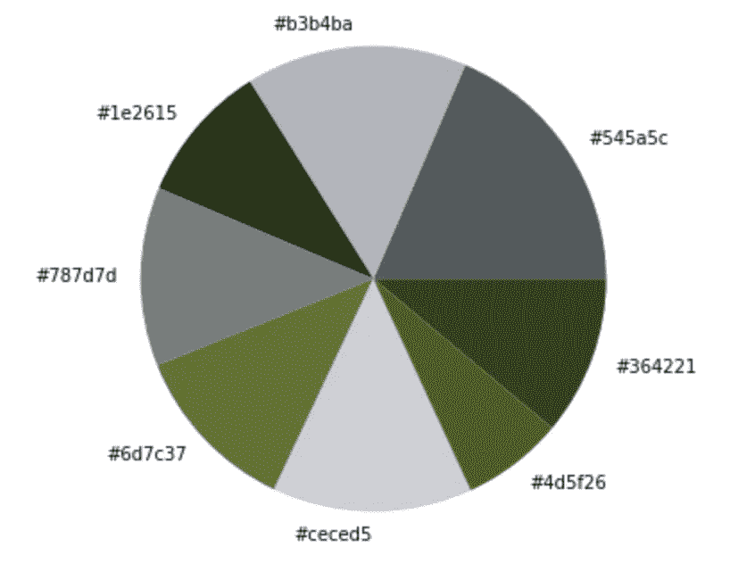
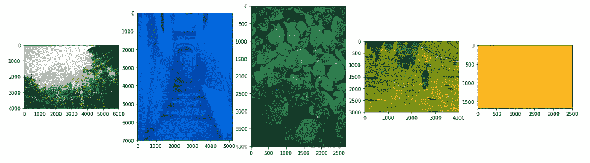
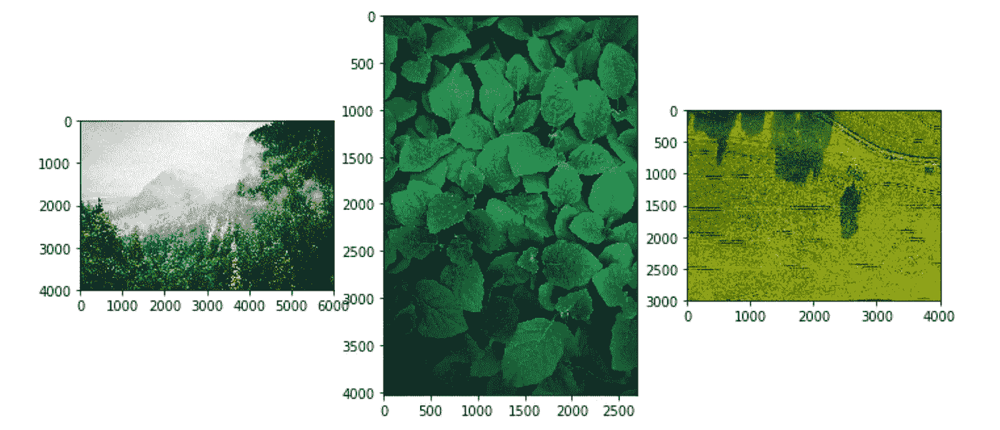
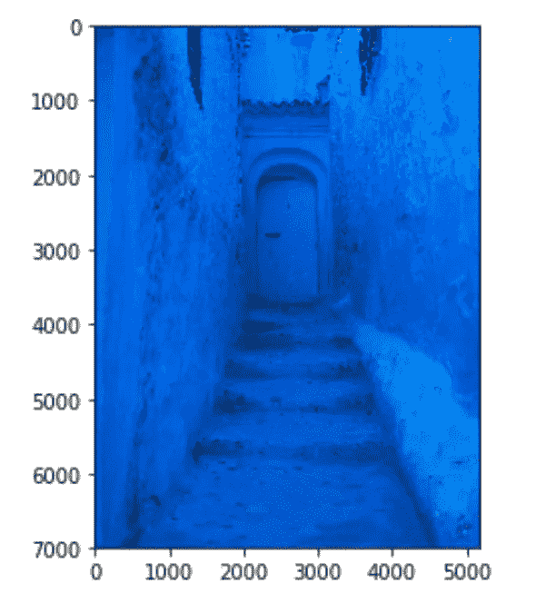
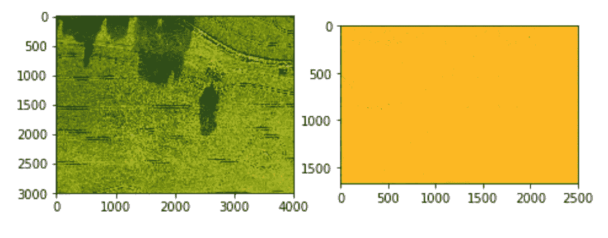

# 图像中的颜色识别

> 原文：<https://towardsdatascience.com/color-identification-in-images-machine-learning-application-b26e770c4c71?source=collection_archive---------1----------------------->

## 机器学习应用

Photo by [Henry Lorenzatto](https://unsplash.com/@henryatto?utm_source=medium&utm_medium=referral) on [Unsplash](https://unsplash.com?utm_source=medium&utm_medium=referral)

我最近开始阅读如何用 Python 处理图像。当我偶然发现 OpenCV 允许用 Python 导入和处理图像时，我开始想知道是否可以使用机器学习从这些图像中提取信息并以某种方式使用。

我们都知道，我们可以基于某些过滤器进行在线搜索，其中一个过滤器是*颜色*。我受到启发，实际上编写了代码，可以从图像中提取颜色，并根据这些颜色过滤图像。

在本文中，我解释了我如何理解 OpenCV 的基础知识，使用 KMeans 算法从图像中提取颜色，并基于颜色的 RGB 值从图像集合中过滤图像。完整的笔记本可以在[这个资源库](https://github.com/kb22/Color-Identification-using-Machine-Learning)中找到。我点击了`sample_image.jpg`，文件夹`images`中的其他 5 张图片取自 [Unsplash](https://unsplash.com/) 。

# 导入库

我们导入的基本库包括`matplotlib.pyplot`和`numpy`。为了提取计数，我们将使用集合库中的`Counter`。要用 OpenCV，我们就用`cv2`。`KMeans`算法是`sklearn's cluster`子包的一部分。为了比较颜色，我们首先使用`rgb2lab`将它们转换到 lab，然后使用`deltaE_cie76`计算相似度。最后，为了在从目录中读取文件时组合路径，我们导入了`os`。

# 使用 OpenCV

Sample Image

为了读取任何图像，我们使用方法`cv2.imread()`并指定作为 Numpy 数组导入笔记本的图像的完整路径。然后我们可以使用 pyplot 的方法`imshow()`来绘制它。

数组的形状是(3456，4608，3)。前两个值匹配图像的像素。第三个值设置为 3，因为每个像素表示为三种颜色(红色、蓝色和绿色)的组合。

Image read by OpenCV

图像的颜色看起来有点不对。这是因为，默认情况下，OpenCV 按照蓝绿色红色(BGR)的顺序读取图像。因此，为了查看实际的图像，我们需要将渲染转换为红绿蓝(RGB)。

方法`cvtColor`允许我们将图像渲染转换到不同的颜色空间。为了从`BGR`色彩空间移动到`RGB`，我们使用方法`cv2.COLOR_BGR2RGB`。

RGB Colors set for the image

在某些情况下，我们可能想要黑白图像。在这种情况下，我们可以将图像表示为灰色。我们现在使用转换空间作为`cv2.COLOR_BGR2GRAY`，并用色图显示输出作为`gray`。

Gray Image

我们还可以将图像调整到给定的尺寸。我们使用`cv2`提供的方法`resize`。第一个参数是我们要调整大小的图像，第二个参数是括号内定义的宽度和高度。

Resized image to 1200 x 600

现在让我们来识别图像中的颜色，并将顶部的颜色显示为饼图。

# 颜色识别

## RGB 到十六进制转换

我们将首先定义一个将`RGB`转换为`hex`的函数，这样我们就可以将它们用作饼图的标签。

在读取`RGB`空间中的颜色时，我们返回一个字符串。`{:02x}`简单显示相应颜色的十六进制值。

## 读取 RGB 颜色空间中的图像

接下来，我们定义一个方法，它将帮助我们在`RGB`空间中把一个图像放入 Python。

我们提供图像的路径作为参数。首先，我们使用`imread`读取文件，然后在返回之前改变它的颜色空间。

## 从图像中获取颜色

我们现在将完整的代码定义为一个方法，我们可以调用该方法从图像中提取顶部的颜色，并将它们显示为饼图。我将该方法命名为`get_colors`，它有 3 个参数:

1.  `image`:我们希望提取颜色的图像。
2.  `number_of_colors`:我们要提取的总颜色。
3.  `show_chart`:决定是否显示饼图的布尔值。

为了更好的理解，我们来分解一下这个方法。

首先，我们将图像调整到尺寸`600 x 400`。不需要将其调整到较小的尺寸，但我们这样做是为了减少像素，从而减少从图像中提取颜色所需的时间。KMeans 期望输入是二维的，所以我们使用 Numpy 的 reshape 函数来整形图像数据。

KMeans 算法根据提供的分类计数创建分类。在我们的例子中，它将形成颜色的集群，这些集群将是我们的顶部颜色。然后，我们在同一幅图像上用`fit`和`predict`将预测提取到变量`labels`中。

我们使用`Counter`来计算所有标签的数量。为了找到颜色，我们使用`clf.cluster_centers_`。`ordered_colors`遍历 count 中出现的键，然后将每个值除以`255`。我们可以直接将每个值除以 255，但是这样会打乱顺序。

接下来，我们得到`hex`和`rgb`颜色。正如我们之前将每种颜色除以 255 一样，我们现在在寻找颜色时再次将其乘以 255。如果`show_chart`是`True`，我们绘制一个饼图，每个饼图部分使用`count.values()`定义，标签为`hex_colors`，颜色为`ordered_colors`。我们最终返回了`rgb_colors`，我们将在后面的阶段使用它。

> 瞧啊。！我们都准备好了！！

让我们把这个方法叫做`get_colors(get_image(‘sample_image.jpg’), 8, True)`，我们的饼状图显示了图像的前 8 种颜色。

Identified colors

> 这为许多高级应用打开了大门，例如在搜索引擎中搜索颜色，或者寻找一件有某种颜色的衣服。

我们刚刚确定了图像中存在的 8 种主要颜色。让我们尝试实现一个搜索机制，它可以根据我们提供的颜色过滤图像。

# 使用颜色搜索图像

我们现在将深入研究基于我们想要的颜色过滤一组五个图像的代码。对于我们的用例，我们将提供颜色*绿色*、*蓝色*和*黄色*的 RGB 值，并让我们的系统过滤图像。

## 获取所有图像

图像在文件夹`images`中。我们把`COLORS`定义为颜色的字典。然后，我们读取该文件夹中的所有图像，并将它们的值保存在`images`数组中。

## 显示所有图像

我们首先使用下面提到的`for`循环显示文件夹中的所有图像。

我们将该区域分割成与图像数量相等的支线剧情。该方法采用的参数为*行数= 1* ，*列数=所有图像，即在我们的例子中为 5* 以及*索引*。

All images in the ‘images’ folder

## 用颜色匹配图像

我们现在定义一个方法`match_image_by_color`来过滤所有匹配所选颜色的图像。

我们首先使用之前定义的方法`get_colors`以`RGB`格式提取图像颜色。我们使用方法`rgb2lab`将选择的颜色转换成我们可以比较的格式。`for`循环简单地遍历从图像中获取的所有颜色。

对于每种颜色，循环将其更改为`lab`，在迭代中找到所选颜色和该颜色之间的差值(基本上是差异),如果该差值小于阈值，则选择该图像与该颜色匹配。我们需要计算增量，并将其与阈值进行比较，因为每种颜色都有许多阴影，我们无法始终将所选颜色与图像中的颜色完全匹配。

> 通过说绿色，用户可以指浅绿色、绿色或深绿色。我们需要扫描所有的可能性。

如果我们从一幅图像中提取 5 种颜色，即使其中一种颜色与所选颜色匹配，我们也会选择该图像。`threshold`基本上定义了图像和所选颜色的差异。

让我们考虑这样的情况，我们试图找到绿色的图像。如果阈值太高，我们可能会在搜索中看到蓝色图像。类似地，另一方面，如果阈值太低，那么绿色甚至可能不匹配包含深绿色的图像。这都是基于手头情况的需要，我们可以相应地修改这些值。我们需要仔细设置`threshold`值。

## 显示选定的图像

我们定义了一个函数`show_selected_images`，它遍历所有图像，调用上面的函数根据颜色过滤它们，并使用`imshow`将它们显示在屏幕上。

我们现在将简单地调用这个方法，并让它绘制结果。

# 过滤结果

我们按如下方式调用该方法。我们将变量`selected_color`替换为绿色的`COLORS['GREEN']`，蓝色的`COLORS['BLUE']`，黄色的`COLORS['YELLOW']`。我们设置阈值为`60`，从图像中提取的总颜色为`5`。

## 寻找绿色

Search for ‘GREEN”

## 寻找蓝色

Search for ‘BLUE’

## 寻找黄色

Search for ‘YELLOW’

# 结论

在本文中，我们讨论了使用 KMeans 算法从图像中提取颜色，然后使用该算法基于颜色搜索图像的方法。

希望你喜欢我的作品。请分享你的想法和建议。