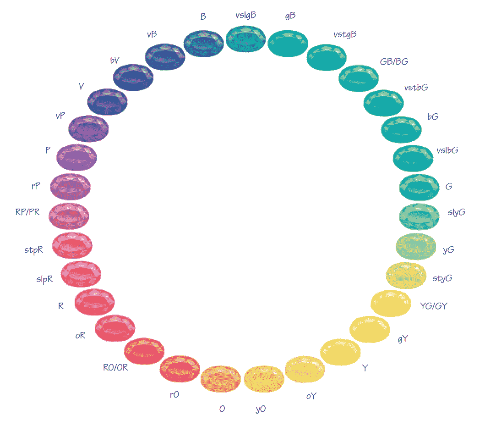
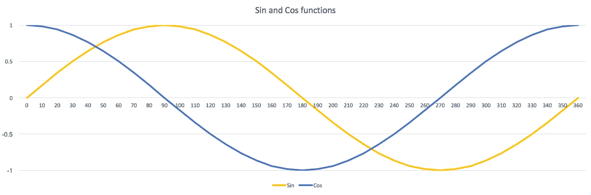
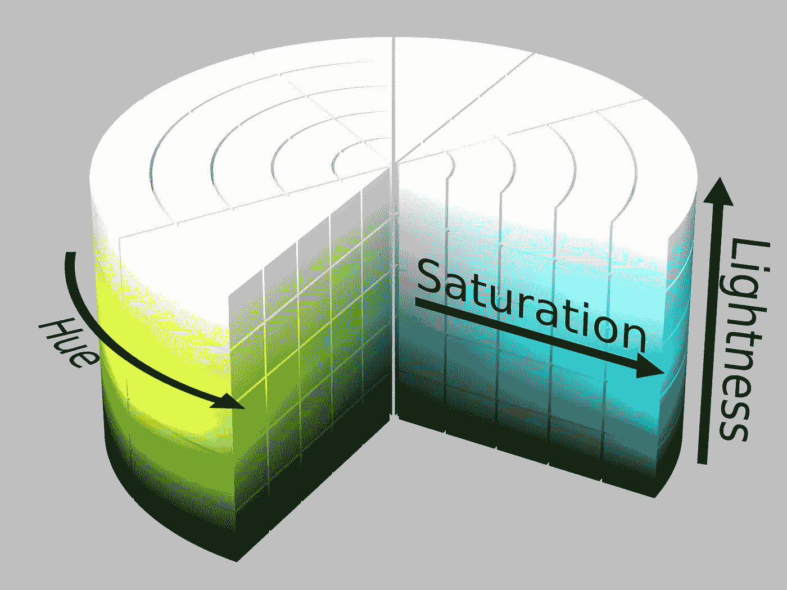
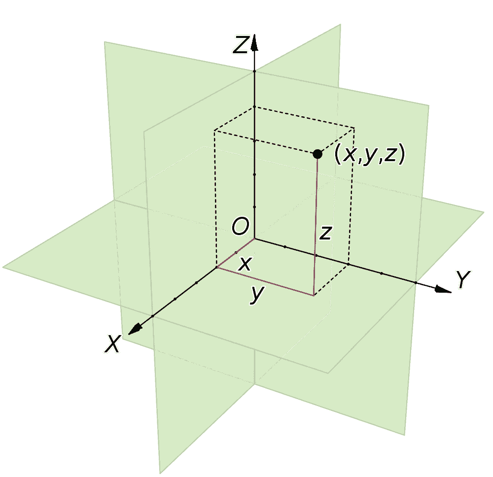

# 机器学习算法的颜色参数

> 原文：<https://towardsdatascience.com/color-parameters-for-a-machine-learning-algorithm-fc19487d2b6f?source=collection_archive---------9----------------------->

# 说到机器学习，你不能低估数据工程的重要性。

在为我的项目准备数据时，我遇到了几个挑战，我正在开发一种机器学习算法，根据影响彩色宝石价值的参数来预测它们的价格。挑战之一是颜色。

颜色是宝石的一个极其重要的特性，因为它对宝石的价值有很大的影响，将颜色参数正确地输入系统是至关重要的。

广泛使用的用于描述宝石颜色的模型是 GIA(美国宝石学院)提出的模型。它通过三个参数来描述每种颜色——色调、色调和饱和度。

**色调**定义了宝石的暗度或明度，可以很容易地用数字表示(GIA 建议从 2 到 8 的整数范围，较大的数字对应较暗的色调)。

这同样适用于**饱和度**，其范围从较弱的饱和度到生动的饱和度。它也可以映射到一个数字范围(1 到 8，较大的数字对应于更鲜明的饱和度)。

GIA® Hue wheel. ©GIA

当你开始使用**色调**时，问题就出现了。标准 GIA 色调色轮由 31 个描述彩色宝石的色调名称组成。对于宝石专业人员来说，这是一种很好的颜色视觉表现，在他们的日常工作中非常实用。但是为了将色调参数传递给算法进行进一步分析，我们需要用数字来表示它。

糟糕的是，如果你只是简单地将色调名称映射到 1 到 31 的数字(对于你的特定任务，你也可以考虑将色调映射到 0 到 360 的角度值)，你会丢失非常重要的关于颜色的实际接近度的信息，这些信息位于数字范围的最开始和最末端。

例如，如果我们从映射到 1 的“红色”开始，我们以映射到 31 的名为 slpR 的“略带紫红色”的颜色结束。所以，这两种在现实中非常接近的颜色在机器学习算法看来会完全不同。算法的这种颜色错误表示对于整体成功是至关重要的，必须避免。

那么，我们如何将色轮中的色调值映射到一个数字表示中，而不会丢失关于颜色接近度的重要信息呢？

乍一看，这里可以应用的一个可能的变通方法是用两个参数定义色调值，这两个参数可以作为 Sin 和 Cos 函数来计算。看看这个图表。

Replacing one Hue parameter with Sin and Cos seems to solve the problem. But this is not good!

这样，在色轮上具有接近 0 度或接近 360 度的色调的颜色将由数值接近的成对 *Sin(色调)*和 *Cos(色调)*呈现。答对了，我们已经解决了问题！或者我们有吗？

等等，我们现在已经向算法传递了 4 个描述颜色的参数——色调、饱和度、Sin(色调)、Cos(色调)！因此，我们增加了模型的维度，而我们希望尽可能地减少维度以避免数据稀疏。因此，这种方法似乎不是最佳解决方案。

换句话说，我们来思考这个问题。我们在这里试图实现的是在 3D 空间中找到这样一种颜色位置的数字表示，它将保留关于该空间中实际颜色的接近度的信息。

HSL color model based on polar coordinate system

用色调、色调和饱和度操作的颜色模型通常被称为 **HSL 颜色模型** (L 代表*亮度*，在我们的例子中是*色调*)。HSL 模型基于柱坐标系，而柱坐标系本身是将极坐标系统扩展到三维的结果。

正如我们已经了解的，极坐标系统的缺点是当用数字表示边缘颜色时，不能解决它们的接近性。但是，如果我们研究另一种流行的坐标系类型——笛卡尔坐标系，我们会发现这种类型的系统对于进一步的机器学习目的来说没有这种缺点。

A Cartesian coordinate system

有几种基于笛卡尔坐标系的颜色模型，RGB 就是其中之一。在 RGB 中，我们通过对应于 RGB 3D 颜色空间中三个轴上的坐标的三个数字来寻址颜色。如果我们写下上例中颜色“红色”(色调= 1)和颜色“略带紫红色”(色调= 31)的坐标(r，g，b ),我们会看到这两种颜色的 *r g b* 值非常接近。Vuala！我们的算法将理解这两种颜色彼此接近，它现在可以正常工作了。非常重要的是，我们避免了增加模型的维数，因为我们仍然只用三个参数来描述颜色。

最后一点是在将颜色信息传递给算法之前，将我们的颜色从 HSL 颜色模型转换为 RGB。这可以通过使用 **Python** 中的***colorsys****模块非常容易地实现。本模块定义了***colorsys****功能。****hls _ to _ rgb****(h，l，s)* 将颜色从 HLS 坐标转换到 RGB 坐标。*

*这些是我从这个案例中得出的结论:*

*   *当心机器学习系统的极坐标系统的数字表示的限制*
*   *选择合适的颜色模型，并在输入算法之前转换您的颜色数据*
*   *小心导致维度增加的快速解决方案*

*这个案例是我现实生活项目**Gemval**(【www.gemval.com】T2)的一部分——基于机器学习算法的在线宝石鉴定服务。*