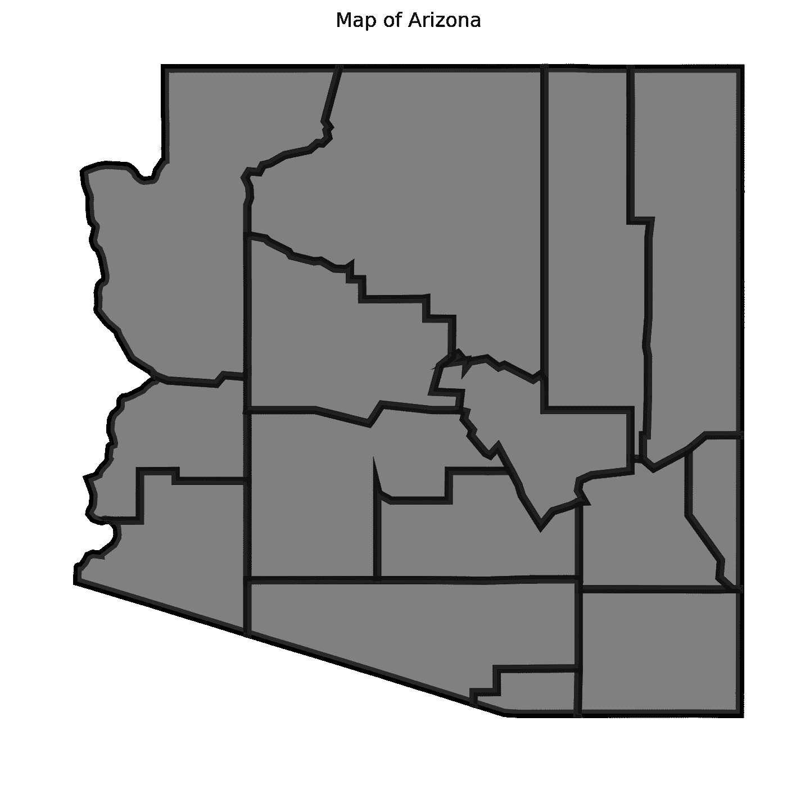
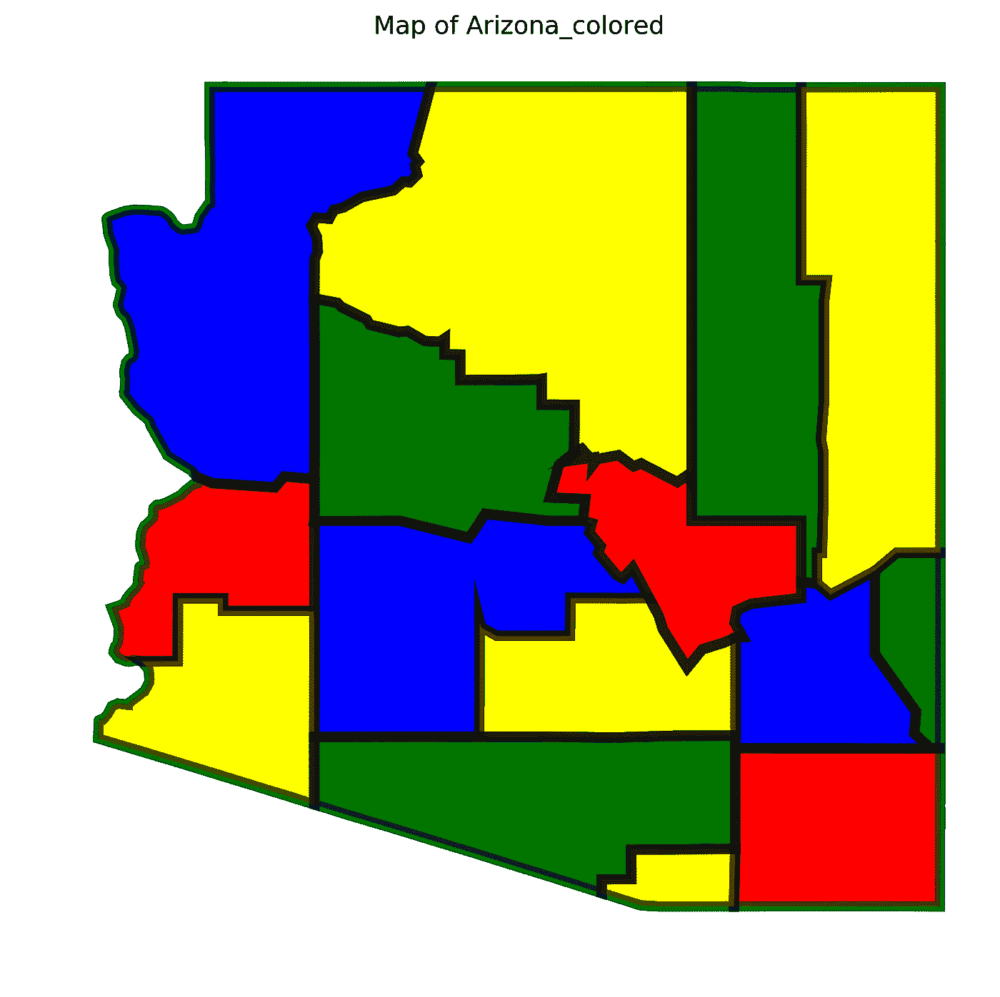

# 使用整数规划的彩色地图

> 原文：<https://towardsdatascience.com/colour-maps-using-integer-programming-e46b6297aad4?source=collection_archive---------14----------------------->

运筹学有很多很酷很实用的应用，比如供应链优化(我的最爱！)、乘务调度、车辆路径和投资组合优化。

本文讨论了这些酷运筹学应用之一。我们将使用一种称为整数规划(IP)的技术来解决地图着色难题。该难题指出，给定一个带有边界实体(例如国家、州、县)的地图，为每个实体着色所需的最少颜色数是多少，使得没有两个相邻实体具有相同的颜色。

这个地图着色问题对应于运筹学中一个著名的问题，称为顶点着色问题。在顶点着色问题中，给我们一个无向图，要求我们给它的顶点分配颜色，使得没有两个相连的顶点具有相同的颜色，当然，使用尽可能少的颜色。地图着色和顶点着色之间的对应是非常明显的，这使得它成为“商业问题”如何映射到“一般运筹学问题”的一个很好的例子，正如我在以前的文章[运筹学的大图景](https://medium.com/@mohamedleila/the-big-picture-of-operations-research-8652d5153aad)中所讨论的。

下图描述了一般流程。

*   选择未着色的地图
*   将地图建模为无向图
*   用你最喜欢的算法给无向图上色
*   将彩色无向图转换回相应的地图


我写了两个 Python 包，[顶点颜色解算器](https://github.com/mleila/vertex-color-solver)和[地图绘制器](https://github.com/mleila/map-grapher)，它们将帮助我们用大约 10 行代码完成这个过程。让我们浏览一下代码。

首先，您需要按照 Github 存储库上的说明安装软件包。

成功安装软件包后，导入以下类和函数

```
from vertex_colorer.solver import Solverfrom map_grapher.core import load_map_data, plot_map, color_map,\save_to_file, build_adjmat
```

从 **map_grapher** 加载的函数允许你选择一个地图，将其建模为一个无向图，并使用一个彩色无向图给你的地图着色。该软件包目前支持美国所有州的县地图以及一个国家地图。

在这个演示中，我将选择亚利桑那州作为一个例子。让我们加载地图

```
state = load_map_data('Arizona')
```

状态变量保存从 geojson 文件加载的地图数据。接下来，我们将使用 **plot_map** 函数绘制地图

```
figure = plot_map(state, map_title='Arizona map')
```

如果您使用 Jupyter 笔记本，您可以直接从图形查看地图，如果您在命令行上，您可能希望将图形保存到文件中

```
save_to_file (figure, 'arizona_black_and_white_map.png')
```



不错！现在下一步是将这个地图建模为一个无向图。我们可以使用下面的代码做到这一点

```
matrix = build_adjmat(state)
```

**build_adjmat** 函数获取地图数据并将其转换为邻接矩阵，这是我们将用来表示无向图的数据结构。邻接矩阵看起来像这样

```
[[1, 0, 0, 1, 1, 0, 0, 0, 1, 0, 0, 0, 1, 0, 0],
 [0, 1, 0, 0, 0, 1, 0, 1, 0, 1, 0, 1, 1, 0, 1],
 [0, 0, 1, 0, 0, 0, 1, 0, 0, 0, 0, 1, 0, 1, 1],
 [1, 0, 0, 1, 1, 0, 1, 1, 0, 0, 1, 1, 1, 0, 0],
 [1, 0, 0, 1, 1, 0, 0, 0, 0, 0, 1, 0, 0, 0, 0],
 [0, 1, 0, 0, 0, 1, 0, 0, 0, 1, 0, 0, 0, 1, 1],
 [0, 0, 1, 1, 0, 0, 1, 0, 0, 0, 1, 1, 0, 0, 0],
 [0, 1, 0, 1, 0, 0, 0, 1, 0, 0, 0, 1, 1, 0, 0],
 [1, 0, 0, 0, 0, 0, 0, 0, 1, 0, 0, 0, 1, 0, 0],
 [0, 1, 0, 0, 0, 1, 0, 0, 0, 1, 0, 0, 1, 0, 0],
 [0, 0, 0, 1, 1, 0, 1, 0, 0, 0, 1, 0, 0, 0, 0],
 [0, 1, 1, 1, 0, 0, 1, 1, 0, 0, 0, 1, 0, 0, 1],
 [1, 1, 0, 1, 0, 0, 0, 1, 1, 1, 0, 0, 1, 0, 0],
 [0, 0, 1, 0, 0, 1, 0, 0, 0, 0, 0, 0, 0, 1, 1],
 [0, 1, 1, 0, 0, 1, 0, 0, 0, 0, 0, 1, 0, 1, 1]]
```

每个元素代表无向图的两个顶点之间的一条边。如果有边(即两个顶点相连，或者从业务问题的角度来看，对应的地图实体相邻)，则值为 1，否则为 0。

我们现在可以将这个矩阵传递给我们的求解器

```
solver = Solver(matrix)
```

求解器被实例化并保存无向图。为了给图表上色，你需要选择一种方法来使用。这里我使用术语“方法”而不是“算法”,因为它们并不完全相同。例如，我们将在本演示中使用的 IP 求解器将无向图本身建模为一个整数程序，然后使用分支算法(以及其他方法)来求解该模型，然后将其转换回无向图。或者，我们可以使用动态规划算法或贪婪启发式算法直接在无向图上操作。

让我们要求求解器使用 IP 给无向图着色

```
solver.solve('IP')
```

瞧啊。我们完了。可以使用**解决方案**属性访问该解决方案。

```
solver.solution
```

这将为我们提供以下数据结构

```
[[0, 0], [1, 1], [2, 3], [3, 1], [4, 2], [5, 0], [6, 2], [7, 3], [8, 3], [9, 3], [10, 3], [11, 0], [12, 2], [13, 1], [14, 2]]]
```

列表中的每一对都有两个值，第一个是顶点标识符(索引)，第二个是指定的颜色。

最后，我们使用**颜色映射**函数将这个解决方案传递给业务层面的问题

```
colored_map = color_map(state, solver.solution)
```

我们按照同样的步骤绘制地图并保存到文件中

```
fig = plot_map(colored_map, map_title='map of Arizona')save_to_file (fig, 'arizona_colored_map.png')
```



这是完整的脚本

```
#!/usr/bin/env python from vertex_colorer.solver import Solverfrom map_grapher.core import load_map_data, plot_map, color_map,\save_to_file, build_adjmat SELECTED_MAP = 'Arizona' if __name__=="__main__": state = load_map_data(SELECTED_MAP) figure = plot_map(state, SELECTED_MAP+'_bw') matrix = build_adjmat(state) solver = Solver(matrix) solver.solve('IP') colored_map = color_map(state, solver.solution) fig = plot_map(colored_map, map_title=SELECTED_MAP+'_colored') save_to_file (fig, 'arizona_colored_map.png')
```

你应该能够自己使用代码并给一些地图上色。请注意，根据您选择着色的州，求解器运行时间会有所不同。在我自己试验了几个州之后，我建议你从没有那么多县的州开始，然后一步步往上。您会注意到，运行时间不是县(顶点)数量的线性函数，而是连接密度的线性函数。当你**尝试**管理加州时，你会看到这一点(祝你好运！).

到目前为止，我只实现了 IP 解算器。下一步是实现其他求解器，如约束编程、动态编程和贪婪试探法，看看它们与 IP 相比如何。完整的代码和更详细的解释可以在这个[要点](https://gist.github.com/mleila/ab2081dddc681c01ffd67956c0137de1#file-coloring-maps-using-integer-programming-ipynb)中找到。如果你有任何问题，请尽情享受并随时给我写信！