# 组合优化:使用 Google 的 OR 工具从理论到代码

> 原文：<https://towardsdatascience.com/combinatorial-optimization-from-theory-to-code-using-googles-or-tools-2e55da55f028?source=collection_archive---------9----------------------->

在这篇文章中，我将考虑一个来自组合优化的问题，这个问题可以理解为一般图上的约束优化。这让我有机会以一种比通常只涉及神经网络更普遍的方式介绍复杂网络的概念和语言。这里开发的概念将用于神经网络模型物理学的后续系列。

我不会从最一般的角度来讨论网络理论，我将在这里专注于解决一个特定的问题，从建立数学模型到使用 Google 的运筹学(或工具)库对其进行数值实现。最后，我将讨论组合优化的一些应用以及它与统计力学和计算机科学的联系。这篇文章本质上是技术性的，我决定不回避方程，而是一步一步地引导你通过数学。希望这能引发你的好奇心！

# 如何用最少的切口在饥饿的孩子中分享巧克力棒？

让我们开始定义我们想要解决的问题。*有长度不等(整数)的* ***m*** *巧克力棒和想要不同数量巧克力的* ***n*** *饥饿儿童。你可以切巧克力棒，目标是确保每个孩子都能得到他们想要的量。写一个程序来分配巧克力，这样你可以切得最少。*

**解决方案:**我决定解决问题的方式是把它映射成一个网络优化问题。我们有两个长度为 m 的输入向量 **B** 和 **C**

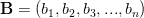

表示巧克力棒的数量。每个酒吧有 b1，b2 …可用的巧克力单位

而 **n** 是孩子的数量，每个孩子想要 c1，c2，…块巧克力。我们定义了全连接(FC)有向网络(意味着连接仅从源节点到漏节点)。下图是 **B** = (2，5，7，3)和 **C** = (3，2，6，1，2)的问题实例。

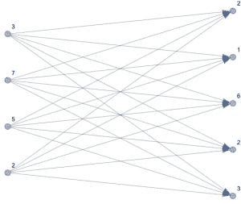

请注意，连接有一个箭头来定义它们的方向。在数学上，这些连接被编码在一个连接矩阵中

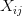

其条目指定从源节点 *i* 移动到漏节点 *j* 的单元数量。我们为每个连接分配一个成本

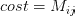

我们希望优选完美匹配(例如，示例中的 2 — >2 和 3 — >3)，即零成本。这意味着供应和需求节点之间的“距离”必须为零。将欧几里德距离作为图上的自然度量，我们定义:

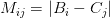

此时我们需要定义系统的目标函数，或者用物理学家的语言来说，问题的哈密顿量:

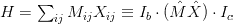

第二个等式中的表达式是哈密顿量的“矢量化”实现；我们已经定义了

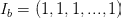

作为长度为 m 的单位向量，而 *Ic* 的长度为 **n** 。注意，矩阵 **M** 和 **X** 之间的乘积是逐元素的。这是最小成本问题的哈密顿量；通过最小化哈密顿量，我们选择成本较低的矩阵元素 **X** 。我们现在推测最小截形对应于图上最小长度(即成本)的路径。有两个约束要强加:一个关于“当前”守恒，另一个关于 **X** 的元素是正定的。在节点之间流动的两股“电流”表示:

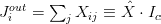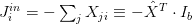

如果我们将通过网络的“通量”定义为

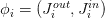

和偏置向量

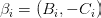

然后我们需要加强元素方面的“巧克力保护”约束:

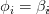

最后，我们需要强制连接矩阵的矩阵元素都是正的:对于[1，m]中的所有 *i* 和[1，n]中的 *j* ，X >0。这个问题可以用拉格朗日形式重新描述为:

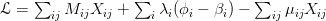

其中我们引入了两个拉格朗日乘数λ和μ来加强约束。注意不等式约束需要遵循卡鲁什-库恩-塔克条件[2]: **X** > 0， **mu** > 0 和

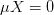

上述示例的解决方案如图所示。

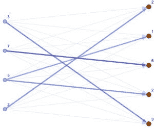

切割对应于每一行 **X** 上非零元素的数量。我们认为一个切割是一个分叉，所以在下面的例子中，单元 2(自下而上计数)用一个切割将原来的 5 个单元一分为二。因此，切割对应于在每一行 **X** 上具有 l > 1 个非零矩阵元素。你可以在我的 [GitHub](https://github.com/WessZumino/Optimization-with-Ortools) 上找到解决问题的 python 代码，连同一步一步的讲解，或者下面随便看看。我使用过谷歌的[约束优化库](https://developers.google.com/optimization/)，我发现相对于 Scipy 的优化工具来说，它更容易使用，也更有效。因此，如果您对学习如何使用这些库感兴趣，您会发现这里考虑的简单问题是解决更复杂问题的有用教程。另请注意，OR tools 已经实现了一个最小成本函数，您可以调整该函数来解决上述问题。如果你不想从头开始做这件事，这是一个有效的选择…但是乐趣在哪里呢？

最小费用问题是组合优化中的经典问题之一；左图给出了这个问题的一个更经典的表述:

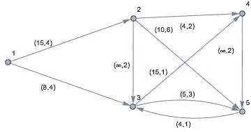

工厂(节点 1)生产一定数量的货物，需要通过不同的路线运送到目的地(节点 4 和 5)。每条路线都有相关的成本和可以运输的货物的最大容量。这个问题可以按照上述步骤连同对矩阵元素边缘连接矩阵的进一步限制来解决，

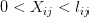

其中 l 是每个边的最大容量。

# 从这里去哪里

在过去的几十年里，物理学家被*随机、*组合优化问题所吸引，因为它们与统计力学有关，见参考文献。[1,3].这些问题与一类被称为**自旋玻璃**的模型有关，这类模型对应于具有随机耦合的**伊辛**模型。这些模型展示了几个有趣的特征，并且是几个神经网络模型的灵感来源。

在下面的帖子里会有更多关于这个的内容！目前，我只想展示巧克力分配问题是如何在随机输入/输出关系的统计力学问题中被重新铸造的。关联吉布斯测度和约束配分函数:

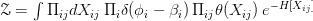

请注意，该问题的哈密顿量是无量纲的，因此可以认为逆“温度”在 h 中被重新调整。如果β是随机变量，我们需要对其分布的自由能进行平均

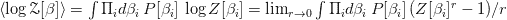

其中最后一个表达式是复制的分区函数。如何解决这类问题将是以后文章的主题。

一些有用的参考资料:

[1] M. Mezard，A. Montanari，*信息、物理和计算*，牛津大学出版社(2009)

[2] C. M. Bishop，*模式识别与机器学习*，Springer (2006)。

[3] M .梅扎德，g .帕里西，*，*，[《形体快报》杂志，1985 年，46 期(17)，第 771–778 页](https://hal.archives-ouvertes.fr/jpa-00232897/document)。

理论物理学家，从事复杂系统和量子突现现象的研究。我目前在人工智能领域工作，尤其对神经网络、它们与物理学的联系以及相关的基础问题感兴趣。[查看 Mirco Milletari 的所有帖子](https://equat10ns.wordpress.com/author/brokenreplica/)

**发布**2018 年 1 月 28 日 2018 年 1 月 30 日

*原载于 2018 年 1 月 28 日 equat10ns.wordpress.com***。**