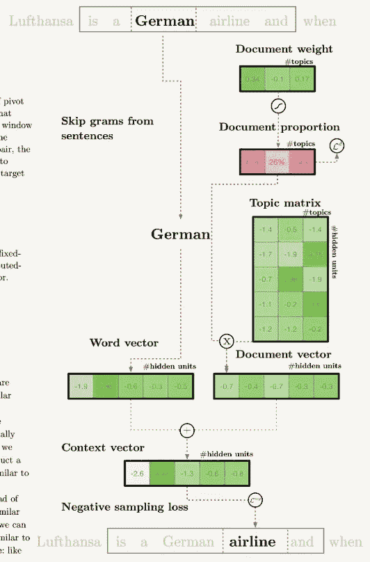
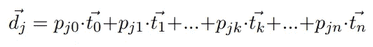

# 结合 LDA 和词嵌入的主题建模

> 原文：<https://towardsdatascience.com/combing-lda-and-word-embeddings-for-topic-modeling-fe4a1315a5b4?source=collection_archive---------5----------------------->

“Business newspaper article” by [G. Crescoli](https://unsplash.com/@freegraphictoday?utm_source=medium&utm_medium=referral) on [Unsplash](https://unsplash.com?utm_source=medium&utm_medium=referral)

潜在狄利克雷分配(LDA)是一种经典的主题建模方法。主题建模是无监督学习，目标是将不同的文档分组到同一个“主题”中。

一个典型的例子是将新闻聚集到相应的类别，包括“金融”、“旅游”、“体育”等。在单词嵌入之前，我们可能大部分时间使用单词袋。然而，在 Mikolov 等人于 2013 年引入 word2vec(单词嵌入的例子之一)后，世界发生了变化。Moody 宣布了 lda2vec，它将 lda 和词嵌入结合起来解决主题建模问题。

看完这篇文章，你会明白:

*   潜在狄利克雷分配
*   单词嵌入
*   lda2vec

# 潜在狄利克雷分配

Photo: [https://pixabay.com/en/golden-gate-bridge-women-back-1030999/](https://pixabay.com/en/golden-gate-bridge-women-back-1030999/)

LDA 在主题建模领域很有名。基于单词使用的文档聚类。简单来说，LDA 使用[单词袋](/3-basic-approaches-in-bag-of-words-which-are-better-than-word-embeddings-c2cbc7398016)作为聚类的特征。详细情况，你可以看看这个[博客](/2-latent-methods-for-dimension-reduction-and-topic-modeling-20ff6d7d547)。

# 单词嵌入

Credit: [https://pixabay.com/en/books-stack-book-store-1163695/](https://pixabay.com/en/books-stack-book-store-1163695/)

单词嵌入的目标是解决自然语言处理问题中的稀疏和高维特征。有了单词嵌入(或向量)，我们可以使用低维(大多数时候是 50 或 300)来表示所有单词。详细情况，你可以看看这个[博客](/3-silver-bullets-of-word-embedding-in-nlp-10fa8f50cc5a)。

# lda2vec

lda2vec 包括两个部分，即单词向量和文档向量，用于预测单词，以便同时训练所有向量。它通过跳格模型构建了一个**词向量**。简而言之，它使用目标词预测周围的词来学习向量。第二部分是**文档向量**,由

*   文档权重向量:每个主题的权重。利用 softmax 将权重转换为百分比。
*   主题矩阵:主题向量。一列表示一个主题，而一行存储每个主题附近的相关单词。

[https://multithreaded.stitchfix.com/blog/2016/05/27/lda2vec/#topic=38&lambda=1&term=](https://multithreaded.stitchfix.com/blog/2016/05/27/lda2vec/#topic=38&lambda=1&term=)

文档向量的公式为

Moody, Mixing Dirichlet Topic Models and Word Embeddings to Make lda2vec (2016)

*   DJ:j 文档向量
*   pj0:“0”主题中 j 文档的权重
*   pjn:“n”主题中 j 文档的权重
*   t0:“0”话题的向量
*   TN:“n”话题的向量

当主题向量被共享时，文档之间的权重是不同的。更多细节，你可以查看穆迪的[原创博客](https://multithreaded.stitchfix.com/blog/2016/05/27/lda2vec/#topic=38&lambda=1&term=)。

# 拿走

对于源代码，你可以看看这个[笔记本](https://github.com/cemoody/lda2vec/blob/master/examples/hacker_news/lda2vec/lda2vec.ipynb)

*   正如作者所建议的，如果你想拥有人类可读的主题，你应该使用 LDA。如果你想用另一种方式重做光学模型或者预测用户的话题，你可以试试 lda2vec。

# 关于我

我是湾区的数据科学家。专注于数据科学、人工智能，尤其是 NLP 和平台相关领域的最新发展。你可以通过[媒体博客](http://medium.com/@makcedward/)、 [LinkedIn](https://www.linkedin.com/in/edwardma1026) 或 [Github](https://github.com/makcedward) 联系我。

# 参考

穆迪·克里斯托弗。“混合狄利克雷主题模型和单词嵌入来制作 lda2vec”。2016.[https://arxiv.org/pdf/1605.02019.pdf](https://arxiv.org/pdf/1605.02019.pdf)