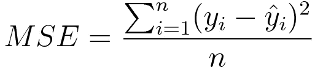
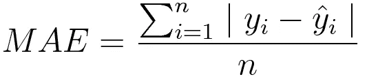
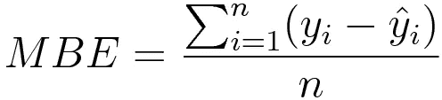
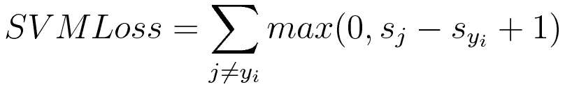
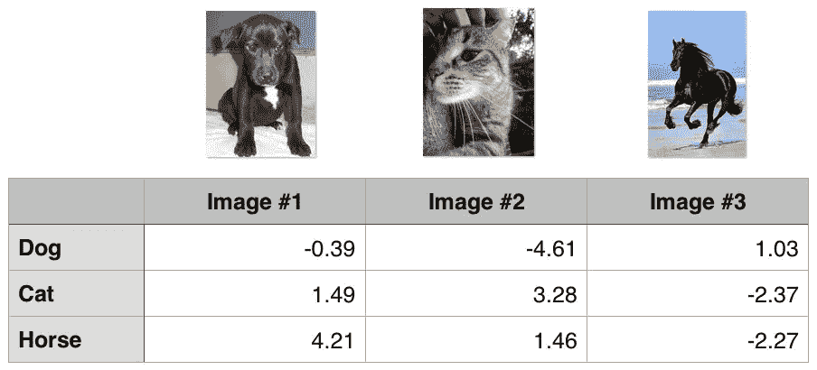
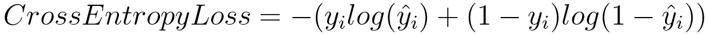

# 机器学习中常见的损失函数

> 原文：<https://towardsdatascience.com/common-loss-functions-in-machine-learning-46af0ffc4d23?source=collection_archive---------0----------------------->


Loss functions and optimizations

机器通过损失函数来学习。这是一种评估特定算法对给定数据建模程度的方法。如果预测与实际结果相差太多，损失函数就会产生一个非常大的数字。逐渐地，在一些优化函数的帮助下，损失函数学习减少预测中的误差。在本文中，我们将介绍几种损失函数及其在机器/深度学习领域的应用。

机器学习中的算法没有放之四海而皆准的损失函数。在为特定问题选择损失函数时涉及各种因素，例如所选择的机器学习算法的类型、计算导数的容易程度以及某种程度上数据集中离群值的百分比。

大体上，损失函数可以根据我们正在处理的学习任务的类型分为两大类——回归损失和 T2 分类损失。在分类中，我们试图预测有限分类值集的输出，即给定手写数字图像的大数据集，将它们分类为 0-9 个数字中的一个。另一方面，回归处理预测连续值，例如给定的楼层面积、房间数量、房间大小，预测房间的价格。

```
**NOTE** 
        n        - Number of training examples.
        i        - ith training example in a data set.
        y(i)     - Ground truth label for ith training example.
        y_hat(i) - Prediction for ith training example.
```

## 回归损失

**均方误差/二次损失/L2 损失**

***数学公式*** :-



Mean Squared Error

顾名思义，*均方误差*是以预测值和实际观测值的平方差的平均值来衡量的。它只关心误差的平均大小，而不考虑它们的方向。然而，由于平方，与偏差较小的预测相比，远离实际值的预测会受到严重的惩罚。加上 MSE 有很好的数学属性，这使得计算梯度更容易。

```
import numpy as npy_hat = np.array([0.000, 0.166, 0.333])
y_true = np.array([0.000, 0.254, 0.998])def rmse(predictions, targets):
    differences = predictions - targets
    differences_squared = differences ** 2
    mean_of_differences_squared = differences_squared.mean()
    rmse_val = np.sqrt(mean_of_differences_squared)
    return rmse_valprint("d is: " + str(["%.8f" % elem for elem in y_hat]))
print("p is: " + str(["%.8f" % elem for elem in y_true]))rmse_val = rmse(y_hat, y_true)
print("rms error is: " + str(rmse_val))
```

**平均绝对误差/L1 损失**

***数学公式*** :-



Mean absolute error

*另一方面，平均绝对误差*是预测值和实际观测值之间的绝对差值的平均值。像 MSE 一样，这也是在不考虑误差方向的情况下测量误差的大小。与 MSE 不同，MAE 需要更复杂的工具，如线性编程来计算梯度。此外，MAE 对异常值更健壮，因为它不使用 square。

```
import numpy as npy_hat = np.array([0.000, 0.166, 0.333])
y_true = np.array([0.000, 0.254, 0.998])

print("d is: " + str(["%.8f" % elem for elem in y_hat]))
print("p is: " + str(["%.8f" % elem for elem in y_true]))

def mae(predictions, targets):
    differences = predictions - targets
    absolute_differences = np.absolute(differences)
    mean_absolute_differences = absolute_differences.mean()
    return mean_absolute_differencesmae_val = mae(y_hat, y_true)
print ("mae error is: " + str(mae_val))
```

**平均偏差误差**

与机器学习领域相比，这在机器学习领域更不常见。这和 MSE 一样，唯一的区别是我们不取绝对值。显然需要谨慎，因为正负误差会相互抵消。虽然在实践中不太准确，但它可以确定模型是有正偏差还是负偏差。

***数学公式*** :-



Mean bias error

## 分类损失

**铰链损耗/多级 SVM 损耗**

简单地说，正确类别的得分应该比所有错误类别的得分之和大一些安全余量(通常是 1)。因此，铰链损失用于[最大间隔](https://link.springer.com/chapter/10.1007/978-0-387-69942-4_10)分类，最显著的是用于[支持向量机](https://en.wikipedia.org/wiki/Support_vector_machine)。虽然不是[可微的](https://ipfs.io/ipfs/QmXoypizjW3WknFiJnKLwHCnL72vedxjQkDDP1mXWo6uco/wiki/Differentiable_function.html)，但它是一个凸函数，这使得它很容易与机器学习领域中常用的凸优化器一起工作。

***数学公式*** :-



SVM Loss or Hinge Loss

考虑一个例子，其中我们有三个训练样本和三个要预测的类别——狗、猫和马。低于我们的算法对每一类的预测值:-



Hinge loss/ Multi class SVM loss

计算所有 3 个训练示例的铰链损耗:-

```
**## 1st training example**
max(0, (1.49) - (-0.39) + 1) + max(0, (4.21) - (-0.39) + 1)
max(0, 2.88) + max(0, 5.6)
2.88 + 5.6
*8.48 (High loss as very wrong prediction)***## 2nd training example** max(0, (-4.61) - (3.28)+ 1) + max(0, (1.46) - (3.28)+ 1)
max(0, -6.89) + max(0, -0.82)
0 + 0
*0 (Zero loss as correct prediction)***## 3rd training example** max(0, (1.03) - (-2.27)+ 1) + max(0, (-2.37) - (-2.27)+ 1)
max(0, 4.3) + max(0, 0.9)
4.3 + 0.9
*5.2 (High loss as very wrong prediction)*
```

**交叉熵损失/负对数似然**

这是分类问题最常见的设置。交叉熵损失随着预测概率偏离实际标签而增加。

***数学公式*** :-



Cross entropy loss

请注意，当实际标签为 1 (y(i) = 1)时，函数的后半部分消失，而当实际标签为 0 (y(i) = 0)时，函数的前半部分消失。简而言之，我们只是将实际预测概率的对数乘以地面真实类。一个重要的方面是交叉熵损失严重惩罚了那些有信心但错误的预测。

```
import numpy as nppredictions = np.array([[0.25,0.25,0.25,0.25],
                        [0.01,0.01,0.01,0.96]])
targets = np.array([[0,0,0,1],
                   [0,0,0,1]])def cross_entropy(predictions, targets, epsilon=1e-10):
    predictions = np.clip(predictions, epsilon, 1\. - epsilon)
    N = predictions.shape[0]
    ce_loss = -np.sum(np.sum(targets * np.log(predictions + 1e-5)))/N
    return ce_losscross_entropy_loss = cross_entropy(predictions, targets)
print ("Cross entropy loss is: " + str(cross_entropy_loss))
```